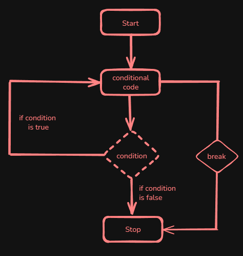
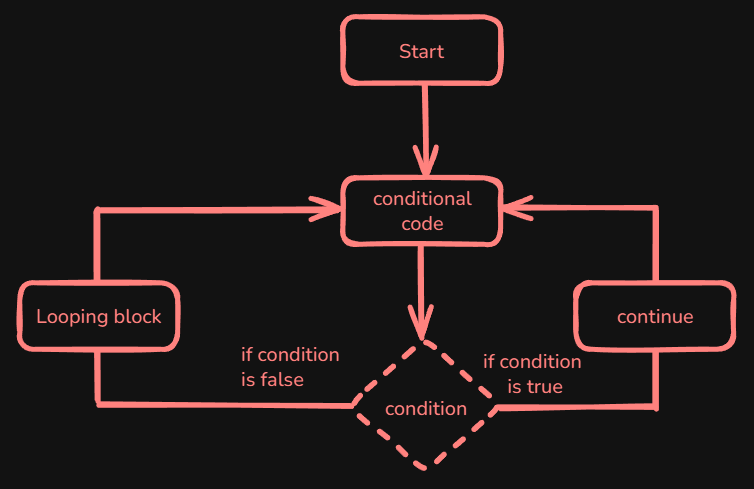

# Content of Python control flow 2 level

In this level, we'll discuss jump statements why we use them, what they are, and the different types available `break`, `continue`, `pass`.

Let's begin with `break`. it is used to immediately exit the current loop and continue execution with the first statement following the loop.

So below there is diagram how the flow looks



The diagram shows the flow of a `break` statement in a loop.

The `break` statement is most commonly used when a loop no longer needs to continue because its goal has already been achieved. This often happens when searching for a specific value, validating input, or stopping execution once a condition is satisfied.

```py
looping statement:
   condition check:
      break
```

Here’s an example using a `for` loop. In this example, the loop iterates over a range of numbers. When the loop reaches the number `5`, the `break` statement immediately exits the loop.

```py
for i in range(10):
    print(f"Iteration {i}")
    if i == 5:
        break # Exit the loop when i equals 5
```

You can also implement a break statement within a `while` loop.

```py
i = 0
while True: # Infinite loop, will break once condition is met
    print(f"Iteration {i}")
    if i == 5:
        break # Exit the loop when i equals 5
    i += 1 # Increment the counter to eventually meet the break condition
```

Below is an example that demonstrates a common use case for the break statement when searching for an item in a container. First, here’s a simple loop that looks for a target value.

```py
names = ["Example1", "Example2", "Example3", "Example4"]
target = "Example5"
for name in names:
    if name == target:
        print(f"Found {target}")
        break # Exit once the target is found
```

*In this loop, when the variable `name` equals the target value, the loop prints a message and immediately exits with `break`.*

Now, let's see how you can implement searching for a specific element using a function, as discussed in **Functions and Modules 1 Level**.

This example wraps the search logic in a function.

```py
def find_target(names, target):
    for name in names:
        if name == target:
            print(f"Found {target}")
            return True # Return as soon as the target is found
    return False # Return False if the target wasn't found

# Example usage:
names = ["Example1", "Example2", "Example3", "Example4"]
target = "Example5"
if find_target(names, target):
    print("Search successful")
else:
    print("Target not found.")
```

*Notice here that we used `return True` inside the loop instead of `break`. When return is executed, it immediately exits the function (and thus the loop) without the need for an explicit `break`.*

Other `continue` statement skips the remainder of the current iteration and moves directly to the next iteration of the loop.

The `continue` statement is commonly used when certain values should be ignored during iteration, but the loop itself should keep running. This pattern is often used when **filtering data**, **ignoring invalid values**, or applying conditions where only specific elements should be processed.

Below is the diagram that shows the flow of a `continue` statement



The diagram shows the flow of a `continue` statement in a loop.

```py
looping statement:
   condition check:
      continue
```

Below is an example of how you can use `continue` in a `while` loop:

```py
i = 0
while i < 10:
    i += 1
    if i % 2 == 0:
        continue # Skip the rest of the loop for even numbers
    print(f"Odd number: {i}")
```

Alternatively, you can achieve the same effect using a `for` loop.

```py
for number in range(10):
    if number % 2 == 0:
        continue # Skip even numbers
    print(f"Processing odd number: {number}")
```

Let's now see a common scenario where you integrate `continue` to filter out unwanted values.

For example, if you want to ignore even numbers and non-positive values in a loop.

```py
numbers = [0, 1, -2, 3, 4, 5, 6, 7, 8, 9]

for num in numbers:
    # Skip non-positive numbers
    if num <= 0:
        continue
    # Skip even numbers
    if num % 2 == 0:
        continue
    print(num) # Only prints positive odd numbers
```

You can also **encapsulate** this filtering logic within a function.

```py
def filter_positive_odds(numbers):
    result = []
    for num in numbers:
        # Skip non-positive numbers
        if num <= 0:
            continue
        # Skip even numbers
        if num % 2 == 0:
            continue
        result.append(num)
    return result

numbers = [0, 1, -2, 3, 4, 5, 6, 7, 8, 9]
positive_odds = filter_positive_odds(numbers)
print(positive_odds)
```

You might encounter situations where you need to leave a block of code intentionally empty. That's where the `pass` statement comes in. The `pass` statement acts as a placeholder for when a statement is syntactically required but no action is needed. It does nothing and is used to fill gaps in code during development.

Below is the syntax for `pass`.

```py
if condition:
    pass # No action is taken
```

For example, you might use `pass` as a placeholder in a function definition when you haven't implemented the function yet. This ensures that the function is syntactically valid.

```py
def my_function():
    pass # Implement this later
```

Similarly, in conditional blocks where you require a syntactically valid statement but don't need any action, `pass` can be used.

```py
if some_condition:
    pass # No action is needed in this case
else:
    print("Condition not met")
```
