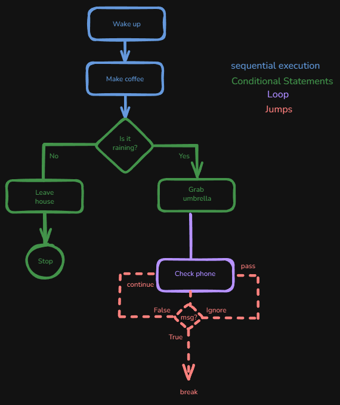

# Introduction of Control Flow

Imagine your morning routine as a flow of events. You wake up, decide whether to grab an umbrella based on the weather, have breakfast, or even skip an activity if you’re running late.

This routine is similar to **control flow** in programming. **First**, events occur in order (*sequential execution*). Then, based on **conditions** (*if it's raining or not*), different actions are taken (*conditional statements*). Sometimes, you might repeat an action like continuously checking your phone notifications until an important message appears—which is similar to **loops** in programming. Additionally, you might choose to `continue` with the next step, `break` out of a process early, or even use `pass` when no action is required. These are all forms of **jumps** that help manage the flow of your program.

Below we can see image, it's represent control flow.

In this image shows what's happens:

- **Sequential Execution:** *"Wake up"* then *"Make Coffee"* happens in order.
- **Conditional Statements:** The decision at *"Is it raining?"* determines whether you *"Grab Umbrella"* or *"Leave House"*.
- **Loops:** The process of **repeatedly checking phone notifications until an important message appears** is similar to loops in programming.
- **Jumps:** These are situations where you might choose to skip an activity (using `continue`), stop your process early if something urgent happens (using `break`), or include a statement that intentionally does nothing when no action is needed (using `pass`).

So, let's see how these different control flow concepts work.
