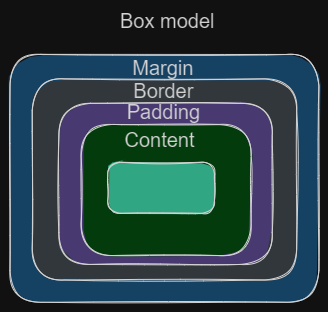

# Table of Contents

- [CSS](#css)
    - [Introduction to CSS](#introduction)
    - [CSS Syntax](#syntax)
    - [Selectors](#selectors)
    - [CSS Properties](#cssProperties)
    - [Inheritance and Cascading](#inheritanceNCascading)
    - [Box Model](#boxModel)
    - [CSS Units](#cssUnits)
    - [CSS Layout](#cssLayouts)
    - [Media Queries](#mediaQueries)
    - [CSS Preprocessors](#cssPreprocessors)

# CSS

## Introduction to CSS

CSS stands for Cascading Style Sheets and is a stylesheet language used to define the visual presentation of HTML and XML documents. It allows you to control the layout, colors, fonts, and other visual aspects of a web page.

```html

<link rel="stylesheet" type="text/css" href="styles.css">

```

## CSS Syntax

CSS rules consist of a selector and a declaration block. The selector identifies the HTML element(s) to style, and the declaration block contains one or more declarations separated by semicolons. Each declaration consists of a property and a value.

```css

selector {
  property: value;
  property: value;
  /* more declarations... */
}

```

## Selectors

Selectors are used to target specific HTML elements to apply styles. Here are some commonly used selectors:

- Element Selector: Targets all instances of a specific HTML element.

```html
<p>This is a paragraph.</p>

```
```css
p {
  color: blue;
}

```
- Class Selector: Targets elements with a specific class attribute.

```html

  <p class="highlight">This is a paragraph with a class of "highlight".</p>

```
```css
.highlight {
  background-color: yellow;
}

```
- ID Selector: Targets an element with a specific ID attribute.

```html

<div id="box">This is a div with an ID of "box".</div>

```
```css

#box {
  background-color: yellow;
  border: 1px solid black;
  padding: 10px;
}

```
- Descendant Selector: Targets elements that are descendants of another element.

```html
<!DOCTYPE html>
<html>
<head>
  <title>Descendant Selector Example</title>
  <link rel="stylesheet" type="text/css" href="styles.css">
</head>
<body>
  <section id="parent">
    <h1>This is the parent element</h1>
    <p>This is a paragraph inside the parent element.</p>
    <article>
      <p>This is a paragraph inside a nested div.</p>
      <span>This is a span element inside the nested div.</span>
    </article>
  </section>
</body>
</html>

```
```css

#parent p {
  color: blue;
}

#parent span {
  font-weight: bold;
}

```
- Attribute Selector: Targets elements with a specific attribute or attribute value.

```html

<!DOCTYPE html>
<html>
<head>
  <title>Attribute Selector Example</title>
  <link rel="stylesheet" type="text/css" href="styles.css">
</head>
<body>
  <h1>This is a heading</h1>
  <a href="https://example.com">This is a link</a>
  <input type="text" placeholder="Enter your name" />
  
</body>
</html>

```
```css

a[href="https://example.com"] {
  color: blue;
}

input[type="text"] {
  width: 200px;
}

img[alt="An image"] {
  border: 1px solid black;
}


```

## CSS Properties

CSS properties define the visual appearance of HTML elements. Some commonly used properties include:

- `color`: Specifies the text color.
- `font-size`: Specifies the size of the font.
- `background-color`: Specifies the background color.
- `margin`: Specifies the margin around an element.
- `padding`: Specifies the padding within an element.
- `border`: Specifies the border around an element.

## Inheritance and Cascading

CSS uses inheritance and cascading to apply styles to HTML elements. Inheritance means that styles applied to a parent element are inherited by its child elements. Cascading refers to the order in which styles are applied and resolved when multiple styles are defined.

```html

<!DOCTYPE html>
<html>
<head>
  <style>
    /* Styles for the parent element */
    .parent {
      color: blue;    /* inherited by child elements */
      font-weight: bold;
    }

    /* Styles for the child element */
    .child {
      font-size: 20px; /* overrides inherited font-size */
    }
  </style>
</head>
<body>
  <div class="parent">
    This is the parent element.
    <div class="child">
      This is the child element.
    </div>
  </div>
</body>
</html>

```
## Box Model

The CSS box model describes the layout of elements on a web page. It consists of four components: content, padding, border, and margin. Understanding the box model is crucial for positioning and spacing elements correctly.



[Code example](https://codesandbox.io/s/amazing-lichterman-uns08l?file=/index.html)

[Video: Learn CSS Box Model](https://www.youtube.com/watch?v=rIO5326FgPE)

## CSS Units

CSS supports various units for specifying measurements. Some common units include pixels (px), percentages (%), em, rem, and viewport units (vw, vh). Understanding and using the appropriate units is important for creating responsive and scalable designs.

Pixels (px):

- When you need precise control over element sizes or positioning.
- When working with fixed-width elements that should maintain a consistent size across different devices.
- Example: Setting the width of a container to 300 pixels: `.container { width: 300px; }`

Percentages (%):

- When you want elements to scale proportionally based on the size of their parent container.
- When creating fluid layouts that adapt to different screen sizes.
- Example: Setting the width of a child element to 50% of its parent: `.child { width: 50%; }`

EM:

- When you want to define sizes relative to the font size of the parent element.
- Useful for creating scalable typography.
- Example: Setting the font size of a paragraph to 1.2 times the font size of its parent: `.parent { font-size: 16px; } .child { font-size: 1.2em; }`

REM:

- Similar to EM, but relative to the root (html) element's font size.
- Useful for creating scalable layouts and consistent spacing.
- Example: Setting the margin of an element to 1.5 times the root font size: `.element { margin: 1.5rem; }`

Viewport units (vw, vh):

- When you want to size elements relative to the viewport's width or height.
- Useful for creating responsive designs that adapt to different screen sizes.
- Example: Setting the height of an element to 50% of the viewport height: `.element { height: 50vh; }`