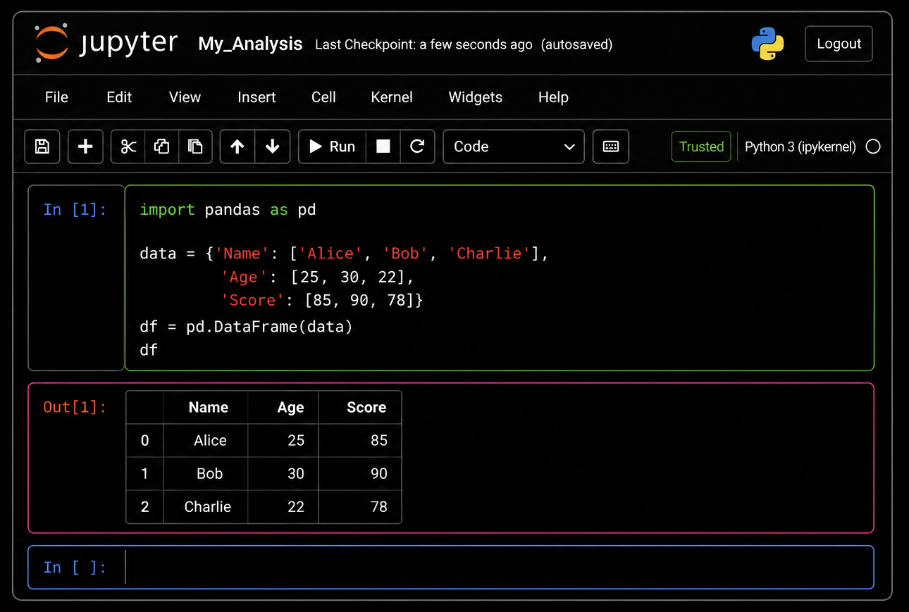
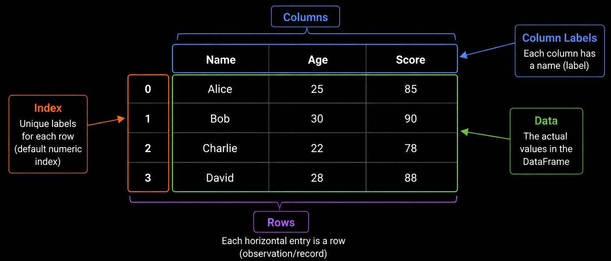
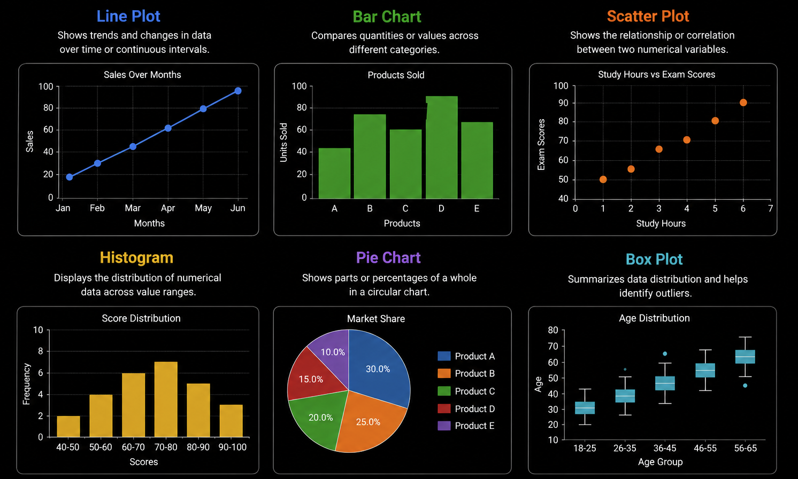

# Content of Python Data Analysis and Visualization Level 1

- [What is Jupyter Notebook](#what-is-jupyter-notebook)
- [Installing Jupyter Notebook](#installing-jupyter-notebook)
- [Running Python inside notebooks](#running-python-inside-notebooks)
- [Introduction to NumPy](#introduction-to-numpy)
- [Creating NumPy arrays](#creating-numpy-arrays)
- [Array operations and calculations](#array-operations-and-calculations)
- [Introduction to Pandas](#introduction-to-pandas)
- [Pandas Series](#pandas-series)
- [Pandas DataFrame](#pandas-dataframe)
- [Reading CSV files](#reading-csv-files)
- [Using head](#using-head)
- [Using shape](#using-shape)
- [Using info](#using-info)
- [Using describe](#using-describe)
- [Selecting dataframe columns](#selecting-dataframe-columns)
- [Filtering rows with conditions](#filtering-rows-with-conditions)
- [Introduction to Matplotlib](#introduction-to-matplotlib)
- [Creating line charts](#creating-line-charts)
- [Creating bar charts](#creating-bar-charts)
- [Creating scatter plots](#creating-scatter-plots)
- [Creating histograms](#creating-histograms)

In the previous sections of Python, we mainly worked with small examples directly inside Python files and executed programs from the terminal.

However, data analysis often requires a different workflow.

When working with datasets, it is common to execute code step by step, inspect intermediate results, experiment with calculations and visualize outputs immediately.

Instead of running an entire program repeatedly, analysts and developers usually work in an *interactive environment* where code and output are combined together.

This is where **Jupyter Notebook** becomes important.

Jupyter Notebook allows Python code to be written and executed in separate cells while displaying the output directly below the code.

This creates a workflow that is especially useful for data analysis, numerical computation and visualization.

Before working with libraries such as `NumPy`, `Pandas` and `Matplotlib`, it is important to understand how Jupyter Notebook works and why it is commonly used in data analysis projects.

## What is Jupyter Notebook

**Jupyter Notebook** is an *interactive development environment* used for writing and executing code step by step.

Unlike traditional Python scripts, where the entire file is usually executed at once, Jupyter allows code to be divided into separate cells that can be run independently.

Each cell can contain Python code, text explanations or visual output.

This makes Jupyter especially useful for data analysis because results can be inspected immediately after running a calculation.

For example, a dataset can be loaded in one cell, filtered in another cell and visualized in a later cell.

The notebook keeps both the code and the output together in a single interactive document.



A notebook commonly contains **code cells** for executing Python code, **markdown cells** for writing explanations and documentation and **output cells** for displaying results, tables and charts.

This structure allows analysis workflows to be easier to follow and experiment with.

Jupyter Notebook is widely used in data analysis, machine learning and scientific computing because it combines code execution, documentation and visualization in one place.

Before working with notebooks, Jupyter must first be installed inside the Python environment.

Once installed, notebooks can be created and used to run Python code interactively.

## Installing Jupyter Notebook

Before Jupyter Notebook can be used, it must first be installed inside the Python environment.

Jupyter is distributed as a Python package and can be installed using package managers such as `pip` or `Poetry`.

If the project uses `pip`, Jupyter can be installed with.

```bash
pip install notebook
```

If the project uses `Poetry`, Jupyter can be installed with.

```bash
poetry add notebook
```

Once the installation is complete, the `jupyter` command becomes available inside the environment.

This command is used to start the notebook server and open the interactive notebook interface in the browser.

After Jupyter Notebook is installed, the next step is learning how to start notebooks and execute Python code inside them.

## Running Python inside notebooks

After Jupyter Notebook is installed, notebooks can be started from the terminal.

If the project uses `pip`, the notebook server can be started with.

```bash
jupyter notebook
```

If the project uses `Poetry`, the command should be executed through Poetry so that it runs inside the project environment.

```bash
poetry run jupyter notebook
```

When the command is executed, Jupyter starts a local notebook server and opens the notebook interface in the browser.

Inside the interface, a new notebook can be created by selecting `New` and choosing `Python 3`.

After the notebook is created, it can be renamed from `Untitled.ipynb` to a more descriptive name such as.

```bash
data_analysis.ipynb
```

Notebook files use the `.ipynb` extension, which stands for *Interactive Python Notebook*.

A notebook is divided into separate cells that can be executed independently.

Python code is usually written inside *code cells*.

```py
print("Hello Notebook")
```

A cell can be executed by pressing `Shift + Enter`.

After execution, the output appears directly below the cell.

```bash
Hello Notebook
```

This interactive workflow makes it possible to write code, inspect results and continue building the analysis step by step without restarting the entire program.

Jupyter also keeps the execution history of the notebook, which allows variables and results from earlier cells to remain available in later cells.

For example, one cell may define a variable.

```py
number = 10
```

A later cell can then reuse that value.

```py
print(number * 2)
20
```

This workflow is especially useful in data analysis, where datasets are often loaded, explored and transformed gradually.

Once the notebook environment is working, the next step is learning about `NumPy`, which provides efficient numerical operations and array structures for working with data.

## Introduction to NumPy

When working with data, many operations involve numbers, calculations and large collections of values.

Python already provides built-in data structures such as `list`, but they are not optimized for numerical computation.

This is where **NumPy** becomes important.

**NumPy** stands for *Numerical Python* and is one of the core libraries used in data analysis and scientific computing.

It provides a powerful structure called an `array`, which allows numerical data to be stored and processed efficiently.

NumPy arrays are designed for fast mathematical operations and are commonly used when working with datasets, statistics, machine learning and visualization libraries.

Before NumPy can be used, it must first be installed inside the Python environment.

If the project uses `pip`, NumPy can be installed with.

```bash
pip install numpy
```

If the project uses `Poetry`, NumPy can be installed with.

```bash
poetry add numpy
```

Once installed, NumPy is commonly imported using the alias `np`.

```py
import numpy as np
```

The alias `np` is widely used in the Python ecosystem and appears in most NumPy examples and documentation.

Unlike normal Python lists, NumPy arrays support efficient vectorized operations and are optimized for numerical processing.

For example, mathematical operations can be applied to entire arrays at once instead of manually looping through each value.

NumPy also forms the foundation for many other data analysis libraries, including `Pandas`.

Because of this, understanding NumPy is an important step before working with more advanced data manipulation tools.

The next step is learning how to create NumPy arrays and perform basic operations with them.

## Creating NumPy arrays

The core structure provided by NumPy is the `ndarray`, commonly referred to as a *NumPy array*.

A NumPy array stores multiple values inside a single structure and is optimized for numerical computation.

Arrays are commonly created from Python lists using the `array()` function.

```py
import numpy as np

numbers = np.array([1, 2, 3, 4, 5])

print(numbers)
# [1 2 3 4 5]
```

Unlike normal Python lists, NumPy arrays display values without commas and are internally stored in a format optimized for mathematical operations.

The type of the array can also be inspected.

```py
print(type(numbers))
# <class 'numpy.ndarray'>
```

Arrays can contain different numeric types such as integers or floating-point values.

```py
prices = np.array([10.5, 20.3, 15.8])

print(prices)
# [10.5 20.3 15.8]
```

NumPy also provides helper functions for creating arrays automatically.

For example, the `zeros()` function creates an array filled with zeros.

```py
zeros_array = np.zeros(5)

print(zeros_array)
# [0. 0. 0. 0. 0.]
```

The `ones()` function creates an array filled with ones.

```py
ones_array = np.ones(5)

print(ones_array)
# [1. 1. 1. 1. 1.]
```

The `arange()` function creates a sequence of values within a range.

```py
range_array = np.arange(1, 6)

print(range_array)
# [1 2 3 4 5]
```

Arrays can also contain multiple dimensions.

For example, a two-dimensional array can represent rows and columns similar to a table.

```py
matrix = np.array([
    [1, 2, 3],
    [4, 5, 6]
])

print(matrix)
# [[1 2 3]
#  [4 5 6]]
```

NumPy arrays form the foundation for efficient numerical operations and data processing.

Once arrays are created, mathematical calculations and operations can be performed directly on them.

## Array operations and calculations

One of the main advantages of NumPy arrays is that mathematical operations can be applied directly to the entire array.

Unlike normal Python lists, NumPy arrays support *vectorized operations*, which means calculations are performed efficiently on all elements at once.

For example, values can be added directly to an array.

```py
import numpy as np

numbers = np.array([1, 2, 3, 4, 5])

result = numbers + 10

print(result)
## [11 12 13 14 15]
```

The operation is automatically applied to every value inside the array.

Arrays can also be multiplied.

```py
numbers = np.array([1, 2, 3, 4, 5])

result = numbers * 2

print(result)
# [ 2  4  6  8 10]
```

Mathematical operations can also be performed between arrays.

```py
array_one = np.array([1, 2, 3])
array_two = np.array([4, 5, 6])

result = array_one + array_two

print(result)
# [5 7 9]
```

NumPy provides many built-in functions for numerical calculations.

For example, the `sum()` function calculates the total value of the array.

```py
numbers = np.array([1, 2, 3, 4, 5])

print(np.sum(numbers))
# 15
```

The `mean()` function calculates the average value.

```py
print(np.mean(numbers))
# 3.0
```

The `max()` and `min()` functions return the largest and smallest values.

```py
print(np.max(numbers))
print(np.min(numbers))
5
1
```

NumPy also supports element selection using indexes.

```py
numbers = np.array([10, 20, 30, 40, 50])

print(numbers[0])
print(numbers[2])
10
30
```

Slices can also be used to select ranges of values.

```py
print(numbers[1:4])
# [20 30 40]
```

These operations make NumPy arrays powerful for numerical computation and data processing.

Once numerical data can be stored and processed efficiently, the next step is learning about `Pandas`, which provides higher-level structures for working with tabular data.

## Introduction to Pandas

While NumPy is powerful for numerical computation, real-world data is often organized in rows and columns similar to spreadsheets or database tables.

Working with this type of structured data directly using NumPy arrays can become difficult as datasets grow larger and more complex.

This is where **Pandas** becomes important.

**Pandas** is one of the most widely used Python libraries for *data manipulation* and *data analysis*.

It provides high-level structures that make it easier to load, organize, filter and process tabular data.

The two main structures provided by Pandas are `Series` and `DataFrame`.

A `Series` represents a single column of data, while a `DataFrame` represents a complete table containing rows and columns.



Pandas is built on top of `NumPy`, which means it uses NumPy arrays internally while providing additional functionality designed specifically for working with datasets.

Before Pandas can be used, it must first be installed inside the Python environment.

If the project uses `pip`, Pandas can be installed with.

```bash
pip install pandas
```

If the project uses Poetry, Pandas can be installed with.

```bash
poetry add pandas
```

Once installed, Pandas is commonly imported using the alias pd.

```bash
import pandas as pd
```

The alias pd is widely used in the Python ecosystem and appears in most Pandas examples and documentation.

Pandas supports many operations commonly used in data analysis, including reading files, selecting rows and columns, filtering data, calculating statistics and transforming datasets.

Because of this, Pandas has become one of the core libraries used in data analysis workflows.

The next step is understanding the Series structure and how it stores data inside Pandas.

## Pandas Series

One of the core structures provided by Pandas is the `Series`.

A `Series` represents a single column of data and can store values such as numbers, text or boolean values.

You can think of a Series as a one-dimensional structure where each value is associated with an index.

A Pandas Series is built on top of NumPy arrays while providing additional features for indexing and data handling.

A Series can be created from a Python list using the `Series()` function.

```py
import pandas as pd

numbers = pd.Series([10, 20, 30, 40])

print(numbers)
# 0    10
# 1    20
# 2    30
# 3    40
# dtype: int64
```

On the left side, Pandas displays the index values and on the right side the stored data values.

By default, Pandas automatically creates indexes starting from `0`.

The type of the structure can also be inspected.

```py
print(type(numbers))
# <class 'pandas.core.series.Series'>
```

A Series can store different types of data.

```py
names = pd.Series(["Example1", "Example2", "Example3"])

print(names)
# 0      Example1
# 1        Example2
# 2    Example3
# dtype: object
```

Custom indexes can also be defined manually.

```py
scores = pd.Series(
    [90, 85, 95],
    index=["Math", "Science", "History"]
)

print(scores)
# Math       90
# Science    85
# History    95
# dtype: int64
```

Values inside a Series can be accessed using indexes.

```py
print(scores["Math"])
90
```

Series also support mathematical operations similar to NumPy arrays.

```py
prices = pd.Series([10, 20, 30])

print(prices * 2)
# 0    20
# 1    40
# 2    60
# dtype: int64
```

Although Series are useful for representing individual columns, data analysis commonly involves multiple columns organized together in tables.

For this reason, the next step is learning about `DataFrame`, which is the main table structure used in Pandas.

## Pandas DataFrame

The main structure used in Pandas is the `DataFrame`.

A `DataFrame` represents tabular data organized into rows and columns similar to a spreadsheet or database table.

Each column inside a DataFrame is internally represented as a `Series`.

This makes DataFrames especially useful for working with structured datasets.

A DataFrame can be created from a Python dictionary where the dictionary keys become column names.

```py
import pandas as pd

students = {
    "name": ["Example1", "Example2", "Example3"],
    "age": [20, 22, 21],
    "grade": [90, 85, 95]
}

df = pd.DataFrame(students)

print(df)
#        name  age  grade
# 0  Example1   20     90
# 1  Example2   22     85
# 2  Example3   21     95
```

The type of the structure can also be inspected.

```py
print(type(df))
# <class 'pandas.core.frame.DataFrame'>
```

A DataFrame contains both row indexes and column names.

By default, Pandas automatically creates numeric row indexes starting from `0`.

Columns can be accessed using their names.

```py
print(df["name"])
# 0    Example1
# 1    Example2
# 2    Example3
# Name: name, dtype: str
```

Selecting a single column returns a `Series`.

Multiple columns can also be selected together.

```py
print(df[["name", "grade"]])
#        name  grade
# 0  Example1     90
# 1  Example2     85
# 2  Example3     95
```

A DataFrame also provides information about its dimensions.

```py
print(df.shape)
# (3, 3)
```

The output shows the number of rows and columns.

DataFrames form the foundation of most Pandas workflows because they make it possible to organize, inspect and manipulate datasets efficiently.

In practice, DataFrames are often created by reading data from external files such as CSV files.

The next step is learning how to load datasets into Pandas using CSV files.

## Reading CSV files

In real-world applications, datasets are commonly stored inside external files instead of being manually created in Python code.

One of the most common file formats used for tabular data is the `CSV` format.

`CSV` stands for *Comma-Separated Values*.

A CSV file stores data as rows and columns where each value is separated by a comma.

For example, a CSV file may look like this.

```csv
name,age,grade
Example1,20,90
Example1,22,85
Example1,21,95
```

Pandas provides the `read_csv()` function for loading CSV files into a DataFrame.

Suppose the project contains a file named `students.csv`.

```text
project/
│
├── students.csv
└── analysis.ipynb
```

The file can be loaded using.

```py
import pandas as pd

df = pd.read_csv("students.csv")

print(df)
#        name  age  grade
# 0  Example1   20     90
# 1  Example1   22     85
# 2  Example1   21     95
```

The `read_csv()` function automatically parses the file and converts the data into a Pandas `DataFrame`.

This makes it possible to immediately start inspecting and analyzing the dataset.

The resulting DataFrame can then be stored inside a variable and reused throughout the notebook.

```py
students_df = pd.read_csv("students.csv")
```

CSV files are widely used because they are simple, portable and supported by many systems including spreadsheets, databases and data analysis tools.

Once the data is loaded into a DataFrame, the next step is inspecting and understanding the structure of the dataset.

Pandas provides several built-in tools for exploring data, including `head()`, `shape`, `info()` and `describe()`.

These methods help verify that the dataset was loaded correctly and make it easier to understand the structure of the data before performing transformations or calculations.

## Using head

After loading a dataset into a `DataFrame`, it is often useful to inspect the first rows of the data.

Pandas provides the `head()` method for this purpose.

The `head()` method returns the first rows of the DataFrame, which helps quickly verify that the dataset was loaded correctly and understand how the data is structured.

For example, suppose the DataFrame contains student data.

```py
import pandas as pd

students = {
    "name": ["Example1", "Example2", "Example3", "Example4", "Example5"],
    "age": [20, 22, 21, 23, 20],
    "grade": [90, 85, 95, 88, 91]
}

df = pd.DataFrame(students)

print(df.head())
#        name  age  grade
# 0  Example1   20     90
# 1  Example2   22     85
# 2  Example3   21     95
# 3  Example4   23     88
# 4  Example5   20     91
```

By default, `head()` returns the first `5` rows.

A custom number of rows can also be specified.

```py
print(df.head(2))
#        name  age  grade
# 0  Example1   20     90
# 1  Example2   22     85
```

The `head()` method is especially useful when working with large datasets because it allows the structure of the data to be inspected without printing the entire DataFrame.

Developers commonly use `head()` immediately after loading data from files such as CSV datasets.

Once the first rows of the dataset are visible, the next step is understanding the dimensions of the DataFrame using `shape`.

## Using shape

When working with datasets, it is often important to know how many rows and columns the `DataFrame` contains.

Pandas provides the `shape` attribute for this purpose.

The `shape` attribute returns a tuple containing the number of rows and columns inside the DataFrame.

The first value represents the number of rows and the second value represents the number of columns.

For example, suppose the DataFrame contains student data.

```py
import pandas as pd

students = {
    "name": ["Example1", "Example2", "Example3"],
    "age": [20, 22, 21],
    "grade": [90, 85, 95]
}

df = pd.DataFrame(students)

print(df.shape)
(3, 3)
```

This output means that the DataFrame contains `3` rows and `3` columns.

The individual values can also be accessed separately.

```py
rows, columns = df.shape

print(rows)
print(columns)
# 3
# 3
```

The shape attribute is commonly used to quickly inspect dataset size and verify that data was loaded correctly.

It is especially useful after filtering, cleaning or transforming data because it helps confirm how the structure of the DataFrame has changed.

Once the dimensions of the dataset are known, the next step is inspecting the columns and data types using `info()`.

## Using info

When working with datasets, it is important to understand what columns exist inside the `DataFrame` and what types of values those columns contain.

Pandas provides the `info()` method for this purpose.

The `info()` method displays a summary of the DataFrame structure, including column names, data types and the number of non-null values.

For example, suppose the DataFrame contains student data.

```py
import pandas as pd

students = {
    "name": ["Example1", "Example2", "Example3"],
    "age": [20, 22, 21],
    "grade": [90, 85, 95]
}

df = pd.DataFrame(students)

df.info()
# <class 'pandas.DataFrame'>
# RangeIndex: 3 entries, 0 to 2
# Data columns (total 3 columns):
#  #   Column  Non-Null Count  Dtype
# ---  ------  --------------  -----
#  0   name    3 non-null      str  
#  1   age     3 non-null      int64
#  2   grade   3 non-null      int64
# dtypes: int64(2), str(1)
# memory usage: 204.0 bytes
```

This output provides several important pieces of information about the dataset.

The column names show what data exists inside the DataFrame.

The `Non-Null Count` column shows how many values are present in each column.

The `Dtype` column shows the data type used for each column.

For example, `int64` represents integer values and object commonly represents text data.

The `info()` method is especially useful for detecting missing values and verifying that columns were loaded using the correct data types.

This becomes important before performing calculations, filtering or transformations on the dataset.

Once the structure and data types are understood, the next step is calculating summary statistics using `describe()`.

## Using describe

After inspecting the structure of a dataset, it is often useful to calculate summary statistics for the numerical columns.

Pandas provides the `describe()` method for this purpose.

The `describe()` method generates statistical information about numeric data inside the `DataFrame`.

For example, suppose the DataFrame contains student data.

```py
import pandas as pd

students = {
    "age": [20, 22, 21, 23, 20],
    "grade": [90, 85, 95, 88, 91]
}

df = pd.DataFrame(students)

print(df.describe())
#             age      grade
# count   5.00000   5.000000
# mean   21.20000  89.800000
# std     1.30384   3.701351
# min    20.00000  85.000000
# 25%    20.00000  88.000000
# 50%    21.00000  90.000000
# 75%    22.00000  91.000000
# max    23.00000  95.000000
```

The output includes several statistical values.

`count` shows the number of non-null values.

`mean` shows the average value.

`std` represents the standard deviation.

`min` and `max` show the smallest and largest values.

The percentage rows such as `25%`, `50%` and 75% represent quartiles that describe how the data is distributed.

The `50%` value is also known as the median.

The `describe()` method is useful for quickly understanding the overall characteristics of a dataset and identifying unusual values or unexpected distributions.

This type of overview is commonly used before performing deeper analysis or visualization.

Once the dataset structure and statistics are understood, the next step is learning how to select specific columns from a DataFrame.

## Selecting dataframe columns

When working with a `DataFrame`, it is common to access only specific columns instead of the entire dataset.

Pandas allows columns to be selected using their column names.

For example, suppose the DataFrame contains student data.

```py
import pandas as pd

students = {
    "name": ["Example1", "Example2", "Example3"],
    "age": [20, 22, 21],
    "grade": [90, 85, 95]
}

df = pd.DataFrame(students)

print(df)
#        name  age  grade
# 0  Example1   20     90
# 1  Example2   22     85
# 2  Example3   21     95
```

A single column can be selected using square bracket notation.

```py
print(df["name"])
# 0    Example1
# 1    Example2
# 2    Example3
# Name: name, dtype: str
```

Selecting a single column returns a `Series`.

Multiple columns can also be selected together by passing a list of column names.

```py
print(df[["name", "grade"]])
#        name  grade
# 0  Example1     90
# 1  Example2     85
# 2  Example3     95
```

Selecting multiple columns returns another `DataFrame`.

Columns can also be assigned to variables for later reuse.

```py
grades = df["grade"]

print(grades)
# 0    90
# 1    85
# 2    95
# Name: grade, dtype: int64
```

Column selection is one of the most common operations in Pandas because data analysis often focuses only on specific parts of a dataset.

Once columns can be selected, the next step is filtering rows based on conditions.

## Filtering rows with conditions

In data analysis, it is common to work only with rows that match specific conditions.

Pandas allows rows to be filtered using conditional expressions inside square brackets.

For example, suppose the `DataFrame` contains student data.

```py
import pandas as pd

students = {
    "name": ["Example1", "Example2", "Example3", "Example4"],
    "age": [20, 22, 21, 23],
    "grade": [90, 85, 95, 70]
}

df = pd.DataFrame(students)

print(df)
#        name  age  grade
# 0  Example1   20     90
# 1  Example2   22     85
# 2  Example3   21     95
# 3  Example4   23     70
```

Rows can be filtered by applying a condition to a column.

```py
high_grades = df[df["grade"] > 85]

print(high_grades)
#        name  age  grade
# 0  Example1   20     90
# 2  Example3   21     95
```

The condition `df["grade"] > 85` creates a boolean result where each row is evaluated as either `True` or `False`.

Only rows where the condition is `True` are returned.

Multiple conditions can also be combined using operators such as `&` for `AND` and `|` for `OR`.

```py
filtered_students = df[
    (df["grade"] > 80) & (df["age"] < 22)
]

print(filtered_students)
#        name  age  grade
# 0  Example1   20     90
# 2  Example3   21     95
```

Parentheses are important when combining multiple conditions because each comparison must be evaluated separately.

Rows can also be filtered using text conditions.

```py
print(df[df["name"] == "Example2"])
#        name  age  grade
# 1  Example2   22     85
```

Filtering is one of the most important operations in data analysis because it allows datasets to be narrowed down to only the relevant information.

Once data can be filtered and selected, the next step is learning how to visualize data using Matplotlib.

## Introduction to Matplotlib

After data is loaded, inspected and filtered, the next step is understanding the data visually.

Looking only at tables and numerical values can make it difficult to recognize patterns, trends or relationships inside the dataset.

This is where **data visualization** becomes important.

Data visualization is the process of representing data graphically using charts and plots.

Visual representations make it easier to identify patterns, compare values and understand distributions inside the data.

In Python, one of the most widely used visualization libraries is **Matplotlib**.

Matplotlib provides tools for creating charts such as line plots, bar charts, scatter plots, histograms and many other types of visualizations.



Before Matplotlib can be used, it must first be installed inside the Python environment.

If the project uses `pip`, Matplotlib can be installed with.

```bash
pip install matplotlib
```

If the project uses Poetry, Matplotlib can be installed with.

```bash
poetry add matplotlib
```

Once installed, Matplotlib is commonly imported using the `pyplot` module.

```py
import matplotlib.pyplot as plt
```

The alias plt is widely used in the Python ecosystem and appears in most Matplotlib examples and documentation.

Matplotlib integrates well with both `NumPy` and `Pandas`, which makes it a common tool in data analysis workflows.

Data stored inside arrays or DataFrames can be visualized directly using charts.

The next step is learning how to create basic line charts using Matplotlib.

## Creating line charts

One of the most common visualizations in data analysis is the *line chart*.

Line charts are commonly used to display how values change over time or across a sequence.

They make it easier to identify trends, increases, decreases and patterns in data.

In Matplotlib, line charts are created using the `plot()` function.

For example, suppose the dataset contains sales values for several months.

```py
import matplotlib.pyplot as plt

months = ["Jan", "Feb", "Mar", "Apr", "May"]
sales = [100, 120, 90, 140, 160]

plt.plot(months, sales)

plt.show()
```

The `plot()` function creates the line chart and `show()` displays the visualization window.

The horizontal axis represents the months values and the vertical axis represents the `sales` values.

Charts can also include labels and titles to make the visualization easier to understand.

```py
import matplotlib.pyplot as plt

months = ["Jan", "Feb", "Mar", "Apr", "May"]
sales = [100, 120, 90, 140, 160]

plt.plot(months, sales)

plt.title("Monthly Sales")
plt.xlabel("Month")
plt.ylabel("Sales")

plt.show()
```

The `title()` function adds a chart title.

The `xlabel()` and `ylabel()` functions define labels for the horizontal and vertical axes.

Line charts are useful when visualizing trends, continuous changes or ordered sequences of values.

Once line charts are understood, the next step is learning how to compare values using bar charts.

## Creating bar charts

While line charts are useful for showing trends over time, *bar charts* are commonly used for comparing values between categories.

Bar charts represent data using rectangular bars where the length or height of each bar corresponds to a value.

This makes comparisons between categories easier to understand visually.

In Matplotlib, bar charts are created using the `bar()` function.

For example, suppose the dataset contains student grades.

```py
import matplotlib.pyplot as plt

students = ["Example1", "Example2", "Example3", "Example4"]
grades = [90, 85, 95, 70]

plt.bar(students, grades)

plt.show()
```

The `bar()` function creates a bar chart and `show()` displays the visualization.

The horizontal axis represents the category labels and the vertical axis represents the numerical values.

Titles and axis labels can also be added to improve readability.

```py
import matplotlib.pyplot as plt

students = ["Example1", "Example2", "Example3", "Example4"]
grades = [90, 85, 95, 70]

plt.bar(students, grades)

plt.title("Student Grades")
plt.xlabel("Students")
plt.ylabel("Grades")

plt.show()
```

Bar charts are especially useful for comparing quantities, frequencies or grouped values across categories.

While bar charts compare categories, some datasets require understanding the relationship between two numerical values.

In these situations, scatter plots provide a useful way to visualize how values are distributed and whether patterns or correlations exist between variables.

## Creating scatter plots

Scatter plots are commonly used to visualize the relationship between two numerical variables.

Each point in the chart represents a pair of values.

This makes scatter plots useful for identifying patterns, trends, clusters or possible correlations between variables.

In Matplotlib, scatter plots are created using the `scatter()` function.

For example, suppose the dataset contains study hours and exam scores.

```py
import matplotlib.pyplot as plt

study_hours = [1, 2, 3, 4, 5, 6]
exam_scores = [50, 55, 65, 70, 80, 90]

plt.scatter(study_hours, exam_scores)

plt.show()
```

The `scatter()` function creates the scatter plot and `show()` displays the visualization.

The horizontal axis represents the study hours and the vertical axis represents the exam scores.

Each point represents one observation inside the dataset.

Titles and axis labels can also be added to improve readability.

```py
import matplotlib.pyplot as plt

study_hours = [1, 2, 3, 4, 5, 6]
exam_scores = [50, 55, 65, 70, 80, 90]

plt.scatter(study_hours, exam_scores)

plt.title("Study Hours vs Exam Scores")
plt.xlabel("Study Hours")
plt.ylabel("Exam Scores")

plt.show()
```

Scatter plots are especially useful when analyzing relationships between variables and identifying whether values tend to increase or decrease together.

Once relationships between variables can be visualized, the next step is understanding how values are distributed using histograms.

## Creating histograms

While scatter plots help visualize relationships between variables, histograms are used to understand how values are distributed inside a dataset.

A histogram groups numerical values into ranges and displays how many values fall inside each range.

This makes histograms useful for identifying distributions, concentration of values and possible outliers.

In Matplotlib, histograms are created using the `hist()` function.

For example, suppose the dataset contains exam scores.

```py
import matplotlib.pyplot as plt

scores = [55, 60, 62, 65, 70, 72, 75, 78, 80, 82, 85, 90, 95]

plt.hist(scores)

plt.show()
```

The `hist()` function creates the histogram and `show()` displays the visualization.

The horizontal axis represents value ranges and the vertical axis represents how many values fall inside each range.

Histograms can also be customized using the bins parameter.

```py
import matplotlib.pyplot as plt

scores = [55, 60, 62, 65, 70, 72, 75, 78, 80, 82, 85, 90, 95]

plt.hist(scores, bins=5)

plt.title("Exam Score Distribution")
plt.xlabel("Scores")
plt.ylabel("Frequency")

plt.show()
```

The `bins` parameter controls how many groups the histogram divides the data into.

Histograms are especially useful for understanding the overall distribution of numerical data and detecting whether values are evenly distributed or concentrated in specific ranges.

At this level, the focus was on the foundations of data analysis using `Jupyter Notebook`, `NumPy`, `Pandas` and basic `Matplotlib` visualizations.

In the next level, we will continue with more advanced data selection, filtering and transformation techniques.
