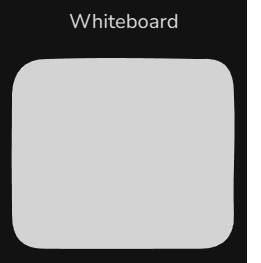
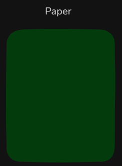
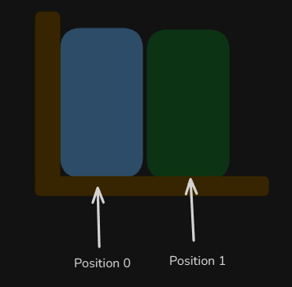

# Content of Python data types 1 level

- [Mutable vs Immutable](#mutable-vs-immutable)
- [Ordered vs Unordered](#ordered-vs-unordered)
- [Core built-in data types](#core-built-in-data-types)
- [Type casting](#type-casting)

Built-in data types can be categorized based on whether they are **mutable** (modifiable after creation) or **immutable** (unchangeable once created).

## Mutable vs Immutable

- **Mutable types** (such as `list`, `dict`, and `set`) are like a **whiteboard** - you can erase and rewrite directly on it. That means you can change their contents **in place** without creating a new **object** (the same *water mug*).

    

- **Immutable types** (such as `int`, `float`, `bool`, `str`, `tuple`, `None`, and `frozenset`) are like a **printed page** - once printed, you can’t change the page itself. If you want something different, you have to **print a new page**, which in Python means creating a new **object**.

    

Data types can also be categorized based on whether they preserve a specific sequence.

## Ordered vs Unordered

- **Ordered types** (like `list`, `tuple`, and `str`) are like a **bookshelf** - every book has its own **spot**, and you can point to a position (`index`) to get exactly the book you want.

    

- **Unordered (non-indexed) types** (like `set` and `dict`) are more like a **box of toys** - items are stored without using positions `indexes` to access them.

    

*Python's built-in data types can be grouped by their use cases:*

## Core built-in data types

**Numeric types:** Numeric data types are **immutable** and represent numbers. The `int` type stores whole numbers (`42` or `-7`), while `float` handles decimal numbers (`3.14` or `-0.001`). For more advanced mathematics, Python also supports `complex` numbers. These types enable standard **arithmetic operations** and **augmented assignment**.

```py
example_number = 2
```

**Text** The `str` (string) type is **immutable** once created and is used to represent textual data as a sequence of characters. Strings can be defined using single quotes (`'Hello'`), double quotes (`"Hello"`), or triple quotes as I mentioned previous. They support operations like **concatenation** (joining strings), **slicing** (extracting substrings), and **formatting** (embedding variables or expressions within text).

```py
example_text = "Hello"
```

**Boolean** data types are **immutable** and represent the two truth values in Python: `True` and `False`. They are commonly used in **conditions**, **control flow** and **loops**, where expressions evaluate to either `True` or `False`.

```py
example_boolean_true = True
example_boolean_false = False
```

**None** The `None` constant represents the absence of a value and is also **immutable**, often used to indicate that a variable is empty or that a function returns nothing explicitly. Unlike `False`, `0`, or an empty `string`, `None` is a distinct object of type `NoneType`, serving as Python's equivalent of a `null` value.

```py
example_none = None
```

## Type casting

If we want to change the type of a variable by converting an `int` to a `float` or a `str` to an `int` or other type we can use Python's **built-in class constructors** (*a recipe that creates a meal from ingredients*) to perform **type conversion(casting)**. This allows you to explicitly convert values from one data type to another, making it easier to work with different representations of data.

Below are some examples of how to change types

```py
"""
float() : Converts an integer or a string representing a number into a floating-point number.
int() : Converts a floating-point number or a numeric string to an integer.
str() : Converts any value to its string representation.
bool() : Converts a value to a Boolean, returning True for truthy values and False for falsy values.
"""

# Variables
num_int = 5
num_float2 = 3.14
num_int3 = 42
truthy_value = "hello"
empty_string = ""

# Casting
num_float = float(num_int)
num_int2 = int(num_float2)
num_str = str(num_int3)
bool_non_empty = bool(truthy_value)
bool_empty = bool(empty_string)

# Results
print(num_float) # Output: 5.0
print(num_int2) # Output: 3
print(num_str) # Output: "42"
print(bool_non_empty) # Output: True
print(bool_empty) # Output: False
```
