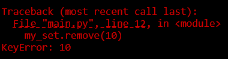

# Content of Python data types 3 level

- [Indexed sequence types](#indexed-sequence-types)
- [Non-indexed and Non-subscriptable Types](#non-indexed-and-non-subscriptable-types)
- [How mutable and immutable data types work](#how-mutable-and-immutable-data-types-work)
- [List data types](#list-data-types)
- [Dictionary data type](#dictionary-data-type)
- [Set data type](#set-data-type)
- [Strings data type](#strings-data-type)
- [Other data types](#other-data-types)
- [Copy](#copy)

In previous levels (**Data Types 1 and 2**), we covered the basics of data types and how to write them. In this level, we go deeper to explore how we can manipulate data types and understand how they really work.

We will examine the key differences between **Mutable vs Immutable** types and how different data types support **element access** (by `index`, by `key`, or **not at all**).

We’ll start by looking at how different data types allow access to their elements, through **indexing**, **slicing**, **keys**, or **membership**.

## Indexed sequence types

Notations in Python provides, built-in way to work with sequences or collections. They let you directly **access**, **modify**, or **delete** elements within your data structures, whether those are hard-coded literals or dynamic data generated at runtime. You can use square brackets `[]` with **lists**, **strings**, **tuple** or **dictionaries** to target specific elements.


In the image above, you can see examples. **Indexing** (`[n]`) retrieves a single element at the specified position in sequences (and for dictionaries, you use a key, `dictionary["key"]`). **Remember** that indexing can be either **positive** (counting from the beginning) or **negative** (counting from the end). **Slicing** (`[start:stop]`) extracts a subsequence from an ordered collection, while **extended slicing** (`[start:stop:step]`) allows you to retrieve elements using a specified step to skip items.

So, let's begin with the basics and see how we create and use both **positive** and **negative** indexing for **sequences** and also how we use `keys` to access `values` in **dictionaries**.

```py
items = [10, 20, 30, 40, 50] # List example
phrase = "Python" # String example
tup = (100, 200, 300, 400) # Tuple example

# Positive indexing (index 0)
print("List first element:", items[0]) # Output: 10
print("String first character:", phrase[0]) # Output: P
print("Tuple first element:", tup[0]) # Output: 100

# Negative indexing (last element)
print("List last element:", items[-1]) # Output: 50
print("String last character:", phrase[-1]) # Output: n
print("Tuple last element:", tup[-1]) # Output: 400

# Dictionary Indexing (by key)
person = {"name": "Test", "age": 30}
print("Name value:", person["name"]) # Output: Test
print("Age value:", person["age"]) # Output: 30
```

Furthermore, we should explore how slicing works. When you write `[:]` or `[:::]` for a sequence, you obtain the full sequence (such as a `string`, `list`, `tuple`). Let's dive deeper and see different ways to use slicing.

```py
text = "Python" # String example
numbers = [10, 20, 30, 40, 50]  # List example
tupl = (100, 200, 300, 400, 500) # Tuple example

# Entire sequence
print(text[:], numbers[:], tupl[:])
# Positive slicing (from index 1 to 3)
print(text[1:4], numbers[1:4], tupl[1:4])
# Negative slicing (using negative indices)
print(text[-4:-1], numbers[-4:-1], tupl[-4:-1])
# Extended slicing with step (every 2nd element)
print(text[::2], numbers[::2], tupl[::2])
```

*When you use a **step** with **negative indices** (`text[-4:-1:2]`), Python applies the step **interval** in the same way as with **positive indices**.*

One important thing to understand about **slicing** is that it **never raises an error**. If the slice boundaries do not produce any valid elements, Python simply returns an **empty sequence**.

```py
text = "Python"
numbers = [10, 20, 30, 40, 50]

print(text[-5:3]) # 'Pyt'
print(text[-3:3]) # ''
print(numbers[-5:3]) # [10, 20, 30]
print(numbers[-3:3]) # []
```

Slicing always moves from **left to right** when the step is positive. If the **start index comes after the stop index**, no elements can be selected. Python does **not throw an error**, it simply returns an empty result.

This behavior is intentional and makes slicing **safe to use**.

```py
# No error, just an empty list
result = numbers[3:1]
print(result) # []
```

This is different from **indexing** (`numbers[10]`), which *does raise an error when the index does not exist*.

So far, we’ve used square brackets to access elements. Another common pattern is **reassignment**, where a variable is assigned a **new sequence** created by combining existing ones. This is typically done using the `+` operator.

```py
items = [1, 2, 3]
items = items + [4, 5]
print(items)
# Output: [1, 2, 3, 4, 5]
```

Here’s what happens, `items + [4, 5]` creates a new list then `items = ...` rebinds the name `items` to that new list and out original list object is **not modified**

This is **reassignment**, not in-place modification.

Strings behave similarly, but for a different reason, **strings are immutable**.

```py
text = "Hello"
text = text + " World"
print(text)
# Output: Hello World
```

Just like lists `"Hello" + " World"` creates a **new string** `text` is reassigned to that new object,

However, unlike lists, **this is the only way** strings can change, they cannot be modified in place.

Tuples are also **immutable**, but they still support concatenation.

```py
tup = (1, 2, 3)
tup = tup + (4, 5)
print(tup)
# Output: (1, 2, 3, 4, 5)
```

Again A **new tuple** is created then variable is rebound using `=` and **no in-place** modification occurs.

Not all collection types support `+`. **Sets** and **dictionaries** do not use concatenation with `+`.

```py
my_set = {1, 2, 3}
my_set = my_set + {4} # TypeError

my_dict = {"a": 1}
my_dict = my_dict + {"b": 2} # TypeError
```

These types use **different mechanisms** for updating, which are covered later.

## Non-indexed and Non-subscriptable Types

However, if you try to use the same square bracket notation (`[]`) on **non-indexed** or **non-subscriptable** types, you’ll encounter errors.

- **Sets** are **non-indexed**, so elements cannot be accessed by position.

- **Dictionaries** are **subscriptable**, but by **key**, not by numeric position.

    ```py
    item_dict = {0: "zero"}
    print(item_dict[0]) # Works because 0 is a key
    ```

- **int**, **float**, **bool**, and **None** are not collections and do not support subscripting at all.

```py
# Set
item_set = {1, 2, 3, 4, 5}
print(item_set[0]) # TypeError: 'set' object is not subscriptable

# Dictionary
item_dict = {"a": 1, "b": 2}
print(item_dict[0]) # Raises KeyError because there is no key 0
```

So far, we’ve focused on **which data types allow square bracket access (`[]`) and which do not**.

In programs, data is rarely flat. You will often work with **nested structures**, meaning one data type contains another data type inside it.

- lists containing other lists
- lists containing dictionaries
- lists containing sets
- lists containing tuples
- dictionaries containing lists
- dictionaries containing other dictionaries

In these cases, square brackets are not used just once, they are **chained together** to move step by step through the structure.

Before discussing mutability, it’s important to understand how square bracket notation can be used not only to **access** nested elements, but also to **add**, **update** using assignment (`=`).

## Nested access and assignment using square brackets (`[]`)

Square brackets `[]` are used to access elements by `index` in sequences, and by `key` in dictionaries.

When a structure is nested, you simply apply this multiple times.

Here is an example of a **list** containing another **list**

```py
numbers = [1, 2, [10, 20, 30]]

print(numbers[2]) # Output: [10, 20, 30]
print(numbers[2][1]) # Output: 20
```

Because lists are **mutable**, nested values can be **updated** using assignment.

```py
numbers[2][1] = 99
print(numbers)
# [1, 2, [10, 99, 30]]
```

Here is an example of a **dictionary** containing a **list**.

```py
profile = {
    "username": "admin",
    "roles": ["editor", "moderator"]
}

print(profile["roles"][0]) # editor
```

**Updating** a nested value works the same way.

```py
profile["roles"][0] = "admin"
print(profile)
```

Here is an example of a **dictionary** containing another **dictionary**.

```py
config = {
    "database": {
        "host": "localhost",
        "port": 5432
    }
}

print(config["database"]["port"]) # 5432
```

**Updating** and **adding** nested values using square brackets.

```py
config["database"]["port"] = 3306
config["database"]["user"] = "root"
print(config)
```

Now consider a **list** containing a **set**.

```py
data = [
    {1, 2, 3},
    {4, 5, 6}
]

print(data[0]) # {1, 2, 3}
```

Square brackets can be used to access the **set object itself**, because it is stored inside a list.

However, sets are **non-indexed**. This means you cannot access or update individual set elements using square brackets.

```py
data[0][1] # TypeError
```

What assignment can do in this case is **replace the entire set**, not modify its internal elements.

```py
data[0] = {10, 20, 30}
print(data)
```

Now consider a **list** containing a **tuple**.

```py
data = [
    (10, 20, 30),
    (40, 50, 60)
]

print(data[0]) # (10, 20, 30)
print(data[0][1]) # 20
```

Tuples are **indexed**, so values can be accessed using square brackets.

However, tuples are **immutable**, so their internal values **cannot be updated** using assignment.

```py
data[0][1] = 99 # TypeError
```

What assignment can do is **replace the entire tuple**, because the list itself is mutable.

```py
data[0] = (100, 200, 300)
print(data)
```

Square brackets are therefore used to **navigate** through nested structures, while assignment determines whether a value is **updated** or an object is **replaced**.

This distinction becomes essential when we examine how **mutable** and **immutable** data types behave in memory.

## How mutable and immutable data types work

In **Data Types Level 1**, was introduced the idea that.

- **Mutable data types** can be changed **in place**.
- **Immutable data types** **cannot** be changed in place, any modification will **create a new object** in memory.

Let’s start by **visualizing** what the difference is between **mutable** and **immutable** objects.

Consider a `list` which is a mutable

```py
my_list = [1, 2, 3]
print("Original list:", my_list)
print("Original id:", id(my_list))
```

*`id()` returns the object’s identity (a unique identifier for that object during its lifetime).*

For example, it might print something like this `140399008182208`.

Now, let’s modify the list using the `.append()` method.

```py
my_list.append(4)
print("After appending 4:", my_list)
print("Modified id:", id(my_list))
```

*Notice that the id stays the same. This means the list was **modified in place**, without creating a new object. That’s why list is a mutable type.*

Other `string` wich is immutable and here is code snippet.

```py
text = "Hello"
print("before:", text, id(text))
text = text + " world"
print("after:", text, id(text))
```

Here, the id changes after modification. This means a **new string object** was created in memory. That’s why `string` is an **immutable** type.

Now that we understand the difference between **mutable** and **immutable**, let’s dive deeper and see **what types exist** in each category and **how we work with them**.

## List data types

In Python, a **list** is a **mutable**, or changeable, **ordered sequence** of elements. This means you can **add**, **remove**, or **modify** elements directly, without creating a new object.

In programs, lists rarely store only simple values like numbers or strings. More often, they store **structured records**, such as **dictionaries**, **lists**, or other collections nested inside them.

If we wanna add a single element to the **end** of the list we will use `append(element)`. This is most common when **data arrives one record at a time**, such as from a **form submission**, an **API response**, or a **processing step**.

```py
valid_users = []

user = {"name": "example1", "email": "example@example.com", "active": True}

if user["email"] != "":
    valid_users.append(user)

print(valid_users)
```

Here, the list stores **user records**, and each new record is appended as a dictionary. Using `append()` adds one complete record at a time, which is common when new data arrives incrementally.

If you need to insert an element at a **specific position**, use `insert(index, element)`.

```py
pipeline = [
    {"step": "load"},
    {"step": "process"}
]

pipeline.insert(1, {"step": "validate"})
print(pipeline)
```

This pattern is typical when **order matters**, such as **task pipelines**, **processing queues**, or **step-by-step workflows**.

To add **multiple records at once**, use `extend(iterable)`.

```py
monday_logs = [
    {"event": "login"},
    {"event": "upload"}
]

tuesday_logs = [
    {"event": "download"},
    {"event": "logout"}
]

monday_logs.extend(tuesday_logs)
print(monday_logs)
```

This is commonly used when **merging datasets**, such as combining results from different sources or time periods.

Next, let's explore several ways to remove elements from a list.

The `remove()` method deletes the **first matching element** by value.

```py
records = [
    {"id": 1, "valid": True},
    {"id": 2, "valid": False},
    {"id": 3, "valid": True}
]

records.remove({"id": 2, "valid": False})
print(records)
```

This approach works only when the **entire object is known** and matches exactly.
In practice, this is less common for structured data.

More commonly, removal happens by position, using `pop()`.

```py
task_queue = [
    {"task": "download file"},
    {"task": "parse data"},
    {"task": "save results"}
]

while task_queue:
    task = task_queue.pop(0)
    print("Processing:", task["task"])
```

This pattern is typical when processing records **one by one**, such as consuming jobs from a queue.

If no index is provided, `pop()` removes the **last element**.

```py
logs = [
    {"event": "login"},
    {"event": "update"},
    {"event": "logout"}
]

last_event = logs.pop()
print("Last event:", last_event)
print(logs)
```

This pattern is common when the most **recent entry should be handled first** or list behaves like a **stack**.

If you want to remove **all records** but keep the list object itself, use `clear()`. Is commonly used when a **list** is **reused across stages** of a program rather than recreated.

```py
event_log = []

# Stage 1
event_log.append({"event": "app_started"})
event_log.append({"event": "user_logged_in"})
print("Stage 1 logs:", event_log)

# After processing or sending logs
event_log.clear()

# Stage 2
event_log.append({"event": "user_updated_profile"})
event_log.append({"event": "user_logged_out"})
print("Stage 2 logs:", event_log)
```

This pattern appears when **processing data in chunks** or **sending batches to a database** or **API**

Another common task with lists is **ordering elements**. Python provides the `sort(key, reverse)` method, which can be customized with two optional parameters.

By default, `sort()` arranges elements in **ascending order** (from smallest to largest). In programs, this usually means **lowest value first**, **earliest**, **simplest**, or **least important**.

```py
scores = [85, 40, 92, 70, 60]
scores.sort()

print(scores)
```

*This is useful when you want to see the lowest values first, such as identifying underperforming results or minimum thresholds.*

To sort in **descending order**, pass `reverse=True`. Descending order is commonly used when you want to see **highest priority**, **most recent**, or **best results first**.

```py
results = [
    {"user": "Example1", "score": 78},
    {"user": "Example2", "score": 92},
    {"user": "Example3", "score": 85}
]

def score_value(record):
    return record["score"]

# Show highest scores first
results.sort(key=score_value, reverse=True)

for result in results:
    print(result["user"], result["score"])
```

The `key` parameter allows sorting based on a **derived value**, rather than the elements themselves.

For example, words by their **length**.

```py
tasks = [
    {"task": "sync"},
    {"task": "validate input"},
    {"task": "generate monthly financial report"}
]

def task_length(task):
    return len(task["task"])

tasks.sort(key=task_length)

for task in tasks:
    print(task["task"])
```

Here, `len` is a function passed as **an argument**, which is possible because functions are **first-class objects** in Python.

This idea appears frequently when working with **collections of structured data**. So far, we’ve seen lists storing values and records, and how functions can operate on those values to control behavior such as **sorting** or **filtering**.

However, data is rarely identified only by **position**. Instead, data usually has **names**, **labels**, or **keys** that describe what each value represents. To model this kind of **labeled data**, Python provides another collection type, **dictionary**.

## Dictionary data type

Next, let’s explore another important data type in Python `dict`, also known as a **mapping type**. A dictionary is a **mutable mapping type** that stores data as **key-value pairs** and is accessed by **keys rather than indexes**.

Dictionaries are **rarely flat**. They often contain **lists**, **other dictionaries**, and **mixed data types** to represent structured information.

Because dictionaries are **mutable**, we can **add**, **update**, and **remove** `key:value` pairs as the program runs.

To access values in a dictionary, one of the most common ways is to use the `get("key")` method.  

The `get()` method is especially useful when working with **nested dictionaries**, where some fields may or may not exist.

Consider an application configuration object.

```py
config = {
    "database": {
        "host": "localhost",
        "port": 5432,
        "credentials": {
            "user": "admin",
            "password": "secret"
        }
    },
    "features": {
        "logging": True,
        "debug": False
    }
}
```

Accessing **nested values**

```py
db_config = config.get("database")
print(db_config)
```

Chaining `get()` allows **safe navigation** through nested data

```py
db_port = config.get("database", {}).get("port")
print(db_port)
# Output: 5432
```

`get("database", {})` prevents errors if `"database"` is missing

In applications, **optional configuration** fields are common.

```py
timeout = config.get("database", {}).get("timeout")
print(timeout)
# Output: None
```

Providing a **default value**

```py
timeout = config.get("database", {}).get("timeout", 30)
print(timeout)
# Output: 30
```

This pattern is common when **loading config files**, **reading environment settings**.

Another very common structure is a dictionary that contains **lists of records**.

```py
users = {
    "admins": [
        {"name": "Example1", "active": True},
        {"name": "Example2", "active": False}
    ],
    "editors": [
        {"name": "Example3", "active": True}
    ]
}
```

Accessing **nested list** data

```py
first_admin = users.get("admins", [])[0]
print(first_admin)
```

Accessing a **specific value** inside a nested structure

```py
admin_name = users.get("admins", [])[0].get("name")
print(admin_name)
```

Using `get()` to avoid runtime errors if we try to **access unsafe** way.

```py
print(users["moderators"][0]["name"])
# KeyError
```

With **safe access**.

```py
moderators = users.get("moderators", [])
if moderators:
    print(moderators[0].get("name"))
else:
    print("No moderators found")
```

This approach in programs that read **API** data or handle **user generated content**.

Next, let’s see how we can **change values** or **add new key–value pairs** in a dictionary. For this, we use the `update({...})` method.

The `update()` method allows you to **modify** existing values or **add** new `key:value` pairs inside a dictionary. This becomes especially useful when working with nested **configuration data**, **user profiles**, or **application state**.

Consider an application configuration dictionary.

```py
config = {
    "database": {
        "host": "localhost",
        "port": 5432
    },
    "features": {
        "logging": True
    }
}
```

If the database port changes, we can update it using `update()`.

```py
config["database"].update({"port": 3306})
print(config)
```

Here `"database"` already exists then `update()` modifies only the specified `key` and all other configuration values remain unchanged. This pattern is common when **environment settings** or **connection details** change.

```py
config["database"].update({"timeout": 30})
print(config)
```

This is typical when **introducing** optional parameters or **extending** existing configuration files.

Often, multiple related values need to be updated together.

```py
config["database"].update({
    "host": "db.internal",
    "port": 5432
})
print(config)
```

Updating **multiple** `keys` at once keeps related changes grouped, which is useful in **deployment scripts** or **runtime configuration** updates.

`update()` is also frequently used when working with **lists of dictionaries**, such as user records.

```py
users = [
    {"id": 1, "name": "Example1", "active": True},
    {"id": 2, "name": "Example2", "active": False}
]
```

Suppose user `id=2` becomes active.

```py
users[1].update({"active": True})
print(users)
```

This pattern appears in **management systems** or **data processing pipelines**

Sometimes additional data arrives later and must be merged into an existing record.

```py
user_profile = {
    "id": 3,
    "name": "Charlie"
}

extra_data = {
    "email": "charlie@example.com",
    "role": "editor"
}

user_profile.update(extra_data)
print(user_profile)
```

Here new keys are **added** and then existing keys (if any) would be **overwritten** and the **original dictionary** object remains the same.

This is common when **combining API responses** or **augmenting user data**.

When merging dictionaries, overlapping `keys` are **replaced**, not merged.

```py
settings = {
    "theme": "light",
    "language": "en"
}

override = {
    "theme": "dark"
}

settings.update(override)
print(settings)
```

This behavior is intentional and widely used for **applying** user preferences, **overriding** defaults.

Another useful dictionary method is `setdefault(key, value)`. It is designed for situations where you want to **ensure a key exists**, without **overwriting** existing data.

This is common when building **nested structures**, such as **logs**, **grouped records**, **counters**, or **categorized data**.

Imagine you are **processing events** and **grouping** them by user.

```py
events = [
    {"user": "Example1", "action": "login"},
    {"user": "Example2", "action": "login"},
    {"user": "Example1", "action": "upload"},
    {"user": "Example2", "action": "logout"},
]
```

You want a structure like this

```py
{
    "Example1": ["login", "upload"],
    "Example2": ["login", "logout"]
}
```

Building **grouped** data with `setdefault()`

```py
activity_log = {}

for event in events:
    user = event["user"]
    action = event["action"]

    activity_log.setdefault(user, []).append(action)

print(activity_log)
```

What happens here is `user` does not exist, `setdefault()` **creates** it with an empty list `[]` If `user` **already exists**, the existing list is reused, no existing data is **overwritten**

If you tried to use `update()` instead

```py
activity_log.update({"alice": []})
```

You would **overwrite existing data**, losing previously collected actions, `setdefault()` avoids that risk entirely.

Consider an application configuration that grows over time.

```py
config = {
    "features": {
        "auth": True
    }
}
```

Later in the program, a **logging** section may or may not already exist.

```py
logging_config = config.setdefault("logging", {})
logging_config.setdefault("level", "INFO")
logging_config.setdefault("format", "json")

print(config)
```

And the result would be like this

```py
{
    "features": {"auth": True},
    "logging": {"level": "INFO", "format": "json"}
}
```

Here `setdefault()` safely creates missing sections and existing configuration is preserved so that nested structures **grow incrementally**.

Tracking scores per category

```py
results = [
    {"category": "math", "score": 80},
    {"category": "science", "score": 90},
    {"category": "math", "score": 85}
]

scores_by_category = {}

for result in results:
    scores_by_category.setdefault(result["category"], []).append(result["score"])

print(scores_by_category)
```

Output would be

```py
{
    "math": [80, 85],
    "science": [90]
}
```

This pattern appears in **analytics**, **reporting systems**, **log aggregation** or **metrics collection**.

Next, let’s look at how we can **remove items** from a dictionary.

In practice, **dictionaries** often store structured data, such as **user profiles**, **configuration sections**, **session data**, or **cached records**, not just flat `key:value` pairs.

The `del` keyword is **not a method**, but a **Python statement**. It removes a `key:value` pair by `key`.

This is commonly used when a piece of data becomes **invalid** or **no longer needed**.

```py
user_profile = {
    "id": 101,
    "name": "Example1",
    "email": "Example1@example.com",
    "session": {
        "token": "abc123",
        "expires": "2026-01-01"
    }
}

# Remove session data after logout
del user_profile["session"]

print(user_profile)
```

Here the user record stays only the **session related data** is **removed**, this is common for **logout**, **cleanup**, or **security sensitive fields**. If the `key` does not exist, `del` raises a `KeyError`.

The `pop()` method **removes** a `key` **and returns its value**, which is useful when the removed data still needs to be processed.

```py
cache = {
    "page:/home": "<html>...</html>",
    "page:/about": "<html>...</html>"
}

expired_page = cache.pop("page:/home")

print("Expired cache entry:", expired_page)
print("Remaining cache:", cache)
```

You remove the entry but still have **access** to the removed data and common in **cache**, **task queues**, or **temporary storage**.

In applications, data may or may not **exist**. Using `pop()` with a default avoids **runtime errors**.

```py
settings = {
    "theme": "dark",
    "language": "en"
}

timezone = settings.pop("timezone", "UTC")
print("Timezone:", timezone)
print(settings)
```

The program no need for extra `if key in dict` checks, ideal for **optional configuration values**

`popitem()` removes and returns the **most recently added** `key:value` pair. This is commonly used when **dictionaries act as stacks** or **temporary stores**.

```py
request_context = {
    "request_id": "req-001",
    "user": "alice",
    "debug": True
}

last_entry = request_context.popitem()
print("Removed:", last_entry)
print(request_context)
```

**Undo** the last change then roll back **temporary values** and process items in **reverse insertion order**. Calling `popitem()` on an **empty dictionary** raises a `KeyError`.

The `clear()` method **removes all** `key:value` pairs, but keeps the dictionary object itself. This is useful when **reusing containers** across multiple stages of a program.

```py
session_data = {
    "user_id": 42,
    "cart": ["item1", "item2"],
    "auth_token": "xyz789"
}

# Reset session after logout
session_data.clear()

print(session_data)
```

The container still **exists** and **references** to the dictionary remain valid is common in **session resets**, or **state reinitialization**

## Set data type

The next data type we’ll explore is the **set**.

A set is a **non-indexed collection of unique elements**. Unlike lists or tuples, sets **do not allow duplicate values**, meaning each element must be unique. Sets are also **mutable**, so you can **add or remove items** after a set has been created.

Since sets are **non-indexed**, you cannot access elements by `index` like you do in lists. To work with elements in a `set`, you typically use **loops**, which we already explored in **Control Flow 1 Level**.

```py
my_set = {1, 2, 3, 4, 5}

for item in my_set:
    print(item)
```

*Later, we’ll explore other ways how to access with set elements in **Control Flow 3 Level**.*

Let’s look at another method we can use to add elements to a set and see how it works in practice.

The first method we can use to add elements to a set is `add(obj)`.

This method adds a **single element** to the set. If the element already exists, it will **not create a duplicate**, since sets only store unique values.

```py
my_set = {1, 2, 3}
my_set.add(4)
print(my_set)
# Output: {1, 2, 3, 4}
```

Another way to add elements is by using the `update(iterable)` method.

Unlike `add()`, which only inserts a single element, `update()` can take an **iterable** (such as a list, tuple, or another set) and add all its elements into the set.  

```py
my_set = {1, 2, 3}

# Add single element
my_set.update([4])
print(my_set)
# Output: {1, 2, 3, 4}

# Add multiple elements at once
my_set.update([4, 5, 6])
print(my_set)
# Output: {1, 2, 3, 4, 5, 6}
```

*Notice that we pass the elements inside **square brackets `[]`**, not curly braces `{}`, because we’re giving an iterable like a list.*

But if we want to **merge another set**, then we use curly braces `{}` because we are passing a set literal as the iterable.

```py
# Adding elements from another set
my_set.update({7, 8})
print(my_set)
# Output: {1, 2, 3, 4, 5, 6, 7, 8}
```

Now let’s move on to the methods for removing elements from a set.  

The first one is `remove(element)`, which is used to delete a specified item from the set.

```py
my_set = {1, 2, 3, 4}

my_set.remove(3)
print(my_set)
# Output: {1, 2, 4}
```

If the element is not found, it will raise a `KeyError`.



The `discard(element)` method works almost the same way as `remove(element)`.

```py
my_set = {1, 2, 3}

my_set.discard(2)
print(my_set)
# Output: {1, 3}
```

The only difference is that `discard()` **does not raise an error** if the element is not present in the set.

```py
my_set.discard(10)
print(my_set)
# Output: {1, 3}
```

*This makes it a safer option when you are not sure whether the element exists or not.*

The `pop()` method removes and returns an **arbitrary element** from the set.

Since sets are **non-indexed**, elements are not accessed by position.

```py
my_set = {1, 2, 3}

removed = my_set.pop()
print("Removed:", removed)
print("After pop:", my_set)
# Output example:
# Removed: 1
# After pop: {2, 3}
```

If the set is empty, calling `pop()` will raise a `KeyError`.

```py
empty_set = set()
empty_set.pop()
print(empty_set)
```

Another delete method is `clear()`. Removes all the items in a set object, leaving an empty set.

```py
my_set = {1, 2, 3, 4}

my_set.clear()
print(my_set)
# Output: set()
```

The `intersection(other_set)` method returns a **new set** containing only the elements that are **common** to both sets. It does **not modify** the original set.

```py
set_a = {1, 2, 3, 4, 5}
set_b = {2, 4, 6}

common = set_a.intersection(set_b)
print(common)  # {2, 4}
```

Finally, if you want to **get all items from a set that do not exist in another set**, you can use the `difference()` method or the subtraction operator (`-=`).

```py
set_a = {1, 2, 3, 4}
set_b = {3, 4, 5, 6}

diff = set_a.difference(set_b)
print(diff)   # Output: {1, 2}
print(set_a)  # Output: {1, 2, 3, 4} (unchanged)
```

## Strings data type

A **string** is an **immutable sequence of Unicode characters** and is **ordered**, so you can access characters using **indexing**.

In this section, we’ll explore what we can do with strings and the methods available.

Strings have several methods to **convert letter case**. The most common ones are `upper()` and `lower()`.

- `upper()` – converts all letters in the string to **uppercase**

- `lower()` – converts all letters in the string to **lowercase**

```py
text = "Hello World"

print(text.upper())
# Output: HELLO WORLD

print(text.lower())
# Output: hello world
```

You can also capitalize the **first letter of a string** using the `capitalize()` method. All other characters in the string are converted to **lowercase**.

```py
text = "hello world"

capitalized_text = text.capitalize()
print(capitalized_text)
# Output: Hello world
```

If you want to capitalize the **first letter of each word** in a string, you can use the `title()` method. This is especially useful for **titles or headings**.

```py
text = "hello world from python"

title_text = text.title()
print(title_text)
# Output: Hello World From Python
```

Sometimes strings contain **extra whitespace** at the beginning or end. Python provides methods to **clean up strings**.

- `strip()` – removes whitespace from **both ends** of the string

- `lstrip()` – removes whitespace from the **left side** (beginning)  

- `rstrip()` – removes whitespace from the **right side** (end)

```py
text = "   Hello World   "

# Remove whitespace from both ends
print(text.strip())
# Output: Hello World

# Remove whitespace from the left side
print(text.lstrip())
# Output: Hello World   

# Remove whitespace from the right side
print(text.rstrip())
# Output:    Hello World
```

Strings can be **split into smaller parts** using the `split()` methods. The most commonly used ones are.

- `split()` – splits the string by **whitespace** by default.

- `split(separator)` – splits the string by a **specific separator**, such as a comma `,`.

- `splitlines()` – splits the string at **line breaks**, returning a list of lines.

```py
text = "apple,banana,cherry"

# Split by default (whitespace)
print("Hello World".split())
# Output: ['Hello', 'World']

# Split by comma
print(text.split(","))
# Output: ['apple', 'banana', 'cherry']

# Split by line breaks
multiline_text = "Line 1\nLine 2\nLine 3"
print(multiline_text.splitlines())
# Output: ['Line 1', 'Line 2', 'Line 3']
```

The `join(str)` method is used to **combine elements of an iterable** (like a list, tuple, or another string) into a single string, with a **specified separator**.

```py
words = ["Python", "is", "fun"]

# Join words with a space
sentence = " ".join(words)
print(sentence)
# Output: Python is fun

# Join words with a comma
csv = ",".join(words)
print(csv)
# Output: Python,is,fun
```

Python provides several methods to **search for substrings** in a string.

- `find(sub, start=0, end=len(string))` – Returns the **index of the first occurrence** of the substring. Returns `-1` if not found.

- `index(sub, start=0, end=len(string))` – Similar to `find()`, but **raises a `ValueError`** if the substring is not found.

- `count(sub, start=0, end=len(string))` – Returns the **number of occurrences** of the substring.

```py
text = "Python is fun. Python is powerful."

# Find first occurrence
print(text.find("Python"))
# Output: 0

# Find first occurrence starting from index 10
print(text.find("Python", 10))
# Output: 16

# Count occurrences of "Python"
print(text.count("Python"))
# Output: 2

# Index of first occurrence
print(text.index("fun"))
# Output: 10
```

Sometimes you want to **check if a string starts or ends** with a specific substring. Python provides two useful methods:

- `startswith(sub, start=0, end=len(string))` – Returns `True` if the string **starts with** the given substring.

- `endswith(sub, start=0, end=len(string))` – Returns `True` if the string **ends with** the given substring.

```py
text = "Python is fun"

# Check start
print(text.startswith("Python"))
# Output: True

# Check start from a specific index
print(text.startswith("is", 7))
# Output: True

# Check end
print(text.endswith("fun"))
# Output: True

# Check end with substring not matching
print(text.endswith("Python"))
# Output: False
```

If you want to **replace part of a string** with another value, you can use the `replace(old, new[, count])` method.

- `old` – the substring you want to replace

- `new` – the substring to replace it with  

- `count` (optional) – the **maximum number of occurrences** to replace

```py
text = "Python is fun. Python is powerful."

# Replace all occurrences
new_text = text.replace("Python", "Java")
print(new_text)
# Output: Java is fun. Java is powerful.

# Replace only the first occurrence
new_text_once = text.replace("Python", "Java", 1)
print(new_text_once)
# Output: Java is fun. Python is powerful.
```

## Other data types

We didn’t go deep into methods for two specific data types.

- **`tuple`** (ordered, immutable)  
- **`frozenset`** (immutable, non-indexed set)  

The reason is unlike strings, which are also immutable but still provide rich helper methods, `tuples` and `frozensets` don’t have methods that let you **add**, **remove**, or **update** elements.  

Since their main strength lies in **immutability**, they are most useful in contexts where you don’t want data to change.

Because of this, we’ll explore them more **practically** later in **Control Flow Level 3**, where we’ll see how they integrate into **loops** and **conditional statements** rather than focusing on methods.

## Copy

At this point, you might be wondering If lists, dictionaries, and sets are mutable, can I easily make a copy of them?

You can, But here’s the **gotcha**, there’s an important distinction between **shallow copy** and **deep copy**.

Should be question adn there is main thing that there is alot of Gotchas adn we go depper adn we udenrstand waht the differeces shallow copy vs deep copy

You can create a **shallow copy** of an existing **mutable** collection (like a `list`, `dict`, or `set`) using the corresponding **built-in class constructors** `list()`, `dict()`, `set()`. We already touched these constructors in **Data Types Level 2**

```py
# Shallow copy of a list
original_list = [1, 2, 3]
new_list = list(original_list)
print(new_list)
# Output: [1, 2, 3]

# Shallow copy of a dictionary
original_dict = {"a": 1, "b": 2}
new_dict = dict(original_dict)
print(new_dict)
# Output: {'a': 1, 'b': 2}

# Shallow copy of a set
original_set = {4, 5, 6}
new_set = set(original_set)
print(new_set)
# Output: {4, 5, 6}
```

This creates a new container object, separate from the original. So if you add or remove items from `new_list`, it won’t affect `original_list`.

```py
original_list = [1, 2, 3]
new_list = list(original_list)

new_list.append(4)

print("=== INITIAL STATE ===")
print(f"Original: {original_list} (id: {id(original_list)})")
print(f"New copy: {new_list} (id: {id(new_list)})")
print(f"Are they the same object? {id(original_list) == id(new_list)}")
print()
# Original: [1, 2, 3] (id: 140245678345600)
# New copy: [1, 2, 3] (id: 140245678987456)
# Are they the same object? False

print("=== AFTER MODIFICATION ===")
print(f"Original: {original_list} (id: {id(original_list)})")
print(f"New copy: {new_list} (id: {id(new_list)})")
print(f"Are they still the same object? {id(original_list) == id(new_list)}")
# Original: [1, 2, 3] (id: 140245678345600)
# New copy: [1, 2, 3, 4] (id: 140245678987456)
# Are they still the same object? False
```

But if your container holds **mutable elements** (like lists inside a list), both the original and the copy will still share references to those inner objects. That means modifying an inner element in the copy will also affect the original.

```py
original = [[1, 2], [3, 4]]
shallow_copy = list(original)

print("=== INITIAL STATE ===")
print(f"Original: {original} (id: {id(original)})")
print(f"Shallow copy: {shallow_copy} (id: {id(shallow_copy)})")
print(f"Are they the same object? {id(original) == id(shallow_copy)}")
print()
# Original: [[1, 2], [3, 4]] (id: 140245678345600)
# Shallow copy: [[1, 2], [3, 4]] (id: 140245678987456)
# Are they the same object? False

print("=== INNER LISTS (BEFORE MODIFICATION) ===")
print(f"Original[0]: {original[0]} (id: {id(original[0])})")
print(f"Shallow_copy[0]: {shallow_copy[0]} (id: {id(shallow_copy[0])})")
print(f"Are inner lists [0] the same object? {id(original[0]) == id(shallow_copy[0])}")
print()
# Original[0]: [1, 2] (id: 140245678345792)
# Shallow_copy[0]: [1, 2] (id: 140245678345792)
# Are inner lists [0] the same object? True

# Modify an inner list inside the copy
shallow_copy[0].append(99)

print("=== AFTER MODIFICATION ===")
print(f"Original: {original} (id: {id(original)})")
print(f"Shallow copy: {shallow_copy} (id: {id(shallow_copy)})")
print()
# Original: [[1, 2, 99], [3, 4]] (id: 140245678345600)
# Shallow copy: [[1, 2, 99], [3, 4]] (id: 140245678987456)

print("=== INNER LISTS (AFTER MODIFICATION) ===")
print(f"Original[0]: {original[0]} (id: {id(original[0])})")
print(f"Shallow_copy[0]: {shallow_copy[0]} (id: {id(shallow_copy[0])})")
print(f"Are inner lists [0] still the same object? {id(original[0]) == id(shallow_copy[0])}")
print()
# Original[0]: [1, 2, 99] (id: 140245678345792)
# Shallow_copy[0]: [1, 2, 99] (id: 140245678345792)
# Are inner lists [0] still the same object? True
```

*Both got updated because the inner lists are still the same **objects in memory**.*

Another way to create a **shallow copy** of a collection is by using the built-in  
`.copy()` method (available for `list`, `dict`, and `set`).  

```py
# Using .copy() on a list
original_list = [1, 2, 3]
copied_list = original_list.copy()
print(copied_list)  
# Output: [1, 2, 3]

# Using .copy() on a dictionary
original_dict = {"a": 1, "b": 2}
copied_dict = original_dict.copy()
print(copied_dict)  
# Output: {'a': 1, 'b': 2}

# Using .copy() on a set
original_set = {4, 5, 6}
copied_set = original_set.copy()
print(copied_set)  
# Output: {4, 5, 6}
```

*This creates a new container object, but it is still a shallow copy - meaning if the container holds mutable elements, those inner elements are still shared between the original and the copy.*

Unlike **shallow copy**, there isn’t a way to make a **deep copy** using **built-in class constructors**.

For that, we need to **import a module** specifically the `copy` module.

Let’s just see how it works.

```py
import copy

# Example of shallow vs deep copy
original_list = [[1, 2], [3, 4]]

# Shallow copy
shallow_copy = copy.copy(original_list) # Same as: original_list.copy() or original_list[:]

# Deep copy
deep_copy = copy.deepcopy(original_list)

# Modify inner list
original_list[0][0] = 99

print("Original:", original_list)     
# Output: [[99, 2], [3, 4]]

print("Shallow copy:", shallow_copy)  
# Output: [[99, 2], [3, 4]] (still linked to the original inner list)

print("Deep copy:", deep_copy)        
# Output: [[1, 2], [3, 4]] (completely independent copy)
```
