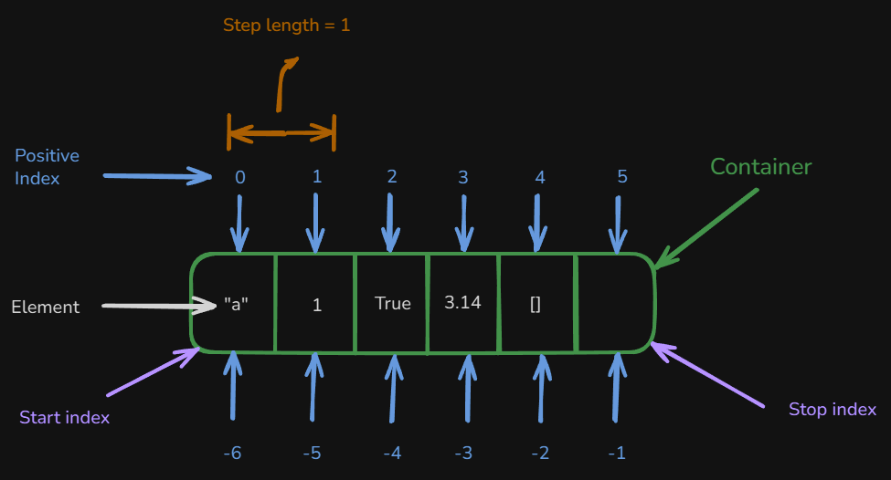

# Content of Python data types 3 level

- [Indexed sequence types](#indexed-sequence-types)
- [Non-indexed and Non-subscriptable Types](#non-indexed-and-non-subscriptable-types)
- [How mutable and immutable data types work](#how-mutable-and-immutable-data-types-work)
- [List data types](#list-data-types)
- [Dictionary data type](#dictionary-data-type)
- [Set data type](#set-data-type)
- [Strings data type](#strings-data-type)
- [Copy](#copy)

In previous levels (**Data Types 1 and 2**), we covered the basics of data types and how to write them. In this level, we go deeper to explore how we can manipulate data types and understand how they really work.

We will examine the key differences between **Mutable vs Immutable** types and how different data types support **element access** (by `index`, by `key`, or **not at all**).

We’ll start by looking at how different data types allow access to their elements, through **indexing**, **slicing**, **keys**, or **membership**.

## Indexed sequence types

Notations in Python provides, built-in way to work with sequences or collections. They let you directly **access**, **modify**, or **delete** elements within your data structures, whether those are hard-coded literals or dynamic data generated at runtime. You can use square brackets `[]` with **lists**, **strings**, **tuple** or **dictionaries** to target specific elements.



In the image above, you can see examples. **Indexing** (`[n]`) retrieves a single element at the specified position in sequences (and for dictionaries, you use a key, `dictionary["key"]`). **Remember** that indexing can be either **positive** (counting from the beginning) or **negative** (counting from the end). **Slicing** (`[start:stop]`) extracts a subsequence from an ordered collection, while **extended slicing** (`[start:stop:step]`) allows you to retrieve elements using a specified step to skip items.

So, let's begin with the basics and see how we create and use both **positive** and **negative** indexing for **sequences** and also how we use `keys` to access `values` in **dictionaries**.

```py
items = [10, 20, 30, 40, 50] # List example
phrase = "Python" # String example
tup = (100, 200, 300, 400) # Tuple example

# Positive indexing (index 0)
print("List first element:", items[0]) # Output: 10
print("String first character:", phrase[0]) # Output: P
print("Tuple first element:", tup[0]) # Output: 100

# Negative indexing (last element)
print("List last element:", items[-1]) # Output: 50
print("String last character:", phrase[-1]) # Output: n
print("Tuple last element:", tup[-1]) # Output: 400

# Dictionary Indexing (by key)
person = {"name": "Test", "age": 30}
print("Name value:", person["name"]) # Output: Test
print("Age value:", person["age"]) # Output: 30
```

Furthermore, we should explore how slicing works. When you write `[:]` or `[:::]` for a sequence, you obtain the full sequence (such as a `string`, `list`, `tuple`). Let's dive deeper and see different ways to use slicing.

```py
text = "Python" # String example
numbers = [10, 20, 30, 40, 50]  # List example
tupl = (100, 200, 300, 400, 500) # Tuple example

# Entire sequence
print(text[:], numbers[:], tupl[:])
# Positive slicing (from index 1 to 3)
print(text[1:4], numbers[1:4], tupl[1:4])
# Negative slicing (using negative indices)
print(text[-4:-1], numbers[-4:-1], tupl[-4:-1])
# Extended slicing with step (every 2nd element)
print(text[::2], numbers[::2], tupl[::2])
```

*When you use a **step** with **negative indices** (`text[-4:-1:2]`), Python applies the step **interval** in the same way as with **positive indices**.*

One important thing to understand about **slicing** is that it **never raises an error**. If the slice boundaries do not produce any valid elements, Python simply returns an **empty sequence**.

```py
text = "Python"
numbers = [10, 20, 30, 40, 50]

print(text[-5:3]) # 'Pyt'
print(text[-3:3]) # ''
print(numbers[-5:3]) # [10, 20, 30]
print(numbers[-3:3]) # []
```

Slicing always moves from **left to right** when the step is positive. If the **start index comes after the stop index**, no elements can be selected. Python does **not throw an error**, it simply returns an empty result.

This behavior is intentional and makes slicing **safe to use**.

```py
# No error, just an empty list
result = numbers[3:1]
print(result) # []
```

This is different from **indexing** (`numbers[10]`), which *does raise an error when the index does not exist*.

So far, we’ve used square brackets to access elements. Another common pattern is **reassignment**, where a variable is assigned a **new sequence** created by combining existing ones. This is typically done using the `+` operator.

```py
items = [1, 2, 3]
items = items + [4, 5]
print(items)
# Output: [1, 2, 3, 4, 5]
```

Here’s what happens, `items + [4, 5]` creates a new list then `items = ...` rebinds the name `items` to that new list and out original list object is **not modified**

This is **reassignment**, not in-place modification.

Strings behave similarly, but for a different reason, **strings are immutable**.

```py
text = "Hello"
text = text + " World"
print(text)
# Output: Hello World
```

Just like lists `"Hello" + " World"` creates a **new string** `text` is reassigned to that new object,

However, unlike lists, **this is the only way** strings can change, they cannot be modified in place.

Tuples are also **immutable**, but they still support concatenation.

```py
tup = (1, 2, 3)
tup = tup + (4, 5)
print(tup)
# Output: (1, 2, 3, 4, 5)
```

Again A **new tuple** is created then variable is rebound using `=` and **no in-place** modification occurs.

Not all collection types support `+`. **Sets** and **dictionaries** do not use concatenation with `+`.

```py
my_set = {1, 2, 3}
my_set = my_set + {4} # TypeError

my_dict = {"a": 1}
my_dict = my_dict + {"b": 2} # TypeError
```

These types use **different mechanisms** for updating, which are covered later.

## Non-indexed and Non-subscriptable Types

However, if you try to use the same square bracket notation (`[]`) on **non-indexed** or **non-subscriptable** types, you’ll encounter errors.

- **Sets** are **non-indexed**, so elements cannot be accessed by position.

- **Dictionaries** are **subscriptable**, but by **key**, not by numeric position.

    ```py
    item_dict = {0: "zero"}
    print(item_dict[0]) # Works because 0 is a key
    ```

- **int**, **float**, **bool**, and **None** are not collections and do not support subscripting at all.

```py
# Set
item_set = {1, 2, 3, 4, 5}
print(item_set[0]) # TypeError: 'set' object is not subscriptable

# Dictionary
item_dict = {"a": 1, "b": 2}
print(item_dict[0]) # Raises KeyError because there is no key 0
```

So far, we’ve focused on **which data types allow square bracket access (`[]`) and which do not**.

In programs, data is rarely flat. You will often work with **nested structures**, meaning one data type contains another data type inside it.

- lists containing other lists
- lists containing dictionaries
- lists containing sets
- lists containing tuples
- dictionaries containing lists
- dictionaries containing other dictionaries

In these cases, square brackets are not used just once, they are **chained together** to move step by step through the structure.

Before discussing mutability, it’s important to understand how square bracket notation can be used not only to **access** nested elements, but also to **add**, **update** using assignment (`=`).

## Nested access and assignment using square brackets (`[]`)

Square brackets `[]` are used to access elements by `index` in sequences, and by `key` in dictionaries.

When a structure is nested, you simply apply this multiple times.

Here is an example of a **list** containing another **list**

```py
numbers = [1, 2, [10, 20, 30]]

print(numbers[2]) # Output: [10, 20, 30]
print(numbers[2][1]) # Output: 20
```

Because lists are **mutable**, nested values can be **updated** using assignment.

```py
numbers[2][1] = 99
print(numbers)
# [1, 2, [10, 99, 30]]
```

Here is an example of a **dictionary** containing a **list**.

```py
profile = {
    "username": "admin",
    "roles": ["editor", "moderator"]
}

print(profile["roles"][0]) # editor
```

**Updating** a nested value works the same way.

```py
profile["roles"][0] = "admin"
print(profile)
```

Here is an example of a **dictionary** containing another **dictionary**.

```py
config = {
    "database": {
        "host": "localhost",
        "port": 5432
    }
}

print(config["database"]["port"]) # 5432
```

**Updating** and **adding** nested values using square brackets.

```py
config["database"]["port"] = 3306
config["database"]["user"] = "root"
print(config)
```

Now consider a **list** containing a **set**.

```py
data = [
    {1, 2, 3},
    {4, 5, 6}
]

print(data[0]) # {1, 2, 3}
```

Square brackets can be used to access the **set object itself**, because it is stored inside a list.

However, sets are **non-indexed**. This means you cannot access or update individual set elements using square brackets.

```py
data[0][1] # TypeError
```

What assignment can do in this case is **replace the entire set**, not modify its internal elements.

```py
data[0] = {10, 20, 30}
print(data)
```

Now consider a **list** containing a **tuple**.

```py
data = [
    (10, 20, 30),
    (40, 50, 60)
]

print(data[0]) # (10, 20, 30)
print(data[0][1]) # 20
```

Tuples are **indexed**, so values can be accessed using square brackets.

However, tuples are **immutable**, so their internal values **cannot be updated** using assignment.

```py
data[0][1] = 99 # TypeError
```

What assignment can do is **replace the entire tuple**, because the list itself is mutable.

```py
data[0] = (100, 200, 300)
print(data)
```

Square brackets are therefore used to **navigate** through nested structures, while assignment determines whether a value is **updated** or an object is **replaced**.

This distinction becomes essential when we examine how **mutable** and **immutable** data types behave in memory.

## How mutable and immutable data types work

In **Data Types Level 1**, was introduced the idea that.

- **Mutable data types** can be changed **in place**.
- **Immutable data types** **cannot** be changed in place, any modification will **create a new object** in memory.

Let’s start by **visualizing** what the difference is between **mutable** and **immutable** objects.

Consider a `list` which is a mutable

```py
my_list = [1, 2, 3]
print("Original list:", my_list)
print("Original id:", id(my_list))
```

*`id()` returns the object’s identity (a unique identifier for that object during its lifetime).*

For example, it might print something like this `140399008182208`.

Now, let’s modify the list using the `.append()` method.

```py
my_list.append(4)
print("After appending 4:", my_list)
print("Modified id:", id(my_list))
```

*Notice that the id stays the same. This means the list was **modified in place**, without creating a new object. That’s why list is a mutable type.*

Other `string` wich is immutable and here is code snippet.

```py
text = "Hello"
print("before:", text, id(text))
text = text + " world"
print("after:", text, id(text))
```

Here, the id changes after modification. This means a **new string object** was created in memory. That’s why `string` is an **immutable** type.

Now that we understand the difference between **mutable** and **immutable**, let’s dive deeper and see **what types exist** in each category and **how we work with them**.

## List data types

In Python, a **list** is a **mutable**, or changeable, **ordered sequence** of elements. This means you can **add**, **remove**, or **modify** elements directly, without creating a new object.

In programs, lists rarely store only simple values like numbers or strings. More often, they store **structured records**, such as **dictionaries**, **lists**, or other collections nested inside them.

If we wanna add a single element to the **end** of the list we will use `append(element)`. This is most common when **data arrives one record at a time**, such as from a **form submission**, an **API response**, or a **processing step**.

```py
valid_users = []

user = {"name": "example1", "email": "example@example.com", "active": True}

if user["email"] != "":
    valid_users.append(user)

print(valid_users)
```

This pattern is commonly used when **data arrives one item** at a time, such as **user registrations**, **form submissions**, **API responses**, or **streaming data**, where each new record is added to the **end** of a growing list.

If you need to insert an element at a **specific position**, use `insert(index, element)`.

```py
pipeline = [
    {"step": "load"},
    {"step": "process"}
]

pipeline.insert(1, {"step": "validate"})
print(pipeline)
```

This pattern is used when the **order of elements is important** and a specific **step must appear at a particular position**, such as **inserting validation steps** into a **processing pipeline** or **reordering tasks** in a workflow.

To add **multiple records at once**, use `extend(iterable)`.

```py
monday_logs = [
    {"event": "login"},
    {"event": "upload"}
]

tuesday_logs = [
    {"event": "download"},
    {"event": "logout"}
]

monday_logs.extend(tuesday_logs)
print(monday_logs)
```

This is commonly used when **merging datasets**, such as combining records from different **days**, **files**, or **data sources** into a **single list** for processing.

Next, let's explore several ways to remove elements from a list.

The `remove()` method deletes the **first matching element** by value.

```py
records = [
    {"id": 1, "valid": True},
    {"id": 2, "valid": False},
    {"id": 3, "valid": True}
]

records.remove({"id": 2, "valid": False})
print(records)
```

This works only when you know the **exact item** to remove, which rarely happens with real data.

More commonly, removal happens by position, using `pop()`.

```py
task_queue = [
    {"task": "download file"},
    {"task": "parse data"},
    {"task": "save results"}
]

while task_queue:
    task = task_queue.pop(0)
    print("Processing:", task["task"])
```

This is commonly used for **queues**, where tasks are processed **one by one in order**.

If no index is provided, `pop()` removes the **last element**.

```py
logs = [
    {"event": "login"},
    {"event": "update"},
    {"event": "logout"}
]

last_event = logs.pop()
print("Last event:", last_event)
print(logs)
```

This pattern is common when the most **recent entry should be handled first**, such as in **text editors** where undo operations are applied to the latest action.

If you want to remove **all records** but keep the list object itself, use `clear()`. Is commonly used when a **list** is **reused across stages** of a program rather than recreated.

```py
event_log = []

# Stage 1
event_log.append({"event": "app_started"})
event_log.append({"event": "user_logged_in"})
print("Stage 1 logs:", event_log)

# After processing or sending logs
event_log.clear()

# Stage 2
event_log.append({"event": "user_updated_profile"})
event_log.append({"event": "user_logged_out"})
print("Stage 2 logs:", event_log)
```

This pattern is commonly used when a **list is reused across multiple stages of a program**, such as **clearing processed data before collecting the next batch to send to a database**, **log system**, or **API**.

Another common task with lists is **ordering elements**. Python provides the `sort(key, reverse)` method, which can be customized with two optional parameters.

By default, `sort()` arranges elements in **ascending order** (from smallest to largest). In programs, this usually means **lowest value first**, **earliest**, **simplest**, or **least important**.

```py
scores = [85, 40, 92, 70, 60]
scores.sort()

print(scores)
```

*This is useful when you want to see the lowest values first, such as identifying underperforming results or minimum thresholds.*

To sort in **descending order**, pass `reverse=True`. Descending order is commonly used when you want to see **highest priority**, **most recent**, or **best results first**.

```py
results = [
    {"user": "Example1", "score": 78},
    {"user": "Example2", "score": 92},
    {"user": "Example3", "score": 85}
]

def score_value(record):
    return record["score"]

# Show highest scores first
results.sort(key=score_value, reverse=True)

for result in results:
    print(result["user"], result["score"])
```

The `key` parameter allows sorting based on a **derived value**, rather than the elements themselves.

For example, words by their **length**.

```py
tasks = [
    {"task": "sync"},
    {"task": "validate input"},
    {"task": "generate monthly financial report"}
]

def task_length(task):
    return len(task["task"])

tasks.sort(key=task_length)

for task in tasks:
    print(task["task"])
```

Here, `len` is a function passed as **an argument**, which is possible because functions are **first-class objects** in Python.

This idea appears frequently when working with **collections of structured data**. So far, we’ve seen lists storing values and records, and how functions can operate on those values to control behavior such as **sorting** or **filtering**.

However, data is rarely identified only by **position**. Instead, data usually has **names**, **labels**, or **keys** that describe what each value represents. To model this kind of **labeled data**, Python provides another collection type, **dictionary**.

## Dictionary data type

Next, let’s explore another important data type in Python `dict`, also known as a **mapping type**. A dictionary is a **mutable mapping type** that stores data as **`key:value` pairs** and is accessed by **keys rather than indexes**.

Dictionaries are **rarely flat**. They often contain **lists**, **other dictionaries**, and **mixed data types** to represent structured information.

Because dictionaries are **mutable**, we can **add**, **update**, and **remove** `key:value` pairs as the program runs.

To access values in a dictionary, one of the most common ways is to use the `get("key")` method.  

The `get()` method is especially useful when working with **nested dictionaries**, where some fields may or may not exist.

Consider an application configuration object.

```py
config = {
    "database": {
        "host": "localhost",
        "port": 5432,
        "credentials": {
            "user": "admin",
            "password": "secret"
        }
    },
    "features": {
        "logging": True,
        "debug": False
    }
}
```

Accessing **nested values**

```py
db_config = config.get("database")
print(db_config)
```

Chaining `get()` allows **safe navigation** through nested data

```py
db_port = config.get("database", {}).get("port")
print(db_port)
# Output: 5432
```

`get("database", {})` prevents errors if `"database"` is missing

In applications, **optional configuration** fields are common.

```py
timeout = config.get("database", {}).get("timeout")
print(timeout)
# Output: None
```

Providing a **default value**

```py
timeout = config.get("database", {}).get("timeout", 30)
print(timeout)
# Output: 30
```

This pattern is appears when optional configuration values **may** or **may not be defined**, and the application must continue safely if they are missing.

Another very common structure is a dictionary that contains **lists of records**.

```py
users = {
    "admins": [
        {"name": "Example1", "active": True},
        {"name": "Example2", "active": False}
    ],
    "editors": [
        {"name": "Example3", "active": True}
    ]
}
```

Accessing **nested list** data

```py
first_admin = users.get("admins", [])[0]
print(first_admin)
```

Accessing a **specific value** inside a nested structure

```py
admin_name = users.get("admins", [])[0].get("name")
print(admin_name)
```

Using `get()` to avoid runtime errors if we try to **access unsafe** way.

```py
print(users["moderators"][0]["name"])
# KeyError
```

With **safe access**.

```py
moderators = users.get("moderators", [])
if moderators:
    print(moderators[0].get("name"))
else:
    print("No moderators found")
```

This pattern is used when **retrieving the first item from a group** while still **guarding against missing keys**.

Next, let’s see how we can **change values** or **add new key–value pairs** in a dictionary. For this, we use the `update({...})` method.

The `update()` method allows you to **modify** existing values or **add** new `key:value` pairs inside a dictionary. This becomes especially useful when working with nested **configuration data**, **user profiles**, or **application state**.

Consider an application configuration dictionary.

```py
config = {
    "database": {
        "host": "localhost",
        "port": 5432
    },
    "features": {
        "logging": True
    }
}
```

If the database port changes, we can update it using `update()`.

```py
config["database"].update({"port": 3306})
print(config)
```

Here `"database"` already exists then `update()` modifies only the specified `key` and all other configuration values remain unchanged. This pattern is common when **environment settings** or **connection parameters** change without affecting other configuration values.

```py
config["database"].update({"timeout": 30})
print(config)
```

This is typical used when introducing **optional configuration** values as applications evolve.

Often, multiple related values need to be updated together.

```py
config["database"].update({
    "host": "db.internal",
    "port": 5432
})
print(config)
```

This pattern is useful when **multiple related settings** must be updated together, such as during **deployments** or **runtime configuration changes**.

`update()` is also frequently used when working with **lists of dictionaries**, such as user records.

```py
users = [
    {"id": 1, "name": "Example1", "active": True},
    {"id": 2, "name": "Example2", "active": False}
]
```

Suppose user `id=2` becomes active.

```py
users[1].update({"active": True})
print(users)
```

This pattern appears in **management systems** or **processing pipelines** where individual records must be updated in place.

Sometimes additional data arrives later and must be merged into an existing record.

```py
user_profile = {
    "id": 3,
    "name": "Charlie"
}

extra_data = {
    "email": "charlie@example.com",
    "role": "editor"
}

user_profile.update(extra_data)
print(user_profile)
```

Here new keys are **added** and then existing keys (if any) would be **overwritten** and the **original dictionary** object remains the same.

This is common used when combining data from **multiple sources**, such as **merging API responses** into an existing user record.

When merging dictionaries, overlapping `keys` are **replaced**, not merged.

```py
settings = {
    "theme": "light",
    "language": "en"
}

override = {
    "theme": "dark"
}

settings.update(override)
print(settings)
```

This behavior is intentionally used to **override defaults** with **user-defined preferences** or **environment-specific values**.

Another useful dictionary method is `setdefault(key, value)`. It is designed for situations where you want to **ensure a key exists**, without **overwriting** existing data.

This is common when building **nested structures**, such as **logs**, **grouped records**, **counters**, or **categorized data**.

Imagine you are **processing events** and **grouping** them by user.

```py
events = [
    {"user": "Example1", "action": "login"},
    {"user": "Example2", "action": "login"},
    {"user": "Example1", "action": "upload"},
    {"user": "Example2", "action": "logout"},
]
```

You want a structure like this

```py
{
    "Example1": ["login", "upload"],
    "Example2": ["login", "logout"]
}
```

Building **grouped** data with `setdefault()`

```py
activity_log = {}

for event in events:
    user = event["user"]
    action = event["action"]

    activity_log.setdefault(user, []).append(action)

print(activity_log)
```

What happens here is `user` does not exist, `setdefault()` **creates** it with an empty list `[]` If `user` **already exists**. This pattern is used for **grouped data** or **categorized data** without **overwriting** existing data.

If you tried to use `update()` instead

```py
activity_log.update({"Example1": []})
```

You would **overwrite existing data**, losing previously collected actions, `setdefault()` avoids that risk entirely.

Consider an application configuration that grows over time.

```py
config = {
    "features": {
        "auth": True
    }
}
```

Later in the program, a **logging** section may or may not already exist.

```py
logging_config = config.setdefault("logging", {})
logging_config.setdefault("level", "INFO")
logging_config.setdefault("format", "json")

print(config)
```

And the result would be like this

```py
{
    "features": {"auth": True},
    "logging": {"level": "INFO", "format": "json"}
}
```

Here `setdefault()` safely creates missing sections and existing configuration is preserved so that nested structures **grow incrementally**.

Tracking scores per category

```py
results = [
    {"category": "math", "score": 80},
    {"category": "science", "score": 90},
    {"category": "math", "score": 85}
]

scores_by_category = {}

for result in results:
    scores_by_category.setdefault(result["category"], []).append(result["score"])

print(scores_by_category)
```

Output would be

```py
{
    "math": [80, 85],
    "science": [90]
}
```

This pattern appears in **analytics**, **reporting systems**, **log aggregation** or **metrics collection**.

Next, let’s look at how we can **remove items** from a dictionary.

In practice, **dictionaries** often store structured data, such as **user profiles**, **configuration sections**, **session data**, or **cached records**, not just flat `key:value` pairs.

The `del` keyword is **not a method**, but a **Python statement**. It removes a `key:value` pair by `key`.

This is commonly used when a piece of data becomes **invalid** or **no longer needed**.

```py
user_profile = {
    "id": 101,
    "name": "Example1",
    "email": "Example1@example.com",
    "session": {
        "token": "abc123",
        "expires": "2026-01-01"
    }
}

# Remove session data after logout
del user_profile["session"]

print(user_profile)
```

Here the user record stays only the **session related data** is **removed**, this is common used to remove sensitive or temporary data, such as **session information after logout** or **cleanup operations**. If the `key` does not exist, `del` raises a `KeyError`.

The `pop()` method **removes** a `key` **and returns its value**, which is useful when the removed data still needs to be processed.

```py
cache = {
    "page:/home": "<html>...</html>",
    "page:/about": "<html>...</html>"
}

expired_page = cache.pop("page:/home")

print("Expired cache entry:", expired_page)
print("Remaining cache:", cache)
```

You remove the entry but still have **access** to the removed data and is commonly used when **removed data must still be processed**, such as **cache invalidation** or **task consumption**.

In applications, data may or may not **exist**. Using `pop()` with a default avoids **runtime errors**.

```py
settings = {
    "theme": "dark",
    "language": "en"
}

timezone = settings.pop("timezone", "UTC")
print("Timezone:", timezone)
print(settings)
```

The program no need for extra `if key in dict` checks, ideal for avoiding **runtime errors** when **optional keys may not exist** and **eliminates the need for manual existence checks**.

`popitem()` removes and returns the **most recently added** `key:value` pair. This is commonly used when **dictionaries act as stacks** or **temporary stores**.

```py
request_context = {
    "request_id": "req-001",
    "user": "Example1",
    "debug": True
}

last_entry = request_context.popitem()
print("Removed:", last_entry)
print(request_context)
```

This is used when **dictionaries** act as **stacks** or **temporary stores**, **reverse-order processing**. Calling `popitem()` on an **empty dictionary** raises a `KeyError`.

The `clear()` method **removes all** `key:value` pairs, but keeps the dictionary object itself. This is useful when **reusing containers** across multiple stages of a program.

```py
session_data = {
    "user_id": 42,
    "cart": ["item1", "item2"],
    "auth_token": "xyz789"
}

# Reset session after logout
session_data.clear()

print(session_data)
```

This pattern is common when **reusing dictionary objects across application stages**, such as **resetting session**.

The next data type we’ll explore is the **set**.

## Set data type

A set is a **non-indexed collection of unique elements**. Unlike lists or tuples, sets **do not allow duplicate values**, meaning each element must be unique. Sets are also **mutable**, so you can **add or remove items** after a set has been created.

Since sets are **non-indexed**, you cannot access elements by `index` like you do in lists. To work with elements in a `set`, you typically use **loops**, which we already explored in **Control Flow 1 and 3 Level**.

Sets are commonly used to **track unique values**, when data is nested inside other collections, such as **lists of records** or **dictionaries of grouped data**.

Consider a dataset of **user actions**, where the same user may appear multiple times.

```py
events = [
    {"user": "example1", "action": "login"},
    {"user": "example2", "action": "login"},
    {"user": "example1", "action": "upload"},
    {"user": "example3", "action": "login"},
    {"user": "example2", "action": "logout"}
]
```

If we want to know **which users were active**, we don’t care how many times they appeared, only that they appeared at least once.

```py
active_users = set()

for event in events:
    active_users.add(event["user"])

print(active_users)
```

Here, the `set` **automatically removes duplicates**, giving us a collection of **unique users**. This pattern is common when **processing logs**, **events**, or **audit data**.

Because sets guarantee uniqueness, there is **no need to manually check** if a user was already added.

Let’s look at another example where a set is used **inside a dictionary**.

Imagine a system that tracks **permissions per role**, where permissions must never be duplicated.

```py
permissions = {
    "admin": {"read", "write", "delete"},
    "editor": {"read", "write"},
    "viewer": {"read"}
}
```

Each value here is a **set**, not a **list**, because permissions must be **unique**.

If we later want to grant a new permission, we can safely add it without worrying about duplicates.

```py
permissions["editor"].add("publish")
permissions["editor"].add("write") # duplicate, ignored

print(permissions["editor"])
```

This is common in **access control systems**, and **role-based authorization**, where uniqueness is a requirement.

Sets are also frequently nested inside **lists of records**.

Consider a dataset where each user has a list of actions, and we want to **extract unique actions per user**.

```py
users = [
    {"name": "example1", "actions": ["login", "upload", "login"]},
    {"name": "example2", "actions": ["login", "logout", "login"]}
]
```

We can convert the action lists into sets to remove duplicates.

```py
for user in users:
    user["actions"] = set(user["actions"])

print(users)
```

Here, each user record is still a dictionary, but the `actions` field becomes a **set**, ensuring uniqueness while keeping the overall structure intact.

This pattern appears in **analytics**, **activity tracking**, and **event aggregation** systems.

Now let’s look at `add(obj)`.

The `add()` method is used when **new data arrives incrementally**, such as **new sessions**, **processed IDs**, or **completed tasks**.

```py
processed_ids = set()

incoming_batches = [
    [101, 102, 103],
    [102, 104],
    [105, 101]
]

for batch in incoming_batches:
    for record_id in batch:
        processed_ids.add(record_id)

print(processed_ids)
```

Even though the same **IDs** appear multiple times across batches, the set keeps **only unique values**.

Another way to add elements is by using the `update(iterable)` method.

Unlike `add()`, which inserts **one element at a time**, `update()` can take an **iterable** (such as a **list**, **tuple**, or another **set**) and add **all its elements into** into the **set** at once.

This is useful when new data arrives in **groups**, not individually.

```py
processed_ids = {101, 102}

new_batch = [102, 103, 104]

processed_ids.update(new_batch)
print(processed_ids)
```

Here, `102` already exists and is ignored, while `103` and `104` are added. This pattern is very common when processing **batch data**, **API responses**, or **file imports**.

**Sets** are often updated from **nested structures**, not **simple lists**.

Consider a **stream of events** grouped by source.

```py
event_batches = {
    "sensor_1": [201, 202, 203],
    "sensor_2": [202, 204],
    "sensor_3": [205, 201]
}

all_event_ids = set()

for batch in event_batches.values():
    all_event_ids.update(batch)

print(all_event_ids)
```

Here, each value in the dictionary is a **list** so `update()` absorbs all values and **duplicates** are removed automatically

**Sets** are often stored **inside dictionaries** to track unique values per category.

```py
active_sessions = {
    "us-east": {"sess_1", "sess_2"},
    "eu-west": {"sess_3"}
}
```

New sessions arrive for a specific region.

```py
new_sessions = ["sess_2", "sess_4", "sess_5"]

active_sessions["us-east"].update(new_sessions)

print(active_sessions["us-east"])
```

The region already exists so `update()` merges multiple sessions at once and the **duplicates** are ignored safely. This is typical for **regional tracking**, **sharded systems**.

When combining results from different stages, `update()` is clearer than looping.

```py
validated_ids = {1, 2, 3}
processed_ids = {3, 4, 5}

validated_ids.update(processed_ids)

print(validated_ids)
```

This produces a **union**, while keeping the original set object intact.

**Sets** are often **inhabited** from **lists of dictionaries**, not raw values.

```py
records = [
    {"id": 301, "status": "ok"},
    {"id": 302, "status": "ok"},
    {"id": 301, "status": "retry"}
]

unique_ids = set()

unique_ids.update(record["id"] for record in records)

print(unique_ids)
```

Data is nested inside dictionaries and **set** extracts only the **unique identifiers**, no extra condition checks are required.

This appears frequently in **data cleanup**, and **report generation**.

Now let’s move on to the methods for **removing elements** from a **set**.

**Sets** are often used to **track state**, such as **active users**, **processed IDs**, **cached items**, or **permissions**. Removing elements usually means that something is no longer **valid**, **finished**, or **expired**.

The `remove(element)` method deletes a specific item from the set. If the element does **not exist**, Python raises a `KeyError`.

Consider a system that tracks **currently active user sessions**.

```py
active_sessions = {"sess_101", "sess_102", "sess_103"}

# A user logs out
active_sessions.remove("sess_102")

print(active_sessions)
```

Here, the session is known to exist, so `remove()` is appropriate.

If you attempt to remove a session that is not tracked, Python raises an error.

```py
active_sessions.remove("sess_999")
# KeyError
```

Sets are often nested inside dictionaries to group unique values.

```py
user_permissions = {
    "admin": {"read", "write", "delete"},
    "editor": {"read", "write"},
    "viewer": {"read"}
}
```

If an **editor** loses write access.

```py
user_permissions["editor"].remove("write")
print(user_permissions["editor"])
```

The permission is expected to exist by removing a **missing permission** would indicate **corrupted data** is common in **authorization**.

The `discard(element)` method removes an element **if it exists**, but **does nothing if it does not**.

This makes good when data may **expired**

Consider a background worker tracking **pending job IDs**.

```py
pending_jobs = {"job_1", "job_2", "job_3"}

# A job completes
pending_jobs.discard("job_2")
print(pending_jobs)
```

No error is raised.

The `pop()` method removes and returns an **arbitrary element** from the **set**.

Because sets are **non-indexed**, you don’t control **which** element is removed. This makes `pop()` useful when the specific element **does not matter**, only that one **element is consumed**.

A common use case is **processing items until none remain**.

```py
pending_jobs = {"job_101", "job_102", "job_103"}

current_job = pending_jobs.pop()
print("Processing:", current_job)
print("Remaining jobs:", pending_jobs)
```

Here is one job is removed and job **ID** is returned using in **task schedulers**

Sets are often nested **inside dictionaries**.

```py
server_connections = {
    "server_a": {"conn_1", "conn_2"},
    "server_b": {"conn_3"}
}
```

When cleaning up **one connection at a time**.

```py
closed_conn = server_connections["server_a"].pop()
print("Closed connection:", closed_conn)
print(server_connections)
```

If the **set** is empty, calling `pop()` raises a `KeyError`.

```py
empty_set = set()
empty_set.pop()
# KeyError
```

It's good to check before popping.

```py
if pending_jobs:
    job = pending_jobs.pop()
```

he `clear()` method removes **all elements**, but keeps the set object itself.

```py
active_users = {"user_1", "user_2", "user_3"}

# System shutdown or reset
active_users.clear()

print(active_users)
# Output: set()
```

This is useful when **reusing containers**, **clearing caches between phases**.

The `intersection()` method returns a **new set** containing only elements present in **both sets**.

Consider checking **shared permissions**.

```py
user_permissions = {"read", "write", "delete"}
required_permissions = {"read", "execute"}

allowed = user_permissions.intersection(required_permissions)
print(allowed)
```

This appears in **compatibility checks** and the **original sets** remain unchanged.

The `difference()` method returns elements that exist in one **set** but not the other.

```py
expected_files = {"a.txt", "b.txt", "c.txt"}
uploaded_files = {"a.txt", "c.txt"}

missing_files = expected_files.difference(uploaded_files)
print(missing_files)
```

Is common when **upload validation**. The **original set** remains unchanged.

However, **sets** don’t **preserve order**, and they don’t store text in a meaningful structure.

To work with **textual data**, **messages** and **content**, we now move to the most common data type in Python programs.

## Strings data type

A **string** is an **immutable sequence of Unicode characters**.

Because strings are **ordered**, you can access individual characters using **indexing**, but because they are **immutable**, you cannot modify them in place.

Strings are used everywhere **user input**, **messages**, **file names**, **configuration values**, **API responses**

Normalizing text with `upper()` and `lower()`

One of the most common uses of strings is normalization (converting text into a **consistent** form **before comparing** or **storing it**).

- **Case-insensitive comparisons**

User input is unpredictable.

```py
user_input = "Admin"
```

Instead of checking every possible case,

```py
if user_input == "admin" or user_input == "Admin":
    pass
```

You normalize first.

```py
if user_input.lower() == "admin":
    print("Admin access granted")
```

Appears in **role checks** or **form validation**

magine processing usernames from different sources.

```py
raw_usernames = ["Example", "example", "EXAMPLE", "ExamplE"]
```

To ensure consistency

```py
normalized = []

for name in raw_usernames:
    normalized.append(name.lower())

print(normalized)
# ["example", "example", "example", "example"]
```

This is commonly done before **storing data in databases**

While logic often uses lowercase, **display output** may require uppercase.

```py
status = "error"
print(status.upper())
# ERROR
```

This is common in **logs**, **alerts**.

Calling `upper()` or `lower()` **does not change the original string**.

```py
text = "Hello"
text.upper()

print(text)
# Hello
```

You must assign the result

```py
text = text.upper()
print(text)
# HELLO
```

This behavior is intentional and protects strings from accidental mutation.

**Strings** often live inside **lists** and **dictionaries**.

```py
users = [
    {"name": "Example1", "role": "Admin"},
    {"name": "example2", "role": "editor"},
    {"name": "EXAMPLE3", "role": "VIEWER"}
]
```

Normalize roles before using them.

```py
for user in users:
    role = user["role"].lower()
    if role == "admin":
        print("Admin user:", user["name"])
```

Because strings are ordered, you can access characters by index.

```py
filename = "report_2026.pdf"

extension = filename[-3:]
print(extension)
# pdf
```

Common for **file validation**, **extension checks**

Another example

```py
country_code = "+370-612-34567"
print(country_code[:4])
# +370
```

Strings are often **containers of multiple values**, not just plain text. Data frequently arrives as **one string** that must be **split** into parts before it can be processed.

By default, `split()` separates a string using **whitespace** (spaces, tabs, newlines).

This is extremely common when handling **user input**, **command-line arguments**

```py
command = "deploy production --force"

parts = command.split()
print(parts)
# ['deploy', 'production', '--force']
```

Each part can now be processed independently

```py
action = parts[0]
environment = parts[1]

print(action, environment)
# deploy production
```

This pattern is common in **CLI tools**

Often, values are separated by a **specific character**, such as a **comma**, **colon**, or **pipe** (`|`).

Reading **CSV-like input**.

```py
row = "101,example,admin,active"

fields = row.split(",")
print(fields)
# ['101', 'example', 'admin', 'active']
```

This allows you to map values into a structured record

```py
user = {
    "id": int(fields[0]),
    "name": fields[1],
    "role": fields[2],
    "status": fields[3]
}

print(user)
```

This appears in **CSV parsing**, **exported reports**

Common case is parsing `key=value` strings.

```py
setting = "timeout=30"

key, value = setting.split("=")
print(key, value)
# timeout 30
```

Frequently in **environment variables** or **URL query strings**

When working with multi-line text, `splitlines()` is safer than `split("\n")`, because it handles different line endings correctly.

```py
log_data = """INFO Server started
WARNING Low memory
ERROR Disk full"""
```

Appears in **reading text files**

```py
lines = log_data.splitlines()

for line in lines:
    print("Log entry:", line)
```

Sometimes you want to **check if a string starts or ends** with a specific substring. Python provides two useful methods:

In programs, strings are often validated based on how they **start** or **end**, rather than by exact equality.  
Python provides `startswith()` and `endswith()` for this purpose.

These checks are commonly used for **file validation**, **URL handling**, **log parsing**, and **input filtering**.

Consider validating uploaded filenames.

```py
filename = "report_2026.pdf"

if filename.endswith(".pdf"):
    print("Valid PDF file")
else:
    print("Invalid file type")
```

Common in **file upload**, where only certain file types are allowed.

Another example is filtering log entries by severity.

```py
log_line = "ERROR Disk full"

if log_line.startswith("ERROR"):
    print("Critical issue detected")
```

This appears frequently in **monitoring systems** and **log processors**.

You can also start checking from a specific position in the string.

```py
path = "/api/v1/users"

if path.startswith("v1", 5):
    print("Version 1 API request")
```

This is useful when working with **URLs**.

Ending checks are often used for **extensions** or **format validation**.

```py
email = "user@example.com"

if email.endswith("@example.com"):
    print("Internal company email")
```

If you want to **replace part of a string** with another value, you can use the `replace(old, new[, count])` method.

- `old` is substring you want to replace
- `new` is substring to replace it with  
- `count` is (optional) and the **maximum number of occurrences** to replace.

Replacing text is commonly used when **cleaning data**, **normalizing input**, or **masking sensitive values**.

```py
message = "User password is secret123"

safe_message = message.replace("secret123", "***")
print(safe_message)
```

Working with **logs**, **user data**, or **security-related information** that must not be stored in plain form.

```py
text = "ERROR: Disk error detected"

fixed = text.replace("error", "issue", 1)
print(fixed)
# ERROR: Disk issue detected
```

Here only the first occurrence is replaced, leaving the rest of the message unchanged. This is used when **correcting a specific field** without **altering the entire text**.

User input and external data often **contain unwanted whitespace**. This includes **spaces**, **tabs**, and **newline characters**.

To clean this up, Python provides the `strip()`.

```py
raw_input = "   admin   "
```

Without cleaning

```py
if raw_input == "admin":
    print("Access granted")
```

This fails because of **extra spaces**.

Using `strip()` removes **whitespace** from **both ends**.

```py
cleaned = raw_input.strip()

if cleaned == "admin":
    print("Access granted")
```

This is common in **form handling**, **CLI tools**, and **API input validation**.

Programs often need to **locate**, **count**, or **analyze specific text inside strings**.

Consider processing **authentication log**

```py
log = "User login failed. User login failed again."
```

Counting how many times an event occurred.

```py
attempts = log.count("failed")
print(attempts)
# 2
```

This is common in **monitoring**, **rate limiting**, or **analytics**.

Finding the **first occurrence** of a **substring**.

```py
first_failure = log.find("failed")
print(first_failure)
# 11
```

Using this `index` to extract surrounding context.

```py
snippet = log[first_failure:first_failure + 20]
print(snippet)
# failed. User login
```

This technique is often used in **log viewers**, **debug tools**, or **error summarization**.

When the **substring must exist**, use `index()` instead of `find()`.

```py
separator = log.index(".")
print(separator)
# 22
```

If the expected subject is missing, the program fails **immediately**, which helps **catch corrupted logs** or **unexpected formats early**.

## Tuple data types

- **`tuple`** (ordered, immutable)  

The reason is unlike strings, which are also immutable but still provide rich helper methods, `tuples` and `frozensets` don’t have methods that let you **add**, **remove**, or **update** elements.  

Since their main strength lies in **immutability**, they are most useful in contexts where you don’t want data to change.

## Copy

```py
# Shallow copy of a list
original_list = [1, 2, 3]
new_list = list(original_list)
print(new_list)
# Output: [1, 2, 3]

# Shallow copy of a dictionary
original_dict = {"a": 1, "b": 2}
new_dict = dict(original_dict)
print(new_dict)
# Output: {'a': 1, 'b': 2}

# Shallow copy of a set
original_set = {4, 5, 6}
new_set = set(original_set)
print(new_set)
# Output: {4, 5, 6}
```

This creates a new container object, separate from the original. So if you add or remove items from `new_list`, it won’t affect `original_list`.

```py
original_list = [1, 2, 3]
new_list = list(original_list)

new_list.append(4)

print("=== INITIAL STATE ===")
print(f"Original: {original_list} (id: {id(original_list)})")
print(f"New copy: {new_list} (id: {id(new_list)})")
print(f"Are they the same object? {id(original_list) == id(new_list)}")
print()
# Original: [1, 2, 3] (id: 140245678345600)
# New copy: [1, 2, 3] (id: 140245678987456)
# Are they the same object? False

print("=== AFTER MODIFICATION ===")
print(f"Original: {original_list} (id: {id(original_list)})")
print(f"New copy: {new_list} (id: {id(new_list)})")
print(f"Are they still the same object? {id(original_list) == id(new_list)}")
# Original: [1, 2, 3] (id: 140245678345600)
# New copy: [1, 2, 3, 4] (id: 140245678987456)
# Are they still the same object? False
```

But if your container holds **mutable elements** (like lists inside a list), both the original and the copy will still share references to those inner objects. That means modifying an inner element in the copy will also affect the original.

```py
original = [[1, 2], [3, 4]]
shallow_copy = list(original)

print("=== INITIAL STATE ===")
print(f"Original: {original} (id: {id(original)})")
print(f"Shallow copy: {shallow_copy} (id: {id(shallow_copy)})")
print(f"Are they the same object? {id(original) == id(shallow_copy)}")
print()
# Original: [[1, 2], [3, 4]] (id: 140245678345600)
# Shallow copy: [[1, 2], [3, 4]] (id: 140245678987456)
# Are they the same object? False

print("=== INNER LISTS (BEFORE MODIFICATION) ===")
print(f"Original[0]: {original[0]} (id: {id(original[0])})")
print(f"Shallow_copy[0]: {shallow_copy[0]} (id: {id(shallow_copy[0])})")
print(f"Are inner lists [0] the same object? {id(original[0]) == id(shallow_copy[0])}")
print()
# Original[0]: [1, 2] (id: 140245678345792)
# Shallow_copy[0]: [1, 2] (id: 140245678345792)
# Are inner lists [0] the same object? True

# Modify an inner list inside the copy
shallow_copy[0].append(99)

print("=== AFTER MODIFICATION ===")
print(f"Original: {original} (id: {id(original)})")
print(f"Shallow copy: {shallow_copy} (id: {id(shallow_copy)})")
print()
# Original: [[1, 2, 99], [3, 4]] (id: 140245678345600)
# Shallow copy: [[1, 2, 99], [3, 4]] (id: 140245678987456)

print("=== INNER LISTS (AFTER MODIFICATION) ===")
print(f"Original[0]: {original[0]} (id: {id(original[0])})")
print(f"Shallow_copy[0]: {shallow_copy[0]} (id: {id(shallow_copy[0])})")
print(f"Are inner lists [0] still the same object? {id(original[0]) == id(shallow_copy[0])}")
print()
# Original[0]: [1, 2, 99] (id: 140245678345792)
# Shallow_copy[0]: [1, 2, 99] (id: 140245678345792)
# Are inner lists [0] still the same object? True
```

*Both got updated because the inner lists are still the same **objects in memory**.*

Another way to create a **shallow copy** of a collection is by using the built-in  
`.copy()` method (available for `list`, `dict`, and `set`).  

```py
# Using .copy() on a list
original_list = [1, 2, 3]
copied_list = original_list.copy()
print(copied_list)  
# Output: [1, 2, 3]

# Using .copy() on a dictionary
original_dict = {"a": 1, "b": 2}
copied_dict = original_dict.copy()
print(copied_dict)  
# Output: {'a': 1, 'b': 2}

# Using .copy() on a set
original_set = {4, 5, 6}
copied_set = original_set.copy()
print(copied_set)  
# Output: {4, 5, 6}
```

*This creates a new container object, but it is still a shallow copy - meaning if the container holds mutable elements, those inner elements are still shared between the original and the copy.*

Unlike **shallow copy**, there isn’t a way to make a **deep copy** using **built-in class constructors**.

For that, we need to **import a module** specifically the `copy` module.

Let’s just see how it works.

```py
import copy

# Example of shallow vs deep copy
original_list = [[1, 2], [3, 4]]

# Shallow copy
shallow_copy = copy.copy(original_list) # Same as: original_list.copy() or original_list[:]

# Deep copy
deep_copy = copy.deepcopy(original_list)

# Modify inner list
original_list[0][0] = 99

print("Original:", original_list)     
# Output: [[99, 2], [3, 4]]

print("Shallow copy:", shallow_copy)  
# Output: [[99, 2], [3, 4]] (still linked to the original inner list)

print("Deep copy:", deep_copy)        
# Output: [[1, 2], [3, 4]] (completely independent copy)
```
