# Duomenų vizualizavimas - turinys

- [Kas yra duomenų vizualizavimas](#kas-yra-duomenų-vizualizavimas)
- [Duomenų vizualizavimo tikslas](#duomenų-vizualizavimo-tikslas)
- [Vizualizacijų tipai](#vizualizacijų-tipai)
- [Diagramų rūšys](#diagramų-rūšys)
- [Histograma](#histograma)
- [Infografikas](#infografikas)
- [Duomenų analizė ir vizualizacija](#duomenų-analizė-ir-vizualizacija)

Duomenys šiandien yra visur. Kiekvieną dieną susiduriame su įvairia informacija – orų prognozėmis, gyventojų statistika, apklausų rezultatais, sporto rezultatais, finansiniais rodikliais ar socialinių tinklų duomenimis.

Tačiau dideli duomenų kiekiai dažnai būna sunkiai suprantami, kai pateikiami tik lentelėmis ar skaičių sąrašais. Dėl šios priežasties duomenys dažnai paverčiami vaizdine forma, kuri leidžia greičiau pastebėti tendencijas, palyginti rezultatus ir padaryti išvadas.

Būtent tam naudojamas duomenų vizualizavimas (*data visualization*). Jis padeda informaciją pateikti aiškiai, suprantamai ir vizualiai patraukliai.

Šioje temoje nagrinėsime, kas yra duomenų vizualizavimas, koks jo tikslas, kokios yra pagrindinės vizualizacijų rūšys, kuo skiriasi įvairios diagramos, kas yra histograma ir infografikas bei kaip duomenų analizė susijusi su duomenų vizualizavimu.

Taip pat aptarsime, kaip duomenų analizės rezultatai pateikiami vizualiai ir kokie principai padeda kurti aiškias bei informatyvias vizualizacijas.

Pirmiausia svarbu suprasti pagrindinę sąvoką - kas apskritai yra duomenų vizualizavimas.

## Kas yra duomenų vizualizavimas

Duomenų vizualizavimas yra procesas, kurio metu duomenys pateikiami vaizdine forma, naudojant diagramas, grafikus, lenteles, žemėlapius, infografikus ir kitas vaizdines priemones.

Angliškai duomenų vizualizavimas vadinamas *data visualization*.

Pagrindinis duomenų vizualizavimo tikslas - sudėtingus duomenis paversti aiškiai suprantama informacija. Žmogaus smegenys vaizdinę informaciją apdoroja greičiau nei didelius tekstinių ar skaitinių duomenų kiekius, todėl vizualizacijos padeda lengviau pastebėti svarbius faktus, tendencijas ir dėsningumus.

Pavyzdžiui, jei turime lentelę su mokinių pažymiais, gali būti sunku iš karto įvertinti bendrus rezultatus. Tačiau pavaizdavus tuos pačius duomenis stulpeline diagrama, greitai matyti, kurie mokiniai surinko daugiausia ar mažiausia taškų.

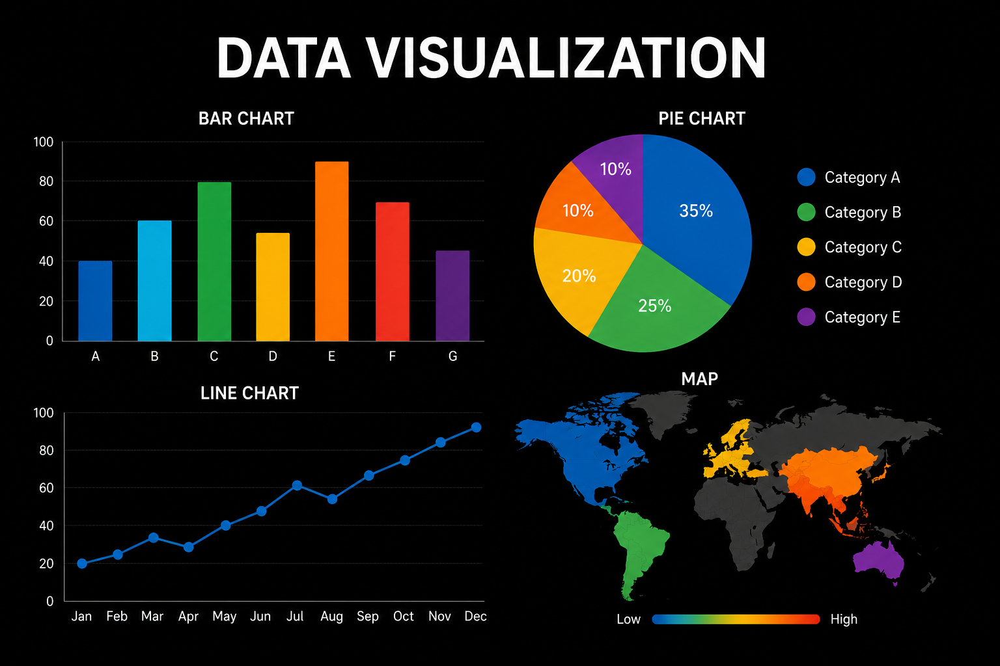

Duomenų vizualizavimas naudojamas įvairiose srityse - versle, moksle, statistikoje, finansuose, apklausų analizėje ir daugelyje kitų veiklų. Vizualizacijos padeda palyginti duomenis, aptikti ryšius tarp reikšmių ir priimti duomenimis pagrįstus sprendimus.

Galima sakyti, kad duomenų vizualizavimas yra tiltas tarp neapdorotų duomenų ir žmogaus supratimo.

Trumpai galima įsiminti taip: **duomenų vizualizavimas** - tai duomenų pateikimas vaizdine forma, kad informaciją būtų lengviau suprasti, analizuoti ir panaudoti sprendimams priimti.

Kai jau aišku, kas yra duomenų vizualizavimas, galima išsiaiškinti, kodėl jis yra svarbus ir kokį tikslą atlieka praktikoje.

## Duomenų vizualizavimo tikslas

Pagrindinis duomenų vizualizavimo tikslas yra padėti greitai suprasti informaciją ir pastebėti svarbiausias duomenų savybes.

Angliškai tai dažnai apibūdinama kaip *making data easier to understand* – duomenų pavertimas lengviau suprantama informacija.

Vienas svarbiausių vizualizavimo tikslų yra parodyti duomenų tendencijas (*trends*). Naudojant diagramas ir grafikus galima lengvai matyti, kaip duomenys keitėsi laikui bėgant arba kuo skiriasi tarpusavyje.

Pavyzdžiui, linijinė diagrama gali parodyti temperatūros pokyčius per savaitę, o stulpelinė diagrama leidžia palyginti skirtingų miestų gyventojų skaičių.

Vizualizacijos taip pat padeda palyginti duomenis, aptikti dėsningumus (*patterns*) ir ryšius tarp skirtingų reikšmių. Tai ypač svarbu atliekant duomenų analizę, mokslinius tyrimus ar priimant verslo sprendimus.

Be to, vizualizacijos leidžia informaciją aiškiai pristatyti auditorijai. Diagramos ir grafikai dažnai yra suprantamesni nei didelės lentelės ar ilgi tekstiniai paaiškinimai.

Galima sakyti, kad duomenų vizualizavimas padeda paversti duomenis informacija, kurią žmogus gali greitai suprasti ir panaudoti sprendimams priimti.

Trumpai galima įsiminti taip **duomenų vizualizavimo tikslas** yra padėti suprasti informaciją, palyginti duomenis, pastebėti tendencijas ir priimti duomenimis pagrįstus sprendimus.

Kai jau aišku, kodėl duomenų vizualizavimas yra svarbus, galima susipažinti su pagrindiniais vizualizacijų tipais ir jų paskirtimi.

## Vizualizacijų tipai

Duomenų vizualizavimui naudojamos įvairios vaizdinės priemonės, kurios padeda informaciją pateikti aiškiai ir suprantamai. Skirtingi vizualizacijų tipai tinka skirtingiems duomenims ir tikslams, todėl svarbu pasirinkti tinkamiausią būdą informacijai perteikti.

Dažniausiai naudojami keturi pagrindiniai vizualizacijų tipai: **lentelės**, **diagramos**, **grafikai** ir **infografikai**.

**Lentelė** (*table*) naudojama tada, kai svarbu pateikti tikslias duomenų reikšmes. Lentelėse duomenys išdėstomi eilutėmis ir stulpeliais, todėl juos patogu peržiūrėti ir lyginti.

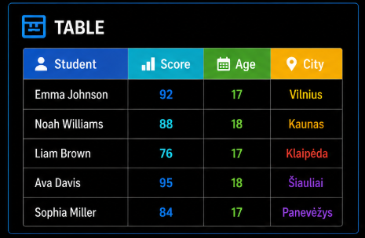

**Diagrama** (*chart*) yra vienas dažniausiai naudojamų vizualizavimo būdų. Ji leidžia greitai palyginti duomenis ir parodyti jų pasiskirstymą. Diagramoms priskiriamos stulpelinės, juostinės, skritulinės, žiedinės ir kitos diagramos.

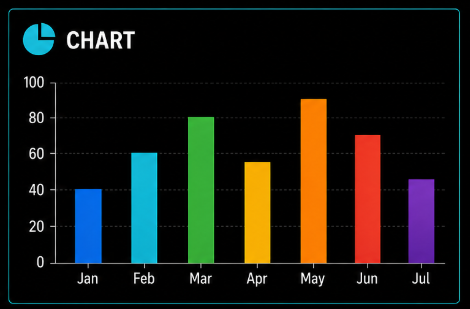

**Grafikas** (*graph*) dažniausiai naudojamas duomenų pokyčiams laike arba ryšiams tarp reikšmių pavaizduoti. Vienas dažniausių pavyzdžių yra linijinis grafikas, rodantis temperatūros, gyventojų skaičiaus ar kitų duomenų kitimą.

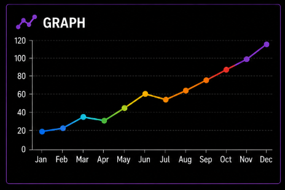

**Infografikas** (*infographic*) yra vizualizacija, kurioje derinami duomenys, tekstas, piktogramos, iliustracijos ir kiti grafiniai elementai. Infografikai dažnai naudojami sudėtingai informacijai pateikti trumpai ir patraukliai.

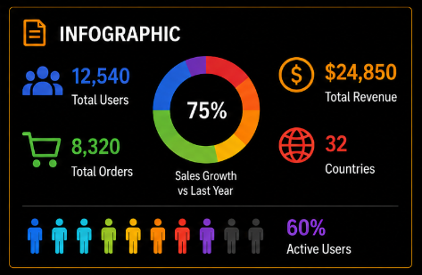

Svarbu suprasti, kad nėra vieno geriausio vizualizacijos tipo. Vizualizacijos pasirinkimas priklauso nuo to, kokius duomenis norima pateikti ir kokią informaciją siekiama perteikti.

Pavyzdžiui, jei reikia parodyti tikslias reikšmes, dažniausiai naudojama lentelė. Jei reikia palyginti duomenis, dažniau pasirenkama diagrama. Jei norima parodyti pokyčius laikui bėgant, naudojamas grafikas. Kai reikia sudominti auditoriją ir informaciją pateikti glaustai, naudojamas infografikas.

Trumpai galima įsiminti taip **lentelės** skirtos tiksliems duomenims pateikti, **diagramos** padeda palyginti duomenis, **grafikai** parodo duomenų pokyčius, o **infografikai** leidžia informaciją pateikti vizualiai ir patraukliai.

Kai jau aišku, kokie yra pagrindiniai vizualizacijų tipai, galima išsamiau susipažinti su dažniausiai naudojamomis diagramų rūšimis.

## Diagramų rūšys

Diagramos yra vienas dažniausiai naudojamų duomenų vizualizavimo būdų. Jos padeda palyginti duomenis, pastebėti tendencijas ir ryšius tarp reikšmių. Kadangi skirtingos diagramos tinka skirtingiems duomenims, svarbu pasirinkti tinkamiausią variantą konkrečiai situacijai.

Viena dažniausiai naudojamų diagramų yra **stulpelinė diagrama** (*column chart*). Ji naudojama skirtingų reikšmių palyginimui. Duomenys vaizduojami vertikaliais stulpeliais, kurių aukštis atitinka reikšmės dydį.

Pavyzdžiui, stulpeline diagrama galima palyginti mokinių pažymius, miestų gyventojų skaičių arba prekių pardavimus.

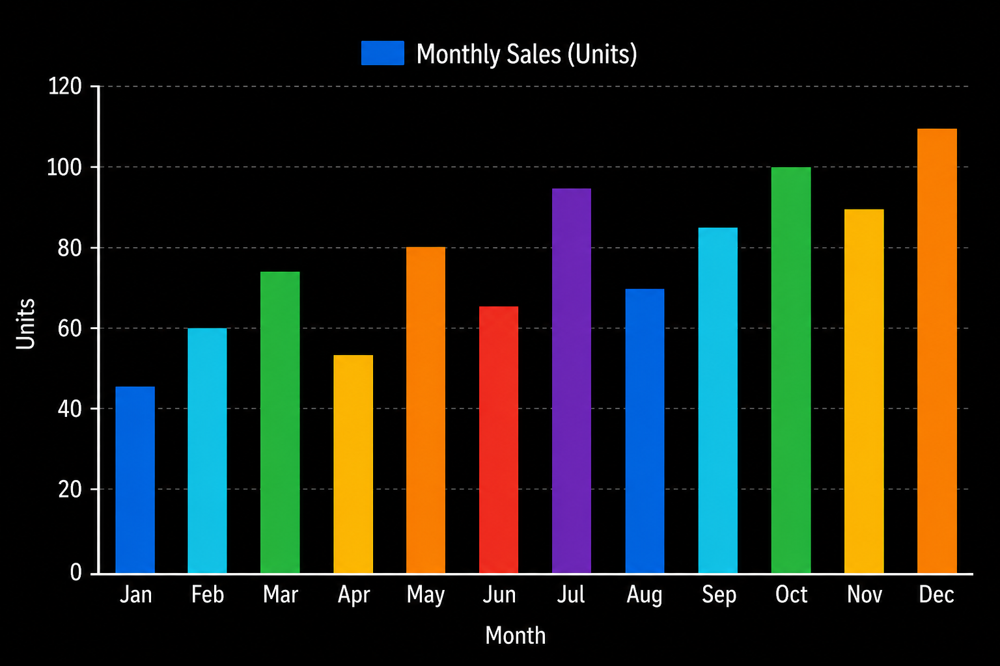

Kita panaši diagrama yra **juostinė diagrama** (*bar chart*). Ji veikia tuo pačiu principu kaip stulpelinė diagrama, tačiau duomenys vaizduojami horizontaliomis juostomis.

Juostinės diagramos dažnai naudojamos tada, kai kategorijų pavadinimai yra ilgesni arba kai reikia palyginti didesnį kiekį duomenų.

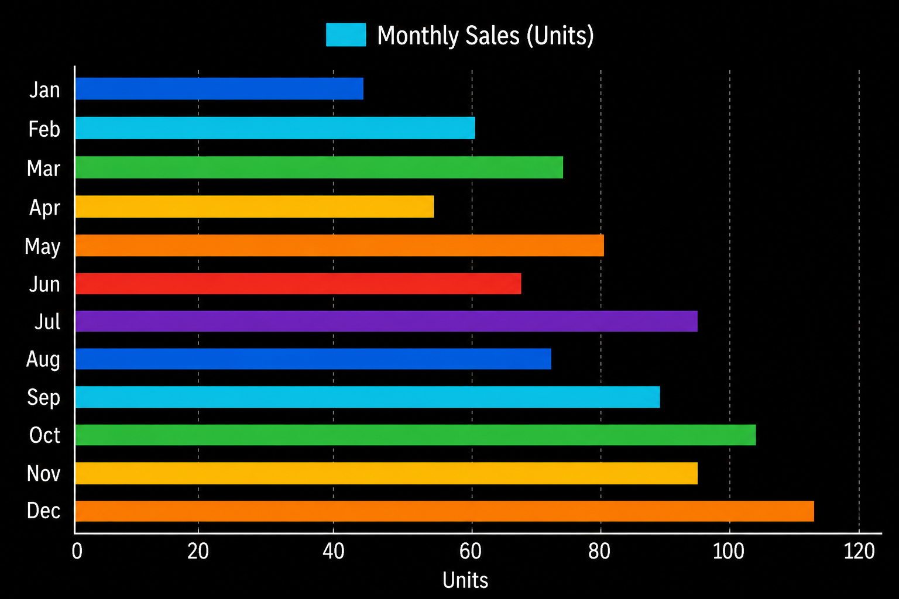

Kai reikia parodyti, kokią visumos dalį sudaro kiekviena kategorija, naudojama **skritulinė diagrama** (*pie chart*).

Visa diagrama sudaro 100 procentų, o kiekvienas sektorius atspindi tam tikrą dalį visumos.

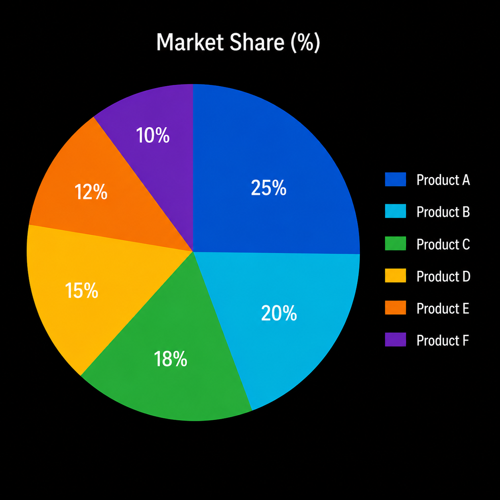

Į skritulinę diagramą panaši yra **žiedinė diagrama** (*doughnut chart*). Jos veikimo principas toks pats, tačiau centre paliekama tuščia vieta.

Dažnai ji naudojama kaip alternatyva skritulinei diagramai, kai norima aiškiau pateikti duomenis arba centre pateikti papildomą informaciją.

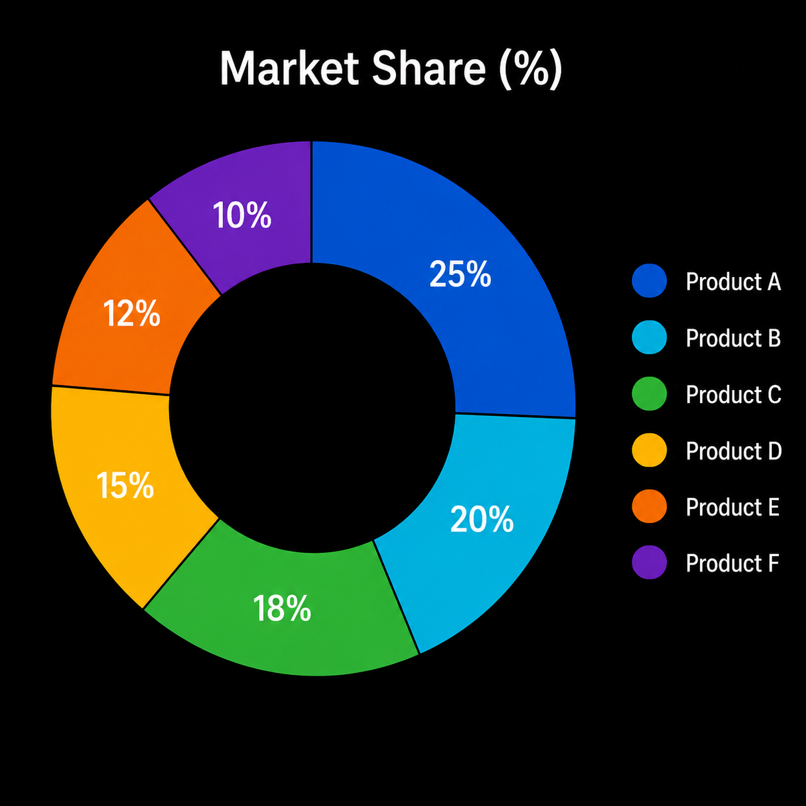

Jeigu svarbu parodyti duomenų pokyčius laikui bėgant, dažniausiai naudojama **linijinė diagrama** (*line chart*).

Duomenų taškai sujungiami linijomis, todėl lengva stebėti augimą, mažėjimą ar kitus pokyčius.

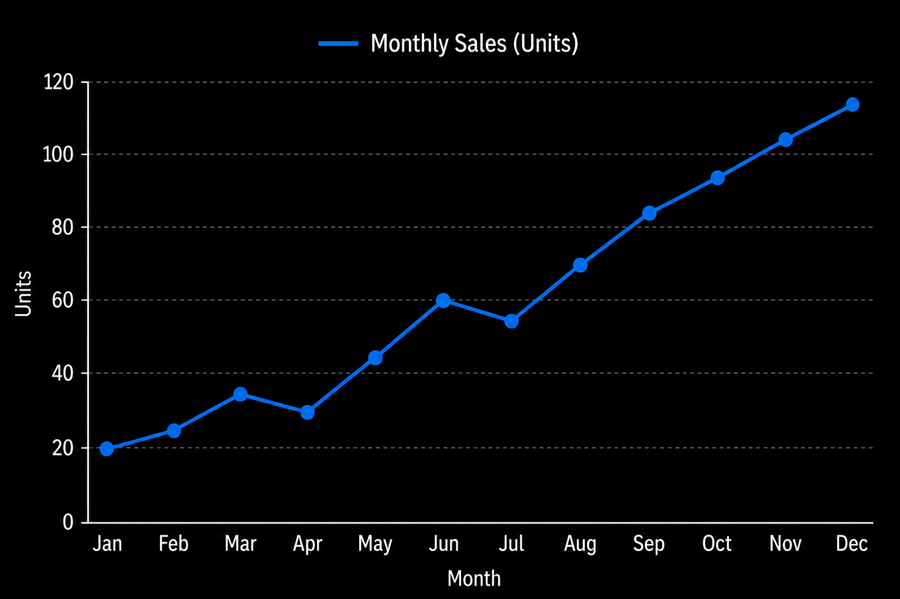

Panaši į linijinę diagramą yra **plotinė diagrama** (*area chart*). Skirtumas tas, kad plotas po linija užpildomas spalva.

Tai leidžia lengviau įvertinti ne tik pokyčius laikui bėgant, bet ir bendrą reikšmių dydį.

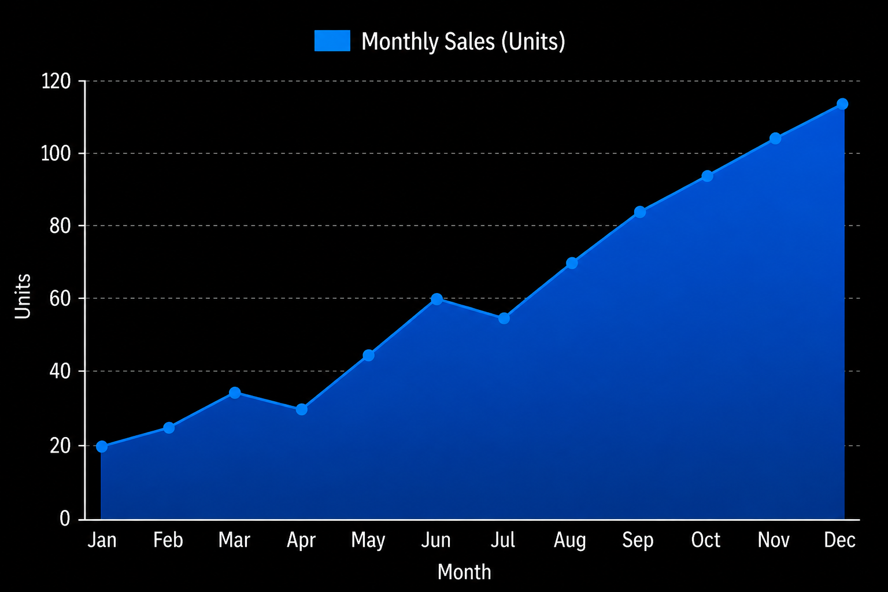

Svarbu suprasti, kad kiekviena diagrama turi savo paskirtį. Netinkamai pasirinkta diagrama gali apsunkinti duomenų supratimą arba net klaidinti skaitytoją.

Trumpai galima įsiminti taip **stulpelinė** ir **juostinė** diagramos naudojamos duomenų palyginimui, **linijinė** ir **plotinė** diagramos parodo pokyčius, o **skritulinė** ir **žiedinė** diagramos leidžia matyti visumos dalių santykį.

Kai jau aišku, kokios yra pagrindinės diagramų rūšys, galima išsamiau susipažinti su viena svarbiausių statistinių diagramų - histograma.

## Histograma

Histograma yra specialus diagramos tipas, naudojamas statistinių duomenų pasiskirstymui pavaizduoti.

Angliškai histograma vadinama *histogram*.

Iš pirmo žvilgsnio histograma gali būti panaši į stulpelinę diagramą, tačiau jų paskirtis skiriasi. Stulpelinė diagrama dažniausiai naudojama atskirų kategorijų palyginimui, o histograma parodo, kaip duomenys pasiskirsto tam tikruose intervaluose.

Histogramoje duomenys grupuojami į intervalus (*intervals*), o kiekvienas stulpelis rodo, kiek reikšmių patenka į konkretų intervalą.

Pavyzdžiui, jei analizuojami klasės mokinių matematikos kontrolinio darbo rezultatai, pažymius galima suskirstyti į kelias grupes. Histograma parodys, kiek mokinių pateko į kiekvieną iš jų.

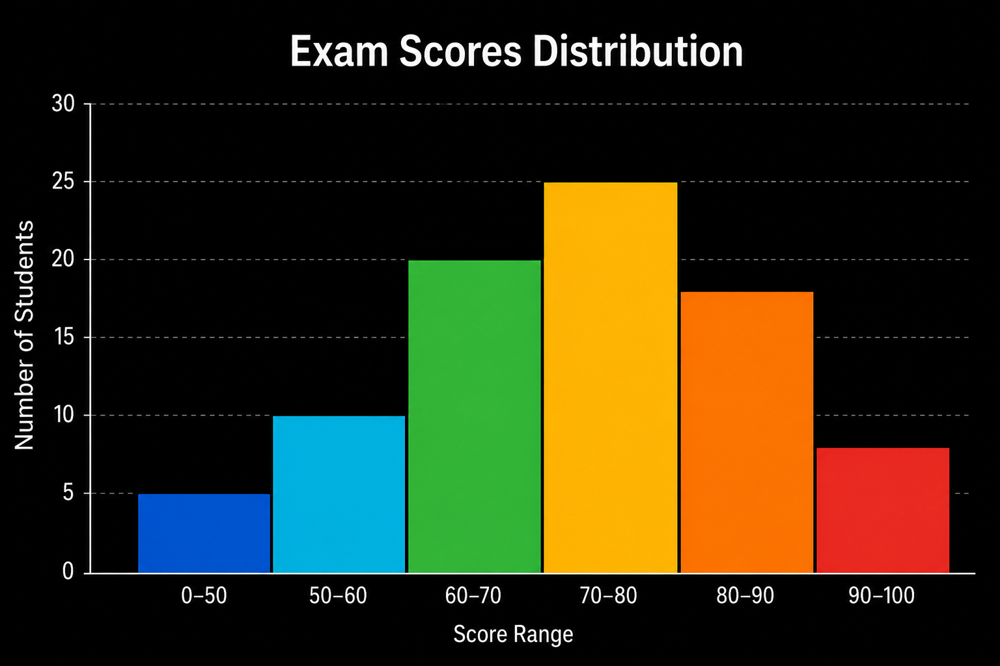

Svarbu atkreipti dėmesį, kad histogramos stulpeliai dažniausiai liečiasi vienas su kitu. Taip yra todėl, kad intervalai sudaro vientisą duomenų seką ir tarp jų nėra atskirų kategorijų.

Histogramos dažnai naudojamos statistikoje, moksliniuose tyrimuose, verslo analizėje ir apklausų duomenų nagrinėjime. Jos padeda įvertinti duomenų struktūrą, pastebėti dažniausiai pasitaikančias reikšmes ir nustatyti bendras tendencijas.

Pagrindinis skirtumas tarp histogramos ir stulpelinės diagramos yra tas, kad stulpelinė diagrama lygina kategorijas, o histograma vaizduoja duomenų pasiskirstymą intervaluose.

Trumpai galima įsiminti taip **histograma** naudojama statistinių duomenų pasiskirstymui vaizduoti, duomenys grupuojami į **intervalus**, o stulpelių aukštis parodo, kiek reikšmių patenka į kiekvieną intervalą.

Kai jau aišku, kas yra histograma ir kuo ji skiriasi nuo kitų diagramų, galima susipažinti su infografikais, kurie leidžia informaciją pateikti ne tik aiškiai, bet ir vizualiai patrauklia forma.

## Infografikas

Infografikas yra vizualus informacijos, duomenų ar žinių pateikimo būdas, kuriame naudojami tekstai, iliustracijos, piktogramos, diagramos ir kiti grafiniai elementai.

Angliškai infografikas vadinamas *infographic*.

Pagrindinis infografiko tikslas – aiškiai ir glaustai pateikti informaciją vaizdine forma. Vietoje ilgų tekstų ar didelių duomenų lentelių naudojami grafiniai elementai, kurie padeda greičiau perteikti pagrindinę mintį.

Infografikai dažnai naudojami švietime, versle, žiniasklaidoje, moksliniuose tyrimuose ir socialiniuose tinkluose. Jie padeda pristatyti statistiką, tyrimų rezultatus, procesus, instrukcijas ir kitą informaciją.

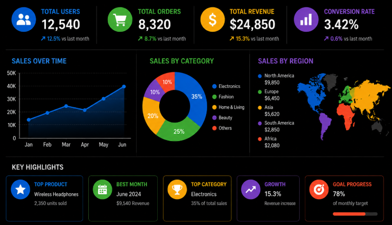

Dažniausiai infografiką sudaro keli elementai: trumpi tekstai, piktogramos (*icons*), diagramos (*charts*), grafikai (*graphs*), nuotraukos ir kiti grafiniai objektai.

Skirtingai nei paprasta diagrama ar grafikas, infografikas apjungia kelis informacijos pateikimo būdus viename vizualiame kūrinyje. Dėl to galima perteikti daugiau informacijos ir parodyti ryšius tarp skirtingų duomenų.

Kuriant infografiką svarbu išlaikyti aiškią struktūrą, naudoti tinkamas spalvas, lengvai skaitomus šriftus ir pateikti tik svarbiausią informaciją.

Pavyzdžiui, infografikas gali parodyti gyventojų skaičiaus pokyčius, apklausos rezultatus, klimato kaitos duomenis, sveikos gyvensenos rekomendacijas ar įmonės veiklos rodiklius.

Dėl savo aiškumo ir vizualumo infografikai dažnai naudojami pristatymuose, interneto svetainėse, ataskaitose ir mokomojoje medžiagoje.

Trumpai galima įsiminti taip **infografikas** yra vizualus informacijos pateikimo būdas, kuriame derinami **tekstai**, **diagramos**, **grafikai**, **piktogramos** ir kiti grafiniai elementai.

Kai jau aišku, kas yra infografikas ir kuo jis skiriasi nuo kitų vizualizacijų, galima išsiaiškinti, kaip duomenų analizė susijusi su duomenų vizualizavimu ir kodėl šios dvi sąvokos dažnai naudojamos kartu.

## Duomenų analizė ir vizualizacija

Duomenų analizė ir duomenų vizualizacija yra glaudžiai susijusios sąvokos. Nors jos atlieka skirtingas funkcijas, praktikoje dažniausiai naudojamos kartu, nes abi padeda geriau suprasti duomenis ir priimti pagrįstus sprendimus.

Angliškai duomenų analizė vadinama *data analysis*, o duomenų vizualizavimas - *data visualization*.

Duomenų analizė yra procesas, kurio metu duomenys renkami, tvarkomi ir nagrinėjami siekiant surasti naudingą informaciją, dėsningumus bei įžvalgas.

Pavyzdžiui, analizuojant mokinių pažymius galima apskaičiuoti klasės vidurkį, nustatyti aukščiausią ir žemiausią pažymį, rasti dažniausiai pasitaikančias reikšmes arba palyginti kelių klasių rezultatus.

Tačiau vien analizės dažnai nepakanka. Gauti rezultatai turi būti pateikti taip, kad juos būtų lengva interpretuoti. Būtent tam naudojamas duomenų vizualizavimas, leidžiantis informaciją pateikti diagramomis, grafikais, lentelėmis, žemėlapiais ar infografikais.

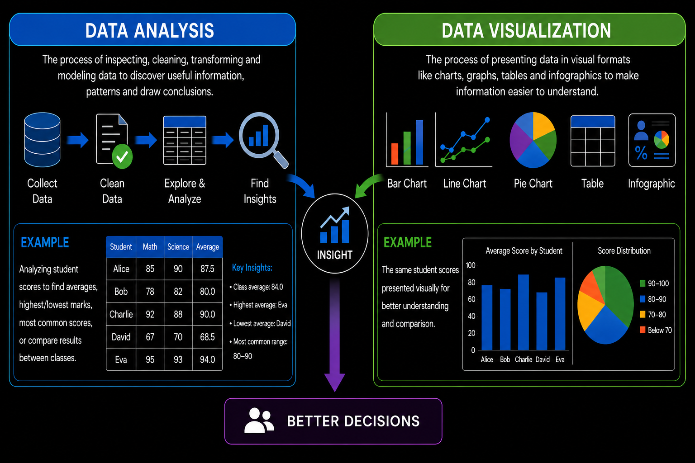

Galima sakyti, kad duomenų analizė atsako į klausimą **ką rodo duomenys**, o duomenų vizualizacija – **kaip šią informaciją pateikti aiškiai ir suprantamai**.

Pavyzdžiui, atlikus apklausą pirmiausia surenkami ir išanalizuojami duomenys, o vėliau rezultatai pateikiami pasirinkta vizualizacija – stulpeline diagrama, skrituline diagrama, grafiku ar infografiku.

Kad vizualizacija būtų naudinga, svarbu pasirinkti tinkamą jos tipą, pateikti tik svarbiausią informaciją ir išlaikyti duomenų tikslumą. Aiškūs pavadinimai, nuoseklios spalvos ir lengvai skaitomi šriftai padeda informaciją suprasti greičiau.

Todėl duomenų analizė ir duomenų vizualizacija yra neatsiejamos veiklos, leidžiančios surinktus duomenis paversti naudinga informacija ir pagrįstomis išvadomis.

Trumpai galima įsiminti taip **duomenų analizė** padeda surasti informaciją ir dėsningumus duomenyse, o **duomenų vizualizacija** leidžia šią informaciją aiškiai pateikti ir interpretuoti.
