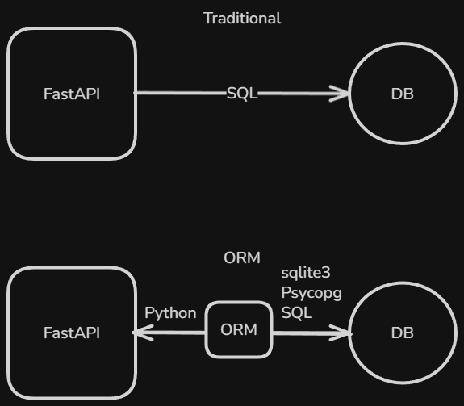
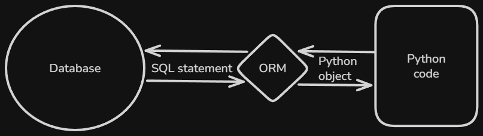

# Content of Python FastAPI Database Level 1

- [Why use an ORM](#why-use-an-orm)
- [Introduction to SQLAlchemy](#introduction-to-sqlalchemy)
- [Choosing SQLite for development](#choosing-sqlite-for-development)
- [Installing database dependencies](#installing-database-dependencies)
- [Creating the database engine](#creating-the-database-engine)
- [Defining ORM models](#defining-orm-models)
- [Creating database tables from models](#creating-database-tables-from-models)
- [Creating a database session](#creating-a-database-session)
- [Using database sessions inside FastAPI routes](#using-database-sessions-inside-fastapi-routes)
- [Reading data using ORM queries](#reading-data-using-orm-queries)
- [Writing data using ORM queries](#writing-data-using-orm-queries)
- [Common ORM query patterns](#common-orm-query-patterns)

FastAPI applications often grow beyond simple request handling. Once data needs to be stored and retrieved, the application must interact with a database in a way that keeps the code readable and maintainable.

At this point, you already understand how databases work and how SQL queries are written. The focus now shifts from *what a database is* to *how database access is structured inside a FastAPI application*.

In this level, we introduce a practical approach for working with databases by using an **Object Relational Mapper (ORM)**. Instead of writing SQL directly inside route functions, database tables are represented as Python objects and database operations are expressed through Python code.



This approach allows database logic to stay organized, reduces repetition, and keeps request handling separate from data access. Before working with database models and queries, it is important to understand **why an ORM is used** and what problems it solves in real FastAPI applications.

## Why use an ORM

FastAPI applications often need to work with persistent data. At this point, we already understand how databases work and how to write SQL queries. The remaining question is how this database logic should be **connected** to a FastAPI application in a way that is **maintainable**.

In small examples, it is possible to write raw SQL directly inside route functions. While this works at first, it quickly leads to repeated queries, **database code mixed** with **request handling**, and logic that becomes harder to change later.

```sql
SELECT id, title, author, price FROM books
```

To reduce these problems, FastAPI applications usually use an **Object Relational Mapper**, commonly called an **ORM**.



**ORM** stands for **Object Relational Mapper**. It is a tool that connects Python classes to database tables. A class represents a **table**, and an **instance** of that class represents a **row** in the table. Instead of writing SQL statements manually, you work with Python objects, and the ORM generates the SQL for you behind the scenes.

For example, without an ORM, retrieving books might look conceptually like this in SQL.

```sql
SELECT id, title, author, price
FROM books
WHERE price > 20;
```

With an ORM, the same idea is expressed in Python using model classes.

```py
select(Book).where(Book.price > 20)
```

You can think of an ORM as a translator between your application and the database. Your application works with Python objects, while the database understands SQL. The ORM translates Python operations into SQL queries and converts the results back into Python objects.

In this section, we focus on understanding why an ORM is used, how it fits into a FastAPI application, and how it helps structure database access from the beginning.

## Introduction to SQLAlchemy

Once the role of an ORM is clear, the next step is to look at the specific tool that will be used throughout this level. Different ORMs exist in the Python ecosystem, each with its own design goals and trade-offs.

For FastAPI applications, one of the most commonly used is [SQLAlchemy](https://www.sqlalchemy.org/). It provides a clear **mapping** between **database tables** and **Python objects** while remaining flexible enough to work with different databases.

Before defining **models** or writing **queries**, it is important to understand what **SQLAlchemy** is, what **responsibilities** it handles.

**SQLAlchemy** itself does not depend on a specific database. It can work with many different database systems, from simple **file-based databases** to **production servers**.

For this we focus is not on **managing infrastructure** or **external services**, but on learning how database integration works inside a **FastAPI** application. To keep that focus by remove unnecessary complexity.

This leads to the choice of **SQLite**, which allows the application to run locally with minimal setup while still supporting the same ORM patterns that apply to larger databases.

SQLite is well suited for learning and early-stage development because it requires **no separate server process** and **stores all data in a single file**.

Using SQLite allows us to focus on how SQLAlchemy **models**, **sessions**, and **queries** behave inside a FastAPI application, without being distracted by database specific setup. The same concepts introduced here will still apply when switching to more advanced databases later.

With this in mind, we can take a closer look at SQLite and how it is used as the development database in this level.

## Choosing SQLite for development

[SQLite](https://www.sqlite.org/) is a **lightweight**, **file-based database** that is commonly used during **development** and **learning**. Unlike **server-based databases**, SQLite does not require a separate database service to be installed or running. The entire database is stored in a single file on disk.

This simplicity makes SQLite an ideal choice for introducing database integration in a FastAPI application. The application can be started immediately, without configuring **users**, **passwords**, **ports** or **network connections**.

SQLite is used strictly as a **development database**. The goal is not to explore SQLite specific features, but to provide a stable and minimal environment for learning how ORM-based database access works inside a FastAPI application.

## Installing database dependencies

With the database choice defined, the next step is to prepare the application environment. Before any database code can be written, the required libraries must be installed so that FastAPI can communicate with SQLite through the ORM.

This level uses **SQLAlchemy** as the ORM and **SQLite** as the database backend. SQLite itself is included with Python, so no external database server or driver needs to be installed. Only the ORM library is required.

If the project is managed using `pip`, SQLAlchemy can be installed directly.

```bash
pip install sqlalchemy
```

If the project is managed using **Poetry**, SQLAlchemy is added as a project dependency instead of being installed globally.

```bash
poetry add sqlalchemy
```

Once the installation is complete, SQLAlchemy becomes available to the application and can be imported into Python modules.

However, when using asynchronous database access with FastAPI, the database driver must also support asynchronous I/O. SQLAlchemy does not provide async communication with SQLite by itself. For asynchronous support, the `aiosqlite` package is required.

If the project uses `pip`.

```bash
pip install aiosqlite
```

If the project uses **Poetry**.

```bash
poetry add aiosqlite
```

The `aiosqlite` package acts as the asynchronous driver that allows SQLAlchemy to communicate with SQLite.

Once the required dependencies are installed, the application needs a way to establish a connection to the database. This connection logic should be defined in a single, consistent place so it can be reused throughout the application.

In SQLAlchemy, this responsibility is handled by the **database engine**. The engine defines how the application communicates with the database and acts as the starting point for all database interactions.

## Creating the database engine

The database engine is the central component that defines how the application connects to the database. It does not execute queries by itself, but it provides the foundation that all database sessions and operations rely on.

In SQLAlchemy, the engine is created by specifying a **database URL**. This URL describes the database type, the location of the database, and the driver used to communicate with it.

For SQLite, the database URL points to a local file.

```py
from sqlalchemy import create_engine

DATABASE_URL = "sqlite:///./app.db"

engine = create_engine(
    DATABASE_URL,
    connect_args={"check_same_thread": False}
)
```

The `sqlite:///./app.db` URL tells SQLAlchemy to use SQLite and store the database in a file named `app.db` in the current project directory.

The `connect_args` parameter is specific to SQLite. To understand why it is needed, it helps to understand what a thread is in simple terms.

When a FastAPI application is running, it can handle multiple requests at the same time. You can imagine this like a small office with several workers. Each worker handles a different task independently. In programming, these workers are called threads.

By default, SQLite is strict about how its connections are used. If one worker creates a **database connection**, SQLite expects that **same worker** to use it. If **another worker** tries to use that **connection**, SQLite raises an error.

In a FastAPI application, one request might create the **database connection** and **another request** running in a different thread, might try to use it. Without adjusting the configuration, this would cause a runtime error.

Setting `check_same_thread` to `False` tells SQLite that the connection is allowed to be used by different workers inside the same application. This makes it suitable for development when using SQLite together with FastAPI and SQLAlchemy.

This configuration is required only when using SQLite with a synchronous engine.

When working with asynchronous database access, an **async engine** must be created instead. In that case, the database URL changes to include the `aiosqlite` driver, and the async engine factory is used.

```py
from sqlalchemy.ext.asyncio import create_async_engine

DATABASE_URL = "sqlite+aiosqlite:///./app.db"

engine = create_async_engine(
    DATABASE_URL
)
```

At this stage, the engine only defines how the application connects to the database. No tables are created and no ORM queries are executed yet.

To confirm that the database engine is configured correctly, a simple connection test can be performed using a raw SQL statement.

Synchronous test.

```py
def main():
    # - database file creation
    # - sqlite connection
    # - raw SQL execution
    with engine.connect() as conn:
        result = conn.execute(
            text("SELECT sqlite_version()")
        ).scalar_one()
        print("SQLite connected. Version:", result)

if __name__ == "__main__":
    main()
```

Asynchronous test.

```py
import asyncio
from sqlalchemy import text

async def main():
    async with engine.connect() as conn:
        result = await conn.execute(
            text("SELECT sqlite_version()")
        )
        version = result.scalar_one()
        print("SQLite connected. Version:", version)

if __name__ == "__main__":
    asyncio.run(main())
```

When using the async engine, database operations must be awaited. The async with statement ensures the connection is properly opened and closed, and `await` is required when executing the query.

In both cases, SQLAlchemy establishes a connection to the SQLite database file. If the file does not exist yet, SQLite creates it automatically.

The `text()` function marks the SQL string as an executable statement. The `scalar_one()` method extracts exactly one value from the result.

This confirms that the engine can successfully communicate with the database.

```bash
SQLite connected. Version: 3.49.1
```

Once the engine is confirmed to work, it can be reused by the rest of the application. The next step is to describe the structure of the data itself by defining ORM models.

## Defining ORM models

**ORM models** define how **database tables** are represented in **Python code**. Each model is a **Python class** that maps directly to a **database table** and each **attribute** on the class represents a **column** in that table.

In SQLAlchemy, ORM models are created by **extending** a shared **base class**. This base class provides the functionality needed for SQLAlchemy to **track models** and **translate** them into database structures.

There are **two common ways** to define this base class, depending on the SQLAlchemy version and style being used.

The **earlier and widely used approach**, introduced in **SQLAlchemy 1.x** and still supported for compatibility, creates the base class using a factory function.

```py
from sqlalchemy.orm import declarative_base

Base = declarative_base()
```

In this approach, `declarative_base()` returns a base class that ORM models inherit from. This style is widely seen in older tutorials and existing codebases.

In modern **SQLAlchemy (2.x)**, a newer and more explicit approach is recommended. Instead of using a factory function, the base class is defined by inheriting from `DeclarativeBase`.

```py
from sqlalchemy.orm import DeclarativeBase

class Base(DeclarativeBase):
    pass
```

This modern approach integrates better with features like **type hints** and **static analysis**.

Regardless of which approach is used, all ORM models in the application inherit from the same **base class**.

A model definition using modern SQLAlchemy declarative mapping looks like this.

```py
from sqlalchemy import Integer, String, Float, Boolean
from sqlalchemy.orm import Mapped, mapped_column

class Book(Base):
    __tablename__ = "books"

    id: Mapped[int] = mapped_column(
        Integer,
        primary_key=True,
        index=True
    )

    title: Mapped[str] = mapped_column(
        String(255),
        nullable=False
    )
    author: Mapped[str] = mapped_column(
        String(255),
        nullable=False
    )
    year: Mapped[int] = mapped_column(
        Integer,
        nullable=False
    )
    genre: Mapped[str] = mapped_column(
        String(100),
        nullable=False
    )

    pages: Mapped[int] = mapped_column(
        Integer,
        nullable=False
    )
    price: Mapped[float] = mapped_column(
        Float,
        nullable=False
    )

    in_stock: Mapped[bool] = mapped_column(
        Boolean,
        nullable=False,
        default=True
    )
```

In this example, the `Book` class represents a database table named `books`. The `__tablename__` attribute explicitly defines the table name in the database.

Each class attribute maps to a column in the table, but instead of using the older `Column(...)` style, this model uses **typed ORM mappings**, which are recommended in **SQLAlchemy 2.x**.

`Mapped[...]` tells SQLAlchemy that this attribute is connected to a database column and is part of the ORM mapping, while `mapped_column()` defines the actual database column, including its data type and constraints (such as `primary key`, `index`, `nullable`).

For string-based columns, it is common to define a maximum length using `String(...)`. For example, `String(255)` means the column stores text values up to 255 characters. This helps make the intended structure of the data clearer and is often used for fields like titles, names, and categories.

Models often include more than numbers, strings, and booleans. In many applications, tables also store when a row was created and last updated. This is usually done with `created_at` and `updated_at` fields using the `DateTime` type.

A model can define them like this.

```py
from datetime import datetime, timezone
from sqlalchemy import DateTime

created_at: Mapped[datetime] = mapped_column(
    DateTime(timezone=True),
    default=lambda: datetime.now(timezone.utc),
    nullable=False
)

updated_at: Mapped[datetime] = mapped_column(
    DateTime(timezone=True),
    default=lambda: datetime.now(timezone.utc),
    onupdate=lambda: datetime.now(timezone.utc),
    nullable=False
)
```

In this approach, timestamps are generated by Python. When a new row is created, `created_at` gets the current UTC time. The `updated_at` field also gets an initial value, and when the row is modified later, `onupdate` sets a new timestamp.

Another common approach is to let the database generate these values.

```py
from sqlalchemy import DateTime, func

created_at: Mapped[datetime] = mapped_column(
    DateTime,
    server_default=func.now(),
    nullable=False
)

updated_at: Mapped[datetime] = mapped_column(
    DateTime,
    server_default=func.now(),
    onupdate=func.now(),
    nullable=False
)
```

Here, the database is responsible for setting the timestamps instead of the application. This is often preferred in production systems because time handling stays closer to the database itself.

However, database support is not identical everywhere. SQLite does not fully support automatic update behavior for timestamps, so the database-driven update approach may not behave as expected there. Because of that, when using SQLite, the Python-based approach is often used.

Both styles are valid. The main difference is whether timestamp values are controlled by application code or by the database.

This style of defining models is known as **Declarative Mapping**.

In addition to column-level configuration, SQLAlchemy also supports table-level configuration. This is done using the `__table_args__` attribute, which is used when a rule applies to the table as a whole rather than to a single column.

For example, a book price should not be negative. This kind of rule can be enforced using a `CheckConstraint`.

```py
from sqlalchemy import CheckConstraint

class Book(Base):
    __tablename__ = "books"

    __table_args__ = (
        CheckConstraint("price >= 0", name="check_price_positive"),
    )
```

This tells the database to reject any row where the `price` is less than zero, helping enforce data consistency at the database level.

SQLAlchemy also supports **Imperative Mapping**, which separates table definitions from class definitions. This approach bypasses the declarative system and manually maps classes to tables.

```py
books_table = Table(
    "books",s
    metadata,
    Column("id", Integer, primary_key=True),
    Column("title", String),
    Column("author", String),
)
```

Imperative mapping is considered more **barebones** and does not support features such as **PEP 484** type annotations. Because of this, it is far less commonly used in applications.

However, the `Table(...)` construct itself is **still widely used together with declarative models**, particularly when defining association tables for **many-to-many relationships**. In these cases, the table acts as a link table between two models rather than being mapped to its own ORM class.

The model itself does not create the table in the database. It only describes the structure. SQLAlchemy uses this definition later to **generate database tables** and to **build queries**.

At this level, models are kept simple. No **relationships**, **constraints** or **validations** are added yet. The goal is to understand how **Python classes** are mapped to **database tables** and how this **mapping forms** foundation for all ORM based database operations.

Once models are defined, they can be used to create tables and interact with stored data through database sessions.

## Creating database tables from models

Once ORM models are defined, the next step is to create the corresponding tables in the database. SQLAlchemy uses the model definitions to generate the database schema.

This process is handled through the `metadata` associated with the **base class**. The metadata contains information about all registered models and their table definitions.

To create tables, SQLAlchemy provides a method that instructs the engine to generate any missing tables based on the defined models.

Synchronous example.

```py
def main():
    # 1) create tables
    Base.metadata.create_all(bind=engine)
    print("Tables created (if not existed).")

    # 2) verify DB + table exists
    with engine.connect() as conn:
        version = conn.execute(
            text("SELECT sqlite_version()")
        ).scalar_one()

        tables = conn.execute(
            text(
                "SELECT name FROM sqlite_master "
                "WHERE type='table' ORDER BY name;"
            )
        ).all()

        print("SQLite connected. Version:", version)
        print("Tables:", [table[0] for table in tables])

if __name__ == "__main__":
    main()
```

When using an asynchronous engine, table creation and verification must also use asynchronous operations.

First, `Base.metadata.create_all(bind=engine)` instructs SQLAlchemy to create database tables based on all ORM models that inherit from `Base`.

The `bind=engine` argument tells SQLAlchemy which database connection should be used. Without binding the metadata to an engine, SQLAlchemy would not know where the tables should be created.

This method is safe to run multiple times. SQLAlchemy checks whether each table already exists and creates only those that are missing. Existing tables are left unchanged.

The second query reads from `sqlite_master`, which is an internal SQLite system table that stores metadata about the database structure.

```sql
SELECT name FROM sqlite_master WHERE type='table'
```

This query lists all tables currently defined in the database. The result is returned as a list of rows, where each row contains the table name. The list comprehension extracts the names for display.

Asynchronous example.

```py
import asyncio
from sqlalchemy import text

async def main():
    # 1) create tables
    async with engine.begin() as conn:
        await conn.run_sync(Base.metadata.create_all)
        print("Tables created (if not existed).")

    # 2) verify DB + table exists
    async with engine.connect() as conn:
        result = await conn.execute(
            text("SELECT sqlite_version()")
        )
        version = result.scalar_one()

        result = await conn.execute(
            text(
                "SELECT name FROM sqlite_master "
                "WHERE type='table' ORDER BY name;"
            )
        )
        tables = result.all()

        print("SQLite connected. Version:", version)
        print("Tables:", [table[0] for table in tables])

if __name__ == "__main__":
    asyncio.run(main())
```

In the asynchronous version, `async with` is used instead of `with`, and database operations must be awaited.

The call to `conn.run_sync(Base.metadata.create_all)` is required because `create_all()` is a synchronous operation. The `run_sync()` method allows it to be executed within an asynchronous connection.

This verification step is not required for normal application operation, but it is useful during development to confirm that the database file was created, the connection works, and ORM models were translated into actual database tables.

Table creation is usually performed once, when the **application starts** or during an **initial setup step**. It should not be triggered inside individual route handlers.

When working inside a FastAPI application, table creation is typically performed during application startup instead of inside a standalone script.

```py
from contextlib import asynccontextmanager
from collections.abc import AsyncIterator

@asynccontextmanager
async def lifespan(app: FastAPI) -> AsyncIterator[None]:
    # startup logic
    async with engine.begin() as conn:
        await conn.run_sync(Base.metadata.create_all)

    yield

    # shutdown logic (optional)
    await engine.dispose()

app = FastAPI(lifespan=lifespan)
```

The `@asynccontextmanager` decorator is provided by Pythons `contextlib` module. It allows defining an asynchronous context manager using a **function** instead of creating a **class**.

FastAPI expects the lifespan handler to be an asynchronous context manager. That is why the function must be defined using `async def` and decorated with `@asynccontextmanager`.

The `yield` keyword separates application startup logic from shutdown logic.

Everything before `yield` runs when the application starts after `yield` runs when the application shuts down.

In this example database tables are created before the application begins handling requests. When the application shuts down, `await engine.dispose()` is executed to close all active database connections and clean up the connection pool.

The `app: FastAPI` parameter is required because FastAPI passes the application instance into the lifespan function. Even if it is not used directly, it must be present in the function signature so FastAPI can call it correctly.

If the `yield` statement is removed, the lifespan function stops being an async context manager. FastAPI expects the lifespan handler to behave like an async iterator that yields control exactly once. Without `yield`, the function becomes a normal coroutine function.

When FastAPI tries to use it as a lifespan context manager, it attempts to iterate over it, but a coroutine is not an async iterator. That is why the error appears.

```bash
TypeError: 'coroutine' object is not an async iterator
```

The warning

```bash
RuntimeWarning: coroutine 'lifespan' was never awaited
```

Appears because FastAPI did not successfully enter the lifespan context, so the coroutine object gets created but never properly awaited or consumed. Since the startup process fails early, Python reports that the coroutine was left unfinished.

This is why `yield` is required. It creates the single handoff point where startup logic finishes and the application begins serving requests. It also provides the point where shutdown logic can run after the application stops.

This lifespan structure is used for both synchronous and asynchronous database engines.

If the engine is synchronous, the startup section would look like this.

```py
@asynccontextmanager
async def lifespan(app: FastAPI) -> AsyncIterator[None]:
    Base.metadata.create_all(bind=engine)
    yield
```

If the engine is asynchronous, it must use an `async` connection and `await`, as shown earlier.

Even when using a synchronous engine, the lifespan function itself must still be asynchronous because FastAPI requires an **async context manager**.

After this step completes, the database file contains the tables defined by the ORM models. The application now has a database structure where data can be stored and retrieved.

Before working with sessions and queries, it is helpful to understand how SQLAlchemy actually manages database operations behind the scenes and how Python objects are translated into SQL statements.

## How SQLAlchemy manages database operations

When working with SQLAlchemy, database operations are not executed immediately. Instead, the session acts as a workspace that tracks changes made to ORM objects and prepares the corresponding SQL statements.

For example, when a new object is added.

```py
db.add(book)
```

SQLAlchemy does not immediately insert a row into the database. The object is first registered inside the session. At this stage, the session simply records that a new record should be created.

The actual SQL statement is generated and executed when the session commits the transaction.

```py
db.commit()
```

During the commit step, SQLAlchemy translates the tracked changes into SQL statements and sends them to the database. This process ensures that multiple changes can be grouped together and executed safely.

Queries work in a similar way. When a query is written using ORM models, SQLAlchemy converts the Python expression into SQL.

In a synchronous session, a query might look like this.

```py
db.query(Book).all()
```

In an asynchronous session, queries are executed using `execute()` together with a SQLAlchemy `select()` statement.

```py
result = await db.execute(select(Book))
books = result.scalars().all()
```

In both cases, SQLAlchemy translates the ORM query into a SQL statement.

```sql
SELECT * FROM books;
```

Instead of writing SQL manually, developers interact with Python **classes** and **attributes**. SQLAlchemy handles the translation between Python objects and database tables.

Another important responsibility of SQLAlchemy is **managing transactions**. When a session interacts with the database, a transaction is automatically started. Changes made within the session are not permanently stored until the transaction is committed.

If an error occurs before the commit, the transaction can be rolled back and the changes are discarded.

```py
db.rollback()
```

Calling `rollback()` cancels the current transaction and discards any pending changes that were not committed.

This helps protect the database from incomplete or inconsistent updates.

By tracking object changes is that **generating SQL statements** and **managing transactions** SQLAlchemy allows developers to work with database data using Python objects while maintaining reliable interaction with the underlying database system.

With this understanding of how SQLAlchemy manages operations internally, the next step is to create and use database sessions that allow these operations to be executed within an application.

## Creating a database session

A **database session** represents an active interaction with the database. While **engine** defines how application connects to database, **session** is the component that is actually used to execute queries and manage transactions.

In SQLAlchemy, sessions are created using a **session factory**. This factory is configured once and then used to generate individual session instances as needed.

First, a session factory is created.

```py
from sqlalchemy.orm import sessionmaker

SessionLocal = sessionmaker(bind=engine)
```

The `SessionLocal` object does **not** represent a session itself. Instead, it is a callable that produces new session instances. Each call to `SessionLocal()` creates a **new independent database session**.

SQLAlchemy sessions operate in transactional mode by default. Database changes are not permanently written until `commit()` is called explicitly.

This means multiple operations can be grouped together as a single transaction. If all operations succeed, `commit()` finalizes the changes. If an error occurs before committing, `rollback()` cancels the entire transaction and restores the database to its previous state.

To demonstrate how a session works, a simple ORM-based interaction can be performed.

```py
def main():
    # 1) ensure tables exist
    Base.metadata.create_all(bind=engine)

    # 2) create a session
    db = SessionLocal()

    try:
        # 3) create ORM object
        book = Book(
            title="Clean Code",
            author="Robert C. Martin",
            year=2008,
            genre="Programming",
            pages=464,
            price=39.99,
            in_stock=True
        )

        # 4) stage object for insertion
        db.add(book)

        print("Querying books...")

        # 5) query triggers autoflush
        books = db.query(Book).all()

        print("Books in DB:", [(book.id, book.title) for book in books])

        # 6) persist transaction
        db.commit()

        # 7) reload object from database
        db.refresh(book)

        print("Inserted book with id:", book.id)

    except Exception as e:
        # rollback transaction if something fails
        db.rollback()
        print("Error:", e)

    finally:
        # 6) close session
        db.close()
```

When `SessionLocal()` is called, a new session instance is created. This session maintains its own **transaction state** and acts as a workspace for database operations.

`db.add(book)` call does not immediately write data to the database. Instead, the object is placed into the session’s pending state.

When the query `db.query(Book).all()` is executed, SQLAlchemy automatically flushes pending changes before running the `SELECT`. This behavior is known as `autoflush`.

During this step the `INSERT` statement for the `book` object is sent to the database even though `commit()` has not yet been called.

The transaction remains open at this stage. The inserted row is still part of the current transaction and can be rolled back if an error occurs later.

The `db.commit()` call finalizes the transaction and makes the changes permanent in the database.

After committing, `db.refresh(book)` reloads the object from the database. This is important because values generated by the database such as the primary key are not available until after the insert has been flushed to the database.

If an exception occurs at any point during the transaction, `db.rollback()` the insert has been flushed to the database.

This guarantees **transaction consistency**. Without explicit transaction boundaries, a failure in the middle of a sequence of operations could leave the database partially updated.

Finally, the session is closed using `db.close()`. In this example, the session is created manually, so it must also be closed manually. Closing the session releases database resources and returns the connection to the pool.

Each session should be created when needed, used for a specific **unit of work** and closed as soon as that work is complete.

Leaving sessions open can lead to connection leaks and unpredictable behavior.

This behavior becomes more important when the pending object is incomplete.

```py
def main():
    Base.metadata.create_all(bind=engine)

    db = SessionLocal()

    try:
        book = Book()
        db.add(book)

        print("Querying books...")

        books = db.query(Book).all()

        print("Books in DB:", [(book.id, book.title) for book in books])

        db.commit()

        db.refresh(book)

    except Exception as e:
        db.rollback()
        print("Error:", e)

    finally:
        db.close()

main()
```

In this version, the same query still triggers autoflush before the `SELECT` runs.

Because the `Book` object is now missing required values such as `title`, `author`, `year`, `genre`, `pages`, and `price`, SQLAlchemy attempts to insert an incomplete row during autoflush.

Since those columns are declared with `nullable=False`, the database rejects the insert and raises an integrity error.

The error looks like this.

```bash
sqlalchemy.exc.IntegrityError: (raised as a result of Query-invoked autoflush)
(sqlite3.IntegrityError) NOT NULL constraint failed: books.title
```

This is the exact point where `flush()` becomes relevant.

If autoflush is disabled, the query will no longer trigger that automatic write.

```py
SessionLocal = sessionmaker(bind=engine, autoflush=False)
```

With this configuration, the session keeps pending objects in memory until the application explicitly decides to flush them.

That means the same example becomes more explicit.

```py
def main():
    Base.metadata.create_all(bind=engine)

    db = SessionLocal()

    try:
        book = Book(
            title="Clean Code",
            author="Robert C. Martin",
            year=2008,
            genre="Programming",
            pages=464,
            price=39.99,
            in_stock=True
        )

        db.add(book)

        db.flush()

        print("Inserted book with id:", book.id)

        books = db.query(Book).all()

        print("Books in DB:", [(book.id, book.title) for book in books])

        db.commit()

        db.refresh(book)

    except Exception as e:
        db.rollback()
        print("Error:", e)

    finally:
        db.close()

main()
```

In the version, `autoflush=False` disables that automatic behavior, so `db.flush()` must be called manually when the pending changes should be sent to the database.

`flush()` sends the SQL statements to the database **without committing the transaction**.

This allows values such as primary keys to become available while still keeping the transaction open.

If something fails afterwards, `db.rollback()` can still undo the transaction.

The same ideas applies to asynchronous sessions.

An `async` session also autoflushes before queries unless that behavior is disabled. If `autoflush=False` is used, then `await db.flush()` is needed when pending changes should be written before a query or before a commit.

The async session factory is created using `async_sessionmaker`.

```py
from sqlalchemy.ext.asyncio import async_sessionmaker, AsyncSession

AsyncSessionLocal = async_sessionmaker(
    bind=engine,
    autoflush=False,
)
```

Each call to `AsyncSessionLocal()` creates a new asynchronous session instance.

The asynchronous session can be used in the same way as the synchronous session.

The main difference is that database operations must be awaited because the async engine performs **non-blocking I/O**.

```py
import asyncio
from sqlalchemy import select

async def main():
    async with AsyncSessionLocal() as db:
        try:
            book = Book(
                title="Clean Code",
                author="Robert C. Martin",
                year=2008,
                genre="Programming",
                pages=464,
                price=39.99,
                in_stock=True,
            )

            db.add(book)

            # commit transaction explicitly
            await db.commit()

            # reload object from database
            await db.refresh(book)

            print("Inserted book with id:", book.id)

            result = await db.execute(select(Book))
            books = result.scalars().all()

            print("Books in DB:", [(book.id, book.title) for book in books])

        except Exception as e:
            await db.rollback()
            print("Error:", e)

if __name__ == "__main__":
    asyncio.run(main())
```

In this version the transaction is finalized explicitly using `await db.commit()`.

This pattern mirrors the synchronous version and is commonly used in application code because the transaction boundary is clearly visible.

SQLAlchemy also provides a transaction context manager using `begin()`.

In this pattern the transaction is committed automatically when the block completes successfully and rolled back automatically if an exception occurs.

```py
import asyncio
from sqlalchemy import select

async def main():
    # 1) create async session
    async with AsyncSessionLocal() as db:

        # 2) start transaction
        async with db.begin():

            # 3) create ORM object
            book = Book(
                title="Clean Code",
                author="Robert C. Martin",
                year=2008,
                genre="Programming",
                pages=464,
                price=39.99,
                available=True,
            )

            # 4) stage object for insertion
            db.add(book)
        
        # transaction committed automatically here

        await db.refresh(book)

        print("Inserted book with id:", book.id)

        # 5) execute query
        result = await db.execute(select(Book))

        # 6) extract ORM objects
        books = result.scalars().all()

        print("Books in DB:", [(book.id, book.title) for book in books])

        except Exception as e:
            await db.rollback()
            print("Error:", e)

if __name__ == "__main__":
    # 8) run async function
    asyncio.run(main())
```

When the program enters async with `db.begin()`, SQLAlchemy automatically starts a new transaction.

If the block finishes successfully, the transaction is committed automatically but If an exception occurs inside the block, SQLAlchemy rolls the transaction back automatically.

Because the transaction lifecycle is handled by the context manager, calling `commit()` manually is not required when this pattern is used.

The `select()` function is used instead of `db.query()` because asynchronous SQLAlchemy follows the newer **2.x style** query pattern. The `result.scalars().all()` call extracts ORM objects from the returned result set and then script is executed normally using Python.

`asyncio.run(main())` call creates an event loop and runs the asynchronous function. Without this call, the async function would not execute because asynchronous functions must run inside an event loop.

There are also situations where the application still needs to work with the same ORM object after the transaction has already been committed. In that case, another session option becomes relevant.

```py
SessionLocal = sessionmaker(
    bind=engine,
    autoflush=False,
    expire_on_commit=False,
)
```

By default, SQLAlchemy expires ORM objects after a transaction is committed. This means that once `commit()` has finished, the values stored in that ORM object are marked as expired. If one of its attributes is accessed afterwards, SQLAlchemy may issue another query to reload the value from the database.

This behavior is useful when the application wants to ensure that object data is always refreshed after a commit. However, it is not always necessary.

For example, if the same object is still used after `commit()`, automatic expiration may cause an additional query.

```py
db.add(book)
db.commit()

print(book.title)
```

In this case, `book.title` may be reloaded from the database because the object was expired after the commit.

When `expire_on_commit=False` is used, the ORM object keeps its already loaded values in memory after the commit.

```py
db.add(book)
db.commit()

print(book.title)
```

Here the code looks the same, but the behavior is different. The attribute can be accessed without SQLAlchemy automatically expiring and reloading the object after the transaction.

This option is mainly useful when the same ORM object is accessed after `commit()` has already happened.

If the object is not used anymore after the transaction finishes, then `expire_on_commit=False` is usually unnecessary.

```py
db.add(book)
db.commit()
```

In this case, the transaction is completed and the object is not used again, so expiration does not create any practical problem.

It is also often unnecessary when the code performs a new query after the transaction instead of continuing to use the previous ORM object.

```py
db.add(book)
db.commit()

book = db.query(Book).filter(Book.id == 1).first()
```

Here the application explicitly loads fresh data again, so automatic expiration is not an issue.

The same idea applies to asynchronous sessions. When the transaction is managed with `async with db.begin()`, the transaction is committed automatically when the block finishes successfully.

```py
async with AsyncSessionLocal() as db:
    try:
        book = Book(
            title="Clean Code",
            author="Robert C. Martin",
            year=2008,
            genre="Programming",
            pages=464,
            price=39.99,
            in_stock=True,
        )

        db.add(book)

        await db.commit()

        print(book.title)

    except Exception:
        await db.rollback()
        raise
```

If the code does not continue using `book` after the block ends, then `expire_on_commit=False` is usually not needed.

But if the same object is accessed after the transaction has already finished, then the setting can be useful.

```py
async with AsyncSessionLocal() as db:
    book = Book(
        title="Clean Code",
        author="Robert C. Martin",
        year=2008,
        genre="Programming",
        pages=464,
        price=39.99,
        in_stock=True,
    )

    db.add(book)

    await db.commit()

    print(book.title)
```

With the default behavior, accessing `book.title` after the transaction may require SQLAlchemy to reload the expired value. With `expire_on_commit=False`, the already loaded value remains available in memory.

So `expire_on_commit=False` is not something that must always be enabled. It is mainly useful in situations where the same ORM object is still needed after the transaction has already been committed. If the object is no longer used, or if the application performs a new query instead, then the default expiration behavior is usually enough.

Enabling `expire_on_commit=False` is generally safe because it does not change how the transaction itself works. The commit still finalizes the transaction in the same way. The only difference is that ORM objects are not automatically expired after the commit.

Because of that, some applications enable this option by default to avoid unexpected reloads or additional queries when the same object is accessed after a transaction. This can make application behavior easier to undestand, especially when ORM objects are returned or used immediately after committing changes.

At the same time, if the application always loads fresh data with new queries or does not reuse ORM objects after the transaction finishes, keeping the default expiration behavior will usually work without any problems.

Just like the synchronous session, the async session maintains its own transaction state and must be properly managed.

With the ability to create and use database sessions, the remaining question is how these sessions should be integrated into a FastAPI application.

Rather than creating sessions manually inside every route, FastAPI provides mechanisms to manage shared resources in a structured way. This allows database sessions to be created, used, and cleaned up consistently for each incoming request.

Before executing queries inside route handlers, it is important to understand how database sessions are made available to FastAPI routes and how they fit into the **request–response lifecycle**.

## Using database sessions inside FastAPI routes

In a FastAPI application, database sessions should be tied to the lifecycle of an incoming request. Each request should receive its own session, and that session should be closed once the request is complete.

FastAPI provides a mechanism called **dependency injection** that allows shared resources, such as database sessions, to be created and passed into route functions in a controlled way.

A common pattern is to define a dependency function that creates a session, yields it to the route, and ensures it is closed afterward.

```py
from sqlalchemy.orm import sessionmaker
from typing import Generator

SessionLocal = sessionmaker(
    bind=engine,
    autoflush=False,
    expire_on_commit=False,
)

def get_db() -> Generator[Session, None, None]:
    db = SessionLocal()
    try:
        yield db
    finally:
        db.close()
```

This function creates a new database session and makes it available to the route.

The `yield` keyword is used to temporarily return the session to FastAPI. When FastAPI receives the yielded value, it injects it into the route function as a parameter. After the request is completed, execution continues after the `yield` statement, and the `finally` block runs. This guarantees that the session is closed even if an error occurs during request handling.

The session can then be injected into a route function using `Depends`.

```py
from fastapi import Depends, FastAPI
from sqlalchemy.orm import Session

app = FastAPI()

@app.get("/books")
def list_books(db: Session = Depends(get_db)):
    books = db.query(Book).all()
    return books
```

In this route, FastAPI automatically calls the `get_db` function, provides the session to the route as the `db` parameter, and closes the session once the response is returned.

The route retrieves all records from the `books` table using the session and returns them as ORM objects.

When working with asynchronous database access, the same pattern is used, but the session factory and the dependency function must be asynchronous.

```py
from sqlalchemy.ext.asyncio import async_sessionmaker, AsyncSession
from typing import AsyncGenerator

AsyncSessionLocal = async_sessionmaker(
    bind=engine,
    autoflush=False,
    expire_on_commit=False,
)

async def get_db() -> AsyncGenerator[AsyncSession, None]:
    async with AsyncSessionLocal() as db:
        yield db
```

In the asynchronous version, `async with` manages opening and closing the session automatically. The `yield` keyword works the same way, FastAPI receives the session and injects it into the route, and when the request finishes, the session is closed.

The session can then be injected into an async route function using `Depends`.

```py
from fastapi import Depends, FastAPI
from sqlalchemy import select
from sqlalchemy.ext.asyncio import AsyncSession

app = FastAPI()

@app.get("/books")
async def list_books(db: AsyncSession = Depends(get_db)) -> List[Book]:
    result = await db.execute(select(Book))
    books = result.scalars().all()
    return books
```

In this route, FastAPI automatically calls the `async get_db` function, provides the session to the route as the `db` parameter, and closes the session once the response is returned.

The `AsyncSession` type annotation indicates that the `db` parameter represents an asynchronous SQLAlchemy session. This is a type hint that helps developers and development tools understand what kind of object the route expects. It does not change how the code runs, but it improves readability, editor support and static analysis.

The route retrieves all records from the `books` table using the async session. Because database execution is asynchronous, the query must be awaited, and `select()` is used instead of `db.query()`.

This approach keeps database session management out of route logic and ensures consistent behavior across the application. Route functions remain focused on handling requests, while session creation and cleanup are handled centrally.

At this stage, the session is available but no queries are executed yet. The next steps involve using this session to read data from the database and write new records safely.

## Reading data using ORM queries

With database sessions available inside FastAPI routes, the application can begin retrieving data from the database. In an ORM-based workflow, reading data means querying Python objects rather than writing raw SQL statements.

SQLAlchemy provides a query interface that allows data to be selected using the ORM models defined earlier. Queries are always executed through an active database session.

When returning database records from an API, it is common to define a **response schema** that describes the structure of the data sent to the client. In this example, the `BookOut` schema represents the fields returned when reading books from the database.

```py
from pydantic import BaseModel, ConfigDict

class BookOut(BaseModel):
    id: int
    title: str
    author: str
    year: int
    genre: str
    pages: int
    price: float
    in_stock: bool

    model_config = ConfigDict(from_attributes=True)
```

This function can then be used inside a FastAPI route.

```py
from fastapi import Depends

@app.get("/books", response_model=list[BookOut])
def list_books(db: Session = Depends(get_db)):
    books = db.query(Book).all()
    return books
```

When the route is called, SQLAlchemy converts the ORM query into SQL, executes it against the SQLite database, and returns a list of `Book` objects. Because the route defines `response_model=list[BookOut]`, FastAPI automatically converts those ORM objects into the `BookOut` schema before sending the response to the client.

The `list[...]` notation is used because this route returns multiple records. If a route returns a single book, the response model would simply be `BookOut` without the list wrapper.

Individual records can be retrieved by applying filters.

```py
def get_user_by_id(db: Session, book_id: int) -> Book | None:
    return db.query(Book).filter(Book.id == book_id).first()
```

Here, the session is passed directly as a function argument. The function itself does not know where the session came from. It simply receives it and uses it. This design makes the function reusable and easier to test.

The `.first()` method returns the first matching record or `None` if no record exists. This allows the application to handle missing data explicitly.

Sometimes the application needs to search for records based on partial text. SQL provides pattern matching using `LIKE`, and SQLAlchemy exposes the same idea through ORM expressions.

A common requirement is case-insensitive searching. SQLite string comparisons are case-sensitive in many situations, so a typical pattern is to convert both the column value and the search string to lowercase.

```py
from sqlalchemy import func

def search_books_by_title(db: Session, query: str) -> list[Book]:
    pattern = f"%{query.lower()}%"

    return (
        db.query(Book)
        .filter(func.lower(Book.title).like(pattern))
        .all()
    )
```

In this example, `func.lower(Book.title)` generates a `LOWER(title)` SQL expression so `like(pattern)` call generates a SQL `LIKE` comparison and `%` symbols act as wildcards, meaning the query can match the search term anywhere inside the title.

SQLAlchemy translates this into SQL similar to.

```sql
SELECT * FROM books
WHERE LOWER(title) LIKE '%clean%';
```

This pattern is common in real applications because it provides a simple way to implement search without needing full-text search features.

When working with asynchronous database access, queries must be executed using an async session and awaited.

```py
from fastapi import Depends
from sqlalchemy import select
from sqlalchemy.ext.asyncio import AsyncSession

@app.get("/books")
async def list_books(db: AsyncSession = Depends(get_db)):
    result = await db.execute(select(Book))
    books = result.scalars().all()
    return books
```

In the asynchronous version, await is required when executing the query because database operations are non-blocking. The `select()` construct is used instead of `db.query()`, following the **SQLAlchemy 2.x style**.

Filtering by ID in the async version looks like this.

```py
async def get_book_by_id(db: AsyncSession, book_id: int) -> Book | None:
    result = await db.execute(
        select(User).where(Book.id == user_id)
    )
    return result.scalars().first()
```

Here, the query is executed using `await db.execute(...)`, and `scalars().first()` extracts the first matching ORM object or returns `None` if no record exists.

As in the synchronous version, the session is passed directly to the helper function. Only route functions use `Depends`. Internal functions remain independent of FastAPI and focus only on database logic.

The `Depends(get_db)` call is used only inside FastAPI route functions because it is part of FastAPIs dependency injection system. Its purpose is to tell FastAPI how to create and provide a database session automatically for each incoming request.

When a route function declares a parameter such as `db: Session = Depends(get_db)`, FastAPI calls the `get_db` function before executing the route. The yielded session is injected into the route function, and once the request is finished, FastAPI continues execution after the `yield` statement and closes the session. This ensures that each request receives its own session.

Helper functions, such as `get_book_by_id`, do not use `Depends` because they are not controlled by FastAPIs request handling system. They are plain Python functions. Instead of creating their own sessions, they receive the session as an argument. This keeps business logic separate from the web framework and makes those functions reusable in other contexts, such as **background tasks**, **scripts**, or **unit tests**.

In short, `Depends` is used only at the boundary where FastAPI handles a request. Inside the applications internal logic, the session is passed explicitly as a normal function parameter.

Case-insensitive search in the async version uses the same `func.lower(...).like(...)` pattern, but the query is executed using `await db.execute(...)`.

```py
from sqlalchemy import func

async def search_books_by_title(db: AsyncSession, query: str) -> Book | None:
    pattern = f"%{query.lower()}%"

    result = await db.execute(
        select(Book).where(
            func.lower(Book.title).like(pattern)
        )
    )
    return result.scalars().all()
```

At this level, queries are kept simple and readable. More advanced query patterns, joins, and optimizations are introduced in later levels. The goal here is to understand how ORM queries map naturally to Python code and integrate cleanly into FastAPI routes.

## Writing data using ORM queries

Writing data to the database involves creating new ORM objects or modifying existing ones and then committing those changes through a database session. Just like read operations, all write operations are performed using the active session provided to the route.

When working with FastAPI, incoming request data should first be validated using **Pydantic schema models**. These schema models define the expected structure of the request body and ensure type validation before any database interaction occurs.

After validation, the schema data is used to create or update **SQLAlchemy ORM models**, which represent database tables and are responsible for persistence.

```py
from pydantic import BaseModel, ConfigDict

class BookCreate(BaseModel):
    title: str
    author: str
    year: int
    genre: str
    pages: int
    price: float
    in_stock: bool = True

class BookUpdatePrice(BaseModel):
    price: float

class BookOut(BaseModel):
    id: int
    title: str
    author: str
    year: int
    genre: str
    pages: int
    price: float
    in_stock: bool

    model_config = ConfigDict(from_attributes=True)
```

To insert a new record, the validated Pydantic model is used to create the ORM object.

```py
from sqlalchemy.orm import Session

def create_book(db: Session, data: BookCreate) -> Book:
    with db.begin():
        book = Book(**data.model_dump())
        db.add(book)

    db.refresh(book)
    return book
```

The add method places the object into the session then commit method writes the changes to the database after refresh method reloads the object so generated values such as the primary key are available.

This function can be used inside a FastAPI route.

```py
from fastapi import Depends

@app.post("/books", response_model=BookOut)
def create_book_route(payload: BookCreate, db: Session = Depends(get_db)) -> Book:
    return create_book(db, payload)
```

Updating existing records follows a similar pattern.

```py
def update_book_price(db: Session, book_id: int, data: BookUpdatePrice) -> Book:
    with db.begin():
        book = db.query(Book).filter(Book.id == book_id).first()
        if book is None:
            return None

        book.price = data.price

    db.refresh(book)
    return book
```

Deleting records is also handled through the session.

```py
def delete_book(db: Session, book_id: int) -> bool:
    with db.begin():
        book = db.query(Book).filter(Book.id == book_id).first()
        if book is None:
            return False

        db.delete(book)

    return True
```

When using asynchronous database access, write operations must use an async session and await database interaction.

```py
from sqlalchemy.ext.asyncio import AsyncSession
from sqlalchemy import select

async def create_book(db: AsyncSession, data: BookCreate) -> Book:
    async with db.begin():
        book = Book(**data.model_dump())
        db.add(book)

    await db.refresh(book)
    return book
```

Async route example.

```py
@app.post("/books", response_model=BookOut)
async def create_book_route(payload: BookCreate, db: AsyncSession = Depends(get_db)) -> Book:
    return await create_book(db, payload)
```

Async update example.

```py
async def update_book_price(db: AsyncSession, book_id: int, data: BookUpdatePrice) -> Book | None:
    async with db.begin():
        result = await db.execute(
            select(Book).where(Book.id == book_id)
        )
        book = result.scalars().first()
        if book is None:
            return None

        book.price = data.price

    await db.refresh(book)
    return book
```

Async delete example.

```py
async def delete_book(db: AsyncSession, book_id: int) -> Book | None:
    async with db.begin():
        result = await db.execute(
            select(Book).where(Book.id == book_id)
        )
        book = result.scalars().first()
        if book is None:
            return None

        book.price = data.price

    await db.refresh(book)
    return book
```

At this level, each write operation explicitly commits its changes.Transaction management are introduced later. The goal here is to understand how ORM objects are created, modified, and persisted using a database session inside a FastAPI application.

While the previous examples assume that all database operations succeed, applications must also account for failures.

Before moving on to other topics, it is useful to review some of the most common ORM query patterns that are frequently used when working with SQLAlchemy.

## Common ORM query patterns

When retrieving data using ORM queries, applications rarely request all records from a table without any conditions. In most real scenarios, queries apply filtering rules, sorting, limits, or pagination. SQLAlchemy provides several common operators and helper methods that make these operations easy to express using Python code.

Conditions are typically applied using the `where()` method.

```py
statement = (
    select(Book)
    .where(Book.year > 2000)
)

result = db.execute(statement)
books = result.scalars().all()
```

Multiple conditions can also be applied within the same query.

```py
statement = (
    select(Book)
    .where(Book.year > 2000, Book.in_stock == True)
)
```

Sometimes a query needs to match values against a list of possible values. In these situations the `in_()` operator can be used.

```py
statement = (
    select(Book)
    .where(Book.genre.in_(["Programming", "Software Engineering"]))
)
```

Results can also be sorted using the `order_by()` method.

```py
statement = (
    select(Book)
    .order_by(Book.year.desc())
)
```

In many API endpoints, only a limited number of records should be returned. The `limit()` method restricts the number of results returned by the database.

```py
statement = (
    select(Book)
    .limit(10)
)
```

Pagination is commonly implemented by combining `limit()` with `offset()`.

```py
statement = (
    select(Book)
    .offset(20)
    .limit(10)
)
```

When joins are involved, queries may sometimes produce duplicate rows. The `distinct()` method can be used to remove duplicate records.

```py
statement = (
    select(Book)
    .distinct()
)
```

After a query is executed, SQLAlchemy returns a Result object. This object represents the rows returned by the database and provides helper methods that allow the application to extract the data.

When a query selects ORM models, the `scalars()` method is commonly used to extract the model objects from the result rows.

```py
result = db.execute(statement)
books = result.scalars().all()
```

The `all()` method returns all matching records as a list.

```py
books = result.scalars().all()
```

The `first()` method returns the first matching record or None if no record exists.

```py
book = result.scalars().first()
```

The `one()` method expects exactly one result. If the query returns zero or multiple records, SQLAlchemy raises an error.

```py
book = result.scalars().one()
```

The `one_or_none()` method returns the record if exactly one exists, otherwise it returns None. If multiple records are found, an error is raised.

```py
book = result.scalars().one_or_none()
```

When a query selects multiple models or columns, the result rows contain tuples instead of single objects.

```py
statement = select(Book, Author).join(Author)

result = db.execute(statement)
rows = result.all()

for book, author in rows:
    print(book.title, author.name)
```

In this situation, `scalars()` should not be used because each row contains more than one value.

These operations form the foundation of most database queries used in FastAPI applications.

While reading queries retrieve information from the database, applications must also create, modify, and remove records. In ORM based applications, these operations are performed by interacting with Python objects that represent database rows.

To insert a new record, an instance of the ORM model is created and added to the database session.

```py
book = Book(
    title="Clean Code",
    author="Robert C. Martin",
    year=2008,
    genre="Programming",
    pages=464,
    price=39.99,
    in_stock=True
)

db.add(book)
db.commit()
db.refresh(book)
```

`add()` method places the object into the session. then `add()` method places the object into the session and `refresh()` method reloads the object so values generated by the database, such as the primary key, are available.

Multiple records can also be added at once using `add_all()`.

```py
books = [
    Book(title="Clean Code", author="Robert C. Martin"),
    Book(title="The Pragmatic Programmer", author="Andrew Hunt")
]

db.add_all(books)
db.commit()
```

Existing records can be modified after retrieving them from the database.

```py
statement = select(Book).where(Book.title == "Clean Code")

result = db.execute(statement)
book = result.scalars().first()

book.price = 29.99
db.commit()
```

Once the attribute is changed, calling `commit()` persists the modification to the database.

Records can also be removed using the `delete()` method.

```py
statement = select(Book).where(Book.title == "Clean Code")

result = db.execute(statement)
book = result.scalars().first()

db.delete(book)
db.commit()
```

The `delete()` method marks the object for removal and the `commit()` call permanently deletes the row from the database.

When using asynchronous sessions, database operations must be awaited.

```py
book = Book(title="Clean Code")

db.add(book)
await db.commit()
await db.refresh(book)
```

Updating records with an async session follows the same structure.

```py
statement = select(Book).where(Book.id == 1)

result = await db.execute(statement)
book = result.scalars().first()

book.price = 29.99
await db.commit()
```

Deleting records asynchronously works the same way.

```py
await db.delete(book)
await db.commit()
```

These operations represent the most common write interactions used in FastAPI applications. They allow the application to create new records, update existing data, and remove records while still working with Python objects instead of writing raw SQL statements.
