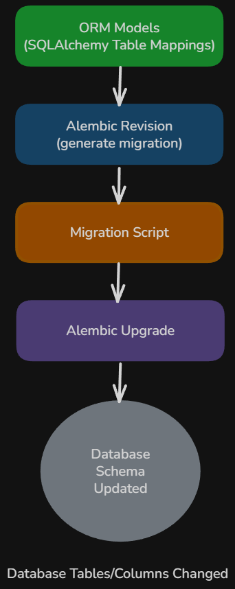

# Content of Python FastAPI Database Level 3

- [Why database migrations are needed](#why-database-migrations-are-needed)
- [Introduction to Alembic](#introduction-to-alembic)
- [Installing Alembic](#installing-alembic)
- [Initializing Alembic in the project](#initializing-alembic-in-the-project)
- [Understanding the Alembic project structure](#understanding-the-alembic-project-structure)
- [Configuring the database connection for Alembic](#configuring-the-database-connection-for-alembic)
- [Connecting Alembic to SQLAlchemy models](#connecting-alembic-to-sqlalchemy-models)
- [Creating the first migration](#creating-the-first-migration)
- [Autogenerating migrations from ORM models](#autogenerating-migrations-from-orm-models)
- [Applying migrations to the database](#applying-migrations-to-the-database)
- [Inspecting migration state](#inspecting-migration-state)
- [Downgrading migrations](#downgrading-migrations)
- [Resolving migration conflicts](#resolving-migration-conflicts)
- [Working with batch operations in SQLite](#working-with-batch-operations-in-sqlite)
- [Handling `NotImplementedError` during migrations](#handling-notimplementederror-during-migrations)

In the previous level, we explored how SQLAlchemy ORM models represent database tables and how relationships, queries, and loading strategies allow applications to retrieve and organize data. These models define the structure of the database schema used by the application.

However, database schemas rarely remain static. As applications evolve, new fields may need to be added, existing columns may change, or entirely new tables may be introduced. Simply modifying ORM models in the code is not enough, because the database itself must also be updated to reflect those structural changes.

Updating a database schema manually can quickly become error-prone, especially as applications grow and multiple environments such as development, testing, and production must stay synchronized.

To manage these changes safely and consistently, developers use **database migrations**. Migration tools track schema changes over time and apply them to the database in a controlled and reproducible way.

In the Python ecosystem, the most common migration tool used together with SQLAlchemy is **Alembic**.

## Why database migrations are needed

Database schemas define the structure of the data used by an application. Tables, columns, constraints, and relationships describe how information is stored and how different pieces of data are connected.

In earlier levels, ORM models were used to define this structure directly in Python. For example, creating a model such as `Book` automatically describes the table that should exist in the database.

```py
class Book(Base):
    __tablename__ = "books"

    id: Mapped[int] = mapped_column(primary_key=True)
    title: Mapped[str] = mapped_column(String)
    price: Mapped[float] = mapped_column(Float)
```

When the application first starts, SQLAlchemy can create the corresponding table using.

```py
Base.metadata.create_all(bind=engine)
```

This approach works well during early development. However, it has an important limitation. The `create_all()` method only **creates tables that do not exist**. It does not modify existing tables.

As an application evolves, the database schema often needs to change. For example, a new column may need to be added.

```py
class Book(Base):
    __tablename__ = "books"

    id: Mapped[int] = mapped_column(primary_key=True)
    title: Mapped[str] = mapped_column(String)
    price: Mapped[float] = mapped_column(Float)
    isbn: Mapped[int] = mapped_column(Integer)
```

Updating the model alone does not update the existing database table. The database schema still reflects the old structure, which can lead to inconsistencies between the application code and the database.

Without a migration system, developers would need to manually modify the database schema using SQL statements such as

```sql
ALTER TABLE books ADD COLUMN isbn INTEGER;
```

Managing schema changes manually becomes difficult and risky. Multiple environments such as **development**, **testing** and **production** must all maintain the same schema, and changes must be applied in the correct order.

Database migrations solve this problem by providing a controlled way to track and apply schema changes over time. Each structural change to the database is recorded as a migration step. These steps can then be applied sequentially to update the database schema safely.

A migration system allows to.

- Apply schema changes consistently across environments

- Upgrade or downgrade the database schema when necessary

- keep the database synchronized with the ORM models used by the application

In the Python ecosystem, the most widely used migration tool for SQLAlchemy projects is **Alembic**. Alembic generates migration scripts that describe how the database schema should change and provides commands to apply those changes to the database.

In the following sections, we will introduce Alembic and configure it to manage schema migrations in a FastAPI application.

## Introduction to Alembic

Once it is clear why database migrations are needed, the next step is to look at the tool that manages them.

In Python projects that use SQLAlchemy, the standard migration tool is **Alembic**.

Alembic works alongside SQLAlchemy and helps track changes to the database schema over time. Instead of modifying database tables manually every time the models change, developers create migration revisions that describe how the schema should move from one version to another.



A migration revision is simply a Python file that contains instructions for updating the database structure. These instructions usually define two directions. One direction upgrades the schema to a newer version and the other direction downgrades it back to an earlier version.

This is important because schema changes are rarely one-time events. During development, the database structure may evolve many times. A project might start with a `books` table, then later add an `authors` table, then later add a new column such as `published_year`. Alembic helps manage these changes in the correct order.

SQLAlchemy still defines the ORM models and database structure in Python code. Alembic uses those models as a reference and generates migration steps that can be applied to the actual database.

This creates a clear separation of responsibilities. SQLAlchemy defines what the schema should look like in code and Alembic manages how the real database is updated over time to match that schema.

In practice, Alembic becomes part of the normal development workflow. When the models change, a new migration is created. That migration is then reviewed and applied to the database.

Before working with migrations, Alembic must first be installed and initialized inside the project.

## Installing Alembic

If the project uses `pip`, Alembic can be installed with

```bash
pip install alembic
```

If the project uses Poetry, Alembic is added with

```bash
poetry add alembic
```

Once installed, the `alembic` command becomes available in the project environment.

This command is used to initialize Alembic, create migration revisions, and apply those revisions to the database.

At this stage, Alembic is only installed. It is not yet connected to the project and does not know anything about the database or the ORM models.

To make Alembic usable, it must be initialized inside the project directory.

## Initializing Alembic in the project

After Alembic is installed, the project must be prepared to use it.

This is done by running the initialization command inside the project root.

If the project uses `pip`, the command can be executed directly.

```bash
alembic init alembic
```

If the project uses **Poetry**, the command should be executed through Poetry so that it runs inside the project environment.

```bash
poetry run alembic init alembic
```

This command creates a new directory named `alembic` together with a configuration file named `alembic.ini`.

The initialization step does not create any migrations yet. It only creates the structure Alembic needs in order to manage them later.

The generated files give Alembic a place to store migration revisions and a configuration entry point that tells it how to connect to the database.

After initialization, the project contains the base migration setup, but it still needs to be configured to work with the actual SQLAlchemy models and database connection used by the FastAPI application.

Before changing any configuration, it is helpful to understand what Alembic created and what each generated file is responsible for.

## Understanding the Alembic project structure

After running the initialization command, the project usually contains a structure similar to this.

```ascii
alembic/
    versions/
    env.py
    README
    script.py.mako
alembic.ini
```

Each part of this structure has a specific responsibility.

- `alembic.ini` file contains the main Alembic configuration. This is where the database URL can be defined if the project uses a direct configuration approach.
- `alembic/` directory contains the migration environment itself.
  - `versions/` stores individual migration revision files. Each time a new migration is created, Alembic places a new Python file inside this folder.
  - `env.py` defines how Alembic connects to the database and how it discovers the SQLAlchemy metadata used for autogeneration.
  - `script.py.mako` is a template used by Alembic when creating new revision files. In most projects, this file is left unchanged.

At this point, Alembic has its own structure, but it still does not know which database to use or which SQLAlchemy models belong to the project.

That configuration is handled next.

## Configuring the database connection for Alembic

Alembic needs to know how to connect to the database before it can generate or apply migrations.

A simple Alembic configuration often places the database URL directly inside `alembic.ini`.

```ini
sqlalchemy.url = sqlite+aiosqlite:///./app.db
```

This tells Alembic to connect to the same SQLite database file used by the FastAPI application.

For simple learning projects, this direct approach is enough. However, many FastAPI projects already define the database URL inside a Python settings module or configuration file. In those cases, it is better for Alembic to reuse the same application configuration instead of duplicating the URL in multiple places.

That setup is usually handled inside `env.py`.

For example, if the FastAPI project stores the URL in a module such as `database`, the Alembic environment can import it.

```py
from database import DATABASE_URL
```

Even if the application uses an asynchronous database URL such as

```py
sqlite+aiosqlite:///./app.db
```

Alembic migrations are typically executed using a synchronous connection.

Because of that, the async driver part is removed before configuring Alembic.

```py
sync_database_url = DATABASE_URL.replace("+aiosqlite", "")
config.set_main_option("sqlalchemy.url", sync_database_url)
```

This allows Alembic to use the same database file as the application, while still using a synchronous connection that works reliably for migrations.

Migrations are executed as standalone commands and are not part of the async request handling used by FastAPI. Because of that, they do not need to use the async driver.

That consistency is important because migrations should run against the same database used by the application, even if the connection style differs.

Once the database connection is configured, Alembic still needs one more important piece. It must know which SQLAlchemy metadata describes the schema.

Without that metadata, Alembic cannot compare the models to the current database structure and cannot autogenerate migrations.

## Connecting Alembic to SQLAlchemy models

Alembic uses SQLAlchemy metadata to understand the structure of the ORM models.

In projects using the declarative base pattern, this metadata is available through the base class.

For example, if the project defines the base like this.

```py
from sqlalchemy.orm import DeclarativeBase

class Base(DeclarativeBase):
    pass
```

Then all ORM models that inherit from `Base` register themselves inside `Base.metadata`.

Alembic must import that metadata inside `env.py`.

```py
from app.db.models import Base

target_metadata = Base.metadata
```

The `target_metadata` variable is the link between Alembic and the SQLAlchemy models.

When Alembic performs autogeneration, it compares `target_metadata` against the actual database schema. It then determines which tables, columns, and constraints have changed.

This means the project models must be imported correctly before migration generation runs. If a model is missing from the imports, Alembic will not see it in the metadata and may fail to detect the schema structure properly.

For example, if the project has separate model files such as `book.py`, `author.py` and `category.py`, they usually need to be imported somewhere in the models package so that they are registered before `Base.metadata` is inspected.

A common pattern is to make sure `models.__init__.py` imports all model classes.

```py
from models import Book, Author, Category
```

Once Alembic is connected to the correct metadata, it is ready to create migration revisions based on the models.

The first migration usually captures the initial schema of the project.

## Creating the first migration

The first migration records the initial database structure defined by the ORM models.

If the project already contains models such as `Book`, `Author` or `Category`, Alembic can generate the initial revision automatically.

If the project uses `pip`

```bash
alembic revision --autogenerate -m "create initial tables"
```

If the project uses **Poetry**

```bash
poetry run alembic revision --autogenerate -m "create initial tables"
```

This command tells Alembic to inspect the SQLAlchemy metadata, compare it to the current database schema, and generate a new revision file.

The `-m` value is the human-readable message attached to the migration. It helps describe what the revision is intended to do.

If the database is empty and the models define several tables, Alembic generates operations to create those tables.

The resulting revision file is placed inside the `alembic/versions` directory.

A typical revision file looks like this.

```py
from typing import Sequence, Union

from alembic import op
import sqlalchemy as sa


# revision identifiers, used by Alembic.
revision: str = 'b71f64b3eed0'
down_revision: Union[str, Sequence[str], None] = None
branch_labels: Union[str, Sequence[str], None] = None
depends_on: Union[str, Sequence[str], None] = None


def upgrade() -> None:
    """Upgrade schema."""
    # ### commands auto generated by Alembic - please adjust! ###
    pass
    # ### end Alembic commands ###


def downgrade() -> None:
    """Downgrade schema."""
    # ### commands auto generated by Alembic - please adjust! ###
    pass
    # ### end Alembic commands ###
```

The `revision` value uniquely identifies this migration.

The `down_revision` value points to the revision that comes immediately before it.

Together, these identifiers form a chain of migration history. Alembic uses that chain to determine the correct order in which migrations must be applied.

The `upgrade()` function describes how to move the schema forward.

The `downgrade()` function describes how to undo that change.

Even when Alembic generates the revision automatically, the file should still be reviewed. Autogeneration helps a lot, but developers are still responsible for checking that the migration actually matches the intended schema change.

Once the first migration is created, later changes to the ORM models can also be turned into migration files.

## Autogenerating migrations from ORM models

One of Alembic’s most useful features is autogeneration.

When the ORM models change, Alembic can compare the updated metadata to the current database schema and generate the migration operations needed to bring the database up to date.

For example, suppose the original Book model contains these fields.

```py
class Book(TimestampMixin, Base):
    __tablename__ = "books"
    __table_args__ = (
        CheckConstraint("pages > 0", name="check_book_pages_positive"),
        CheckConstraint("price >= 0", name="check_book_price_non_negative"),
    )

    id: Mapped[int] = mapped_column(Integer, primary_key=True, index=True)
    title: Mapped[str] = mapped_column(String(255), nullable=False, index=True)
    year: Mapped[int] = mapped_column(Integer, nullable=False, index=True)
    pages: Mapped[int] = mapped_column(Integer, nullable=False)
    price: Mapped[float] = mapped_column(Float, nullable=False)
    in_stock: Mapped[bool] = mapped_column(Boolean, nullable=False, default=True)

    author_id: Mapped[int] = mapped_column(
        ForeignKey("authors.id", ondelete="RESTRICT"),
        nullable=False,
        index=True,
    )

    author: Mapped["Author"] = relationship(
        back_populates="books",
    )

    categories: Mapped[list["Category"]] = relationship(
        secondary=book_category,
        back_populates="books",
    )
```

Later, the application may need to store the publication year.

```py
class Book(TimestampMixin, Base):
    __tablename__ = "books"
    __table_args__ = (
        CheckConstraint("pages > 0", name="check_book_pages_positive"),
        CheckConstraint("price >= 0", name="check_book_price_non_negative"),
    )

    id: Mapped[int] = mapped_column(Integer, primary_key=True, index=True)
    title: Mapped[str] = mapped_column(String(255), nullable=False, index=True)
    year: Mapped[int] = mapped_column(Integer, nullable=False, index=True)
    pages: Mapped[int] = mapped_column(Integer, nullable=False)
    price: Mapped[float] = mapped_column(Float, nullable=False)
    isbn: Mapped[int] = mapped_column(Integer, nullable=False)
    in_stock: Mapped[bool] = mapped_column(Boolean, nullable=False, default=True)

    author_id: Mapped[int] = mapped_column(
        ForeignKey("authors.id", ondelete="RESTRICT"),
        nullable=False,
        index=True,
    )

    author: Mapped["Author"] = relationship(
        back_populates="books",
    )

    categories: Mapped[list["Category"]] = relationship(
        secondary=book_category,
        back_populates="books",
    )
```

After the model is updated, a new migration can be generated.

If the project uses `pip`

```bash
alembic revision --autogenerate -m "add isbn to books"
```

If the project uses `Poetry`

```bash
poetry run alembic revision --autogenerate -m "add isbn to books"
```

However, when creating a second or later migration, Alembic may raise an error like this.

```bash
INFO  [alembic.runtime.migration] Context impl SQLiteImpl.
INFO  [alembic.runtime.migration] Will assume non-transactional DDL.
ERROR [alembic.util.messaging] Target database is not up to date.
FAILED: Target database is not up to date.
```

This happens when a previous migration file has already been created, but the database itself has not yet been upgraded to that latest revision.

In other words, the migration history in the `versions` directory has moved forward, but the actual database schema is still behind.

Alembic does not allow generating a new migration on top of an outdated database state. Before creating another revision, the existing migrations must first be applied to the database.

That is done with the upgrade command.

## Applying migrations to the database

Creating a migration file does not change the database by itself.

The migration must be applied using the Alembic upgrade command.

If the project uses `pip`

```bash
alembic upgrade head
```

If the project uses **Poetry**

```bash
poetry run alembic upgrade head
```

The word `head` means the latest available revision in the migration history.

When this command runs, Alembic connects to the database, checks which revisions have already been applied, and executes any missing `upgrade()` functions in order.

A successful execution produces output similar to this.

```bash
INFO  [alembic.runtime.migration] Context impl SQLiteImpl.
INFO  [alembic.runtime.migration] Will assume non-transactional DDL.
INFO  [alembic.runtime.plugins] setting up autogenerate plugin alembic.autogenerate.schemas
INFO  [alembic.runtime.plugins] setting up autogenerate plugin alembic.autogenerate.tables
INFO  [alembic.runtime.plugins] setting up autogenerate plugin alembic.autogenerate.types
INFO  [alembic.runtime.plugins] setting up autogenerate plugin alembic.autogenerate.constraints
INFO  [alembic.runtime.plugins] setting up autogenerate plugin alembic.autogenerate.defaults
INFO  [alembic.runtime.plugins] setting up autogenerate plugin alembic.autogenerate.comments
INFO  [alembic.autogenerate.compare.tables] Detected added column 'books.isbn'
Generating
done
```

This output confirms that Alembic has applied the migration and updated the database schema to the latest revision.

For example, if the project has an initial migration and then a second migration that adds a new column, Alembic applies both in sequence if the database is still behind.

Alembic also creates its own internal table named `alembic_version`. This table stores the current revision identifier applied to the database.

That is how Alembic knows which migrations have already run and which ones still need to be executed.

Applying migrations in this way keeps the database schema synchronized with the evolution of the application code.

In development, this often happens whenever the models change and a new revision is created.

In real projects, the same process is also used in test and production environments so that all databases follow the same schema history.

In addition to applying and downgrading migrations, it is important to track which changes have already been applied to the database.

## Inspecting migration state

When working with database migrations, it is not always enough to apply or downgrade changes. It is also important to understand the current state of the database and which migrations have already been applied.

Migration tools such as Alembic keep track of applied revisions using a version table stored in the database. This allows the system to determine which migrations need to be executed and which have already been completed.

During development, inspecting the migration state helps verify that the database schema matches the expected version and that migrations have been applied in the correct order.

To check the current revision applied to the database, the following command can be used.

```bash
poetry run alembic current
```

This shows the revision that the database is currently using.

To view the latest available revisions in the project, the following command can be used.

```bash
poetry run alembic heads
```

This helps identify whether there are new migrations that have not yet been applied.

To see the full history of migrations, the following command can be used.

```bash
poetry run alembic history
```

This displays all revisions in order, making it easier to understand how the schema has evolved over time.

In some situations, the database schema may already match a specific revision, but Alembic does not recognize it as applied. This can happen when migrations fail partway through or when the database has been modified manually.

In such cases, the migration state can be updated without executing the migration again.

```bash
poetry run alembic stamp head
```

This marks the given revision as applied in Alembic without making any changes to the database structure.

Inspecting migration state provides a clear view of the relationship between the database and the migration files. It helps detect inconsistencies early and ensures that schema changes are applied in a controlled and predictable way.

Sometimes, however, it is necessary to reverse a previously applied migration.

In such cases, downgrading allows the database schema to be moved back to an earlier state.

## Downgrading migrations

Alembic revisions support both forward and backward movement through schema history.

The `upgrade()` function moves the schema to a newer version and the `downgrade()` function reverts it to the previous one.

To move back one revision, Alembic provides the downgrade command.

If the project uses `pip`

```bash
alembic downgrade -1
```

If the project uses `Poetry`

```bash
poetry run alembic downgrade -1
```

This tells Alembic to undo the most recent migration.

A successful execution produces output similar to this.

```bash
INFO  [alembic.runtime.migration] Context impl SQLiteImpl.
INFO  [alembic.runtime.migration] Will assume non-transactional DDL.
INFO  [alembic.runtime.migration] Running downgrade b71f64b3eed0 -> , create initial tables
```

This output shows that the latest revision was removed and the database schema was moved one step backward.

A specific target revision can also be used.

If the project uses `pip`

```bash
alembic downgrade b71f64b3eed0
```

If the project uses `Poetry`

```bash
poetry run alembic downgrade b71f64b3eed0
```

In that case, Alembic downgrades the database until it reaches the specified revision.

A successful execution produces output similar to this.

```bash
INFO  [alembic.runtime.migration] Context impl SQLiteImpl.
INFO  [alembic.runtime.migration] Will assume non-transactional DDL.
INFO  [alembic.runtime.migration] Running downgrade a06a32c0230e -> b71f64b3eed0, add published year to books
```

This means the database was moved from a newer revision back to the specified one.

Downgrading is especially useful during development and testing, where schema changes may need to be adjusted repeatedly.

For example, if a migration adds the wrong column or uses an incorrect constraint, downgrading allows the database to return to the earlier state before a corrected migration is created.

The ability to upgrade and downgrade safely is one of the main reasons migration systems are preferred over manual schema editing.

However, migrations can also become inconsistent at the versioning level. When multiple revisions are created independently, conflicts may appear in the migration history that must be resolved before further changes can be applied.

## Resolving migration conflicts

When working on a project alone, migrations usually form a single linear history. However, in collaborative environments, multiple developers may create migrations at the same time.

As a result, the migration history can split into multiple branches instead of continuing in a single sequence. These branches are referred to as multiple heads.

To check the current migration heads, the following command can be used.

```bash
poetry run alembic heads
```

If more than one head is returned, it means that the migration history has diverged and must be resolved before new migrations can be applied.

This situation commonly occurs when two migrations are created independently without being aware of each other.

To resolve this, the separate branches need to be merged into a single revision.

```bash
poetry run alembic merge -m "merge heads" <revision_1> <revision_2>
```

This creates a new migration that combines both branches into a single unified history.

After merging, the migration can be applied as usual.

```bash
poetry run alembic upgrade head
```

Resolving migration conflicts ensures that the project maintains a consistent and linear migration history, which is required for reliable schema evolution.

However, not all schema changes can be applied directly in SQLite. Because of its limited support for modifying existing tables, a different approach is required to safely apply structural changes.

## Working with batch operations in SQLite

When applying migrations, not all schema changes can be executed in the same way across different database systems.

In SQLite, support for modifying existing tables is limited. Operations such as changing column definitions, adding constraints or restructuring a table cannot always be performed using direct table modification.

Because of this, migrations that rely on standard table alteration may not work as expected.

To address these limitations, Alembic provides batch operations.

Batch operations allow schema changes to be applied by recreating the table instead of modifying it directly. Rather than issuing a direct change, the table is rebuilt with the updated structure while preserving the existing data.

In this process, a new version of the table is created, the current data is copied into it and the original table is replaced. This makes it possible to apply structural changes even when direct modification is not supported.

In Alembic, batch operations are defined using a context manager.

```py
from alembic import op
import sqlalchemy as sa

with op.batch_alter_table("books") as batch_op:
    batch_op.add_column(
        sa.Column("author_id", sa.Integer(), nullable=True)
    )
```

Inside the `batch_op` block, operations are applied using the batch mechanism rather than direct modification.

This allows schema changes to be applied in SQLite even when direct table alteration is not supported. However, autogenerated migrations do not always use batch operations, which can lead to failures when applying them.

## Handling `NotImplementedError` during migrations

When working with database migrations, it is important to understand that not all schema changes can be applied directly in every database system.

If a migration tries to modify a constraint in a way that SQLite does not support, the operation fails before the schema change can be completed. In these situations, Alembic raises a `NotImplementedError`.

A typical error may look like this.

```bash
NotImplementedError: No support for ALTER of constraints in SQLite dialect.
Please refer to the batch mode feature which allows for SQLite migrations
using a copy-and-move strategy.
```

This type of error occurs when the migration uses an operation that depends on `ALTER TABLE` support for constraints, but SQLite cannot perform that operation directly. SQLite omits many direct constraint-alteration operations, and Alembic documents batch mode as the recreate-and-copy approach used for SQLite table changes.

For example, consider a project that starts with a `Book` model that does not yet include an author relationship.

```py
class Book(Base):
    __tablename__ = "books"

    id: Mapped[int] = mapped_column(primary_key=True)
    title: Mapped[str]
```

Before generating a migration, it is important to verify the current migration state. This helps confirm that the database is aligned with the latest applied revision and avoids creating migrations on top of an inconsistent state.

```bash
poetry run alembic current
poetry run alembic heads
```

Once the state is confirmed, a migration can be created and applied for this version of the model.

```bash
poetry run alembic revision --autogenerate -m "create books without author"
poetry run alembic upgrade head
```

At this stage, the `books` table exists without an `author_id` column and without a foreign key constraint to `authors`.

Later, the model is updated to include a required relationship.

```py
class Book(Base):
    __tablename__ = "books"

    id: Mapped[int] = mapped_column(primary_key=True)
    title: Mapped[str]

    author_id: Mapped[int] = mapped_column(
        ForeignKey("authors.id", ondelete="RESTRICT"),
        nullable=False
    )
```

After this change, a new migration is generated.

```bash
poetry run alembic revision --autogenerate -m "add author foreign key to books"
```

A typical autogenerated migration may look like this.

```py
def upgrade() -> None:
    op.add_column("books", sa.Column("author_id", sa.Integer(), nullable=False))
    op.create_index(op.f("ix_books_author_id"), "books", ["author_id"], unique=False)
    op.create_foreign_key(
        "fk_books_author_id",
        "books",
        "authors",
        ["author_id"],
        ["id"],
        ondelete="RESTRICT",
    )
```

At the migration level, this may look valid. However, SQLite cannot apply the constraint change directly when the migration uses operations such as `create_foreign_key(...)` outside batch mode.

When the migration is applied.

```bash
poetry run alembic upgrade head
```

SQLite raises a `NotImplementedError`, because it cannot execute this kind of constraint modification using `ALTER TABLE`.

For this reason, migrations in SQLite must sometimes be rewritten to use batch mode.

```py
with op.batch_alter_table("books") as batch_op:
    batch_op.create_foreign_key(
        "fk_books_author_id",
        "authors",
        ["author_id"],
        ["id"],
        ondelete="RESTRICT",
    )
```

The same limitation appears in other situations as well. Changing a column constraint, such as making a nullable column required, may generate an `alter_column(...)` operation that SQLite cannot execute directly. Removing a constraint or dropping a column may also fail for the same reason.

It is also important to understand that a migration can fail before Alembic marks the revision as applied.

In that situation, the revision file already exists, but the database may still be on the previous revision. At the same time, some operations from the failed upgrade may already have changed the database structure.

For example, the `author_id` column may have been added before the migration failed while creating the foreign key. If the upgrade command is run again, Alembic starts the same revision again, and SQLite may raise a different error.

```bash
sqlite3.OperationalError: duplicate column name: author_id
```

This happens because the migration is trying to add a column that already exists in the database, even though Alembic has not marked the revision as successfully applied.

In this situation, the actual database structure should be checked before editing or running the migration again.

```bash
sqlite3 app.db
```

Inside the SQLite shell, the table structure can be inspected.

```sql
.schema books
PRAGMA table_info(books);
```

If `author_id` already appears in the table, then the column creation step should not be repeated in the migration.

After inspection, the SQLite shell can be closed.

```sql
.quit
```

The revision file must be updated to match the actual database state. If the column was already created, the following operations should be removed.

```py
op.add_column("books", sa.Column("author_id", sa.Integer(), nullable=False))
op.create_index(op.f("ix_books_author_id"), "books", ["author_id"], unique=False)
```

Only the remaining missing operation should be kept.

```py
with op.batch_alter_table("books") as batch_op:
    batch_op.create_foreign_key(
        "fk_books_author_id",
        "authors",
        ["author_id"],
        ["id"],
        ondelete="RESTRICT",
    )
```

At a conceptual level, this means that migrations must reflect the actual state of the database, not only the intended changes.

Ignoring this can lead to repeated failures and inconsistent schema updates.

However, not all migration problems are caused by adding new constraints. Similar issues can appear even when a column already exists and only its rules are changed.

In these cases, the structure of the table does not change significantly, but the database is still required to modify how existing data is validated. For example, a column that previously allowed `NULL` values may later be updated to require a value for every row.

```py
author_id: Mapped[int | None] = mapped_column(
    ForeignKey("authors.id", ondelete="RESTRICT"),
    nullable=True
)
```

Later, the model is updated to make the relationship required.

```py
author_id: Mapped[int] = mapped_column(
    ForeignKey("authors.id", ondelete="RESTRICT"),
    nullable=False
)
```

After this change, a new migration is generated.

```bash
poetry run alembic revision --autogenerate -m "make author_id required"
```

A typical autogenerated migration may look like this.

```py
op.alter_column("books", "author_id", nullable=False)
```

When applied in SQLite.

```bash
poetry run alembic upgrade head
```

this may fail, because SQLite does not support altering column constraints directly using `ALTER TABLE`.

In this situation, the migration must again be rewritten using batch mode.

```py
with op.batch_alter_table("books") as batch_op:
    batch_op.alter_column(
        "author_id",
        existing_type=sa.Integer(),
        nullable=False,
    )
```

This ensures that the table is recreated using SQLite’s copy-and-move strategy, allowing the constraint change to be applied safely.

Unlike the previous scenario, this type of change may also require updating existing data before applying the constraint. If any rows still contain `NULL` values, the migration will fail after the schema change is applied.

However, constraint changes do not always introduce stricter validation.

In some cases, an existing constraint may be relaxed instead of enforced. For example, a column that previously required a value may later be updated to allow `NULL`.

```py
author_id: Mapped[int] = mapped_column(
    ForeignKey("authors.id", ondelete="RESTRICT"),
    nullable=False
)
```

Later, the model is updated to make the relationship optional.

```py
author_id: Mapped[int | None] = mapped_column(
    ForeignKey("authors.id", ondelete="RESTRICT"),
    nullable=True
)
```

After this change, a new migration may be generated.

```bash
poetry run alembic revision --autogenerate -m "make author_id optional"
```

A typical autogenerated migration may look like this.

```py
op.alter_column("books", "author_id", nullable=True)
```

This type of change does not usually fail because of existing data, since relaxing a constraint does not invalidate current rows.

However, when applied in SQLite, this operation may still fail because direct column alteration is not supported. In such cases, the migration must again be rewritten using batch mode.

```py
with op.batch_alter_table("books") as batch_op:
    batch_op.alter_column(
        "author_id",
        existing_type=sa.Integer(),
        nullable=True,
    )
```

This ensures that the schema change is applied using SQLite’s copy-and-move strategy, even when the modification itself is not restricted by existing data.

While the previous examples focus on modifying existing constraints, similar limitations also apply when constraints need to be removed entirely.

For example, after a relationship already exists, the model may later be changed so that `Book` no longer stores `author_id`.

```py
# author_id: Mapped[int] = mapped_column(
#     ForeignKey("authors.id", ondelete="RESTRICT"),
#     nullable=False,
#     index=True,
# )

# author: Mapped["Author"] = relationship(
#     back_populates="books",
# )
```

After this change, a new migration may be generated.

```bash
poetry run alembic revision --autogenerate -m "remove author from books"
```

A autogenerated migration may try to drop the foreign key constraint and then remove the column.

```py
    op.drop_index(op.f('ix_books_author_id'), table_name='books')
    op.drop_constraint(op.f('fk_books_author_id'), 'books', type_='foreignkey')
    op.drop_column('books', 'author_id')
```

When applied in SQLite.

```bash
poetry run alembic upgrade head
```

This may fail because SQLite cannot directly drop constraints in the same way other databases can. In such cases, Alembic raises a `NotImplementedError` and requires the use of batch mode.

In this situation, the migration must also be rewritten using batch mode.

```py
with op.batch_alter_table("books") as batch_op:
    batch_op.drop_constraint("fk_books_author_id", type_="foreignkey")
    batch_op.drop_column("author_id")
```

In all of these scenarios, the underlying issue is the same. SQLite cannot apply these operations using direct table modification, so the migration must be rewritten using batch mode.
