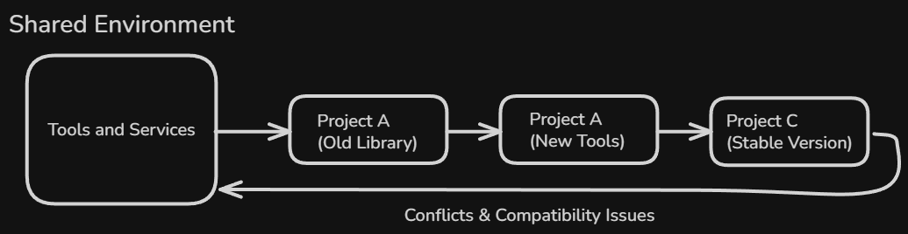
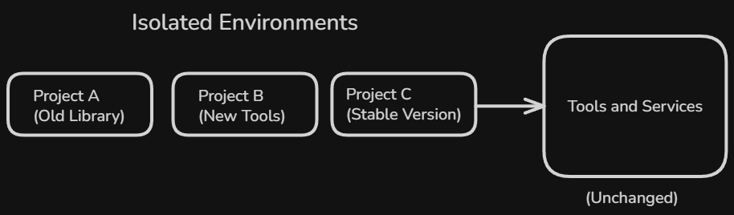
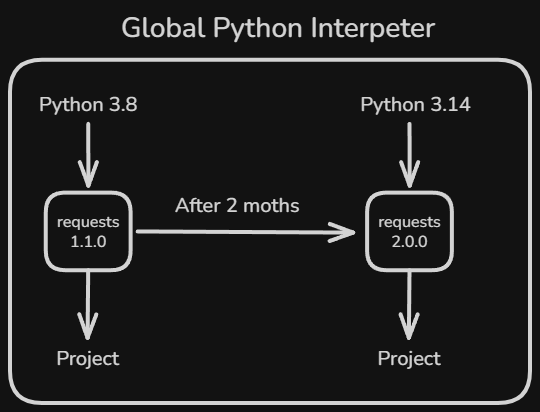
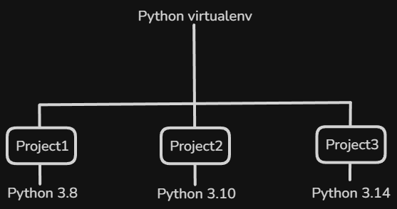

# Content of Python Environment Level 2

- [Why environments need isolation](#why-environments-need-isolation)
- [Global Python environment](#global-python-environment)
- [Virtual environments](#virtual-environments)
- [Creating a virtual environment](#creating-a-virtual-environment)
- [Activating and deactivating environments](#activating-and-deactivating-environments)

In **Python Environment Level 1**, running programs locally was introduced through interactive use and script files. At that stage, everything appears to work as if there is a single tool available on the system.

In development, this assumption does not hold. Multiple projects often exist on the same machine, each with different needs and timelines. When all projects share the same runtime, changes made for one can unintentionally affect others.

This **Python Environment Level 2** introduces the need to separate execution per project. Instead of relying on one shared environment, programs run inside controlled spaces that limit their impact on the rest of the system.

Understanding the reason for this separation is the starting point for working with virtual environments and project specific execution contexts. For that reason, this level begins by examining **why environments need isolation**.

## Why environments need isolation

When a system has only one shared runtime, every program depends on the same underlying setup. Any change made to that setup affects all programs that use it.

In practice, different projects evolve at different speeds. One project may require **newer tools** or **updated libraries**, while another depends on **older**, **stable versions**. If everything runs in a single shared environment, these requirements conflict.



Isolation solves this problem by separating execution contexts. Each project runs with its own configuration, unaffected by changes made elsewhere. This prevents accidental breakage and makes behavior more predictable.



Another reason for isolation is safety. **System-level environments** are often used by other **tools** and **services**. Modifying them for a single project can cause failures outside the project itself.

By isolating environments, projects become independent. They can be **developed**, **tested**, **updated**, and **removed** without impacting the rest of the system. This independence is the foundation for reliable development workflows and is why isolation is a core requirement when working with multiple projects.

Because isolation is not the default, it is important to first understand what exists before any separation is applied. On most systems, there is a single shared environment that all programs use unless told otherwise.

This shared setup is known as the **global Python environment**.

## Global Python environment

When Python is installed on a system, it creates a **global environment**. This environment is shared by default and is used whenever a program runs without any form of isolation.



The global environment includes the **system wide interpreter** and any **libraries** installed into it. Every project that uses this setup depends on the same configuration and sees the same available packages.

The location where global libraries are installed can be inspected directly.

```py
python -c "import site; print(site.getsitepackages())"
```

On **macOS** and **Linux**.

```py
['/usr/lib/python3.12/site-packages']
```

On **Windows**.

```py
['C:\\Python312\\Lib\\site-packages']
```

All packages installed without an active virtual environment are placed in these directories. Every project using the global environment loads libraries from the same shared location.

This shared nature makes the global environment convenient for **simple tasks** and **quick experiments**. There is no setup required, and programs run immediately using the **system configuration**.

However, because all projects use the same environment, changes made for one project affect all others. **Installing**, **upgrading**, or **removing** libraries alters the shared state, which can lead to conflicts or unexpected behavior in unrelated projects.

For this reason, the **global environment** is generally treated as a baseline rather than a workspace for active development. It exists to support the system and simple use cases, not to manage multiple independent projects.

Because the **global environment** is shared and affects everything that depends on it, relying on it for active development quickly becomes limiting. Projects need a way to run with their own settings without changing the system wide setup.

This need leads to the use of **virtual environments**, which provide isolated spaces for running programs.

## Virtual environments

A virtual environment is an isolated execution space created on top of an existing system installation. It provides a separate runtime context that does not interfere with the global environment or with other projects.



Each virtual environment has its own interpreter reference and its own area for installed libraries. Programs running inside it see only what belongs to that environment, even though they share the same machine with other environments.

Virtual environments make it possible to work on multiple projects at the same time, each with different requirements, without conflict. Changes made inside one environment remain local and do not affect others.

From a practical point of view, a virtual environment behaves like a self-contained workspace. When it is active, all commands and executions are directed to that isolated context rather than to the global setup.

Virtual environments do not replace the global environment. Instead, they depend on it as a foundation while providing the isolation needed for safe and predictable project work

While virtual environments explain what isolation is and **why it matters**, they are only useful once they can be created and used in practice.

The next step is to see how a virtual environment is created for a project.

## Creating a virtual environment

Creating a virtual environment means setting up a dedicated space for a project to run independently from the global setup. This space contains everything needed to execute programs without affecting other projects on the system.

A virtual environment is created inside a directory, usually within the project itself. That directory becomes the boundary that separates one project runtime from others.

In practice, Python provides this functionality through the built-in `venv` module.

Creating an environment inside a project directory looks like this.

```bash
python -m venv .venv
```

The name `.venv` is a convention, not a requirement. Any name can be used, but `.venv` is commonly chosen to indicate that the directory is an internal project artifact. Many tools and editors also recognize this convention automatically.

When this command runs, a new directory appears in the project. This directory represents the virtual environment itself.

```ascii
.venv/
┣ Include/
┣ Lib/
┣ Scripts/
┣ .gitignore
┗ pyvenv.cfg
```

Inside the virtual environment directory are a few key components. It includes a **Python interpreter** that is used when the environment is **active**, along with startup and activation scripts that **control how the environment is enabled in a terminal session**. The directory also contains a **dedicated location where project specific libraries are installed**.

Directory names differ between operating systems, but their purpose remains the same. Together, they define an isolated runtime that behaves separately from the system Python installation.

Creating a virtual environment does not modify the global environment. No system packages are removed or replaced.

Each project typically has its own environment. This keeps project lifecycles independent and allows environments to be recreated or removed without affecting other work.

Once created, a virtual environment exists on disk until it is deleted. It has no effect on program execution until it is explicitly activated.

On **macOS** and **Linux**, the environment can be removed by deleting the directory.

```bash
rm -rf .venv
```

On **Windows**, the environment can be removed using.

```bash
rmdir /s .venv
```

After removal, the environment no longer exists and any libraries installed inside it are removed with it.

To actually use a virtual environment, it must first be activated.

## Activating and deactivating environments

Creating a virtual environment only prepares it on disk. It does not change how programs run until it is activated.

Activating an environment means telling the current terminal session to use that environment for execution. Once activated, commands run using the environment interpreter and its installed libraries instead of the global setup.

Activation affects only the current terminal session. Other terminals, editors, or processes are not changed. This makes it possible to work on multiple projects at the same time, each using a different environment.

On **macOS** and **Linux**, activating an enviroinment looks like this.

```bash
source .venv/bin/activate
```

On **Windows**, activation uses a different directory layout and shell system.

```bash
.venv\Scripts\activate
```

On some **Windows** systems, activation scripts may be blocked by **PowerShell’s execution policy**. If activation fails with a security-related error, the policy can be adjusted for the current user.

```bash
Set-ExecutionPolicy RemoteSigned -Scope CurrentUser
```

This change allows locally created activation scripts to run without affecting system-wide security settings. It only needs to be done once per user account.

After activation, the active runtime can be verified by checking which Python interpreter is being used.

```bash
python -c "import sys; print(sys.executable)"
```

If the printed path includes .venv, the virtual environment is active. If it points to a system location, commands are running in the global environment.

Deactivating an environment restores the previous state. After deactivation, commands run again using the global setup or whatever environment was active before.

```bash
deactivate
```

Activation and deactivation do not modify project files or system configuration. They only control which runtime context is used for execution in the current shell session.

All commands that install packages or run programs are expected to be executed with the correct environment active. When an environment exists but is not activated, commands still run, but they use the global runtime instead of the project setup.

For example, running a program like this.

```bash
python main.py
```

may fail with an error such as `ModuleNotFoundError: No module named 'requests'`, even though the library was installed earlier. The command itself is correct, but it is executed in the wrong runtime context.
