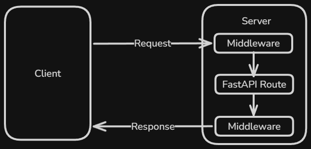

# Content of Python FastAPI Level 3

- [Router](#router)
- [Middleware](#middleware)
- [Cors](#cors)
- [Configuration Management with BaseSettings](#configuration-management-with-basesettings)

In the previous levels, we built a FastAPI application by defining routes, validating request data, and then extending it to work with database models, Pydantic schemas, and related data so that routes could handle real application logic and return structured responses.

As an application grows, another problem appears. Even if each individual route is correct, placing all routes directly in one file quickly becomes difficult to manage. The code becomes longer, different parts of the application become mixed together, and the overall structure becomes harder to follow.

At this point, the next step is not adding more business logic, but improving how the application itself is organized.

In this level, we focus on the parts of FastAPI that help structure and control the application at a higher level. We will separate routes into dedicated units, see how request and response processing can be intercepted, and understand how the application can be configured to communicate safely with clients running on other origins.

We begin with routers.

## Router

In the earlier levels, routes were attached directly to the main FastAPI application object.

```py
from fastapi import FastAPI

app = FastAPI()

@app.get("/books")
async def list_books():
    return []
```

This works well in small examples, but as more resources are added, the file begins to grow. Routes for `books`, `authors`, `categories`, `users`, `authentication` and other features all compete for space in the same module.

The problem is not that the routes stop working. The problem is that the application becomes harder to read and maintain.

FastAPI solves this by allowing routes to be grouped into routers.

A router is an object that collects related routes in one place. Instead of attaching every route directly to the main application object, routes can first be attached to an `APIRouter` and then included in the application.

This allows the application to be split into smaller parts while still behaving as one API.

A router is created using `APIRouter`, and routes are attached to it in the same way as before.

```py
from fastapi import APIRouter

router = APIRouter()

@router.get("/")
async def list_books():
    return []

@router.get("/{book_id}")
async def get_book(book_id: int):
    return {"book_id": book_id}
```

At this point, the routes exist, but they are not yet part of the application. To make them available, the router must be included in the main FastAPI instance.

```py
from fastapi import FastAPI
from routers import books

app = FastAPI()

app.include_router(books.router)
```

When the router is included, all of its routes become part of the application.

In practice, routers are often included with additional configuration.

```py
app = FastAPI(prefix="/books", tags=["Books"])
```

The `prefix` argument adds a path in front of every route defined in the router. A route defined as `/` inside the router becomes `/books`, and a route defined as `/{book_id}` becomes `/books/{book_id}`.

The `tags` argument is used for documentation. It groups routes in Swagger UI so that related endpoints appear together. This does not affect how the API behaves, only how it is presented.

Using routers separates the definition of routes from how they are exposed in the application. The router focuses on the resource itself, while the main application decides how that resource is structured within the API.

While routers help organize *where* routes are defined, they do not change *how* requests are processed. Every request still follows the same path through the application, from the moment it arrives to the moment a response is returned.

In some situations, it is useful to run logic **before or after every request**, regardless of which route is called. This could include tasks such as logging, modifying headers, measuring execution time, or handling cross-cutting concerns that apply to the entire application.

FastAPI provides a way to intercept requests and responses globally using middleware.

## Middleware

In the previous section, routers were used to organize routes. Each route handles a specific request and returns a response.

Sometimes, logic should not be repeated inside every route. There are cases where the same code should run for every request, no matter which endpoint is called. This is where middleware is used.

Middleware is a function that sits between the incoming request and the route. It receives the request before the route runs, and it also receives the response after the route finishes.

A simple way to imagine this is a security check at an airport. Every passenger must pass through the same checkpoint before reaching their gate. The security check does not care where the passenger is going. It performs the same checks for everyone. After the passenger passes through, they continue to their destination.

The same idea is shown in the diagram.



The request starts from the client and enters the server. Before it reaches the FastAPI route, it first goes through middleware.

Then the route processes the request and creates a response.

After the route finishes, the response goes back through the middleware again before it is sent to the client.

This means middleware wraps around the route. It runs before the route and continues running after the route finishes.

A simple middleware looks like this.

```py
from fastapi import FastAPI, Request

app = FastAPI()

@app.middleware("http")
async def simple_middleware(request: Request, call_next):
    print("Request received")

    response = await call_next(request)

    print("Response created")

    return response
```

The string `"http"` tells FastAPI that this middleware should run for HTTP requests. At this level, this is the most common type of middleware.

The request argument represents the incoming HTTP request. It contains information such as the method, path, headers, and body.

The `call_next` argument is a function provided by FastAPI. Calling `await call_next(request)` passes the request to the next step, which is usually the route function. Without calling it, the request would never reach the route.

When the request arrives, the middleware runs first. The line `print("Request received")` executes before the route.

Then await `call_next(request)` runs the route function and produces a response.

After that line finishes, execution returns back to the middleware. At this point, the response already exists, and the middleware can inspect or change it before returning it.

For example, the middleware can print information about the request.

```py
@app.middleware("http")
async def log_path(request: Request, call_next):
    print("Path:", request.url.path)

    response = await call_next(request)

    return response
```

In this case, every request will print the URL path in the server output.

Middleware is used for logic that should apply to all requests. It runs automatically for every request and surrounds the route execution without modifying the route itself.

In the next section, we will see a practical use case of middleware when working with requests coming from different origins.

## Cors

In curriculum **Security**, CORS was already explained as a browser security rule that controls whether a frontend running on one origin is allowed to send requests to a backend on another origin.

At this we focus is not on the theory again, but on how CORS is integrated into a FastAPI application.

FastAPI handles CORS through middleware. This means the application is configured once, and the rules are applied automatically to incoming browser requests.

CORS support is added using `CORSMiddleware`.

```py
from fastapi import FastAPI
from fastapi.middleware.cors import CORSMiddleware

app = FastAPI()

app.add_middleware(
    CORSMiddleware,
    allow_origins=["http://localhost:3000"],
    allow_credentials=True,
    allow_methods=["*"],
    allow_headers=["*"],
)
```

This middleware tells FastAPI which origins are allowed to access the API.

The `allow_origins` argument defines which frontend origins are permitted. In this example, requests coming from `http://localhost:5473` are allowed.

The `allow_credentials` argument controls whether cookies or authentication headers may be included.

The `allow_methods` argument defines which HTTP methods are allowed, such as `GET`, `POST`, `PUT`/`PATCH` and `DELETE`. Using `"*"` allows all methods.

The `allow_headers` argument defines which request headers the client is allowed to send. Using `"*"` allows all headers.

With this configuration in place, browser requests from the allowed frontend origin can reach the API correctly.

A development setup is a frontend running on one port and a FastAPI backend running on another port.

For example, the frontend may run on

```bash
http://localhost:5473
```

while the FastAPI application runs on

```bash
http://127.0.0.1:8000
```

Even though both are local, they are different origins, so the browser applies CORS rules. Without `CORSMiddleware`, the browser may block the request even if the backend route itself works correctly.

CORS middleware is usually added near the start of the application setup, after creating the FastAPI app and before the application starts handling requests.

At this level, it is enough to understand that CORS in FastAPI is enabled by adding `CORSMiddleware` and configuring which origins, methods, headers, and credentials are allowed.

In applications, these configuration values should not be hardcoded. Instead, they are typically managed in a structured and flexible way.

## Configuration Management with BaseSettings

**BaseSettings** is a utility that allows an application to load configuration values from environment variables or `.env` files instead of hardcoding them in the code  is typically used at the **application entry point** to define all configuration in one place. It acts as a central source of truth that other parts of the application import and use.

It works by defining a class where each attribute represents a configuration value. When the application starts, these values are automatically read from the environment.

This allows the same codebase to run in different environments with different configurations without modification.

To use this functionality, the required package must be installed.

Using `pip`

```bash
pip install pydantic-settings
```

Using poetry

```bash
poetry add pydantic-settings
```

Once installed, a configuration class can be defined.

```py
import os
from pydantic_settings import BaseSettings

ENVIRONMENT = os.getenv("ENVIRONMENT", "development")

class Settings(BaseSettings):
    CORS_ORIGINS: list[str]
    CORS_ALLOW_CREDENTIALS: bool = True
    CORS_ALLOW_METHODS: list[str] = ["*"]
    CORS_ALLOW_HEADERS: list[str] = ["*"]

    DATABASE_URL: str

    class Config:
        env_file = ".env"

settings = Settings()
```

In this approach, configuration values are written in **UPPERCASE** because they represent **environment-based constants**.

The `ENVIRONMENT` variable determines which configuration file is loaded. If it is not explicitly set, the application defaults to `development`.

This variable is typically defined in a base `.env` file or as a system environment variable.

```env
ENVIRONMENT=development
```

Based on this value, the application loads a corresponding configuration file.

```env
# .env.development
CORS_ORIGINS=["http://localhost:3000"]

DATABASE_URL=sqlite+aiosqlite:///./app.db
```

Or

```env
# .env.production
CORS_ORIGINS=["https://myapp.com"]
DATABASE_URL=postgresql+asyncpg://user:password@db:5432/app
```

When `Settings()` is created, `BaseSettings` automatically looks for environment variables with the same names.

If these variables exist, they override the default values defined in the class. If not, the default values are used.

At runtime, this means that the application does not rely on hardcoded values, and configuration is loaded dynamically from the environment. This makes it possible for different environments to provide different values without requiring any changes to the code.

These settings are then used wherever configuration is needed in the application.

For example, in CORS configuration

```py
from fastapi.middleware.cors import CORSMiddleware

app.add_middleware(
    CORSMiddleware,
    allow_origins=settings.CORS_ORIGINS,
    allow_credentials=settings.CORS_ALLOW_CREDENTIALS,
    allow_methods=settings.CORS_ALLOW_METHODS,
    allow_headers=settings.CORS_ALLOW_HEADERS,
)
```

And in database setup

```py
from sqlalchemy.ext.asyncio import create_async_engine

engine = create_async_engine(settings.DATABASE_URL)
```

Here, the configuration is treated as constants and accessed directly from the settings object.
