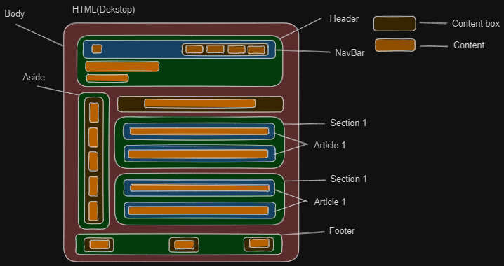

# Table of Contents

- [HTML](#html)
  - [Basic HTML](#basic-html)
    - [HTML file example](#html-file-example)
    - [Explanation](#explanation)
- [Semantic HTML](#semantic-html)
  - [Introduction to Semantic HTML](#intro-semantic-html)
    - [Layout Examples](#layout-examples)
    - [Others sematic tags](#others-semantic-tags)
      - [Image tags](#image-tags)
- [HTML Tables](#html-tables)
  - [Basic Structure](#basic-structure)
  - [Table Headers](#table-headers)
  - [Table Data](#table-data)
  - [Table Caption](#table-caption)
  - [Spanning Rows or Columns](#rows-or-columns)
- [Forms and Validation](#forms)
  - [Introduction to HTML Forms](#introduction-to-html-forms)
  - [Form Elements](#form-elements)
  - [Input Validation](#Input-validation)
  - [Length Validation](#length-validation)
  - [Regular Expression (Regex) Validation](#regex)
  - [Semantic HTML and SEO](#semantic-seo)
  - [Password Validation](#password)
  - [Visual Feedback using CSS](#css-feedback)
- [Best Practices](#best-practices)
- [Accessibility](#accessibility)
- [Basics of SEO](#basic-of-seo)
  - [Images](#images)

# HTML 

HTML, which stands for HyperText Markup Language, is the standard markup language used for creating web pages and applications. It provides a structure for organizing and formatting the content of a webpage by using various HTML tags and elements.

## Basic HTML

### HTML file example

```html
<!DOCTYPE html>
<html lang="en">
<head>
  <meta charset="UTF-8">
  <meta name="viewport" content="width=device-width, initial-scale=1.0">
  <title>My First Webpage</title>
</head>
<body>
  <h1>Welcome to My Webpage</h1>
  <p>This is a paragraph of text.</p>
  
  <h2>Lists</h2>
  <ul>
    <li>Item 1</li>
    <li>Item 2</li>
    <li>Item 3</li>
  </ul>

  <h2>Ordered List</h2>
  <ol>
    <li>First item</li>
    <li>Second item</li>
    <li>Third item</li>
  </ol>
  
  <h2>Links</h2>
  <a href="https://www.example.com">Click here</a> to visit Example.com.
</body>
</html>

```
### Explanation

Let's go through the code snippet and explain each line:

- `<html lang="en">`: This line represents the root element of an HTML document. The `lang` attribute specifies the language of the document, where `"en"` represents English.

- `<head>`: This element contains metadata and other information about the HTML document.

- `<meta charset="UTF-8">`: This meta tag sets the character encoding for the document to UTF-8, which supports a wide range of characters and is commonly used for multilingual content.

- `<meta name="viewport" content="width=device-width, initial-scale=1.0">`: This meta tag is used to control the behavior and dimensions of the viewport on mobile devices. It ensures that the webpage is rendered properly on different screen sizes.

### Code example

[Demo](https://codesandbox.io/s/html-basics-647tsc)

### Resources

- [W3Schools: Learn HTML](https://www.w3schools.com/html/html_intro.asp)
- [MDN Docs: Getting Started with HTML](https://developer.mozilla.org/en-US/docs/Learn/HTML/Introduction_to_HTML/Getting_started)

# Semantic HTML

## Introduction to Semantic HTML

Semantic HTML refers to the use of HTML elements that carry meaning and convey the structure and content of a web page. By using semantic tags, you provide additional context and improve accessibility for users and search engines. Here are some commonly used semantic HTML tags:

- `<header>`: Represents the introductory content or a group of introductory content in a document.
- `<nav>`: Defines a section containing navigation links.
- `<main>`: Represents the main content of the document.
- `<section>`: Defines a section in a document.
- `<article>`: Represents a self-contained composition in a document, such as a blog post or a news article.
- `<aside>`: Represents content that is tangentially related to the content around it.
- `<footer>`: Defines the footer of a document or a section.

Using semantic HTML elements not only improves the structure and readability of your code but also helps search engines understand the content better.

### Layout Examples



### Code example

- [Sematic html demo](https://codesandbox.io/s/onepage-forked-3fvgcr?file=/index.html)

### HTML tags

#### Image tags

```
<figure>
  
  <figcaption>image</figcaption>
</figure>
```

```
<picture>
  <source srcset="image-large.jpg" media="(min-width: 1200px)">
  <source srcset="image-medium.jpg" media="(min-width: 768px)">
  <source srcset="image-small.jpg" media="(min-width: 480px)">
  
</picture>

```

#### Code example

- [Image](https://codesandbox.io/s/image-wcgdcp?file=/index.html)

## Resources

- [(Video)HTML Tags](https://www.youtube.com/watch?v=iX_QyjdctsQ&t=13s)
- [(Article)Guide to Writing Semantic HTML](https://cs.fyi/guide/writing-semantic-html)
- [(Article)W3Schools: Semantic HTML](https://www.w3schools.com/html/html5_semantic_elements.asp)
- [(Article)How To Write Semantic HTML](https://hackernoon.com/how-to-write-semantic-html-dkq3ulo)
- [(Article)HTML Best Practices – How to Build a Better HTML-Based Website](https://www.freecodecamp.org/news/html-best-practices/)
- [(Article)Semantic HTML: What It Is and How It Improves Your Site](https://blog.hubspot.com/website/semantic-html)

# HTML Tables

## Basic Structure

To create an HTML table, you need to use the `<table>` element as the container. The content of the table is defined using `<tr>` (table row) elements for each row, and `<td>` (table data) elements for each cell within a row.

```html
<table>
  <tr>
    <td>Cell 1</td>
    <td>Cell 2</td>
  </tr>
  <tr>
    <td>Cell 3</td>
    <td>Cell 4</td>
  </tr>
</table>
```

## Table Headers

Tables often include a header row to label the columns or provide additional information about the data. HTML provides the `<th>` element specifically for table headers. It functions similarly to `<td>`, but it conveys that the content is a header.

```html
<table>
  <tr>
    <th>Header 1</th>
    <th>Header 2</th>
  </tr>
  <tr>
    <td>Cell 1</td>
    <td>Cell 2</td>
  </tr>
  <tr>
    <td>Cell 3</td>
    <td>Cell 4</td>
  </tr>
</table>
```

## Table Data

As shown in the examples above, you can use the `<td>` element to define the data cells within the table rows. These cells contain the actual content or data that you want to display.

```html
<table>
  <tr>
    <th>Name</th>
    <th>Age</th>
    <th>Email</th>
  </tr>
  <tr>
    <td>John Doe</td>
    <td>25</td>
    <td><a href="mailto:johndoe@example.com">johndoe@example.com</a></td>
  </tr>
  <tr>
    <td>Jane Smith</td>
    <td>30</td>
    <td><a href="mailto:janesmith@example.com">janesmith@example.com</a></td>
  </tr>
</table>
```

## Table Caption

To provide a descriptive caption for your table, you can use the `<caption>` element. This element should be placed immediately after the opening `<table>` tag.

```html
<table>
  <caption>Sample Table</caption>
  <tr>
    <th>Header 1</th>
    <th>Header 2</th>
  </tr>
  <tr>
    <td>Cell 1</td>
    <td>Cell 2</td>
  </tr>
</table>
```

## Spanning Rows or Columns

Sometimes, you may need to merge or span multiple rows or columns. This can be achieved using the `rowspan` and `colspan` attributes on the respective `<td>` or `<th>` elements.

```html
<table>
  <tr>
    <th>Item</th>
    <th colspan="2">Details</th>
  </tr>
  <tr>
    <td rowspan="2">Item 1</td>
    <td>Color</td>
    <td>Red</td>
  </tr>
  <tr>
    <td>Size</td>
    <td>Medium</td>
  </tr>
</table>
```

## Code example

[Styled Table example](https://codesandbox.io/s/table-yx5c4m)

# Forms and Validation

## Introduction to HTML Forms

HTML forms provide a way for users to interact with a website by entering and submitting data. They consist of various form elements such as text fields, checkboxes, radio buttons, dropdown lists, and buttons. Validating user input is essential to ensure data accuracy and security.

## Form Elements

HTML provides several form elements to collect user input. Some commonly used elements include:

- `<input>`: Represents a generic form input field.
- `<textarea>`: Allows multi-line text input.
- `<select>:` Creates a dropdown list for users to select options.
- `<checkbox>`: Represents a checkbox element.
- `<radio>`: Represents a radio button element.

## Input Validation

Input validation ensures that the data entered by users meets specified criteria. HTML offers various attributes for validation, including:

- `required`: Specifies that a field must be filled out.
- `pattern`: Specifies a regex pattern for input validation.
- `min and max`: Defines the minimum and maximum values for numeric inputs.

## Length Validation

To validate the length of an input, you can use the minlength and maxlength attributes. 
For example:

```
/// code creates a text input field that must contain a minimum of 5 characters and a maximum of 10 characters.
<input type="text" minlength="5" maxlength="10">

```

## Regular Expression (Regex) Validation

Regex validation allows you to define custom patterns for validating input. The pattern attribute accepts a regex pattern to match against user input. 
For example:

```html
/// code validates that the input consists of exactly three alphabetical characters.
<input type="text" pattern="[A-Za-z]{3}">

```

## Semantic HTML and SEO

When creating forms or any other content in HTML, it is important to use semantic HTML for better SEO. Semantic HTML helps search engines understand the structure and meaning of your content. Here are some tips for using semantic HTML in forms:

- Use appropriate semantic tags such as `<form>`, `<label>`, and `<fieldset>` to structure the form.
- Assign meaningful labels to form fields using the `<label>` element.
- Group related form elements using the `<fieldset>` and `<legend>` elements.
- Provide alternative text for images or icons used in the form using the alt attribute.
- Consider using structured data markup, such as Schema.org, to provide additional context to search - engines.

By using semantic HTML, you enhance the accessibility and search engine visibility of your forms, ultimately improving your website's SEO.

## Password Validation

Password validation is essential to ensure the strength and security of user passwords. You can use the pattern attribute with a regex pattern to enforce specific requirements for passwords. For example, to validate a password that must be at least 8 characters long, contain at least one uppercase letter, one lowercase letter, and one digit, you can use the following code:

```
///  this pattern ensures that a valid password must be at least 8 characters long and contain at least one digit, one lowercase letter, and one uppercase letter.
<input type="password" pattern="(?=.*\d)(?=.*[a-z])(?=.*[A-Z]).{8,}" required>

```
- (?=.*\d): This part of the pattern requires the password to contain at least one digit (0-9). The (?=.*\d) is a positive lookahead assertion that checks if there is any digit present in the password.

- (?=.*[a-z]): This part of the pattern requires the password to contain at least one lowercase letter (a-z). The (?=.*[a-z]) is another positive lookahead assertion that checks if there is any lowercase letter present in the password.

- (?=.*[A-Z]): This part of the pattern requires the password to contain at least one uppercase letter (A-Z). The (?=.*[A-Z]) is a positive lookahead assertion that checks if there is any uppercase letter present in the password.

- .{8,}: This part of the pattern specifies that the password must be at least 8 characters long. The .{8,} means that the password can have any character (except newline) repeated 8 or more times.

## Visual Feedback using CSS

You can provide visual feedback to users indicating whether their input is valid or not using CSS. Here's an example of how you can style the input fields to display a green border for valid input and a red border for invalid input:

## Code example

- [Form example](https://codesandbox.io/s/focused-monad-nwjo2q?file=/index.html)

## Resources

- [(Article)MDN Web Docs: Client-side form validation](https://developer.mozilla.org/en-US/docs/Learn/Forms/Form_validation) 
- [(Article)Learn Forms by web.dev](https://web.dev/learn/forms/) 
- [(Article)W3Schools: JavaScript Form Validation](https://web.dev/learn/forms/)

# Best Practices

## Resources

- [HTML Best Practices](https://github.com/hail2u/html-best-practices)

# Accessibility

- `alt`: Used with the `` element to provide alternative text for images.

- `aria-*` attributes: A set of attributes from the Accessible Rich Internet Applications (ARIA) specification used to enhance accessibility. Some commonly used attributes include `aria-label`, `aria-labelledby`, `aria-describedby`, and `aria-hidden`.

- `role`: Specifies the role or type of an element to assistive technologies. For example, `role="button"` indicates an element functions as a button.

- `tabindex`: Determines the tabbing order of interactive elements on a page, allowing users to navigate using the keyboard alone.

- `title`: Provides additional information about an element when the user hovers over it, often used for tooltips.

- `aria-live`: Indicates that content within an element may change dynamically, allowing assistive technologies to announce the changes in real-time.

- `aria-disabled`: Indicates that an element is disabled and cannot be interacted with.

- `aria-expanded`: Indicates whether a collapsible element, such as an accordion or dropdown menu, is expanded or collapsed.

- `aria-hidden`: Hides elements from assistive technologies, useful for decorative or non-essential content that should not be announced to users.

- `lang`: Specifies the language of the content within an element, assisting screen readers and other assistive technologies in presenting the content correctly.

## Resources

- [(Article)Developing for Web Accessibility by W3C WAI](https://www.w3.org/WAI/tips/developing/)
- [(Article)Accessibility Tutorial](https://www.w3schools.com/accessibility/accessibility_role_name_value.php)
- [(Article)A Complete Guide To Accessible Front-End Components](https://www.smashingmagazine.com/2021/03/complete-guide-accessible-front-end-components/)
- [(Article)Accessibility for Developers by Google](https://web.dev/accessibility/)

# Basics of SEO

## Images

Here are a few cons of using JPEG, SVG, and WebP images instead of PNG for web pages:

- Lossy compression: JPEG is a lossy compression format, which means it sacrifices image quality for smaller file sizes. This can result in a loss of image details and artifacts, especially when the compression level is high. In contrast, PNG is a lossless format that preserves image quality without compromising details.

- Limited support for transparency: JPEG does not support transparency, which means it cannot retain transparent backgrounds or alpha channels.

- Scalability limitations: While SVG (Scalable Vector Graphics) is a vector-based format and can be scaled without loss of quality, it may not be suitable for all types of images. 

- Browser support: Although WebP is an efficient image format developed by Google, it may not be supported by all web browsers, particularly older or less popular ones. 

- Image editing limitations: When it comes to post-processing and editing images, PNG offers more flexibility. Its lossless nature allows for easy editing and modification without any quality degradation. 

## Resources

- [(Article)Google Search Central — SEO Docs](https://developers.google.com/search/docs)
- [(Article)SEO Guide](https://github.com/seo/guide)
- [(Article)SEO Best Practices For Developers](https://neilpatel.com/blog/seo-developers/)

