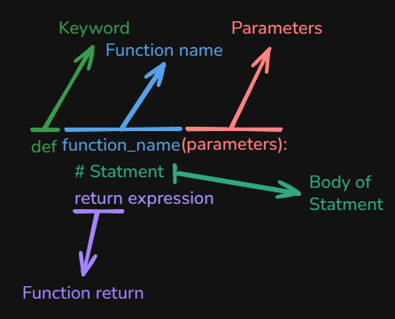

# Content of Python function programming 1 level

- [Function definition vs function call](#function-definition-vs-function-call)
- [Parameters vs arguments](#parameters-vs-arguments)
- [Return vs print](#return-vs-print)
- [Function composition](#function-composition)
- [Control flow inside functions](#control-flow-inside-functions)
- [Functions with collections](#functions-with-collections)
- [Built-in numeric utility functions](#built-in-numeric-utility-functions)

Functions are reusable blocks of code designed to perform a specific task and help you organize your code.



## Function definition vs function call

We define a function with the keyword `def` and give it a name. As discussed in **Syntax Level 1**, if the name consists of multiple words, use **snake_case** for clarity.

Syntax for defining a function is.

```py
def function_name(parameters, parameters2):
    # Function body
```

## Parameters vs arguments

In **Syntax Level 1**, parameters were introduced as variables listed inside the parentheses `()` in a function definition. They serve as placeholders for the values (**arguments**) that will be passed to the function when it is called.

Inside the function block, you can use the `return` keyword to send back a value, or you can use `print()` a result directly without returning it.

## Return vs print

*Using `print()` inside a function is generally for debugging purposes. It's best to use `return` to send a value back, allowing the function's output to be reused elsewhere.*

Here's an example using `print()` within a function.

```py
def function_name(parameters):
    # Function body
    print(expression)
```

And when we write using `return`, the function sends a value back so that it can be reused.

```py
def function_name(parameters):
    # Function body
    return expression
```

To get an answer in your console, you must call the function after defining it, and if you don't use `print()` within the function, you need use `print()` when calling the function.

```py
def function_name(parameters):
    # Function body
    return expression

# Calling the function and printing its returned result
print(function_name(argument))
```

Consider the following sequential code that adds two numbers

```py
number1 = 10
number2 = 20

sum_result = number1 + number2

print(sum_result)
```

*This approach works fine for a one-time calculation, but the result cannot be reused elsewhere in your program.*

In contrast, by defining a **function**, you can reuse it this logic, and return the result to be used in other parts of your code. Inside a **function block**, you can use the `return` keyword to send a value back, or you can use `print()` to display it directly.

```py
def add_numbers(a, b):
    # Function body
    return a + b

# Now you can reuse the function wherever needed
result = add_numbers(10, 20)
print(result)
```

*Using `print()` inside a function is generally for debugging purposes. It's best to use `return` to send a value back, allowing the function's output to be reused elsewhere.*

Because a function can return a value, that returned result can be used just like any other value in your program. One common and useful pattern is passing the result of one function directly into another function call.

## Function composition

Function composition means using the return value of one function as the input (`argument`) for another function.

The general pattern looks like this.

```py
result = function_two(function_one(value))
```

There are examples how function composition can be implemented.

```py
def add_tax(price):
    return price + (price * 0.21)

def add_shipping(price):
    return price + 5

price = 20
result = add_shipping(add_tax(price))
print(result) # 29.2
```

Function composition can also be used together with conditional logic.

```py
def apply_discount(price):
    if price >= 50:
        return price - 10
    return price

def add_shipping(price):
    return price + 5

price = 60
result = add_shipping(apply_discount(price))
print(result) # 55
```

Function composition can also be implemented by calling one function inside the body of another function.

```py
def add_tax(price):
    return price + (price * 0.21)

def add_shipping(price):
    return price + 5

def calculate_total(price):
    taxed_price = add_tax(price)
    final_price = add_shipping(taxed_price)
    return final_price

price = 20
result = calculate_total(price)
print(result) # 29.2
```

In this example, `calculate_total()` calls other functions inside its function block, stores their returned values, and returns the final result.

A function may return multiple values, which can be assigned to multiple variables.

```py
def get_user_data():
    return "admin", True, 3

username, is_active, login_count = get_user_data()
print(username) # admin
print(login_count) # 3
```

Function can also be implemented using functions that return multiple values inside another function.

```py
def get_order_data():
    return 20, True

def add_tax(price):
    return price + (price * 0.21)

def calculate_total():
    price, is_active = get_order_data()
    taxed_price = add_tax(price)
    return taxed_price

result = calculate_total()
print(result) # 24.2
```

In this example, `calculate_total()` receives multiple values from another function, uses only the required value, and returns the final result.

Not all returned values must be used. In that case, we can assign unused values to `_`.

```py
def get_user_data():
    return "admin", True, 3

username, _, _ = get_user_data()
print(username) # admin
```

Here is another example where we keep only the middle value.

```py
def get_user_data():
    return "admin", True, 3

_, is_active, _ = get_user_data()
print(is_active) # True
```

If a function uses `print()` instead of `return`, its result cannot be used in another function call.

```py
ef add_tax(price):
    print(price + (price * 0.21))

def add_shipping(price):
    return price + 5

price = 20
add_shipping(add_tax(price))
```

In this example, `add_tax(price)` prints the value but does not return it. When a function does not use `return`, Python automatically returns `None`.

Since `add_shipping()` tries to add `5` to `None`, Python raises the error, `TypeError: unsupported operand type(s) for +: 'NoneType' and 'int'`.

So far, we have learned **how functions work**, how they take **parameters**, and how they **return values**. We have also already used some **built-in functions** provided by Python.

Now, let’s focus on a specific group of built-in functions that are commonly used when working with numbers.

## Built-in numeric utility functions

So far, we have learned **how functions work**, how they take **parameters**, and how they **return values**.

Now let’s look at some **built-in functions** that Python provides to help us work with numbers.

These are called **numeric utility functions**.

The `abs()` function returns the absolute value of a number. It basically converts a **negative number into a positive one** (or leaves a positive number unchanged).

```py
print(abs(10)) # 10
print(abs(-10)) # 10
```

The `round()` function rounds a number to the nearest value.

```py
print(round(3.6)) # 4
print(round(3.14159, 2)) # 3.14
```

The first argument is the number to round, and the second argument is **optional** and specifies how many **decimal places** to keep.

Another useful pair of functions is `min()` and `max()`.

- The `min()` function returns the **smallest value**
- The `max()` function returns the **largest value**

```py
print(min(3, 7, 1)) # 1
print(max(3, 7, 1)) # 7
```

They also work with **collections**, such as lists.

```py
numbers = [4, 9, 2, 8]
print(min(numbers)) # 2
print(max(numbers)) # 9
```

The `sum()` function adds all numeric values in a collection.

```py
numbers = [1, 2, 3, 4]
print(sum(numbers)) # 10
```

This function is useful when working with lists of numbers.

Another useful numeric utility is the `pow()` function, which raises a number to a power.

```py
print(pow(2, 3)) # 8
```

This is equivalent to using the exponent operator `**`, which I already introduced earlier.

```py
print(2 ** 3) # 8
```

So far, the examples focused on how functions return values and interact with each other. Next, we will look at how to control the logic *inside* a function using conditionals and loops.

## Control flow inside functions

In programs, functions often need to make decisions based on input values. This is done using **conditional statements** inside the function.

A common use case is validating or categorizing input data.

```py
def check_password_length(password):
    if len(password) < 8:
        return "Password too short"
    else:
        return "Password length is OK"
```

The same function can be reused for multiple inputs using a loop.

```py
passwords = ["1234", "mypassword", "securepass123"]

for pwd in passwords:
    print(check_password_length(pwd))
```

## Functions with collections

Functions often need to work with **collections**, such as lists, to check permissions or allowed values.

```py
def is_allowed_user(username, allowed_users):
    if username in allowed_users:
        return True
    else:
        return False

allowed_users = ["admin", "editor", "viewer"]

print(is_allowed_user("admin", allowed_users)) # True
print(is_allowed_user("guest", allowed_users)) # False
```

Functions can also compare objects using **identity**, which is important when tracking shared state.

```py
def is_same_config(config_a, config_b):
    if config_a is config_b:
        return "Same configuration"
    else:
        return "Different configuration"

default_config = {"theme": "dark"}
active_config = default_config
custom_config = {"theme": "dark"}

print(is_same_config(default_config, active_config))
print(is_same_config(default_config, custom_config))
```
