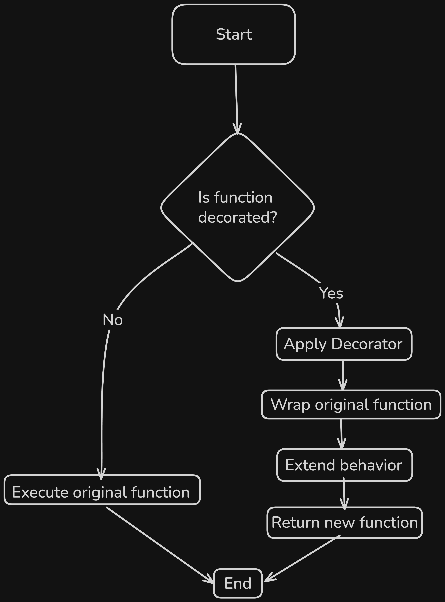

# Content of Python Function Programming Level 3

- [First-class functions](#first-class-functions)
- [Higher-order functions](#higher-order-functions)
- [Functions returning functions](#functions-returning-functions)
- [Lambda functions](#lambda-functions)
- [Built-in higher-order functions](#built-in-higher-order-functions)
- [Recursion](#recursion)
- [Decorators](#decorators)

In the previous levels, we learned how to **define functions**, **call them**, and control how arguments are passed using **positional**, **keyword**, and **default values**.

So far, we mostly treated functions as **blocks of code** that run when they are called. In Python, functions go one step further, they are **objects**.

This means that functions can be **assigned to variables**, **stored in data structures**, **passed as arguments to other functions**, **returned from functions**.

Understanding this idea is important because it unlocks new patterns, such as **callbacks**, **lambdas**, **closures**, **recursion**, and **decorators**.

We will start by looking at the simplest case: treating a **function as a value** and assigning it to a variable.

## First-class functions

In Python, functions are **first-class objects**. This means a function can be treated like any other value. It can be **assigned to a variable**, **stored**, and **used later**.

Because of this, a program can decide **what action to perform**, not just **what data to work with**.

A common practical pattern is having a **set of actions** (or rules) and choosing which one to apply.

```py
def validate_length(value):
    return len(value) >= 5

def validate_digits(value):
    return value.isdigit()
```

Instead of calling a function immediately, we can store a reference to it in a variable.

```py
validator = validate_length
```

At this point, the function is not executed. It is only stored.

Later in the program, the function can be executed by using **parentheses**.

```py
result = validator("hello")
print(result) # True
```

The function runs only when `()` are used.

Because **functions are objects**, the reference can be changed when behavior needs to change.

```py
validator = validate_digits
print(validator("12345")) # True
```

This allows programs to change behavior without rewriting logic.

Functions can also be **grouped** and **reused** together.

```py
validators = [
    validate_length,
    validate_digits
]
```

Each function in the list represents a **rule**.

```py
value = "12345"

for check in validators:
    print(check(value))
```

In this example, functions are treated as **data** that represent behavior, not just code to be executed immediately.

The next step is using this idea more directly, instead of choosing a function inside a block of code, we can **pass a function to another function** and let it decide when and how that behavior is used.

## Higher-order functions

A **higher-order function** is a function that **accepts another function as an argument**, **returns a function**, or both.

Because functions are objects, they can be passed just like any other value. This allows one function to **delegate part of its behavior** to another function. In practice, this separates **what to do** from **how to do it**.

Consider a function that processes a value but does not decide *how* it should be processed.

```py
def process_value(value, action):
    result = action(value)
    return result
```

Here, `action` is expected to be a **function**.

We can define different actions separately.

```py
def to_upper(text):
    return text.upper()

def add_prefix(text):
    return "ID_" + text
```

Now the behavior can be injected when calling the function.

```py
result1 = process_value("abc", to_upper)
print(result1) # ABC

result2 = process_value("abc", add_prefix)
print(result2) # ID_abc
```

The `process_value` function does not know **what** operation is applied. It only knows **when** to apply it.

This pattern is useful when the same logic needs to work with **different behaviors**.

Another common case is applying the **same rule to multiple values**.

```py
def apply_rule(values, rule):
    results = []
    for value in values:
        results.append(rule(value))
    return results

items = ["one", "two", "three"]

result = apply_rule(items, to_upper)
print(result) # ['ONE', 'TWO', 'THREE']
```

Here, the function `to_upper` is passed as an argument and applied repeatedly.

So far, we have seen how functions can be **passed into other functions** to control behavior.

The next step is that a function can also **create and return another function**. This allows programs not only to accept behavior, but also to **build behavior dynamically**.

## Functions returning functions

A function is not limited to returning simple values like **numbers** or **strings**. Because functions are objects, a function can also **return another function**.

This allows **create behavior dynamically** instead of deciding everything in advance.

When this happens, the returned function may **remember values** from the context in which it was created. This combination is called a **closure**.

A closure is not a special syntax. It is a natural result of **defining a function inside another function**, **returning that inner function**, **and using variables from the outer function**.

Consider a function that creates a rule based on a condition.

```py
def create_validator(min_length):
    def validate(value):
        return len(value) >= min_length
    return validate
```

Here, the inner function `validate` uses `min_length`, even though `min_length` is not defined inside `validate` itself.

When we call the outer function, we get a new function back.

```py
validate_short = create_validator(3)
validate_long = create_validator(6)
```

Each returned function remembers the value that was used when it was created.

```py
print(validate_short("abc")) # True
print(validate_short("a")) # False

print(validate_long("abcdef")) # True
print(validate_long("abc")) # False
```

Even though `create_min_length_validator` has already finished running, the returned functions still have access to `min_length`. This remembered value is what makes the function a **closure**.

Closures are useful when behavior depends on **configuration** or **setup values** that should not be global and should not be passed every time the function is called.

Another example is creating processors with predefined behavior.

```py
def create_multiplier(factor):
    def multiply(value):
        return value * factor
    return multiply
```

Here, `factor` is captured by the returned function.

```py
double = create_multiplier(2)
triple = create_multiplier(3)

print(double(5)) # 10
print(triple(5)) # 15
```

Both `double` and `triple` were created from the same outer function, but each one remembers its own `factor`.

This shows the key idea that **functions can carry behavior together with remembered data**.

Closures allow programs to keep state **without global variables**, making code safer, more modular, and easier to reason about.

In the next section, we will look at **lambda functions**, which provide a compact way to create small functions, often used together with **higher-order functions**.

## Lambda functions

So far, all functions were created using `def`. However, sometimes a function is **very small**, **used only once**, and exists only to be passed as behavior.

For these cases, Python provides **lambda functions**.

A **lambda function** is a small, anonymous function defined in a single expression.

```py
lambda x: x + 1
```

A `lambda` function **has no name**, **can take arguments**, **returns a value automatically**, **contains only one expression**

Here is the same function written with `def`.

```py
def increment(x):
    return x + 1
```

```py
increment = lambda x: x + 1
```

The same function with `lambda`.

```py
numbers = [1, 2, 3, 4]

result = apply_rule(numbers, lambda x: x * 2)
print(result) # [2, 4, 6, 8]
```

Both functions behave the same way.

```py
print(increment(5)) # 6
```

Lambda functions are most useful when passing a **function as an argument**, especially when the **behavior is simple** and **used only once**.

```py
def process_value(value, action):
    return action(value)
```

Instead of defining a separate function, we can use a `lambda`.

```py
result = process_value("abc", lambda text: text.upper())
print(result) # ABC
```

This keeps the code compact and avoids creating a function that will never be reused.

Lambda functions are also commonly used with functions that **apply behavior repeatedly**.

```py
def apply_rule(values, rule):
    results = []
    for value in values:
        results.append(rule(value))
    return results

numbers = [1, 2, 3, 4]

result = apply_rule(numbers, lambda x: x * 2)
print(result) # [2, 4, 6, 8]
```

Here, the `lambda` function defines **what to do**, while `apply_rule` defines **how it is applied**.

Lambda functions are best used when **function is short**, **logic is simple**, **function is used only once**

For more complex logic, a **regular `def` function** is usually clearer.

Lambda functions showed how small pieces of behavior can be created inline and passed around easily.

Python also provides several **built-in higher-order functions** that are designed to work with this kind of small, inline behavior. Instead of writing the same loop repeatedly, these functions allow programs to express **data-processing** directly.

## Built-in higher-order functions

When programs work with **collections**, the same processing pattern appears again and again.

We start with **raw records**, remove invalid entries, transform the remaining data, order it by importance, and sometimes combine values into one final result.

Let’s work with a **single shared dataset** and walk through this process step by step.

```py
requests = [
    {"id": 101, "user": "example1", "status": "ok", "priority": 2, "cost": 10},
    {"id": 102, "user": "example2", "status": "failed", "priority": 1, "cost": 20},
    {"id": 103, "user": "example3", "status": "ok", "priority": 3, "cost": 5},
    {"id": 104, "user": "example4", "status": "ok", "priority": 1, "cost": 15}
]
```

A common first step is selecting only valid records, such as keeping only entries where the status is `"ok"`.

Using a loop, this usually looks like this.

```py
valid_requests = []

for req in requests:
    if req["status"] == "ok":
        valid_requests.append(req)

print(valid_requests)
```

The same logic can be expressed using `filter()`, where the function describes which records should remain.

```py
valid_requests = list(
    filter(lambda req: req["status"] == "ok", requests)
)

print(valid_requests)
```

Here, `filter()` does not immediately produce a **list**. It returns an iterator that yields values only when requested. We use `list()` to materialize the result into a **list**.

If wasn't **not** convert the result to a list and print it directly, we will not see the records. We will only see the filter object.

```py
valid_requests = filter(lambda req: req["status"] == "ok", requests)
print(valid_requests)
# <filter object at 0x...>
```

To see the values, we must consume the iterator, for example by converting it into a list.

If we try to consume the same iterator a second time, it becomes empty.

```py
valid_requests = filter(lambda req: req["status"] == "ok", requests)

print(list(valid_requests))
print(list(valid_requests))
# The second output is []
```

This happens because the iterator is exhausted after it has been consumed once. In programs, **filtered data** is often reused for **sorting**, **transforming**, or **totals**, so converting it to a **list** makes the data available for multiple steps.

After validation, the next step is often **transforming** records into a simpler form.

Using a loop, extracting durations looks like this.

Loop-based selection.

```py
valid_requests = list(
    filter(lambda req: req["status"] == "ok", requests)
)

durations = []

for req in valid_requests:
    durations.append(req["duration"])

print(durations)
```

With `map()`, the function describes **what to extract from each record**.

```py
valid_requests = list(
    filter(lambda req: req["status"] == "ok", requests)
)

durations = list(
    map(lambda req: req["duration"], valid_requests)
)

print(durations)
```

Now suppose we want to **order** the valid requests by duration.

Before using built-in tools, it is important to understand **what sorting actually means** at a basic level. One of the simplest sorting approaches is **bubble sort**. It works by repeatedly comparing neighboring elements and swapping them if they are in the wrong order.

This is **not** the most efficient algorithm, and Python does **not** use it internally, but it is useful for understanding the **core idea of sorting**.

```py
ordered_requests = valid_requests.copy()

for i in range(len(ordered_requests)):
    for j in range(i + 1, len(ordered_requests)):
        if ordered_requests[i]["duration"] > ordered_requests[j]["duration"]:
            ordered_requests[i], ordered_requests[j] = (
                ordered_requests[j],
                ordered_requests[i]
            )

print(ordered_requests)
```

Here, the program manually compares the `"duration"` value of each request and swaps elements until the list is ordered from smallest duration to largest.

Python provides **built-in sorting** tools so we **do not need to write this logic ourselves** in programs. Instead, we describe **what value should be used for ordering**.

```py
ordered_requests = sorted(
    valid_requests,
    key=lambda req: req["duration"]
)

print(ordered_requests)
```

Another option is the `.sort()` method, which **orders the list in place** and does **not** create a new list.

```py
valid_requests.sort(key=lambda req: req["duration"])
print(valid_requests)
```

The behavior is the same in both cases. The difference is whether we want to keep the **original list unchanged** (`sorted`) or modify it directly (`.sort()`).

In both cases, the function passed to `key` tells Python which value represents the meaningful ordering criteria.

There are many **sorting algorithms**, but understanding this basic **comparison-and-swap logic** helps explain why the `key` function exists and how ordering actually works.

Finally, sometimes we need a **single combined result**, such as the total processing time.

Using a loop, accumulation looks like this.

```py
total_duration = 0

for req in valid_requests:
    total_duration = total_duration + req["duration"]

print(total_duration)
```

The same logic can be expressed using `reduce()`, which repeatedly combines the accumulated value with the next element.

```py
from functools import reduce

total_duration = reduce(
    lambda acc, req: acc + req["duration"],
    valid_requests,
    0
)

print(total_duration)
```

All of these built-in functions rely on the same core idea, **functions can be passed into other functions** to control behavior without rewriting the surrounding logic.

In the next section, we will look at **recursion**, where a function solves a problem by calling itself.

## Recursion

So far, functions have called **other functions**. Recursion is a special case where a function **calls itself**.

Recursion is useful when a problem has a **self-similar structure**, meaning the problem contains smaller parts that follow the same.

Consider a nested structure where items can contain other items.

```py
structure = {
    "name": "root",
    "items": [
        {
            "name": "docs",
            "items": [
                {"name": "file1.txt", "items": []}
            ]
        },
        {
            "name": "images",
            "items": []
        }
    ]
}
```

To process every element in this structure, recursion is a natural solution.

```py
def print_names(node):
    print(node["name"])
    for item in node["items"]:
        print_names(item)

print_names(structure)
```

When the function runs, it prints the name of the current element and then calls itself for each nested element.

The recursion naturally ends when an element contains no further items.

Recursion can also be used to **count elements** inside a nested structure.

```py
def count_items(node):
    total = 1
    for item in node["items"]:
        total += count_items(item)
    return total

print(count_items(structure)) # 4
```

Another practical use case is processing a **sequence of steps** where each step depends on the next.

```py
def follow_steps(steps, index):
    if index == len(steps):
        return
    print(steps[index])
    follow_steps(steps, index + 1)

steps = ["start", "load", "process", "finish"]
follow_steps(steps, 0)
```

**Recursion** works well in these cases because the logic follows **structure of the data** or **sequence itself**. It is best used when it simplifies the code and matches the shape of the problem.

In the next section, we will look at **decorators**, which are built on top of closures and are used to modify or extend function behavior.

## Decorators

So far, we have seen that functions can be **passed around**, **returned**, and can **remember values** using closures.  

A decorator uses the same ideas to solve a problem.

The problem is not that we **cannot write extra code inside functions** but rather when many functions need the **same extra behavio**r, we start repeating the same code again and again.

When repeated code changes, we must update it in many places so decorators allow us to **write that shared behavior once** and **apply it to many functions**.

Imagine we have two functions that do different tasks.

```py
def load_data():
    print("Loading data")

def save_data():
    print("Saving data")
```

Now suppose we want the same extra behavior for both functions, such as printing a message before and after each execution.

One direct approach is to add it manually inside every function.

```py
def load_data():
    print("Start")
    print("Loading data")
    print("End")

def save_data():
    print("Start")
    print("Saving data")
    print("End")
```

This works, but the extra behavior is duplicated, if the start/end messages change, every function must be edited.

A decorator solves this by moving the repeated behavior into a single reusable place.



We start by writing a function that receives another function as a parameter.

```py
def log_execution(original_function):
    pass
```

The parameter name `original_function` is used to shows that this is the function we want to wrap.

Inside the decorator, we define a new function, this new function is the one that will run instead of the original one.

```py
def log_execution(original_function):
    def wrapped_function():
        print("Start")
        original_function()
        print("End")
    return wrapped_function
```

Here is what happens `wrapped_function` adds extra behavior and it prints before and after calling `original_function` so then decorator returns `wrapped_function`.

This means the result of `log_execution(original_function)` is a new function.

```py
load_data = log_execution(load_data)
save_data = log_execution(save_data)
```

Now calling `load_data()` actually calls the wrapper.

```py
load_data()
save_data()
```

Both functions now include the start/end behavior without changing their internal logic.

Python provides a shorter syntax for the same operation.

The `@` symbol is called **decorator syntax**. It is just a shorter and more readable way to apply a decorator to a function.

```py
@log_execution
def load_data():
    print("Loading data")

@log_execution
def save_data():
    print("Saving data")
```

This is equivalent to writing the following code manually.

```py
def load_data():
    print("Loading data")

load_data = log_execution(load_data)
```

The decorator is applied at **function definition time**, before the function is ever called. The original function is replaced by the wrapped version returned by the decorator.

To make the decorator work with any function, the wrapper must accept any arguments and forward them.

This allows the decorator to wrap functions that take parameters and also return values.

Consider the following complete example.

```py
def log_execution(original_function):
    def wrapped_function(*args, **kwargs):
        print("Start")
        result = original_function(*args, **kwargs)
        print("End")
        return result
    return wrapped_function

@log_execution
def process(value):
    print("Processing:", value)
    return value * 2


@log_execution
def combine(a, b):
    print("Combining values")
    return a + b


result1 = process(10)
print("Result:", result1)

result2 = combine(3, 5)
print("Result:", result2)
```

In this example, the decorator is written once and applied to multiple functions `process` function takes a single argument and returns a value in other hand `combine` function takes two arguments and returns a value.

The decorator does not need to know anything about the functions parameters it simply forwards all received arguments using `*args` and `**kwargs`.

Another common case is retrying a function when an error happens.

```py
def retry(original_function):
    def wrapped_function(*args, **kwargs):
        for attempt in range(3):
            try:
                return original_function(*args, **kwargs)
            except Exception:
                print("Retrying...")
        print("Failed after retries")
    return wrapped_function
```

Applying it.

```py
@retry
def unstable_call():
    print("Calling server")
    raise Exception("Network error")

unstable_call()
```

Here the retry rule is not written inside `unstable_call` it is added externally by the decorator and applied consistently.

However, in this example, the retry behavior is fixed.

The decorator always retries the function the same number of times if we want different functions to retry a different number of times, this decorator is no longer sufficient.

For that, the decorator itself must receive configuration this is why decorators are sometimes written with parentheses.

When a decorator uses parentheses, it means the decorator is called first to receive its configuration, and only then is the function wrapped.

Consider the same retry logic, but configurable.

```py
def retry(max_attempts):
    def decorator(original_function):
        def wrapped_function(*args, **kwargs):
            for attempt in range(max_attempts):
                try:
                    return original_function(*args, **kwargs)
                except Exception:
                    print("Retrying...")
            print("Failed after retries")
        return wrapped_function
    return decorator
```

Now the number of retry attempts is not fixed inside the decorator.

Applying the decorator with configuration.

```py
@retry(3)
def unstable_call():
    print("Calling server")
    raise Exception("Network error")

unstable_call()
```

Here, the retry rule is still not written inside `unstable_call` it is still applied externally by the decorator.

At this level, decorators are introduced as a **function programming concept**, functions wrapping other functions to extend behavior.

Later, decorators will appear again in more structured forms. There, we will see decorators used for things like **access control**, **method behavior modification**, **class-level decorators**, and **framework-style patterns**.
