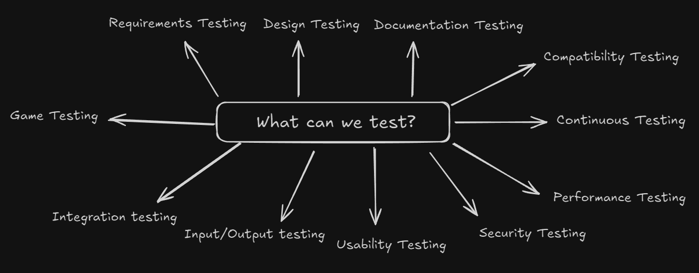

<!-- markdownlint-disable MD033 -->
# Content Of Table

- [Fundamentals of Testing](#fundamentals-of-testing)
  - [What is Testing?](#what-is-testing)
  - [Test Roles](#test-roles)
  - [QA vs QC](#qa-vs-qc)
  - [Errors, Defects, Failures, and Root Causes](#errors-defects-failures-and-root-causes)
  - [Testing and Debugging](#testing-and-debugging)
  - [Independence of Testing](#independence-of-testing)
  - [Whole Team Approach](#whole-team-approach)
  - [Test Objectives](#test-objectives)
  - [Principles of Testing](#principles-of-testing)
  - [Test Activities](#test-activities)

## Fundamentals of Testing

### What is Testing?

**Explanation:**

Testing has been a part of daily activities and is essential for validating products and applications. Testing ensures that a product works as expected by the validate products, find defects, and ensure requirements are met and also involves reviewing work products and ensuring quality.

    
Overview:

1. **Product-Oriented Approach:**
    - Features and quality of the final product.
    - The product meets user needs and expectations.

2. **Process-Oriented Approach:**
    - Processes and methodologies used to develop the product.
    - Efficient and standardized development processes.

3. **User-Oriented Approach:**
    - Involvement of end-users in the development process.
    - The product is user-friendly and meets actual user needs.

4. **Time-Oriented Approach:**
    - Speed of development.
    - Rapid delivery to meet tight deadlines or market demands.

5. **Rules-Oriented Approach:**
    - Compliance with specific rules, regulations, and standards.
    - The product and process meet legal and regulatory requirements.

### Test Roles

**Explanation:**

Test roles define the responsibilities and contributions of different individuals involved in the testing process.

    
Overview:

1. **Test Management:** Responsibility for the test process, team adn focus on Test planning, monitoring and control, and test completion.

2. **Test Engineer:** Responsibility Technical aspects of testing. and focus on Test analysis, design, implementation, and execution.

3. **Role Flexibility:** In small organizations One person can take on both test management and test engineer roles. and in other organizational responsibilities may vary based on project context, skills, structure of the companie.

### QA vs QC

**Explanation:**

Quality Assurance (QA) and Quality Control (QC) are two aspects of quality management.

They serve different purposes and involve different activities:

- **Quality Assurance (QA):** Proactive process that focuses on preventing defects in the development process. QA is **process-oriented** and aims to improve and stabilize production and associated processes to avoid issues that lead to defects.

- **Quality Control (QC):** Reactive process that focuses on identifying defects in the final product. **product-oriented** and aims to identify and correct defects in the finished product before it reaches the customer.

### Errors, Defects, Failures, and Root Causes

**Explanation:**

These terms in the context of software testing to describe different aspects of problems that can occur during the development and operation of software.

    
Overview:

1. **Error:** An error, also known as a mistake, is a human action or decision that produces an incorrect or unexpected result.

2. **Defect:** A defect, also known as a bug, is a flaw in the system. It's the result of an error made by the creators of the app.

3. **Failure:** A failure is the result of defect during execution of the software.

4. **Root Cause:** The root cause is the deepest underlying cause of a defect or a failure.

### Testing and Debugging

**Explanation:**

Testing and debugging are two steps in the software development process that work together.

    
Overview:

1. **Testing:** Process of executing a program or system with the intent of finding errors. The goal of testing is to ensure that the software behaves as expected and meets its requirements.

2. **Debugging:** Once an error has been identified through testing, debugging is the process of finding the exact location and cause of that error in the code.

### Independence of Testing

**Explanation:**

Independence of testing refers to the concept where the testing of a software product is conducted by a person or a team that is separate and independent from the team that developed the software.

    
Overview:

1. **Objectivity:** Independent testing provides an objective view of the software, which helps in identifying defects that might be overlooked by the development team due to familiarity with the code.

2. **Bias Reduction:** Since the testing team is separate from the development team, it reduces the risk of bias and ensures a more thorough and impartial testing process.

3. **Specialized skills:** Independent testers often have specialized skills in testing methodologies and tools, which can contribute to a more effective testing process.

4. **Accountability:** Having a separate testing team holds the development team accountable for the quality of their work, as any defects found can be traced back to the development process.

5. **Degrees of Independence:**

    - Work products tested by their author (no independent tester).
    - Tested by the author's peer from the same team.
    - Tested by testers from outside the author's team but within the same organization.
    - Tested by testers from outside the organization (outsourced testing).

### Whole Team Approach

**Explanation:**

The whole team approach emphasizes collaboration and coordination among all team members to ensure quality throughout the software development lifecycle.

    
Overview:

1. **Collaboration:** Emphasizes the importance of collaboration and coordination among all team members (developers, testers, business representatives).

2. **Suitable:** Notes that the whole team approach may not always be appropriate, especially in safety-critical situations where test independence is needed.

### Test Objectives

**Explanation:**

Test objectives are the specific goals and purposes of testing. It's like a guide
for tester to aligned with the overall project goals.

    
Overview:

1. **Evaluating Work Products:** This involves requirements, user stories, designs documents, and code to identify defects early in the development process.

2. **Triggering Failures and Finding Defects:** One of the primary objectives of testing is to find defects in the system under test.

3. **Ensuring Required Coverage:** Test objectives often include achieving a certain level of coverage, which could be in terms of requirements, risk, functionality, code.

4. **Reducing Risk of Inadequate Software Quality:** Testing helps in reducing the risk by prevent major failure in the production environment.

5. **Verifying Requirements Fulfillment:** Confirm that the software meets the specified requirements and user needs.

6. **Regulatory Compliance:** In certain domains(areas), complying with regulatory requirements is a key test objective.

7. **Providing Information to Stakeholders:** Communicate the test results, progress, and any identified issues to stakeholders.

8. **Building Confidence in Product Quality:** Testing helps Increase quality of the software that it has been thoroughly tested and meets the required standards.

9. **Validating Completeness and Functionality:** Ensure that the software is complete and functions works correctly.

### Principles of Testing

**Explanation:**

The principles of testing are fundamental guidelines that dictate what to test, how to test, and when to test, following a **rule-oriented approach**.

    
Overview:

1. **Testing shows presence of defects:** Testing can show that defects are present, but cannot prove that there are no defects. Testing reduces the probability of undiscovered defects remaining in the software but, even if no defects are found, it is not a proof of correctness.

2. **Exhaustive testing is impossible:** It's not possible to test all combinations of inputs, scenarios, and paths in the software. Instead, risk analysis, priorities, and techniques like boundary value analysis and equivalence partitioning are used to focus the testing effort.

3. **Early testing:** To find defects early, testing activities should start as early as possible in the software development lifecycle and should be focused on defined objectives.

    

4. **Defect clustering:** A small number of modules usually contain most of the defects discovered during pre-release testing, or are responsible for most of the operational failures. This is also known as the **Pareto principle**, also known as the 80-20 rule, which states that approximately 80% of the issues occur due to 20% of the modules.

5. **Pesticide paradox:** If the same tests are repeated over and over again, eventually they will no longer find new bugs. To overcome this, the test cases need to be regularly reviewed and revised, and new and different tests need to be written to exercise different parts of the software or system.

6. **Testing is context dependent:** Testing is done differently in different contexts. For example, Android application software is tested differently from an e-commerce site.

7. **Absence-of-errors fallacy:** If the system does not fulfill the users' needs and expectations, finding and fixing defects does not necessarily improve the system. A system that is 100% bug-free is not necessarily useful to the user.

### Test Activities

**Explanation:**

Test activities are the various tasks and processes involved in testing a software product to ensure it meets the required quality standards.

    
Overview:

1. **Test Planning:** The phase where the testing lifecycle begins. This involves defining the test objectives. Depending on the context.

    - **Activities:**

        - Define goals and objectives of testing.
        - Determine the overall approach, timelines, resources, and tools.
        - Define entry and exit criteria.
        - Plan for monitoring and control.

    - **Deliverables:**

        - Test Plan
        - Test Schedule
        - Risk Register
        - Entry and Exit Criteria

2. **Test Monitoring and Control:** This involves the ongoing checking of all test activities and the comparison of actual progress against the plan.

    - **Activities:**

        - Monitor test progress.
        - Compare actual progress against the plan.
        - Document control directives.
        - Update risk information.

    - **Deliverables:**

        - Test Progress Report
        - Control Directives
        - Updated Risk Information

3. **Test Analysis:** Analyzing the test basis to derive test cases.

    - **Activities:**

        - Identify testable features.
        - Define and prioritize test conditions (test scenarios).
        - Evaluate test basis and test objects to identify defects.
        - Use test techniques to identify test conditions.

    - **Deliverables:**

        - Prioritized Test Conditions

4. **Test Design:** It's involves test cases identifying other test artifacts.

    - **Activities:**

        - Write test cases and testware (test data, configurations).
        - Identify coverage items.
        - Define test data requirements, environment, and tools.

    - **Deliverables:**

        - Prioritized Test Cases
        - Test Charters
        - Test Data Requirements
        - Test Environment Requirements

5. **Test Implementation:** Preparing for test execution.

    - **Activities:**

        - Define test procedures and automation scripts.
        - Create test suites (collection of test cases).
        - Prioritize test procedures.
        - Set up and verify the test environment.

    - **Deliverables:**

        - Test Procedures
        - Automated Test Scripts
        - Test Suites
        - Test Data
        - Execution Schedule

6. **Test Execution:** Executing the test cases.

    - **Activities:**

        - Execute test cases and compare actual vs. expected results.
        - Report defects and track them for closure.
        - Perform retesting and regression testing.
        - Debugging and root cause analysis.

    - **Deliverables:**

        - Test Logs.
        - Defect Reports.

7. **Test Completion:** Test completion is the last step in the software testing life cycle, where we finalize all testing activities and document the results.

    - **Activities:**

        - Evaluate exit criteria.
        - Hand over the product to the business.
        - Document and archive test artifacts.
        - Gather lessons learned.
        - Prepare and share the test summary report.

    - **Deliverables:**

        - Test Completion Report
        - Action Items for Improvement
        - Documented Lessons Learned
        - Change Requests

