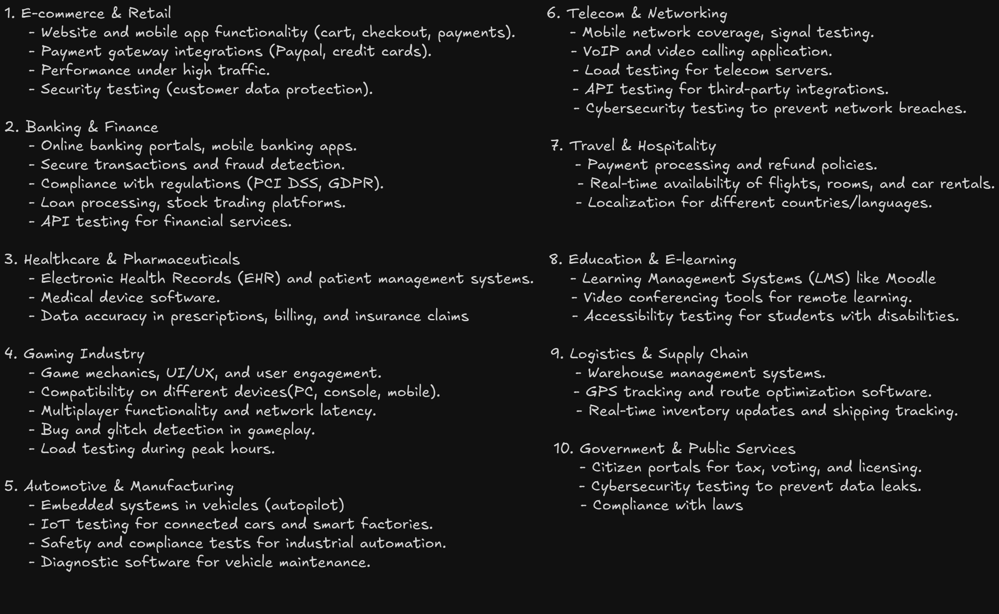
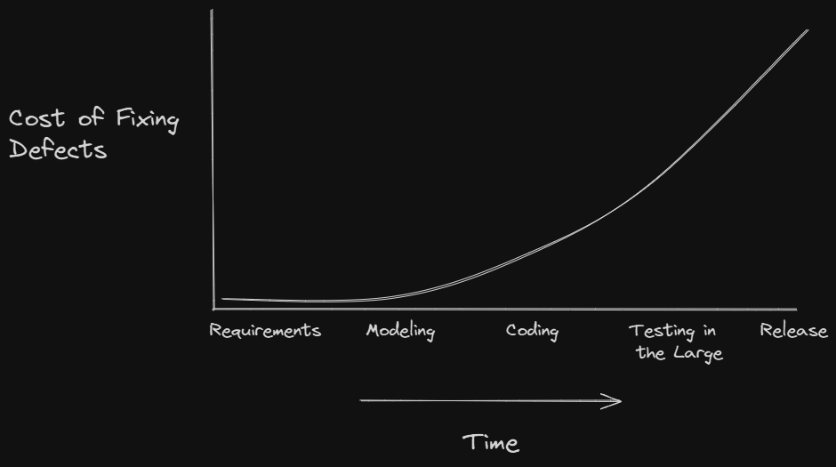

<!-- markdownlint-disable MD033 -->
# Content Of Table of the Fundamentals of Testing

- [What is Testing?](#what-is-testing)
- [Why Testing is Necessary?](#why-testing-is-necessary)
- [Test Roles](#test-roles)
- [QA vs QC](#qa-vs-qc)
- [Errors, Defects, Failures, and Root Causes](#errors-defects-failures-and-root-causes)
- [Testing and Debugging](#testing-and-debugging)
- [Independence of Testing](#independence-of-testing)
- [Whole Team Approach](#whole-team-approach)
- [Test Objectives](#test-objectives)
- [Principles of Testing](#principles-of-testing)
- [Test Activities](#test-activities)

## What is Testing?

**Explanation:**

Testing is a fundamental process in software development that ensures a product or application functions as expected. It involves validating and verifying that a product meets the specified requirements and is free of defects. Testing is not limited to software; it applies to any product or application.

    
Overview:

1. **Historical Context:** Initially, developers were responsible for both development and testing, leading to many defects. It was realized that having a separate testing team could improve quality.

2. **Human Psychology:** Humans are prone to errors and often cannot find all their mistakes. However, they are good at finding mistakes in others' work, justifying the need for independent testers.

3. **Misconceptions:** Testing is not just about writing and executing test cases. It involves reviewing work products, planning, managing, estimating, monitoring, and controlling the testing process.

4. **Product-Oriented Approach:** This approach focuses on the features and quality of the final product. The objective is to ensure that the product meets user needs and expectations.

5. **Process-Oriented Approach:** This approach emphasizes the processes and methodologies used to develop the product. The goal is to ensure efficient and standardized development processes.

6. **User-Oriented Approach:** This approach involves the end-users in the development process. The objective is to ensure that the product is user-friendly and meets actual user needs.

7. **Time-Oriented Approach:** This approach focuses on the speed of development. The goal is to ensure rapid delivery to meet tight deadlines or market demands.

8. **Rules-Oriented Approach:** This approach ensures compliance with specific rules, regulations, and standards. The objective is to ensure that the product and process meet legal and regulatory requirements.

9. **Scenario-Oriented Approach:** This approach tests and validates the product based on practical use cases and user interactions. The goal is to consider how users will interact with the product in various scenarios.

## Why Testing is Necessary?

**Explanation:**

Testing is necessary because it adds value to the overall success of a product. It starts at the beginning of the Software Development Life Cycle (SDLC) and continues throughout. Testing helps identify ambiguities, contradictions, inconsistencies, and omissions in the requirements during the requirement gathering phase.

## Test Roles

**Explanation:**

Test roles define the responsibilities and contributions of different individuals involved in the testing process.

    
Overview:

1. **Test Management:** Responsibility for the test process, and the test team. This role focuses on test planning, monitoring and control, and test completion. Activities include defining goals and objectives, determining the overall approach, timelines, resources, tools, and managing the test process.

2. **Test Engineer:** Responsibility for the Technical aspects of testing. This role focuses on test analysis, design, implementation, and execution. Activities include analyzing the test basis, writing test cases, preparing test data, setting up the environment, executing tests, and reporting defects.

3. **Role Flexibility:** In small organizations, one person can take on both test management and test engineer roles. In other organizations, responsibilities may vary based on project context, skills, and the structure of the company. Different people may take on these roles at different times, and it is possible for one person to handle multiple roles depending on the availability and context.

## QA vs QC

**Explanation:**

Quality Assurance (QA) and Quality Control (QC) are two aspects of quality management.

They serve different purposes and involve different activities:

- **Quality Assurance (QA):** Proactive process that focuses on preventing defects in the development process. QA is **process-oriented** and aims to improve and stabilize production and associated processes to avoid issues that lead to defects.

- **Quality Control (QC):** Reactive process that focuses on identifying defects in the final product. **product-oriented** and aims to identify and correct defects in the finished product before it reaches the customer.

## Errors, Defects, Failures, and Root Causes

**Explanation:**

These terms in the context of software testing to describe different aspects of problems that can occur during the development and operation of software.

    
Overview:

1. **Error:** An error, also known as a mistake, is a human action or decision that produces an incorrect or unexpected result.

2. **Defect:** A defect, also known as a bug, is a flaw in the system. It's the result of an error made by the creators of the app.

3. **Failure:** A failure is the result of defect during execution of the software.

4. **Root Cause:** The root cause is the deepest underlying cause of a defect or a failure.

## Testing and Debugging

**Explanation:**

Testing and debugging are two steps in the software development process that work together.

    
Overview:

1. **Testing:** The process of finding defects. It involves executing the product to identify any issues. Performed by testers to find defects.

2. **Debugging:** The process of analyzing and fixing defects. It involves root cause analysis and correcting the identified issues. Performed by developers to analyze and fix defects.

## Independence of Testing

**Explanation:**

Independence of testing refers to the concept where the testing of a software product is conducted by a person or a team that is separate and independent from the team that developed the software.

    
Overview:

1. **Objectivity:** Independent testing provides an objective view of the software, which helps in identifying defects that might be overlooked by the development team due to familiarity with the code.

2. **Bias Reduction:** Since the testing team is separate from the development team, it reduces the risk of bias and ensures a more thorough and impartial testing process.

3. **Specialized skills:** Independent testers often have specialized skills in testing methodologies and tools, which can contribute to a more effective testing process.

4. **Accountability:** Having a separate testing team holds the development team accountable for the quality of their work, as any defects found can be traced back to the development process.

5. **Degrees of Independence:**

    - **No Independence:** Work products are tested by their author. This means the developer who wrote the code also tests it.
    - **Peer Review:** Work products are tested by the author's peer from the same team. For example, one developer tests another developer's code.
    - **Separate Testing Team:** Testers from outside the author's team but within the same organization perform the testing. This is the most common practice today.
    - **External Testing:** Testers from outside the organization perform the testing. This is often seen in small-scale organizations that outsource testing to third-party organizations.

6. **Benefits and Drawbacks:**

    - **Benefits:**
        - Independent testers are likely to recognize different kinds of failures and defects compared to developers due to their different backgrounds and perspectives.
        - Independent testers can verify, challenge, or disapprove assumptions made by stakeholders during the specification and implementation of the system.

    - **Drawbacks:**
        - Independent testers may be isolated from the development team, leading to a lack of collaboration and understanding.
        - Developers may lose the sense of responsibility for quality if testing is entirely outsourced.
        - Independent testers may be seen as a bottleneck or blamed for delays in release.

7. **Best Practices:**

    - For most projects, it is best to carry out testing with multiple levels of independence. For example, developers can perform component and component integration testing, the test team can perform system and system integration testing, and business representatives can perform acceptance testing. This blended approach leverages the benefits of different degrees of independence while mitigating the drawbacks.

## Whole Team Approach

**Explanation:**

The whole team approach emphasizes collaboration and coordination among all team members to ensure quality throughout the software development lifecycle.

    
Overview:

1. **Collaboration:** Emphasizes the importance of collaboration and coordination among all team members (developers, testers, business representatives). This improves team dynamics, enhances communication, and creates synergy by leveraging various skill sets within the team.

2. **Shared Responsibility for Quality:** Quality is not just the responsibility of the testing team. Every team member, including developers and business representatives, is responsible for ensuring the product's quality.

3. **Collocation:** Team members share the same workspace, whether physical or virtual, to facilitate communication and interaction. This helps in reducing communication gaps and ensures better understanding among team members.

4. **Close Collaboration:** Testers work closely with other team members to ensure desired quality levels are achieved. This includes collaborating with business representatives to create suitable acceptance tests and working with developers to agree on test strategies and automation approaches.

5. **Knowledge Transfer:** Testers transfer testing knowledge to other team members, influencing the development of the product. They act as quality coaches, educating others about testing and quality practices.

6. **Limitations:** While the whole team approach has many benefits, it may not always be appropriate. In safety-critical situations, a high level of test independence may be needed to ensure unbiased testing.

## Test Objectives

**Explanation:**

Test objectives are the specific goals and purposes of testing. They guide testers to align with the overall project goals and ensure that the software meets the required standards and user expectations.

    
Overview:

1. **Evaluating Work Products:**
    - **Description:** Review requirements, user stories, design documents, and code to identify defects early in the development process.
    - **Purpose:** Catch defects early to reduce the cost and effort of fixing them later.

2. **Triggering Failures and Finding Defects:**
    - **Description:** Execute tests to intentionally trigger failures in the system under test.
    - **Purpose:** Identify defects that need to be fixed to improve software quality.

3. **Ensuring Required Coverage:**
    - **Description:** Achieve a certain level of coverage, which could be in terms of requirements, risk, functionality, or code.
    - **Purpose:** Ensure that all critical areas of the software are tested and validated.

4. **Reducing Risk of Inadequate Software Quality:**
    - **Description:** Conduct thorough testing to prevent major failures in the production environment.
    - **Purpose:** Minimize the risk of software defects affecting end-users.

5. **Verifying Requirements Fulfillment:**
    - **Description:** Confirm that the software meets the specified requirements and user needs.
    - **Purpose:** Ensure that the software delivers the expected functionality and performance.

6. **Regulatory Compliance:**
    - **Description:** Ensure that the software complies with regulatory requirements specific to the domain (healthcare, finance, automotive).
    - **Purpose:** Avoid legal and compliance issues by meeting industry standards and regulations.

7. **Providing Information to Stakeholders:**
    - **Description:** Communicate test results, progress, and any identified issues to stakeholders.
    - **Purpose:** Keep stakeholders informed to facilitate decision-making and project management.

8. **Building Confidence in Product Quality:**
    - **Description:** Conduct comprehensive testing to ensure the software meets quality standards.
    - **Purpose:** Increase confidence among stakeholders and users in the reliability and performance of the software.

9. **Validating Completeness and Functionality:**
    - **Description:** Ensure that the software is complete and functions correctly as intended.
    - **Purpose:** Verify that all features and functionalities are implemented and working as expected.

10. **Supporting Decision Making:**
    - **Description:** Provide detailed information about the software's quality and readiness for release.
    - **Purpose:** Help stakeholders make informed decisions about the release and deployment of the software.

11. **Improving Development Process:**
    - **Description:** Identify areas for improvement in the development and testing processes.
    - **Purpose:** Enhance overall software quality by refining processes and practices based on testing feedback.

## Principles of Testing

**Explanation:**

The principles of testing are fundamental guidelines that dictate what to test, how to test, and when to test, following a **rule-oriented approach**.

    
Overview:

1. **Testing shows presence of defects:** Testing can show that defects are present, but cannot prove that there are no defects. Testing reduces the probability of undiscovered defects remaining in the software but, even if no defects are found, it is not a proof of correctness.

2. **Exhaustive testing is impossible:** It's not possible to test all combinations of inputs, scenarios, and paths in the software. Instead, risk analysis, priorities, and techniques like boundary value analysis and equivalence partitioning are used to focus the testing effort.

3. **Early testing:** To find defects early, testing activities should start as early as possible in the software development lifecycle and should be focused on defined objectives.

    

4. **Defect clustering:** A small number of modules usually contain most of the defects discovered during pre-release testing, or are responsible for most of the operational failures. This is also known as the **Pareto principle**, or the 80-20 rule, which states that approximately 80% of the issues occur due to 20% of the modules.

5. **Pesticide paradox:** If the same tests are repeated over and over again, eventually they will no longer find new bugs. This is also known as **test wear out**. To overcome this, the test cases need to be regularly reviewed and revised, and new and different tests need to be written to exercise different parts of the software or system.

6. **Testing is context dependent:** Testing is done differently in different contexts. For example, Android application software is tested differently from an e-commerce site. The approach and techniques used should be appropriate for the specific context of the software being tested."

7. **Absence-of-errors fallacy:** If the system does not fulfill the users' needs and expectations, finding and fixing defects does not necessarily improve the system. A system that is 100% bug-free is not necessarily useful to the user. The ultimate goal of testing is to ensure that the software meets the requirements and provides value to the users.

## Test Activities

**Explanation:**

Test activities, also known as the test process, involve various tasks and processes to ensure a software product meets the required quality standards. Understanding these phases is crucial for testers to know their contributions, involvement, and the deliverables expected from each phase. The artifacts produced during these activities are collectively known as testware.

- **Artifacts:** These are individual pieces of documentation or tools created and used during the testing process. Examples include a single test case, a defect report, or a test plan. Each artifact serves a specific purpose and provides detailed information about a particular aspect of the testing process.

- **Testware:** This is a collective term that encompasses all the artifacts produced during the testing process. It includes all the documentation, scripts, inputs, expected results, setup and cleanup procedures, files, databases, environment configurations, and any other software or hardware used during testing. Testware ensures that testing is thorough, repeatable, and consistent.

    
Overview:

1. **Test Planning:** The phase where the testing lifecycle begins. This involves defining the test objectives. Depending on the context.

    - **Activities:**

        - Define goals and objectives of testing.
        - Determine the overall approach, timelines, resources, and tools.
        - Define entry and exit criteria.
        - Plan for monitoring and control.

    - **Deliverables (Artifacts):**

        - Test Plan
        - Test Schedule
        - Risk Register
        - Entry and Exit Criteria

2. **Test Monitoring and Control:** This involves the ongoing checking of all test activities and the comparison of actual progress against the plan.

    - **Activities:**

        - Monitor test progress.
        - Compare actual progress against the plan.
        - Document control directives(guidelines, policies, or instructions).
        - Update risk information.

    - **Deliverables (Artifacts):**

        - Test Progress Report
        - Control Directives
        - Updated Risk Information

3. **Test Analysis:** Analyzing the test basis to derive test cases.

    - **Activities:**

        - Identify testable features.
        - Define and prioritize test conditions (test scenarios).
        - Evaluate test basis and test objects to identify defects.
        - Use test techniques to identify test conditions.

    - **Deliverables (Artifacts):**

        - Prioritized Test Conditions
        - Defect Report regarding defects in the test basis

4. **Test Design:** It's involves test cases identifying other test artifacts.

    - **Activities:**

        - Write test cases and testware (test data, configurations).
        - Identify coverage items.
        - Define test data requirements, environment, and tools.

    - **Deliverables (Artifacts):**

        - Prioritized Test Cases
        - Test Charters
        - Test Data Requirements
        - Test Environment Requirements

5. **Test Implementation:** Preparing for test execution.

    - **Activities:**

        - Define test procedures(step-by-step instructions) and automation scripts.
        - Create test suites (collection of test cases).
        - Prioritize test procedures.
        - Set up and verify the test environment,  including the installation and configuration of tools.

    - **Deliverables (Artifacts):**

        - Test Procedures.
        - Automated Test Scripts.
        - Test Suites.
        - Test Data.
        - Execution Schedule.
        - Environment Elements (stubs, drivers, simulators, service virtualization).

6. **Test Execution:** Executing the test cases.

    - **Activities:**

        - Execute test cases and compare actual vs. expected results.
        - Report defects and track them for closure.
        - Perform retesting and regression testing.
        - Debugging and root cause analysis.

    - **Deliverables (Artifacts):**

        - Test Logs.
        - Defect Reports.

7. **Test Completion:** Test completion is the last step in the software testing life cycle, where we finalize all testing activities and document the results.

    - **Activities:**

        - Evaluate exit criteria.
        - Hand over the product to the business.
        - Document and archive test artifacts.
        - Gather lessons learned.
        - Prepare and share the test summary report.

    - **Deliverables (Artifacts):**

        - Test Completion Report
        - Action Items for Improvement
        - Documented Lessons Learned
        - Change Requests

