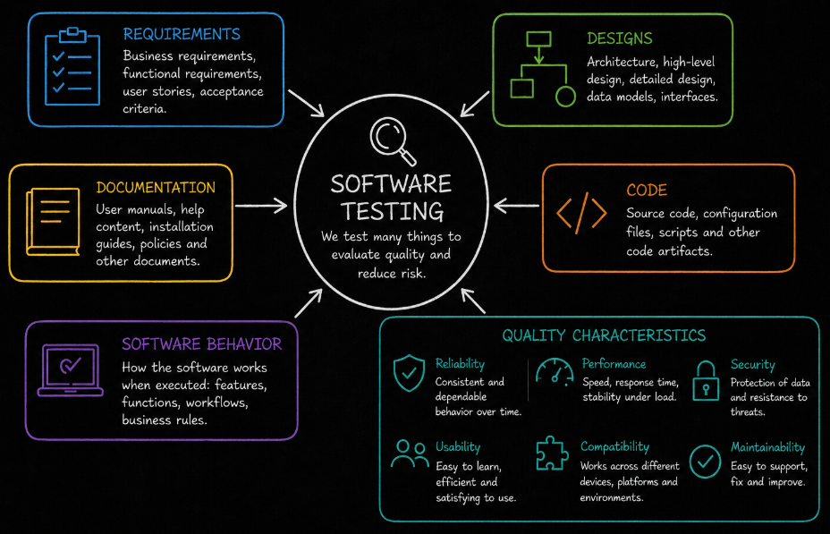
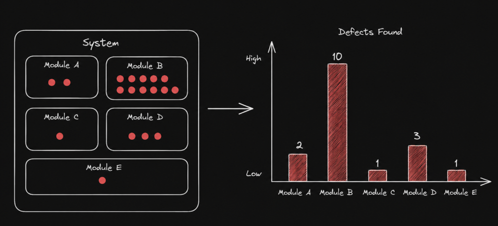
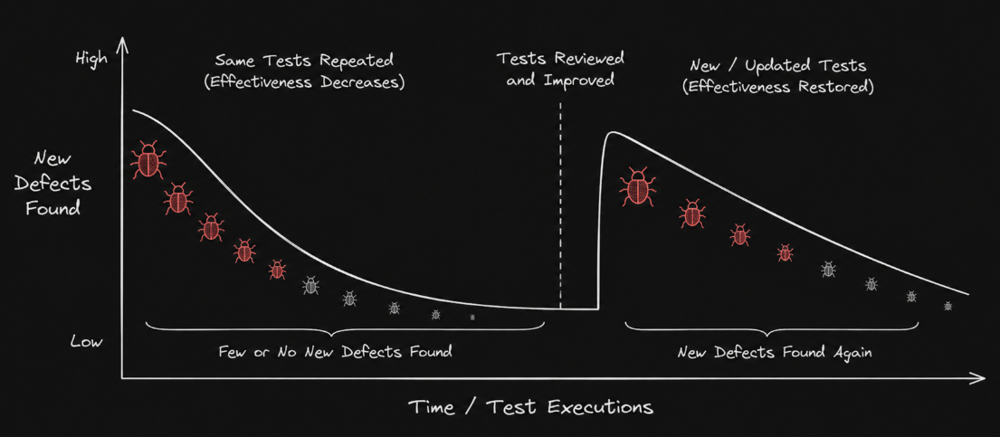

# Table of Contents: Fundamentals of Testing Level 1

- [What is Testing?](#what-is-testing)
- [Test Objectives](#test-objectives)
- [Testing and Debugging](#testing-and-debugging)
- [Errors, Defects, Failures, and Root Causes](#errors-defects-failures-and-root-causes)
- [Principles of Testing](#principles-of-testing)

**Fundamentals of Testing Level 1** introduces the core concepts needed to understand software testing. Before learning how testing is organized, how test cases are designed, or how testing fits into a development team, it is important to understand **what testing is**, **why we test** and **how problems in software are described**.

In this level, we begin with the meaning and purpose of testing together with the concepts of **verification**, **validation**, and **reliability**. We then explore the main **test objectives** and distinguish **testing** from **debugging**. After that, we introduce the relationship between **errors**, **defects**, **failures**, and **root causes**. Finally, we cover the fundamental **principles of testing** that influence how testers think and make testing decisions.

## What is Testing?

Software testing is a set of activities used to **evaluate software and related work products** and determine whether they meet specified requirements and stakeholder expectations. Testing helps teams discover problems, assess quality, reduce risk, and build confidence that a product is suitable for its intended purpose.

Testing is not only about checking whether individual features work. A product can behave correctly in individual situations and still have problems with usability, reliability, performance, security, compatibility, or other important quality characteristics. Testing therefore looks at the product from different perspectives depending on its purpose and risks.

Two important concepts closely connected to testing are **verification** and **validation**.

**Verification** focuses on whether the product has been built correctly according to specified requirements, designs, and other expectations. It can involve reviewing requirements, designs, code and other work products to identify inconsistencies or defects.

**Validation** focuses on whether the right product has been built for its intended users and purpose. A system may satisfy its written requirements but still fail to solve the actual problem or provide the value users expect.

Testing also contributes to **reliability**. Reliability describes the ability of a system to perform its required functions consistently under specified conditions for a specified period of time. Testing can provide information about reliability, although testing alone cannot guarantee that a system will never fail.

Testing includes more than executing test cases. It can involve activities such as analyzing what needs to be tested, designing tests, preparing test data, executing tests, evaluating results and communicating information about product quality. These activities will be explored in more detail in later levels.

Testing can involve both **static testing** and **dynamic testing**.

**Static testing** evaluates work products without executing the software. Examples include reviewing requirements, designs, documentation and source code.

**Dynamic testing** evaluates software by executing it and observing its behavior.

Both contribute to finding problems and providing information about quality. Testing ultimately helps stakeholders make better decisions by providing information about the product and reducing uncertainty about its quality.

Understanding what testing is leads to an important question. We also need to understand **what we are trying to achieve through testing**. These purposes are described through test objectives.

## Test Objectives

Test objectives describe **what testing is intended to achieve**. The specific objectives can vary depending on the product, project stage, risks, and development approach, but several objectives are common across software projects.

One important objective is **evaluating work products**. Requirements, user stories, designs, code and other work products can be examined to identify defects, inconsistencies, ambiguities and missing information as early as possible.

Another objective is **triggering failures and finding defects**. By executing software under different conditions, testing can expose failures that provide evidence of underlying defects.

Testing also helps achieve **required coverage**. Since it is impossible to test every possible situation, teams identify important areas, conditions and risks that need sufficient testing.

Another major objective is **reducing risk**. Testing provides information about potential problems and helps reduce the likelihood and impact of failures occurring during operation.

Testing also helps determine whether **requirements have been satisfied** and whether the product meets stakeholder expectations. This provides information that supports decisions about whether the software is ready for its intended use or release.

Testing can therefore serve several purposes at the same time. It can discover problems, prevent defects through early evaluation, provide information about quality, reduce risk, and build confidence in the product.

Once the objectives of testing are clear, it becomes easier to distinguish testing from another closely related activity called **debugging**.

## Testing and Debugging

Testing and debugging are closely connected activities, but they have different purposes.

**Testing** evaluates software and work products to discover defects, trigger failures, assess quality and provide information about the system. When dynamic testing exposes unexpected behavior, the observed failure can be investigated further.

**Debugging** is the activity of finding the cause of a defect, analyzing why the problem occurred and correcting it. After a change is made, additional testing is normally performed to confirm that the original problem has been resolved and that the change has not introduced unwanted effects elsewhere.

Testing therefore helps **reveal and evaluate problems**, while debugging focuses on **locating their causes and correcting them**.

These responsibilities are not necessarily restricted to particular job titles. Depending on the team and development approach, developers, testers and other team members can contribute to testing activities, while debugging is usually closely connected to development and code correction.

To understand how problems move from human actions to observable software behavior, we need to distinguish between **errors**, **defects**, **failures**, and their **root causes**.

## Errors, Defects, Failures, and Root Causes

Errors, defects, failures, and root causes are related concepts, but they describe different parts of how problems are introduced and observed in software.

An **error**, also called a mistake, is a human action that produces an incorrect result.

A **defect**, commonly called a bug, is an imperfection or flaw in a work product. A defect can exist in requirements, designs, code, documentation or other artifacts. Defects are often introduced as a result of human errors.

A **failure** occurs when a system or component does not perform a required function within specified limits during execution. A defect can cause a failure when the relevant part of the software is executed under particular conditions.

A **root cause** is a fundamental reason why a problem occurred. Identifying root causes helps teams understand not only what went wrong, but also why it happened and what could be changed to reduce the chance of similar problems occurring again.

These concepts can often be understood as a relationship in which a human **error** may introduce a **defect**, and under certain conditions that defect may result in an observable **failure**. Root cause analysis investigates deeper to understand why the error, defect or failure occurred.

Not every defect causes a failure every time the software runs. A defect may remain hidden until particular inputs, system states, configurations or environmental conditions cause it to affect the system.

Understanding this terminology gives us the vocabulary needed to discuss software problems accurately. The next step is understanding the fundamental principles that guide how testing is approached.

## Principles of Testing

Testing is guided by several fundamental principles. These principles help explain the limitations of testing and support better decisions about where and how testing effort should be applied.

**Testing shows the presence of defects, not their absence** Testing can demonstrate that defects exist by exposing failures or identifying problems in work products. However, finding no defects during testing does not prove that the software contains no defects. Testing reduces uncertainty but cannot establish absolute correctness.

**Exhaustive testing is impossible** Testing every possible combination of inputs, conditions, configurations, and execution paths is usually impossible except for very simple systems. Testing effort must therefore be prioritized based on factors such as **risk**, **importance**, and available resources.

**Early testing saves time and effort** Testing activities should begin as early as possible. Reviewing requirements, designs, and other work products early can identify problems before they propagate into later stages of development, where they may require significantly more effort to correct.

**Defect clustering** means that defects are often distributed unevenly throughout a system. A relatively small number of components may contain a large proportion of the discovered defects or be responsible for many operational failures.

This idea is often associated with the **Pareto principle**, also known as the **80/20 rule**, which illustrates that a large proportion of problems may come from a relatively small proportion of the system. The 80/20 relationship should not be treated as an exact rule because the actual distribution depends on the product and context.

Understanding where defects tend to cluster can help teams focus additional testing on areas with higher defect concentration and risk.

**Pesticide paradox** Repeatedly executing the same tests may eventually stop revealing new defects. Existing tests should therefore be reviewed and updated and new tests may need to be added as the software, risks, and understanding of the product change.

**Testing is context dependent** There is no single testing approach that is appropriate for every product. Testing for an online store, mobile game, banking platform or safety critical system will differ because each has different users, technologies, risks, requirements.

**Absence of errors is a fallacy** Finding and fixing many defects does not guarantee that a product will be successful. Software that technically works may still fail if it does not satisfy user needs, solve the intended problem or support application objectives. Both **verification** and **validation** are therefore important when evaluating quality.

These principles form the foundation for how we think about testing. They remind us that testing has limitations, that priorities matter, and that quality cannot be determined simply by counting defects or executing more tests.

**Fundamentals of Testing Level 1** establishes the basic testing mindset and terminology. We now understand **what testing is**, **what objectives it supports**, **how testing differs from debugging**, **how errors can lead to defects and failures** and **which principles guide effective testing**.

With these fundamentals in place, we are ready to move from understanding **why testing matters** to understanding **how testing is organized and performed in practice**. **Fundamentals of Testing Level 2** continues with the **test process**, **test activities** and **test roles** that structure testing work throughout a project.
