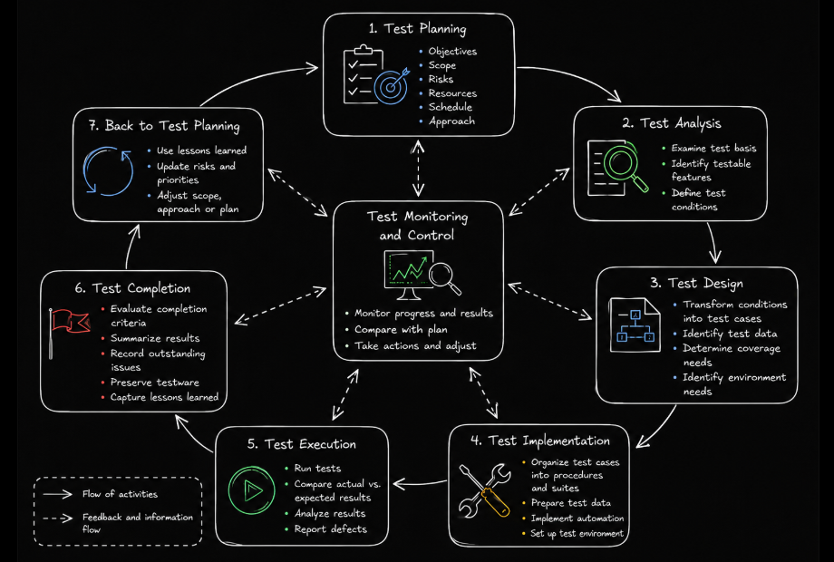
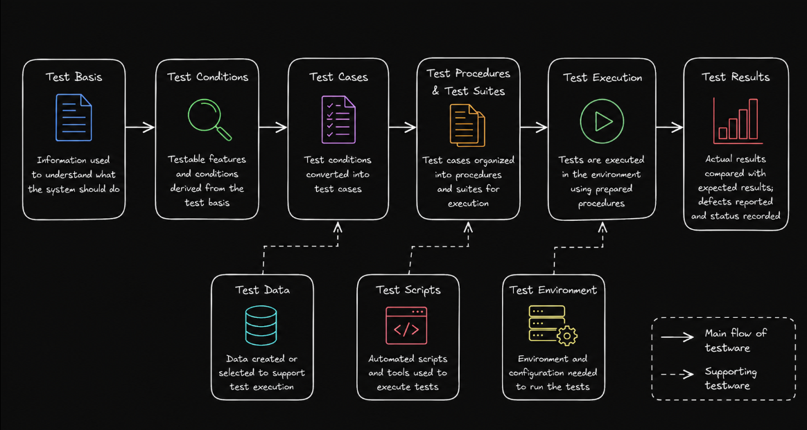

# Table of Contents: Fundamentals of Testing Level 2

- [Test Process](#test-process)
- [Test Activities](#test-activities)
- [Test Roles](#test-roles)

**Fundamentals of Testing Level 2** builds on the core concepts introduced in Level 1 and moves from understanding **why testing matters** to understanding **how testing work is organized and performed**.

In this level, we explore the **test process** and the main activities that support testing from initial planning through completion. We then look more closely at the **testware and deliverables** produced during these activities. Finally, we introduce **test roles** and how testing responsibilities can be distributed among people within a project or team.

## Test Process

The **test process** provides a structured way to organize testing work. It consists of interconnected activities that help teams plan testing, identify what needs to be tested, prepare and execute tests, evaluate results and complete testing work.

A test process is not necessarily a rigid sequence in which one activity must finish before another begins. Depending on the development approach and project context, activities can **overlap**, **repeat** and provide feedback to one another.

The main test process activities include **test planning**, **test monitoring and control**, **test analysis**, **test design**, **test implementation**, **test execution** and **test completion**.

As introduced in **Fundamentals of Testing Level 1**, testing can involve both **static** and **dynamic testing**. Static testing can be applied to work products without executing the software, while dynamic testing involves executing the software. Both can contribute to the test process depending on the testing objectives and context.

**Test planning** establishes what testing aims to achieve and how the testing work will be approached. It considers areas such as **objectives**, **scope**, **risks**, **resources**, **schedule** and the overall testing approach.

**Test monitoring and control** evaluates how testing is progressing compared with the plan. Monitoring collects information about progress and results, while control uses that information to determine whether changes or corrective actions are needed.

**Test analysis** focuses on determining **what needs to be tested**. Testers examine the **test basis**, which is the information and source material used to understand what the system should do and to derive tests. The test basis may include **requirements**, **user stories**, **designs**, **acceptance criteria** and other relevant work products. From this information, testers identify **testable features** and define **test conditions**.

**Test design** determines **how the identified test conditions will be tested**. Test conditions are transformed into test cases and other testware, while required **test data**, coverage needs and environment requirements are identified.

**Test implementation** prepares everything required for test execution. Test cases may be organized into **test procedures** and **test suites**, test data is prepared, automated tests may be implemented and the required test environment is made ready.

**Test execution** involves running tests and comparing **actual results** with **expected results**. Test outcomes are recorded, unexpected behavior is analyzed and defects are reported when appropriate.

**Test completion** takes place when testing for a particular objective, iteration, release or project is concluded based on the defined **completion criteria** and the current testing results. Results are summarized, useful testware can be preserved for future use, unresolved issues are documented and lessons learned can contribute to future testing work.

For example, consider a team preparing to test a new **login feature**.

During **test planning**, the team defines the scope, priorities, resources and testing approach for the feature.

During **test analysis**, the team examines the requirements and identifies test conditions such as successful login, incorrect passwords and locked accounts.

During **test design**, these conditions are developed into test cases with appropriate inputs and expected results.

During **test implementation**, the test cases are organized for execution, required test data is prepared and the test environment is made ready.

During **test execution**, the tests are performed and actual results are compared with expected results. If a locked user is still able to sign in, the unexpected behavior is investigated and a defect may be reported.

During **test completion**, the team summarizes the testing results, records outstanding issues and preserves useful testware for future testing.

Throughout these activities, **test monitoring and control** helps the team track progress, evaluate results and adjust the testing work when necessary.

This example shows how the test process activities work together rather than as completely separate steps. The exact way they are performed depends on the **development lifecycle**, **project context**, **risks** and needs of the team.

Understanding the overall process gives us the structure of testing work. We can now look more closely at the activities themselves and the **testware and deliverables** they produce.

## Test Activities

Test activities turn the test process into practical testing work. Each activity contains specific tasks and produces information or materials that support testing and project decisions.

The work products created or used during testing are often referred to as **testware**. Testware can include **test conditions**, **test cases**, **test procedures**, **test suites**, **test data**, **test scripts**, **test results** and other materials that support testing.

Some testing work products also become formal **deliverables**. Deliverables are outputs that are formally communicated or provided to stakeholders. Examples include a **test plan**, **test progress report** and **test completion report**.

Different types of testware are created and used as testing progresses.

During **test planning**, the team establishes the testing approach, objectives, resources, schedule and other information needed to guide testing.

During **test monitoring and control**, information about testing progress, results, risks and deviations from the plan is collected and evaluated. When necessary, actions are taken to keep testing aligned with its objectives.

During **test analysis**, the test basis is examined to identify testable features and define **test conditions**. A test condition represents an aspect of the system that can be tested, such as a feature, requirement, application rule or specific behavior. Risks and priorities help determine where testing effort should be focused.

During **test design**, test conditions are developed into **test cases**. A test case describes a particular situation to be tested and defines the information needed to verify the expected behavior. Required test data, coverage and environment needs are also identified.

During **test implementation**, test cases are prepared and organized for execution. **Test procedures** define how one or more test cases are performed, while **test suites** group related tests for a particular testing purpose. Test data and automated test scripts may also be prepared, and the test environment is made ready.

During **test execution**, tests are performed and their results are recorded. Actual and expected results are compared, unexpected outcomes are investigated and defects are reported when necessary.

During **test completion**, testing information is consolidated and evaluated. Useful testware can be preserved for future use, outstanding issues are recorded and relevant results are communicated to stakeholders.

Although these activities have different purposes, they are interconnected. Information discovered during one activity can influence another. For example, test execution may reveal a new risk that requires additional analysis, test design and implementation.

Understanding these activities shows how testing work progresses from identifying **what needs to be tested** to preparing tests, executing them and evaluating the results. The next step is understanding **who is responsible for this work** and how testing responsibilities can be distributed within a team.

## Test Roles

Test roles describe responsibilities associated with testing rather than fixed job titles. The way these responsibilities are distributed depends on the organization, development approach, project context and skills available within the team.

Testing responsibilities can broadly be viewed from two perspectives, **test management** and **testing**.

**Test management** focuses on responsibility for the overall test process. Typical responsibilities include **test planning**, **test monitoring and control**, and **test completion**. This work can involve defining test objectives, selecting an appropriate testing approach, estimating effort, coordinating resources, monitoring progress, managing risks and communicating testing information to stakeholders.

The **testing role** focuses primarily on the technical activities involved in evaluating the product. Typical responsibilities include **test analysis**, **test design**, **test implementation** and **test execution**. This work can involve analyzing the test basis, identifying test conditions, designing test cases, preparing test data, configuring environments, executing tests, evaluating results and reporting defects.

These roles do not necessarily correspond to separate people. One person may perform responsibilities from both roles, particularly in smaller teams. In larger organizations, responsibilities may be distributed among several specialists.

Testing responsibilities are also not limited to people with the word **tester** in their job title. Developers, business analysts, product specialists, users and other stakeholders may participate in different testing activities depending on the project and development approach.

The important distinction is therefore not simply **who has a particular job title**, but **who is responsible for each testing activity and whether the team has the knowledge and skills required to perform it effectively**.

**Fundamentals of Testing Level 2** builds on the testing mindset from Level 1 by showing how testing work is structured and carried out. Now we understand the **test process**, the **activities and testware involved in testing** and the **roles and responsibilities that support this work**.

With this structure in place, we are ready to look beyond individual testing activities and understand **how quality responsibility is organized across a team**. **Fundamentals of Testing Level 3** continues with **QA and QC**, **independence of testing** and the **whole team approach** that showing how different perspectives and levels of collaboration contribute to product quality.
