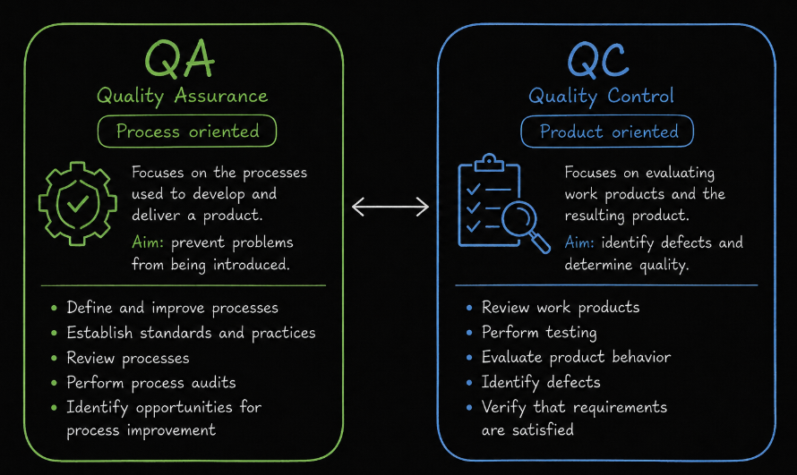
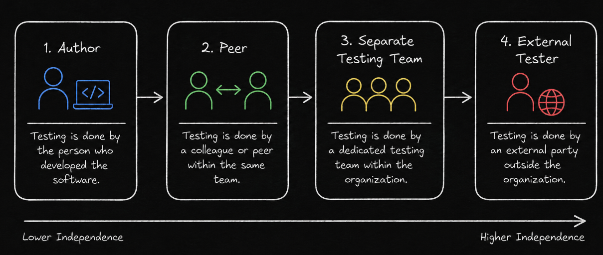
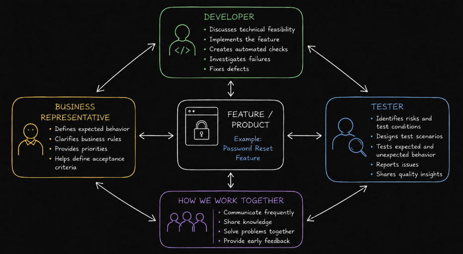

# Table of Contents: Fundamentals of Testing Level 3

- [QA vs QC](#qa-vs-qc)
- [Independence of Testing](#independence-of-testing)
- [Whole Team Approach](#whole-team-approach)

**Fundamentals of Testing Level 3** builds on the test process, activities and roles introduced in Level 2 and moves toward understanding **how quality responsibility is organized across a development team**.

In this level, we distinguish between **Quality Assurance** and **Quality Control** and examine how each contributes to quality from a different perspective. We then explore **independence of testing** and how different levels of independence can influence objectivity and defect detection. Finally, we introduce the **whole team approach**, where quality becomes a shared responsibility supported by collaboration, communication, and knowledge sharing.

## QA vs QC

**Quality Assurance**, commonly referred to as **QA**, and **Quality Control**, commonly referred to as **QC**, are related parts of quality management. They contribute to the same overall goal of achieving an appropriate level of quality, but they focus on different aspects of the work.

**Quality Assurance** is primarily **process oriented**. It focuses on establishing, evaluating, and improving the processes used to develop and deliver a product. The aim is to increase confidence that appropriate processes are being followed and to help prevent problems from being introduced.

Examples of QA activities can include defining development and testing practices, reviewing processes, establishing standards, performing audits, and identifying opportunities for process improvement.

**Quality Control** is primarily **product oriented**. It focuses on evaluating work products and the resulting product to identify defects and determine whether quality requirements have been satisfied.

Testing is an important form of quality control because it provides information about the quality of software and related work products. QC is not limited to checking only the final product. It can take place throughout development whenever work products are evaluated.

QA and QC therefore support quality from different perspectives. **QA focuses on the processes used to create the product**, while **QC focuses on evaluating the product and related work products**. Both can contribute to defect prevention, defect detection, risk reduction and continuous improvement.

Understanding these different perspectives also raises an important question about **who performs testing**. The relationship between the people who create a work product and the people who test it can influence objectivity, which leads to the concept of independence of testing.

## Independence of Testing

**Independence of testing** describes the degree of separation between the person performing testing and the person who created the work product being tested.

People who create software can and should test their own work. However, familiarity with the implementation and the assumptions used while creating it can make certain problems more difficult to recognize. A different person may approach the same product with different assumptions, experience, and perspectives.

Testing can therefore be performed with different levels of independence.

The **author** of a work product can test their own work. This provides little independence but allows rapid feedback and makes use of the author's detailed knowledge.

A **peer or another team member** can perform testing. This introduces additional independence while maintaining close collaboration with the development team.

A **separate testing function or team** within the organization can provide a higher level of independence and a different perspective on the product.

In some contexts, testing may be performed by **external testers or organizations** that are independent from the development organization. This can provide a high degree of independence and may be required in certain regulated or safety critical environments.

Greater independence can provide benefits. Independent testers may be more likely to **challenge assumptions**, identify different types of defects and evaluate the product from perspectives that differ from those of its creators.

Independence can also introduce challenges. Strong separation between developers and testers can create communication barriers, slow feedback, encourage an unhealthy division between development and testing or lead developers to believe that quality belongs only to testers.

The appropriate level of independence therefore depends on **project context**, **risk**, **development approach** and any applicable regulatory requirements. Independence and collaboration do not have to oppose each other. Teams can maintain an appropriate level of objectivity while still working closely together.

This balance becomes especially important in modern development environments, where quality is increasingly treated as a responsibility shared across the entire team.

## Whole Team Approach

The **whole team approach** means that team members share responsibility for quality and work together to achieve the desired level of product quality.

Quality is not considered the responsibility of testers alone. **Developers**, **testers**, **business representatives**, **product specialists** and other team members can contribute their knowledge throughout development.

Different team members contribute in different ways. Developers bring detailed technical knowledge and can create automated checks, perform testing, investigate failures and correct defects. Testers contribute testing expertise, risk awareness, critical thinking, and knowledge of testing techniques. Business representatives and product specialists contribute knowledge about user needs, business rules, priorities and expected product behavior.

Collaboration allows these perspectives to be combined. Requirements and acceptance criteria can be discussed before implementation, potential risks can be identified earlier, and questions about expected behavior can be resolved before they become expensive problems.

The whole team approach also encourages **knowledge sharing**. Testers can help other team members improve their testing skills, while developers and business specialists can help testers build stronger technical and domain knowledge. This strengthens the overall quality capability of the team.

Close collaboration can happen in the same physical location or through effective virtual communication. The important factor is not physical proximity itself, but the ability to communicate frequently, share information and solve problems together.

Shared responsibility does not mean that every team member performs exactly the same work. People still have different skills, responsibilities, and areas of expertise. Instead, the whole team contributes to quality while specialists provide deeper knowledge where it is needed.

The whole team approach also does not eliminate the need for **independent testing**. Some projects, particularly those involving high risk, regulation or safety critical systems, may require greater independence. The appropriate balance between collaboration and independence depends on the context.

**Fundamentals of Testing Level 3** completes the progression from understanding testing concepts to understanding how quality work fits within a team. We now understand the distinction between **QA and QC**, how **testing independence** can provide additional objectivity and how the **whole team approach** makes quality a shared responsibility.

Together, the three Fundamentals of Testing levels establish a foundation for further QA topics. They connect the **purpose and principles of testing**, the **process and activities used to perform testing**, and the **people and quality responsibilities that support effective testing in practice**.
