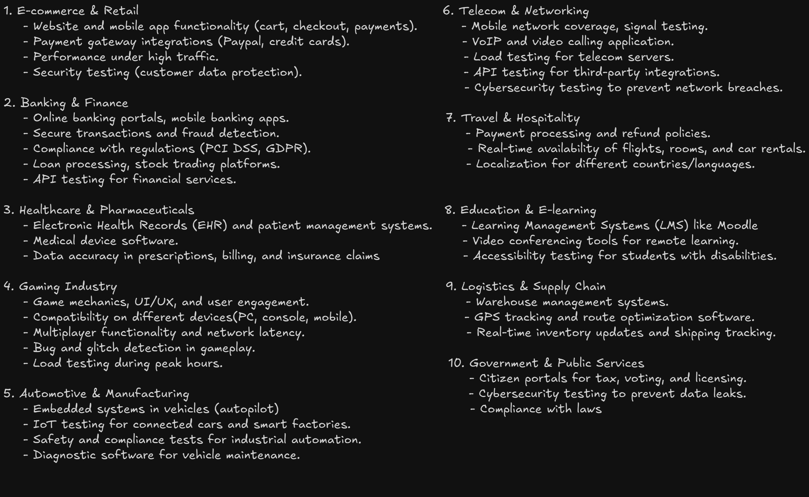
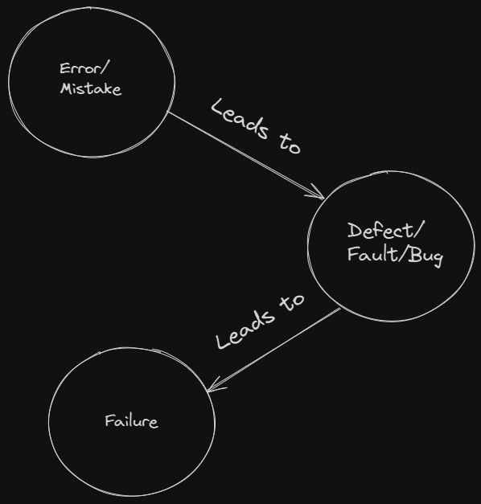
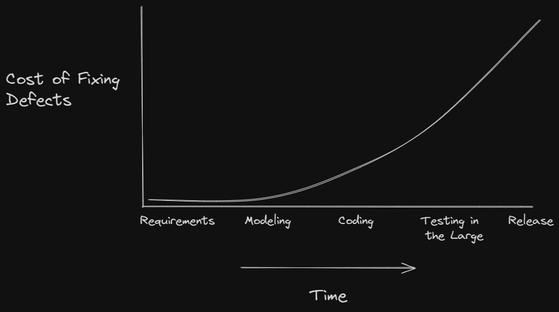

<!-- markdownlint-disable MD033 -->
# Content Of Table of the Fundamentals of Testing

- [What is Testing?](#what-is-testing)
- [Test Objectives](#test-objectives)
- [Testing and Debugging](#testing-and-debugging)
- [Errors, Defects, Failures, and Root Causes](#errors-defects-failures-and-root-causes)
- [Principles of Testing](#principles-of-testing)
- [Test Process](#test-process)
- [Test Activities](#test-activities)
- [Test Roles](#test-roles)
- [QA vs QC](#qa-vs-qc)
- [Independence of Testing](#independence-of-testing)
- [Whole Team Approach](#whole-team-approach)

## What is Testing?

**Explanation:**

Testing is a process in software development that checks if a product or application works as required. It confirms that the product does what it is supposed to do without mistakes and meets quality standards. In short, testing makes sure every feature works as planned and performs well. This process applies not only to software but also to any product or system that needs to work reliably.

    
Overview:

1. **Verification:** Checking if the product is built correctly. It means reviewing work and ensuring that each part follows the design and requirements.

2. **Validation:** This step confirms that the product does what users need. It's about making sure the product is the right fit for its use.

3. **Reliability:** This ensures that the product works well every time it is used. Performs as expected, even under different conditions.

4. **Scope of Testing:** Testing isn’t limited to executing test cases or running software it includes planning, managing, monitoring, and controlling the testing process (product-oriented, process-oriented, user-oriented, time-oriented, rules-oriented, and scenario-oriented approaches).

5. **Types of Testing:** Testing activities can be either dynamic (executing the software) or static (reviewing code and documentation).

6. **Why Testing is Necessary?:** Software testing reduces the risk of failures in operation, ensuring that every feature works as planned and meets stakeholder expectations.

7. **What can we test?:**

    

## Test Objectives

**Explanation:**

Test objectives are the specific goals and purposes of testing. They guide testers to align with the overall project goals and ensure that the software meets the required standards and user expectations.

    
Overview:

1. **Evaluating Work Products:** Review requirements, designs, and code to catch issues early.

2. **Triggering Failures and Finding Defects:** Trigger failures during tests to identify and fix defects.

3. **Ensuring Required Coverage:** Confirm that all critical parts of the software are tested.

4. **Reducing Risk:** Lower the risk of defects affecting production quality.

5. **Verifying Requirements:** Ensure the software meets specified requirements and user expectations.

## Testing and Debugging

**Explanation:**

Testing and debugging are two steps in the software development process that work together.

    
Overview:

1. **Testing:** The process of finding defects. It involves executing the product to identify any issues. Performed by testers to find defects.

2. **Debugging:** The process of analyzing and fixing defects. It involves root cause analysis and correcting the identified issues. Performed by developers to analyze and fix defects.

## QA vs QC

**Explanation:**

Quality Assurance (QA) and Quality Control (QC) are two aspects of quality management.

- **Quality Assurance (QA):** Proactive process that focuses on preventing defects in the development process. QA is **process-oriented** and aims to improve and stabilize production and associated processes to avoid issues that lead to defects.

- **Quality Control (QC):** Reactive process that focuses on identifying defects in the final product. **product-oriented** and aims to identify and correct defects in the finished product before it reaches the customer.

## Errors, Defects, Failures, and Root Causes

**Explanation:**

These terms in the context of software testing to describe different aspects of problems that can occur during the development and operation of software.

    
Overview:

1. **Error:** An error, also known as a mistake, is a human action or decision that produces an incorrect or unexpected result.

2. **Defect:** A defect, also known as a bug, is a flaw in the system. It's the result of an error made by the creators of the app.

3. **Failure:** A failure is the result of defect during execution of the software.

4. **Root Cause:** The root cause is the deepest underlying cause of a defect or a failure.

## Principles of Testing

**Explanation:**

The principles of testing are fundamental guidelines that dictate what to test, how to test, and when to test, following a **rule-oriented approach**.

    
Overview:

1. **Testing shows presence of defects:**
    - Testing can reveal the existence of defects but cannot guarantee that all defects have been found.
    - Even if no issues are detected, it does not prove that the software is completely correct.

2. **Exhaustive testing is impossible:**
    - It is impractical to test every possible input, scenario, or execution path.
    - Instead, testing efforts focus on the most critical areas using techniques such as risk analysis, boundary value analysis, and equivalence partitioning.

3. **Early testing:**
    - Starting testing activities as early as possible in the development cycle helps catch defects sooner.
    - Early defect detection reduces the cost and impact of later, more extensive rework.

    

4. **Defect clustering (Pareto Principle):**
    - A small number of modules or components often contain the majority of the defects.
    - For example, roughly 80% of problems may be found in 20% of the modules, highlighting where risk-based testing should concentrate.

5. **Pesticide paradox (Tests Wear Out):**
    - Repeating the same set of test cases over time may lead them to lose effectiveness in detecting new defects.
    - Regularly reviewing, updating, and adding new tests is essential to keep the test suite fresh and relevant.

6. **Testing is context dependent:**
    - Different types of software (mobile apps, e-commerce sites, embedded systems) require different testing approaches and techniques.
    - The testing strategy should be tailored to the specific characteristics and risks of the project.

7. **Absence-of-errors fallacy:**
    - A defect-free system is not automatically a useful or successful system.
    - Even with all detected defects fixed, the software must also meet users needs and deliver business value. Validation ensuring the right product is built is as important as verification.

## Test Process

**Explanation:**

The test process is a structured approach that covers all activities from planning through closure. It ensures that testing is aligned with project objectives, risks are managed, and the final product is validated against its requirements.

    
Overview:

1. **Test Planning:** Define objectives, choose an approach, schedule resources, and set entry/exit criteria.

2. **Test Monitoring and Control:** Continuously track progress against the plan, adjust as needed, and update risks.

3. **Test Analysis:** Examine the documentation—the test basis (requirements, designs, user stories)—to identify what features or conditions need testing.

4. **Test Design:** Develop test cases and related artifacts such as test data and test charters.

5. **Test Implementation:** Build or acquire the test artifacts needed for execution, including test procedures (step-by-step instructions), automation scripts, and setting up the test environment.

6. **Test Execution:** Run tests, compare actual and expected results, log outcomes, and report defects.

7. **Test Completion:** inalize testing activities by reviewing exit criteria, archiving test artifacts, and documenting lessons learned.

## Test Activities

**Explanation:**

Test activities, often referred to as the test process, involve a series of tasks to ensure that a software product meets its quality standards. Throughout these activities, various tangible outputs are produced.

- **Artifact:** These are the individual pieces of documentation or tools created during the testing process. The raw outputs produced during testing (test cases, scripts, data, logs).

- **Testware (Test Artifacts):** This encompasses all technical outputs created or used during testing such as test cases, scripts, logs, configuration files, and tools that help ensure testing is complete, can be easily repeated, and produces consistent results.

- **Deliverables:** A subset of artifacts, deliverables are formally provided to stakeholders (Test Plan, Test Summary Report, Test Closure Report). These documents convey testing status, results, and insights.

    
Overview:

- **Test Planning:** Define test objectives, select an appropriate approach, establish timelines, resources, and criteria (entry/exit). This sets the stage for all subsequent test activities.

- **Test Monitoring and Control:** Continuously review test progress against the plan and make adjustments as necessary. Activities here include tracking progress, issuing control directives, and updating risk information.

- **Test Analysis:** Analyze the test basis to identify testable features, derive test conditions, and assess potential risks and defects. This stage answers the question: "What should we test?"

- **Test Design:** Elaborate the test conditions into detailed test cases and other supporting testware (test charters). It involves defining required test data, environment configurations, and applying appropriate test techniques — essentially answering “How to test?”

- **Test Implementation:** Create or acquire the necessary testware, including writing test procedures and scripts, assembling test suites, and setting up the test environment to prepare for execution.

- **Test Execution:** Carry out the test cases (either manually or automated), compare actual results with expected results, log test outcomes, and report any anomalies and defects.

- **Test Completion:** Conclude test activities at project milestones by evaluating exit criteria, archiving useful testware, and producing a Test Completion Report that includes lessons learned and recommendations for future improvements.

## Test Roles

**Explanation:**

Test roles define the responsibilities and contributions of different individuals involved in the testing process.

    
Overview:

1. **Test Management:** Responsibility for the test process, and the test team. This role focuses on test planning, monitoring and control, and test completion. Activities include defining goals and objectives, determining the overall approach, timelines, resources, tools, and managing the test process.

2. **Test Engineer:** Responsibility for the Technical aspects of testing. This role focuses on test analysis, design, implementation, and execution. Activities include analyzing the test basis, writing test cases, preparing test data, setting up the environment, executing tests, and reporting defects.

3. **Role Flexibility:** In small organizations, one person can take on both test management and test engineer roles. In other organizations, responsibilities may vary based on project context, skills, and the structure of the company. Different people may take on these roles at different times, and it is possible for one person to handle multiple roles depending on the availability and context.

## Whole Team Approach

**Explanation:**

The whole team approach means that everyone on the team developers, testers, and business representatives is responsible for quality. The team works in a shared space (physical or virtual), which improves communication and collaboration.

    
Overview:

1. **Collaboration:** All team members work together closely, sharing information and responsibilities.

2. **Shared Responsibility for Quality:** Quality is everyones job, not just the testers. For example, developers help define tests and fix defects, while testers offer insights into improving the product.

3. **Co-location:** Working in the same space (or virtually closely) helps reduce misunderstandings and speeds up problem solving.

4. **Knowledge Transfer:** Testers pass on testing knowledge to developers and other team members, improving overall quality.

5. **Context Matters:** In some cases (such as safety-critical systems), a higher level of test independence may be required.

## Independence of Testing

**Explanation:**

Independence of testing means that testing is performed by individuals or teams separate from those who developed the software. This helps to reduce bias and increases the chances of finding defects.

    
Overview:

1. **Objectivity:** Independent testers bring a fresh perspective, likely identifying defects that developers might overlook because of familiarity.

2. **Degrees of Independence:**

    - **No Independence:** Work products are tested by their author. This means the developer who wrote the code also tests it.
    - **Peer Review:** Work products are tested by the authors peer from the same team. For example, one developer tests another developers code.
    - **Separate Testing Team:** Testers from outside the authors team but within the same organization perform the testing. This is the most common practice today.
    - **External Testing:** Testers from outside the organization perform the testing. This is often seen in small scale organizations that outsource testing to third party organizations.

3. **Benefits and Drawbacks:**

    - **Benefits:**
        - Independent testers are likely to recognize different kinds of failures and defects compared to developers due to their different backgrounds and perspectives.
        - Independent testers can verify, challenge, or disapprove assumptions made by stakeholders during the specification and implementation of the system.

    - **Drawbacks:**
        - Independent testers may be isolated from the development team, leading to a lack of collaboration and understanding.
        - Developers may lose the sense of responsibility for quality if testing is entirely outsourced.
        - Independent testers may be seen as a bottleneck or blamed for delays in release.

4. **Benefits:** Independent testers can challenge assumptions and discover different kinds of issues, helping to ensure a more reliable product.

5. **Drawbacks:** Too much separation can lead to communication gaps. A balanced approach (combining several levels of independence) is often best.

