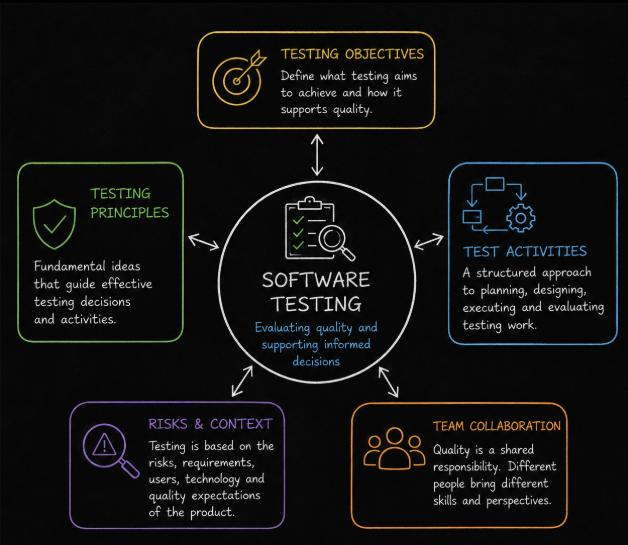

# Fundamentals of Testing Overview

The fundamentals of testing provide the foundation for understanding **what software testing is, why it is performed and how it contributes to software quality**. These concepts establish the terminology, principles, processes and responsibilities that support testing throughout software development.

The **Fundamentals of Testing** module develops from understanding the basic testing mindset and terminology, through organizing testing work, to understanding how quality responsibilities and collaboration work within development teams.

**Level 1** introduces the fundamental concepts and principles of testing. It explains **what testing is**, the main **test objectives**, the difference between **testing and debugging**, the relationship between **errors, defects, failures and root causes**, and the fundamental **principles of testing** that guide testing decisions.

**Level 2** focuses on **how testing work is organized and performed**. It introduces the **test process**, explains the activities involved in planning, analyzing, designing, implementing, executing and completing testing, introduces important **testware**, and explains how **testing responsibilities** can be distributed.

**Level 3** focuses on **quality responsibilities and collaboration within development teams**. It explains the relationship between **Quality Assurance and Quality Control**, the purpose and different degrees of **testing independence**, and how the **whole team approach** supports shared responsibility for quality.

Together, these concepts provide the foundation for understanding testing as a **structured, risk aware and collaborative activity** that provides information about product quality and supports better decisions throughout software development.
