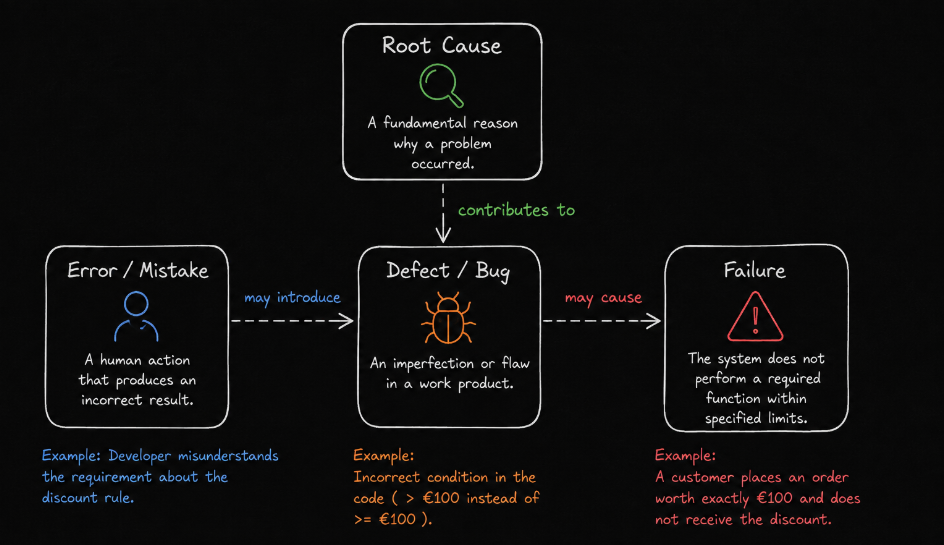
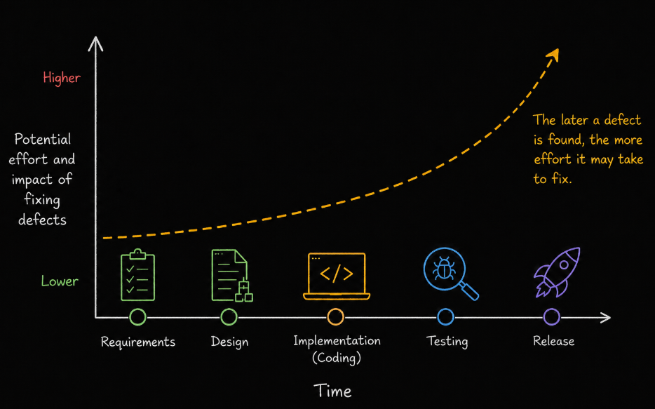

# Table of Contents: Fundamentals of Testing Summary

- [Fundamentals of Testing Level 1](#fundamentals-of-testing-level-1)
- [Fundamentals of Testing Level 2](#fundamentals-of-testing-level-2)
- [Fundamentals of Testing Level 3](#fundamentals-of-testing-level-3)

This summary brings together the most important concepts from the **Fundamentals of Testing** module. It is designed as a quick reference for revision and preparation for questions where the main concepts, relationships and differences need to be explained clearly.

## Fundamentals of Testing Level 1

Level 1 establishes the basic **testing mindset, terminology and principles**. The main goal is to understand what testing is, why it is performed, how software problems are described and which fundamental principles influence testing decisions.

Software testing consists of activities used to **evaluate software and related work products** and determine whether they meet specified requirements and stakeholder expectations. Testing helps teams **discover problems**, **assess quality**, **reduce risk** and build confidence that a product is suitable for its intended purpose.

Testing is broader than executing software. **Static testing** evaluates work products such as requirements, designs, documentation and source code without executing the software, while **dynamic testing** evaluates software by executing it and observing its behavior.

Two important concepts are **verification** and **validation**. **Verification** considers whether the product has been built correctly according to specified requirements, while **validation** considers whether the right product has been built for its intended users and purpose. Testing can also provide information about **reliability**, which describes the ability of a system to perform required functions consistently under specified conditions for a specified period of time.

Testing can have different objectives depending on the project and context. Important objectives include **evaluating work products**, **triggering failures and discovering defects**, achieving appropriate **coverage**, **reducing risk**, determining whether **requirements and stakeholder expectations are satisfied** and providing information that supports decisions about product quality and readiness.

Testing and debugging are related but different activities. **Testing** evaluates software and work products to discover problems, trigger failures and provide information about quality, while **debugging** investigates the causes of defects and corrects them. **Testing reveals and evaluates problems**, while **debugging locates their causes and corrects them**. Testing can then be performed again after debugging to confirm that the correction works and has not introduced unwanted effects elsewhere.

Problems in software are described using several important terms. An **error** is a human action that produces an incorrect result. A **defect** is an imperfection or flaw in a work product. A **failure** occurs when a system or component does not perform a required function within specified limits during execution. A **root cause** is a fundamental reason why a problem occurred.

The relationship can often be understood as **Error -> may introduce -> Defect -> may cause -> Failure**. Root cause analysis investigates more deeply to understand **why the problem occurred**. A defect does not necessarily cause a failure every time the software runs because particular inputs, states, configurations or environmental conditions may be required before the defect produces observable incorrect behavior.

Testing is guided by several fundamental principles that help explain both its value and its limitations.

**Testing shows the presence of defects, not their absence** means that testing can demonstrate that defects exist, but finding no defects does not prove that the software is defect free.

**Exhaustive testing is impossible** means that testing every possible input, condition, configuration and execution path is normally impractical. Testing effort must therefore be prioritized according to factors such as **risk and importance**.

**Early testing saves time and effort** means that testing activities should begin as early as possible. Identifying problems in requirements, designs and other early work products can prevent those problems from propagating into later development work.

**Defect clustering** means that defects are often distributed unevenly and a relatively small part of a system may contain a large proportion of discovered defects. This idea is commonly associated with the **Pareto principle**, also known as the **80/20 rule**, although the numbers are illustrative rather than an exact rule for every project.

**Tests wear out** means that repeatedly executing the same tests without reviewing or changing them can reduce their ability to discover new defects. Tests should therefore be reviewed and adapted when appropriate. This principle has traditionally been known as the **pesticide paradox**.

**Testing is context dependent** means that there is no single testing approach suitable for every product. Testing depends on factors such as **risks**, **users**, **technology**, **development approach** and **quality expectations**.

**Absence of errors does not guarantee success** means that a product can contain few known defects and still fail if it does not satisfy user needs or achieve its intended purpose. A technically correct product is not necessarily a valuable or useful product.

After reviewing Level 1, you should be able to explain **what testing is and why it is performed**, distinguish **static and dynamic testing**, distinguish **verification and validation**, explain the difference between **testing and debugging**, describe the relationship between **errors, defects, failures and root causes**, and explain how the fundamental **principles of testing** influence testing decisions.

## Fundamentals of Testing Level 2

Level 2 focuses on how testing work is **organized and performed**, which activities make up the test process, what work products support those activities and how testing responsibilities can be distributed.

The **test process** provides a structured way to organize testing work. Its main activities are **test planning**, **test monitoring and control**, **test analysis**, **test design**, **test implementation**, **test execution** and **test completion**. These activities are interconnected and can **overlap**, **repeat** and provide feedback to one another rather than always occurring as a rigid sequence.

**Test planning** establishes the testing objectives, scope, risks, resources, schedule and overall testing approach.

**Test monitoring and control** tracks testing progress and results. Monitoring provides information about what is happening, while control uses that information to determine whether adjustments or corrective actions are required.

**Test analysis** determines **what needs to be tested**. Testers examine the **test basis** and identify testable features and test conditions. The test basis is the information used to understand expected system behavior and derive tests. It can include requirements, user stories, designs, acceptance criteria and other relevant work products.

**Test design** determines **how the identified test conditions will be tested**. Test conditions are developed into test cases and supporting testware, while required test data, coverage and environment needs are identified.

**Test implementation** prepares testing for execution. Tests are organized into appropriate procedures and suites, test data is prepared, automated tests may be implemented and the required test environment is made ready.

**Test execution** involves running tests and comparing **actual results with expected results**. Outcomes are recorded, unexpected behavior is investigated and defects are reported when appropriate.

**Test completion** consolidates testing information when testing for an objective, iteration, release or project reaches its completion point. Results and outstanding issues are recorded, useful testware can be preserved and lessons learned can support future testing work.

The test process produces and uses different forms of **testware**. Testware consists of work products created or used to support testing and can include test conditions, test cases, test procedures, test suites, test data, test scripts and test results.

A **test condition** is an aspect of the system that can be tested, such as a feature, requirement, application rule or specific behavior.

A **test case** describes a particular situation to be tested and can include conditions, inputs, actions and expected results needed to verify specific behavior.

A **test procedure** describes the sequence in which one or more test cases should be performed, including the actions required to carry them out.

A **test suite** is a collection of test cases or test procedures grouped together for a particular testing purpose.

**Test data** is the information required to perform tests, while **test results** contain information produced by executing and evaluating those tests.

Some testing work products become formal **deliverables** that are communicated or provided to stakeholders. Examples can include a **test plan**, **test progress report** and **test completion report**.

Testing work also requires clear responsibilities. The **test management role** focuses primarily on responsibility for the overall testing effort and can include planning, monitoring, coordination, risk management and communication.

The **testing role** focuses primarily on technical testing activities such as **analysis**, **design**, **implementation** and **execution**.

These roles describe groups of responsibilities rather than fixed job titles. One person may perform responsibilities from both roles, while larger teams may distribute them among several people. Developers, testers, business analysts, product specialists, users and other stakeholders may also contribute to testing depending on the project and development approach.

The important distinction is therefore not only **who is called a tester**, but **who is responsible for the required testing activities and whether the necessary testing skills are available**.

After reviewing Level 2, you should be able to explain **how the test process is organized**, describe the purpose of each **test process activity**, explain the relationship between **analysis, design, implementation and execution**, define the main forms of **testware**, distinguish **testware from formal deliverables** and explain how **testing responsibilities can be distributed across different roles**.

## Fundamentals of Testing Level 3

Level 3 focuses on how **quality responsibilities are organized within development teams**, how **QA and QC contribute to quality**, why **testing independence** can improve objectivity and how the **whole team approach** supports shared responsibility for quality.

**Quality Assurance** and **Quality Control** are related parts of quality management, but they approach quality from different perspectives.

**Quality Assurance**, commonly referred to as **QA**, is primarily **process oriented**. It focuses on establishing, evaluating and improving the processes used to develop and deliver a product. QA helps prevent problems by supporting appropriate practices, standards and continuous process improvement.

**Quality Control**, commonly referred to as **QC**, is primarily **product oriented**. It focuses on evaluating work products and the resulting product to identify defects and determine whether quality requirements have been satisfied. Testing is an important form of **Quality Control**.

A useful distinction is that **QA focuses on the processes used to create the product**, while **QC focuses on evaluating the product and related work products**. Both contribute to the overall goal of achieving an appropriate level of quality.

Quality responsibility also involves considering **independence of testing**. Independence of testing describes the degree of separation between the person performing testing and the person who created the work product being tested.

Testing performed by **the author** provides little independence but can provide rapid feedback and benefits from detailed knowledge of the work.

Testing performed by **a peer or another team member** provides additional independence while maintaining close collaboration with the people involved in development.

Testing performed by **a separate testing function or team** provides greater independence and can introduce a different perspective that helps challenge assumptions and discover different types of problems.

Testing performed by **external testers or organizations** can provide a high degree of independence and may be appropriate or required in particular regulated, high risk or safety critical contexts.

Greater independence can improve **objectivity**, provide a different perspective and help challenge assumptions made by the people who created the work product. However, excessive separation can create **communication barriers**, delay feedback and reduce the sense of shared responsibility for quality. The appropriate level of independence therefore depends on **project context and risk**.

Modern development also emphasizes the **whole team approach**, where quality is treated as a shared responsibility rather than something owned only by testers.

**Developers** contribute technical and implementation knowledge and can perform testing, create automated checks, investigate failures and correct defects. **Testers** contribute testing expertise, critical thinking, risk awareness and knowledge of testing techniques. **Business representatives and product specialists** contribute knowledge about users, application rules, priorities and expected product behavior.

Collaboration brings these different perspectives together. It helps teams establish a **shared understanding**, identify risks earlier, resolve questions sooner, improve feedback and make quality part of everyday development work.

The whole team approach also encourages **knowledge sharing**. Testers can help other team members strengthen their testing skills, while developers and business specialists can help testers develop stronger technical and domain knowledge.

Shared responsibility does not mean that everyone performs the same work. Team members continue to have different **skills, responsibilities and areas of expertise**, while everyone contributes to achieving the required level of quality.

The whole team approach also does not eliminate **testing independence**. Collaboration and independence can coexist. A team can work closely together while still using an appropriate degree of independent testing when additional objectivity is needed. The balance depends on the **project context, risks and quality requirements**.

After reviewing Level 3, you should be able to explain the difference between **QA and QC**, describe how testing contributes to **Quality Control**, explain the different degrees of **testing independence**, discuss the **advantages and potential disadvantages of independence**, explain the **whole team approach**, describe how different team members contribute to quality and explain why **collaboration and independence can coexist**.
