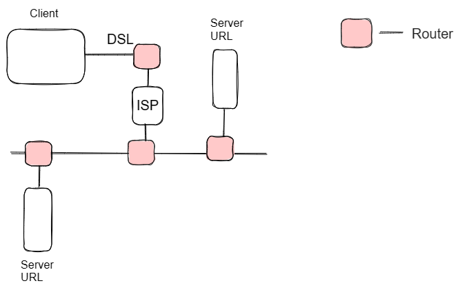

# Table of Contents

- [Internet](#internet)
    - [Introduction to the Internet](#intro)
    - [HTTP (Hypertext Transfer Protocol)](#http)
    - [Browsers and How They Work](#browser)
    - [DNS (Domain Name System)](#dns)
    - [Hosting](#hosting)

## Introduction to the Internet

The internet is a global network of interconnected computers that enables the transfer of information and communication between users worldwide. It consists of various components, including servers, routers, and communication protocols, working together to facilitate the exchange of data.

At its core, the internet relies on a technology called TCP/IP (Transmission Control Protocol/Internet Protocol). TCP breaks data into packets and ensures reliable delivery, while IP handles the addressing and routing of these packets across different networks.

## Credits

[How does the Internet Work?](https://cs.fyi/guide/how-does-internet-work) |
[How the Internet Works in 5 Minutes](https://www.youtube.com/watch?v=7_LPdttKXPc)

