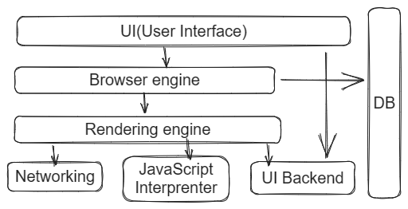

# Table of Contents

- [Internet](#internet)
    - [Introduction to the Internet](#intro)
    - [HTTP (Hypertext Transfer Protocol)](#http)
    - [Browsers and How They Work](#browser)
    - [DNS (Domain Name System)](#dns)
    - [Domain Names](#domain)
    - [Hosting](#hosting)

# Internet

## Introduction to the Internet

The internet is a global network of interconnected computers that enables the transfer of information and communication between users worldwide. It consists of various components, including servers, routers, and communication protocols, working together to facilitate the exchange of data.

At its core, the internet relies on a technology called TCP/IP (Transmission Control Protocol/Internet Protocol). TCP breaks data into packets and ensures reliable delivery, while IP handles the addressing and routing of these packets across different networks.

### Credits

[How does the Internet Work?](https://cs.fyi/guide/how-does-internet-work) |
[How the Internet Works in 5 Minutes](https://www.youtube.com/watch?v=7_LPdttKXPc)

## HTTP (Hypertext Transfer Protocol)

HTTP, or Hypertext Transfer Protocol, is the foundation of data communication on the World Wide Web. It is an application protocol that defines how web browsers and servers communicate with each other. When you type a website address (URL) into a browser, it sends an HTTP request to the corresponding web server.

The server then processes the request and sends back an HTTP response, typically containing the requested web page. HTTP supports various methods such as GET (retrieve data), POST (submit data), PUT (update data), and DELETE (remove data). It also defines status codes (e.g., 200 for success, 404 for page not found) to indicate the outcome of a request.

### Credits

[HTTP deep explaination](https://cs.fyi/guide/http-in-depth)

## Browsers and How They Work

A web browser is a software application used to access and view websites on the internet. Popular examples include Google Chrome, Mozilla Firefox, and Safari. Browsers provide a graphical interface that allows users to interact with web pages, multimedia content, and other online resources.

Here's a simplified overview of how browsers work:

- User Input: Users enter a URL or click on links to navigate to a specific web page.
- HTTP Request: The browser sends an HTTP request to the appropriate web server.
- HTTP Response: The server responds with an HTTP response containing the requested web page's data.
- Rendering: The browser processes the received data, interprets the HTML, CSS, and JavaScript code, and renders the web page accordingly.
- Display: The rendered web page is displayed on the user's screen, including text, images, and interactive elements.

Browsers also include features like bookmarks, history, and extensions to enhance the user's browsing experience.

### Credits

[How Do Web Browsers Work?](https://www.youtube.com/watch?v=WjDrMKZWCt0)

## DNS (Domain Name System)

The Domain Name System (DNS) is a hierarchical system that translates domain names (e.g., example.com) into IP addresses (e.g., 192.168.0.1). It acts as the "phonebook" of the internet, allowing users to access websites using human-readable domain names instead of remembering numerical IP addresses.

Here's how DNS works:

- Domain Name Resolution: When a user enters a domain name in a browser, the browser sends a DNS request to a DNS resolver (typically provided by the ISP).
- DNS Recursive Resolution: The resolver checks its cache for the corresponding IP address. If not found, it contacts the DNS root servers, which direct it to the appropriate top-level domain (TLD) server (e.g., .com, .org).
- TLD Resolution: The TLD server directs the resolver to the authoritative DNS server responsible for the specific domain name.
- Authoritative Resolution: The authoritative server provides the IP address back to the resolver, which caches it for future use.
- Response to the Browser: The resolver sends the IP address to the browser, which can then establish a connection with the web server.

DNS caching helps optimize the resolution process, reducing the time required to translate domain names into IP addresses.

### Credits

[What is DNS? | How DNS works](https://www.cloudflare.com/en-gb/learning/dns/what-is-dns/)

## Domain Names

A domain name is a unique and human-readable address that represents a specific website or online resource on the internet. It is part of a URL (Uniform Resource Locator) and typically consists of two or more parts separated by dots. For example, in "www.example.com," "example" is the second-level domain, and "com" is the top-level domain (TLD).

Key points about domain names:

- Website Identification: Domain names provide a memorable way to identify and access websites instead of using complex IP addresses.
- Registration: Domain names are registered through accredited domain registrars for a specified period (e.g., one year, multiple years).
- Hierarchy: Domain names follow a hierarchical structure, with different levels indicating ownership and categorization (e.g., country-code TLDs like .uk for the United Kingdom).
- Extensions: TLDs represent different categories of websites (e.g., .com for commercial, .org for organizations, .edu for educational institutions).
- Domain Name System: DNS is responsible for translating domain names into IP addresses, allowing browsers to locate the correct web servers.

When choosing a domain name, it is important to consider its relevance, memorability, and availability for registration.

### Credits

[What is a domain name](https://developer.mozilla.org/en-US/docs/Learn/Common_questions/Web_mechanics/What_is_a_domain_name) |
[What is a domain name? | Domain name vs. URL](https://www.cloudflare.com/en-gb/learning/dns/glossary/what-is-a-domain-name/)

## 

Hosting refers to the practice of storing and serving website files, data, or applications on a server accessible over the internet. When you host a website, you make it available to users worldwide. Web hosting providers offer various services and technologies to ensure websites are accessible and perform efficiently.

Key points about hosting:

- Web Servers: Hosting providers maintain web servers that store website files and deliver them to users upon request.
- Types of Hosting: Common types of hosting include shared hosting (multiple websites sharing server resources), dedicated hosting (exclusive - - server usage), and cloud hosting (distributed resources across multiple servers).
- Domain and DNS: Hosting often involves associating a domain name with the hosted website's IP address through DNS configuration.
- Website Management: Hosting services often include features like email accounts, database management, security measures, and website analytics.
- Scalability: Hosting plans should allow for scalability, enabling websites to handle increased traffic and resource demands.

Remember to choose a reliable hosting provider that meets your website's requirements and provides adequate support and security features.

### Credits

[What Is Web Hosting? Explained](https://www.youtube.com/watch?v=htbY9-yggB0) |
[Different Types of Web Hosting Explained](https://www.youtube.com/watch?v=AXVZYzw8geg)

