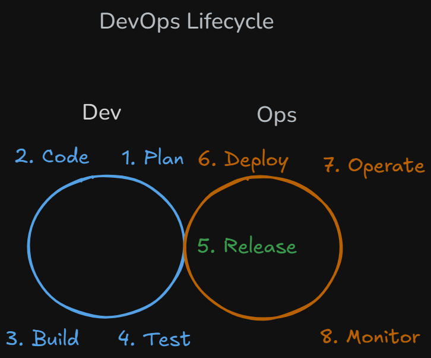

<!-- markdownlint-disable MD033 -->
# Content of Table: DevOps Approach

- [Lifecycle phases](#lifecycle-phases)

## Lifecycle phases

**Explanation:**

The DevOps lifecycle is the process of building, testing, and running software. It starts with planning, then coding, testing, and releasing. After deployment, the software is monitored to keep it working. The cycle repeats continuously for improvements. It’s a never-ending loop.

    
Overview:

1. **Never-ending cycle of software delivery:**  DevOps breaks the traditional "release-and-forget" model. Creates a circular flow where software keeps evolving through continuous updates and improvements, with no final "end point."

    

       
Overview:

    - **Plan:** Product teams and engineers collaborate to define requirements using agile methodologies, with tools automatically tracking progress.

    - **Code:** Developers work in small batches with frequent commits, supported by automated version control and peer review workflows.

    - **Build:** Automated systems compile code and package artifacts while engineers maintain the underlying build infrastructure.

    - **Test:** While test execution is automated, humans design test strategies and maintain test suites to validate quality.

    - **Release:** The transition point where operations teams validate stability, often requiring manual approval for production.

    - **Deploy:** Increasingly automated deployment processes still benefit from human verification for critical systems.

    - **Operate:** Systems run with automated management but require human expertise for complex issues.

    - **Monitor:** Automated alerts and dashboards provide data that engineers analyze to inform improvements.

    

2. **Bridges development and operations:** The lifecycle intentionally connects what were traditionally separate teams (developers writing code and operations running systems) into one collaborative workflow.

3. **Balancing automation with human judgment:** While repetitive tasks are automated, strategic decisions and creative problem-solving remain human-led.

4. **Self-reinforcing feedback loops:** Each phase's outputs automatically trigger the next phase's activities while providing data for ongoing optimization.

5. **Data-driven evolution:** Production metrics and user feedback directly shape future planning decisions, creating a true learning organization.

