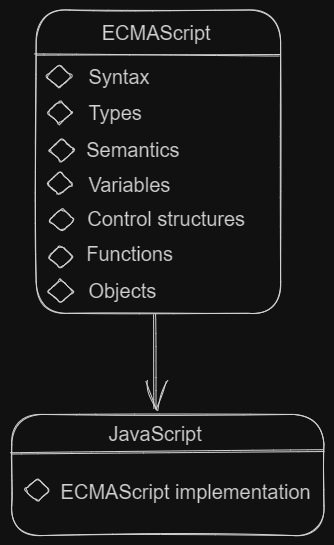
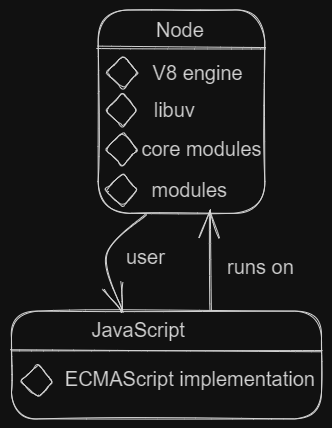

# Table of Contents

- [JavaScript](#javascript)
    - [Explaination how the JavaScript works](#explaination-how-the-javaScript-works)
    - [Introduction to JavaScript](#introduction-to-javascript)
    - [ECMAScript](#ecmascript)
    - [Node.js](#nodejs)
    - [Additional Resources](#intro-javascript-additional-resources)
- [Data Types](#data-types)
    - [string](#string)
    - [Undefined](#undefined)
    - [Number](#number)
    - [BigInt](#big-int)
    - [Boolean](#boolean)
    - [Null](#null)
    - [Symbol](#symbol)    
    - [typeof Operators](#typeof-operators)
    - [Built-in Objects](#built-in-objects)
- [Type Casting in JavaScript](#type-casting-in-javascript)
    - [Type Conversion](#type-conversion)
    - [Coercion](#coercion)
    - [Explicit Type Casting](#explicit-type-casting)
    - [Implicit Type Casting](#implicit-type-casting)
- [Node.js](#node)
- [Data Structures](#data-structures)
    - [Structured Data](#structured-data)
        - [JSON](#json)
    - [Indexed Collections](#indexed-collections)
        - [Arrays](#arrays)
    - [(TBD)Keyed Collections](#keyed-collections)
        - [Map](#map)
        - [WeakMap](#weakmap)
        - [Set](#set)
        - [WeakSet](#weakset)
- [Equality Comparisons](#equality-comparisons)
    - [The == Operator](#operator==)
    - [The === Operator](#operator==)
    - [The Object.is() Method](#object-method)
- [Loops and Iterations](#loops-and-iterations)
    - [for Statement](#for-statement)
    - [do...while Statement](#do-while-statement)
    - [while Statement](#while-statement)
    - [for...in Statement](#for-in-statement)
    - [for...of Statement](#for-of-statement)
    - [break / continue - labeled Statement](#break-continue-labeled-statement)
- [Control Flow and Exception Handling](#control-flow-and-exception-handling)
    - [Conditional Statements](#conditional-statements)
      - [if...else Statement](#ifelse-statement)
      - [Switch Statement](#switch-statement)
    - [Exception Handling](#exception-handling)
      - [Utilizing Error Object](#utilizing-error-object)
      - [Throw Statement](#throw-statement)
      - [try/catch/finally](#trycatchfinally)
- [Expressions and Operators](#expressions-and-operators)
  - [Assignment Operators](#assignment-operators)
  - [Comparison Operators](#comparison-operators)
  - [Arithmetic Operators](#arithmetic-operators)
  - [Logical Operators](#logical-operators)
  - [String Operators](#string-operators)
  - [Conditional operators](#conditional-operators)
  - [Comma Operators](#comma-operators)
  - [Unary Operators](#unary-operators)
- [Functions](#functions)
  - [Defining and Calling Functions](#defining-and-calling-functions)
  - [Function Parameters](#function-parameters)
    - [Default Parameters](#default-parameters)
    - [Rest Parameters](#rest-parameters)
  - [Arrow Functions](#arrow-functions)
  - [Built-in Functions](#built-in-functions)
- [Build Tools](#build-tools)
  - [Linters formatters](#linters-formatters)
    - [Prettier](#prettier)
    - [ESLint](#eslint)
  - [Task Runners](#task-runners)
    - [Task Runners](#task-runners)
    - [scripts](#scripts)
  - [Module Bundlers](#module-bundlers)
    - [Vite](#vite)
    - [esbuild](#esbuild)
- [Strict Mode](#strict-mode)
- [Asynchronous JavaScript](#asynchronous-javascript)
  - [setTimeout](#settimeout)
  - [setInterval](#setinterval)
  - [Callbacks](#callbacks)
    - [Callback Hell](#callback-hell)
  - [Promises](#promises)
    - [async / await](#async-await)

# JavaScript

JavaScript is a high-level programming language that is primarily used for web development. It enables the creation of interactive and dynamic elements on websites. JavaScript can be executed on both the client-side (in the web browser) and the server-side (on a web server).

## Explaination how the JavaScript works

When a user opens a website, the browser requests JavaScript files from the server. Once the files are received, the browser executes the JavaScript and manipulates the Document Object Model (DOM) to make changes to the website. Finally, the browser displays the website with the JavaScript changes to the user.


## Introduction to JavaScript

- Syntax and basic structure of JavaScript
- Variables and data types
- Control flow and decision-making with conditionals
- Loops and iteration
- Functions and scope
- Manipulating the Document Object Model (DOM)
- Event handling
- Asynchronous programming with callbacks, promises, and async/await

## ECMAScript

ECMAScript is the standardized specification for JavaScript. It defines the language syntax, features, and behavior that all JavaScript implementations should follow. ECMAScript versions are often referred to as ES5, ES6 (or ES2015), ES7, and so on.

It's important to note that JavaScript is the most widely used implementation of ECMAScript. JavaScript engines in web browsers and server-side environments adhere to the ECMAScript specification to ensure consistent behavior across platforms.



## Node.js 

Node.js is a runtime environment that allows JavaScript to be executed on the server-side. It provides an event-driven architecture and a rich set of built-in modules, making it suitable for building scalable network applications. Node.js is built on the V8 JavaScript engine, which is also used by the Google Chrome browser.

Node.js extends the capabilities of JavaScript beyond the web browser, enabling developers to build server-side applications, command-line tools, APIs, and more. It provides access to various APIs for file system operations, networking, database connectivity, and other system-level tasks.

    

## Additional Resources

- [The History of JavaScript](https://dev.to/iarchitsharma/the-history-of-javascript-5e98)
- [Video: JavaScript in 100 Seconds](https://www.youtube.com/watch?v=DHjqpvDnNGE)

# Data Types

## String

A string represents a sequence of characters and is enclosed in either single quotes (') or double quotes (").

```js
const greeting = 'Hello, world!';
```

## Undefined

The undefined data type represents a value that is not assigned to a variable or not yet defined.

```js
let username;
console.log(username); // Output: undefined
```
## Number

The number data type represents numeric values.

```js
const age = 25;
```

## BigInt

The bigint data type represents integers with arbitrary precision, allowing you to work with numbers larger than the Number type can handle.

```js
const bigNumber = 123456789012345678901234567890n;
```

## Boolean

The boolean data type represents a logical value, either true or false.

```js
const isLogged = true;
```
The null data type represents the intentional absence of any object value.

## Null

```js
const user = null;
```
The symbol data type represents unique and immutable values that may be used as property keys of objects.

## Symbol

```js
const id = Symbol('uniqueId');
```
## typeof Operator

The typeof operator is used to determine the data type of a value.

```js
const username = 'John';
console.log(typeof username); // Output: string
```
## Built-in Objects

JavaScript provides several built-in objects that offer functionalities for specific purposes. Here are a few commonly used ones:

`Math`: Provides mathematical functions and constants.
`Date`: Enables working with dates and times.
`Array`: Represents an ordered list of elements.
`Object`: Serves as a basic object type.

```js
const randomNumber = Math.random();
const currentDate = new Date();
const fruits = ['apple', 'banana', 'orange'];
const person = { name: 'John', age: 25 };
```
## Resources

- [JavaScript Data Types - CodeGuage](https://www.codeguage.com/courses/js/data-types)

# Type Casting in JavaScript

## Type Conversion

```js
// Implicitly converting a number to a string
const num = 42;
const str = "The answer is: " + num; // Implicit type conversion
console.log(str); // Output: "The answer is: 42"
```
The number `42` is implicitly converted to a string by JavaScript when it is concatenated with another string using the `+` operator.

## Coercion

```js
// Implicitly converting a string to a number
const num = 42;
const str = "3";
const result = num + str; // Implicit coercion
console.log(result); // Output: "423"
```
The string `"3"` is implicitly coerced to a number, allowing JavaScript to perform the addition operation with the number `42`. However, since the `+` operator is used for both addition and concatenation, the result is the concatenated string `"423"`.

## Explicit Type Casting

```js
// Explicitly converting a float to an integer
const numFloat = 3.14;
const numInt = parseInt(numFloat); // Explicit type casting
console.log(numInt); // Output: 3
```
The `parseInt()` function is used to explicitly cast the floating-point number `3.14` to an integer. The function parses the integer portion of the number, discarding the decimal part, and returns the integer value `3`.

## Implicit Type Casting

```js
// Implicitly converting an integer to a float
const numInt = 42;
const numFloat = numInt; // Implicit type casting
console.log(numFloat); // Output: 42.0
```
 The integer value `42` is implicitly cast to a float by JavaScript without any explicit syntax. The result is the floating-point number `42.0`.

## Resources

- []()

# Node.js

# Data Structures

## Structured Data

### JSON

1. **JSON (JavaScript Object Notation):**
JSON is a lightweight data interchange format that is easy for humans to read and write, and easy for machines to parse and generate. It is often used for representing structured data in web applications. JSON data consists of key-value pairs and can be represented as a nested hierarchy.

```js
// JSON data representing a person
const person = {
  "name": "John Doe",
  "age": 25,
  "email": "johndoe@example.com"
};
```
### Indexed Collections

2. **Arrays:**
An array is a data structure that stores a collection of elements in a specific order. Each element in the array is identified by its index, starting from 0. Arrays in JavaScript can hold elements of any data type.

```js
// Array of numbers
const numbers = [1, 2, 3, 4, 5];

// Accessing array elements
console.log(numbers[0]); // Output: 1

// Modifying array elements
numbers[2] = 10;
console.log(numbers); // Output: [1, 2, 10, 4, 5]
```

# Equality Comparisons

In JavaScript, there are different operators available for comparing values. Understanding the differences between these operators is crucial to ensure accurate comparisons. Let's explore three commonly used comparison operators: `==`, `===`, and `Object.is()`.

## The == Operator

The `==` operator compares the values of two operands after performing type coercion if necessary. It converts the operands to a common type and then checks for equality. While this can be convenient in some cases, it can lead to unexpected results.

```js
console.log(5 == "5");  // true
```
## The === Operator

The `===` operator, also known as the strict equality operator, compares both the values and the data types of the operands. It does not perform any type coercion.

```js
console.log(5 === "5");  // false
```

## The Object.is() Method

The `Object.is()` method determines whether two values are the same value without performing any type coercion. It provides a precise way of comparing values.

```js
console.log(Object.is(5, "5"));  // false
```

# Loops and Iterations

## for Statement

The `for` statement allows you to execute a block of code repeatedly for a specific number of times. It consists of three parts: initialization, condition, and increment/decrement.

```js
for (initialization; condition; increment/decrement) {
  // Code to be executed
}
```

**Example:**

```js
for (let i = 0; i < 5; i++) {
  console.log(i);
}
```

**Output:**

```js
0
1
2
3
4
```

## do...while Statement

The `do...while` statement executes a block of code once, and then repeats the execution as long as a specified condition is true.

```js
do {
  // Code to be executed
} while (condition);
```

**Example:**

```js
let i = 0;
do {
  console.log(i);
  i++;
} while (i < 5);
```
**Output:**

```js
0
1
2
3
4
```

## while Statement

The `while` statement executes a block of code as long as a specified condition is true.

```js
while (condition) {
  // Code to be executed
}
```

**Example:**

```js
let i = 0;
while (i < 5) {
  console.log(i);
  i++;
}
```

**Output:**

```js
0
1
2
3
4
```
## for...in Statement

The `for...in` statement iterates over the enumerable properties of an object. It can be used to loop through the keys of an object.

```js
for (variable in object) {
  // Code to be executed
}
```

**Example:**

```js
const person = {
  name: 'John',
  age: 30,
  city: 'New York'
};

for (let key in person) {
  console.log(key + ': ' + person[key]);
}
```

**Output:**

```js
name: John
age: 30
city: New York
```
## for...of Statement

The `for...of` statement iterates over iterable objects such as arrays, strings, and more. It can be used to loop through the values of an iterable.

```js
for (variable of iterable) {
  // Code to be executed
}
```

**Example**

```
const fruits = ['apple', 'banana', 'orange'];

for (let fruit of fruits) {
  console.log(fruit);
}
```
**Output:**

```
apple
banana
orange
```

## break / continue - labeled Statement

The `break` statement is used to terminate a loop prematurely, while the `continue` statement skips the current iteration and moves to the next one. Both statements can be labeled to specify which loop to break or continue when nested loops are present.

**Example:**

```js
outerLoop: for (let i = 0; i < 3; i++) {
  console.log('Outer loop:', i);
  
  innerLoop: for (let j = 0; j < 3; j++) {
    if (j === 1) {
      continue outerLoop;
    }
    console.log('Inner loop:', j);
  }
}
```

**Output:**

```js
Outer loop: 0
Inner loop: 0
Outer loop: 1
Outer loop: 2
Inner loop: 0
Outer loop: 3
Inner loop: 0
```

# Control Flow and Exception Handling

## Conditional Statements

Conditional statements in JavaScript allow you to make decisions and execute different blocks of code based on certain conditions.

### if...else Statement

The `if...else` statement is used to perform different actions based on different conditions.

**Syntax:**

```js
if (condition) {
  // code to be executed if the condition is true
} else {
  // code to be executed if the condition is false
}
```
**Example:**

```js
const age = 18;

if (age >= 18) {
  console.log("You are eligible to vote!");
} else {
  console.log("You are not eligible to vote yet.");
}
```

**Output:**

```js
You are eligible to vote!
```

### Switch Statement

The `switch` statement is used to perform different actions based on different cases.

**Syntax:**

```js
switch (expression) {
  case value1:
    // code to be executed if expression matches value1
    break;
  case value2:
    // code to be executed if expression matches value2
    break;
  default:
    // code to be executed if expression doesn't match any case
    break;
}
```

**Example:**

```js
const day = "Monday";
let dayType;

switch (day) {
  case "Monday":
  case "Tuesday":
  case "Wednesday":
  case "Thursday":
  case "Friday":
    dayType = "Weekday";
    break;
  case "Saturday":
  case "Sunday":
    dayType = "Weekend";
    break;
  default:
    dayType = "Invalid day";
    break;
}

console.log(`Today is a ${dayType}.`);
```

**Output:**

```js
Today is a Weekday.
```

## Exception Handling

Exception handling allows you to catch and handle errors that occur during the execution of your program.

### Utilizing Error Object

JavaScript provides an `Error` object that represents runtime errors.

**Syntax**

```js
try {
  // code that may throw an error
} catch (error) {
  // code to handle the error
}
```

**Example:**

```js
try {
  const result = 10 / 0;
  console.log(result);
} catch (error) {
  console.log("An error occurred:", error.message);
}
```

**Output:**

```js
An error occurred: Division by zero
```
### Throw Statement

The `throw` statement allows you to create custom errors and throw them.

**Syntax:**

```js
throw expression;
```

**Example:**

```js
function validateAge(age) {
  if (age < 18) {
    throw new Error("Invalid age. Must be at least 18 years old.");
  }
  // code to be executed if age is valid
}

try {
  validateAge(15);
  console.log("Age is valid.");
} catch (error) {
  console.log("An error occurred:", error.message);
}
```

**Output:**

```js
An error occurred: Invalid age. Must be at least 18 years old.
```

### try/catch/finally

The `try/catch/finally` statement allows you to handle errors and execute cleanup code regardless of whether an error occurred or not.

**Syntax:**

```js
try {
  // code that may throw an error
} catch (error) {
  // code to handle the error
} finally {
  // code to be executed regardless of errors
}
```

**Example:**

```js
try {
  // code that may throw an error
  console.log("Executing try block.");
  throw new Error("Error occurred.");
} catch (error) {
  // code to handle the error
  console.log("An error occurred:", error.message);
} finally {
  // code to be executed regardless of errors
  console.log("Executing finally block.");
}
```

**Output:**

```js
Executing try block.
An error occurred: Error occurred.
Executing finally block.
```

# Expressions and Operators

At a high level, an expression is a valid unit of code that resolves to a value. There are two types of expressions: those that have side effects (such as assigning values) and those that purely evaluate.

## Assignment Operators

Assignment operators are used to assign values to variables. They allow you to perform simple mathematical operations and update the value of a variable in a single step.

**Syntax:**

```js
variable = value;
```

**Example:**

```js
let x = 5;
x += 3; // Equivalent to x = x + 3;
console.log(x); // Output: 8
```

## Comparison Operators

Comparison operators are used to compare two values and return a Boolean result (true or false) based on the comparison.

**Syntax:**

```js
value1 operator value2;
```

**Example:**

```js
let x = 5;
let y = 3;
console.log(x > y); // Output: true
```

## Arithmetic Operators

Arithmetic operators are used to perform mathematical calculations on numeric values.

**Syntax:**

```js
value1 operator value2;
```

**Example:**

```js
let x = 5;
let y = 3;
console.log(x + y); // Output: 8
```

## Logical Operators

Logical operators are used to combine or invert Boolean values and produce a Boolean result.

**Syntax:**

```js
value1 operator value2;
```

**Example:**

```js
let x = 5;
let y = 3;
console.log(x > 3 && y < 10); // Output: true
```

## String Operators

**Syntax:**

```js
string1 + string2;
```

**Example:**

```js
let greeting = "Hello";
let name = "John";
console.log(greeting + " " + name); // Output: "Hello John"
```

## Conditional Operators

Conditional operators are used for conditional statements and ternary expressions.

**Syntax:**

```js
condition ? value1 : value2;
```

**Example:**

```js
let age = 20;
let isAdult = (age >= 18) ? "Adult" : "Minor";
console.log(isAdult); // Output: "Adult"
```
## Comma Operators

Comma operators are used to separate multiple expressions within a single statement. The value of the entire expression is determined by the last expression.

**Syntax:**

```js
expression1, expression2, expression3;
```

**Example:**

```js
let x = 1, y = 2, z = 3;
console.log(x, y, z); // Output: 1 2 3
```

# Functions

## Defining and Calling Functions

**Syntax:**

```js
function functionName(parameter1, parameter2) {
  // Function body
  // Code to be executed
  return result;
}
```

**Example:**

```js
function greet(name) {
  return "Hello, " + name + "!";
}

console.log(greet("Alice"));
```

**Output:**

```js
Hello, Alice!
```

## Function Parameters

In JavaScript, function parameters are the variables that are declared as part of a function's definition. They represent the values that can be passed into the function when it is called. Parameters allow you to provide input to a function and make it more flexible and reusable.

### Default Parameters

**Syntax:**

```js
function functionName(parameter1 = defaultValue1, parameter2 = defaultValue2) {
  // Function body
  // Code to be executed
  return result;
}
```

**Example:**

```js
function greet(name = "stranger") {
  return "Hello, " + name + "!";
}

console.log(greet());
console.log(greet("Alice"));
```

**Output:**

```js
Hello, stranger!
Hello, Alice!
```

### Rest Parameters

**Syntax:**

```js
function functionName(parameter1, parameter2, ...restParameters) {
  // Function body
  // Code to be executed
  return result;
}
```

**Example:**

```js
function sum(...numbers) {
  let total = 0;
  for (let number of numbers) {
    total += number;
  }
  return total;
}

console.log(sum(1, 2, 3, 4, 5));
```

**Output:**

```js
15
```

## Arrow Functions

**Syntax:**

```js
const functionName = (parameter1, parameter2) => {
  // Function body
  // Code to be executed
  return result;
};
```

**Example:**

```js
const add = (a, b) => a + b;

console.log(add(3, 5));
```

**Output:**

```js
8
```

## Built-in Functions

JavaScript provides several built-in functions that can be directly used without defining them. Examples include `console.log()`, `Math.random()`, `parseInt()`, etc.

# Strict Mode

When strict mode is enabled, certain actions that wouldotherwise result in silent errors or different behavior areinstead treated as syntax errors or throw exceptions. Strictmode helps you write cleaner and more reliable JavaScriptcode by catching common mistakes and preventing someproblematic features from being used.

1. Enable strict mode for an entire script:

```js
"use strict";

// Your code here
```
Placing the string "use strict"; at the beginning of your script (before any other statements) enables strict mode for the entire file.

2. Enable strict mode for a specific function:

```js
function myFunction() {
  "use strict";

  // Your code here
}
```
Adding the string "use strict"; as the first statement within a function enables strict mode for that function only.

**Example**

```js
// Regular mode
x = 10;  // This creates a global variable silently

// Strict mode
"use strict";
y = 20;  // Throws an error: ReferenceError: y is not defined
```

Strict mode provides several benefits such as preventing accidental global variable creation, disallowing duplicate parameter names, making assignments to non-writable properties throw an error, and more.

# Asynchronous JavaScript

## setTimeout

**Description**: The `setTimeout` function is used to schedule the execution of a function after a specified delay (in milliseconds). It allows for the execution of code after a certain amount of time has passed.

**Syntax:**

```js
setTimeout(function, delay, param1, param2, ...);
```
`function`: The function to be executed.
`delay`: The time (in milliseconds) to wait before executing the function.
`param1, param2, ...`: Optional parameters to be passed to the function.

**Example:**

```js
function greet(name) {
  console.log("Hello, " + name + "!");
}

setTimeout(greet, 2000, "John");
```

## setInterval

**Description:** The `setInterval` function is used to repeatedly execute a function at a specified interval (in milliseconds). It allows for the execution of code at regular intervals until stopped.

**Syntax:**

```js
setInterval(function, delay, param1, param2, ...);
```

`function:` The function to be executed.
`delay:` The time (in milliseconds) between each execution of the function.
`param1, param2, ...`: Optional parameters to be passed to the function.

**Example:**

```js
function countDown(seconds) {
  console.log(seconds);
  seconds--;

  if (seconds < 0) {
    clearInterval(intervalId);
    console.log("Countdown complete!");
  }
}

var intervalId = setInterval(countDown, 1000, 5);
```

**Output:**

```js
5
4
3
2
1
Countdown complete!
```

## Callbacks

**Description:** Callbacks are functions that are passed as arguments to other functions and are executed once a certain task is completed. They are commonly used in asynchronous programming to handle results or perform actions after an operation has finished.

**Syntax:**

```js
function asyncFunction(param1, param2, ..., callback) {
  // Perform asynchronous operation
  // Once completed, invoke the callback function
  callback(result);
}
```

`param1, param2, ...`: Parameters required for the asynchronous operation.
`callback`: A function to be called once the operation is completed, usually with the result as an argument.

**Example:**

```js
function fetchData(url, callback) {
  // Simulating asynchronous data fetching
  setTimeout(function () {
    const data = { id: 1, name: "John Doe" };
    callback(data);
  }, 2000);
}

function processData(data) {
  console.log("Received data:", data);
}

fetchData("https://api.example.com/data", processData);
```

**Output:**

```js
After 2 seconds:
Received data: { id: 1, name: 'John Doe' }
```

### Callback Hell

**Description:** Callback hell refers to the situation when multiple asynchronous operations are nested within each other, leading to deeply nested callbacks. This can make the code harder to read and maintain. To mitigate this issue, other asynchronous patterns like promises and async/await are often used.

```js
asyncOperation1(function (result1) {
  asyncOperation2(result1, function (result2) {
    asyncOperation3(result2, function (result3) {
      // More nested callbacks...
    });
  });
});
```

## Promises

Description: Promises are a more structured way to handle asynchronous operations in JavaScript. A promise represents the eventual completion (or failure) of an asynchronous operation and allows you to attach callbacks for handling the results.

**Syntax:**

```js
new Promise(function (resolve, reject) {
  // Perform asynchronous operation
  // If successful, call resolve(result)
  // If an error occurs, call reject(error)
}).then(function (result) {
  // Handle the successful result
}).catch(function (error) {
  // Handle the error
});
```

**Example:**

```js
function fetchData(url) {
  return new Promise(function (resolve, reject) {
    // Simulating asynchronous data fetching
    setTimeout(function () {
      const data = { id: 1, name: "John Doe" };
      resolve(data);
    }, 2000);
  });
}

fetchData("https://api.example.com/data")
  .then(function (data) {
    console.log("Received data:", data);
  })
  .catch(function (error) {
    console.log("Error:", error);
  });
```

**Output:**

```js
After 2 seconds:
Received data: { id: 1, name: 'John Doe' }
```

### async / await

**Description:** The `async` and `await` keywords provide a more concise and synchronous-looking syntax for working with promises. `async` is used to define an asynchronous function, and `await` is used to pause the execution of the function until a promise is resolved or rejected.

**Syntax:**

```js
async function functionName() {
  try {
    // Asynchronous operations with await
    const result = await promise;
    // Handle the result
  } catch (error) {
    // Handle the error
  }
}
```

**Example:**

```js
function fetchData(url) {
  return new Promise(function (resolve, reject) {
    // Simulating asynchronous data fetching
    setTimeout(function () {
      const data = { id: 1, name: "John Doe" };
      resolve(data);
    }, 2000);
  });
}

async function processData() {
  try {
    const data = await fetchData("https://api.example.com/data");
    console.log("Received data:", data);
  } catch (error) {
    console.log("Error:", error);
  }
}

processData();
```

**Output:**

```js
After 2 seconds:
Received data: { id: 1, name: 'John Doe' }
```