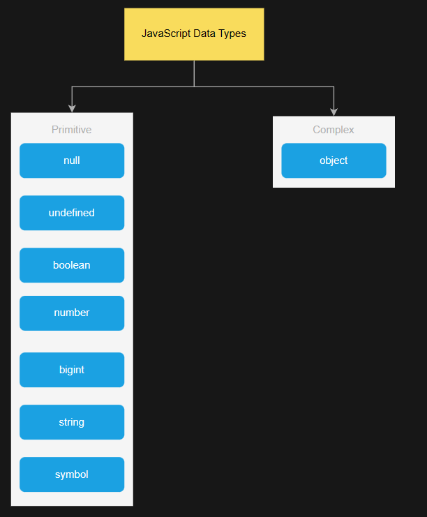
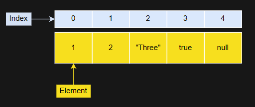
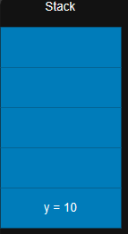
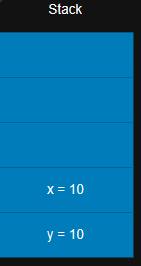
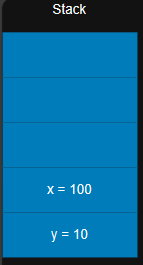
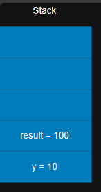
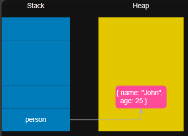
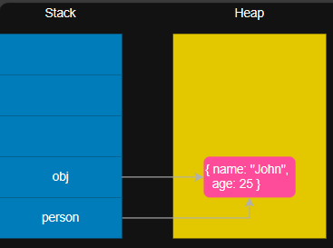
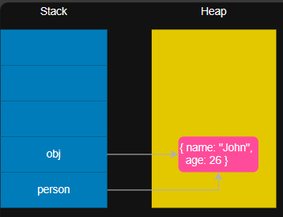
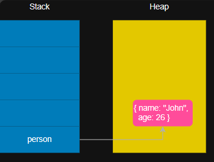

# Table of Contents

- [Introduction to JavaScript](#introduction-to-javascript)
- [JavaScript Fundamentals](#javascript-fundamentals)
- [JavaScript Operators](#javascript-operators)
- [String Methods](#string-methods)
- [Control Flow](#control-flow)
- [JavaScript functions](#javascript-functions)
- [Array Methods](#array-methods)
- [Asynchronous JavaScript](#asynchronous-javaScript)
- [Working with APIs](#working-with-apis)
- [Classes](#classes)
- [Javascript Object](#javascript-object)
- [JavaScript Runtime](#javaScript-runtime)

# Introduction to JavaScript

- [What is JavaScript?](#what-is-javascript)
- [History of JavaScript](#history-of-javascript)
- [JavaScript Versions](#javascript-versions)
- [How to run JavaScript?](#how-to-run-javascript)

## What is JavaScript?

**Explanation:**

JavaScript is a programming language initially designed to interact with elements of web pages. In web browsers, JavaScript consists of three main parts:

- ECMAScript provides the core functionality.

         +--------------------------------------+
         |            ECMAScript Core           |
         |                                      |
         |        +---------------------+       |
         |        |   Language Syntax   |       |
         |        +---------------------+       |
         |                                      |
         |        +---------------------+       |
         |        |    Data Types       |       |
         |        +---------------------+       |
         |                                      |
         |        +---------------------+       |
         |        |   Control Flow      |       |
         |        +---------------------+       |
         |                                      |
         |        +---------------------+       |
         |        |   Functions         |       |
         |        +---------------------+       |
         |                                      |
         |        +---------------------+       |
         |        |    Objects          |       |
         |        +---------------------+       |
         |                                      |
         +--------------------------------------+


- The Document Object Model (DOM) provides interfaces for interacting with elements on web pages

               +-------------------------------------------+
               |            Document Object Model          |
               |                                           |
               |   +-----------------------------+         |
               |   |            Document         |         |
               |   +-----------------------------+         |
               |         |                    |            |
               |         v                    v            |
               |   +-------------+     +----------------+  |
               |   |  Element    |     |    Element     |  |
               |   +-------------+     +----------------+  |
               |         |                    |            |
               |         v                    v            |
               |   +-------------+     +----------------+  |
               |   |  Attribute  |     |    Attribute   |  |
               |   +-------------+     +----------------+  |
               |                                           |
               |   +-----------------------------+         |
               |   |           Text Node         |         |
               |   +-----------------------------+         |
               |                                           |
               +-------------------------------------------+


- The Browser Object Model (BOM) provides the browser API for interacting with the web browser.

                +---------------------------------------------+
                |             Browser Object Model            |
                |                                             |
                |   +---------------------------+             |
                |   |          Window           |             |
                |   +---------------------------+             |
                |       |                 |                   |
                |       v                 v                   |
                |   +----------+    +----------------+        |
                |   | Location |    |    Document    |        |
                |   +----------+    +----------------+        |
                |       |                |     |              |
                |       v                v     v              |
                |   +-----------+   +----------------+        |
                |   | Navigator |   |    History     |        |
                |   +----------+    +----------------+        |
                |                   |                         |
                |                   v                         |
                |               +----------------+            |
                |               |   Screen       |            |
                |               +----------------+            |
                |                   |                         |
                |                   v                         |
                |               +----------+                  |
                |               |  Console |                  |
                |               +----------+                  |
                +---------------------------------------------+

JavaScript allows you to add interactivity to a web page. Typically, you use JavaScript with HTML and CSS to enhance a web page’s functionality, such as validating forms, creating interactive maps, and displaying animated charts.

When a web page is loaded, after HTML and CSS have been downloaded, the JavaScript engine in the web browser executes the JavaScript code. The JavaScript code then modifies the HTML and CSS to update the user interface dynamically.

The JavaScript engine is a program that executes JavaScript code. In the beginning, JavaScript engines were implemented as interpreters.

However, modern JavaScript engines are typically implemented as just-in-time compilers that compile JavaScript code to bytecode for improved performance.

*Client-side vs. Server-side JavaScript*

When JavaScript is used on a web page, it is executed in web browsers. In this case, JavaScript works as a client-side language.

JavaScript can run on both web browsers and servers. A popular JavaScript server-side environment is **Node.js**. Unlike client-side JavaScript, server-side JavaScript executes on the server and allows you to access databases, file systems, etc.

## History of JavaScript

In 1995, JavaScript was created by a Netscape developer named **Brendan Eich**. First, its name was Mocha. And then, its name was changed to LiveScript.

Netscape decided to change LiveScript to JavaScript to leverage Java’s fame, which was popular. The decision was made just before Netscape released its web browser product Netscape Navigator 2. As a result, JavaScript entered version 1.0.

Netscape released JavaScript 1.1 in Netscape Navigator 3. In the meantime, Microsoft introduced a web browser product called Internet Explorer 3 (IE 3), which competed with Netscape. However, IE came with its own JavaScript implementation called **JScript**. Microsoft used the name JScript to avoid possible license issues with Netscape.

Two different JavaScript versions were in the market:

JavaScript in Netscape Navigator

JScript in Internet Explorer.

JavaScript had no standards that governed its syntax and features. And the community decided that it was time to standardize the language.

In 1997, JavaScript 1.1 was submitted to the European Computer Manufacturers Association (ECMA) as a proposal. Technical Committee #39 (TC39) was assigned to standardize the language to make it a general-purpose, cross-platform, and vendor-neutral scripting language.

TC39 came up with ECMA-262, a standard for defining a new scripting language named ECMAScript (often pronounced Ek-ma-script).

After that, the International Organization for Standardization and International Electrotechnical Commissions (ISO/IEC) adopted ECMAScript (ISO/IEC-16262).

## JavaScript Versions

**Explanation:**

JavaScript is a widely-used programming language that is primarily used for creating dynamic and interactive web pages. Over the years, several versions of JavaScript have been released, each introducing new features, enhancements, and improvements. 

**Key Concepts:**

1. **ES1 (ECMAScript 1) - 1997:**
   - The first standardized version of JavaScript.
   - Introduced fundamental features like variables, loops, conditionals, and functions.

2. **ES2 (ECMAScript 2) - 1998:**
   - Minor updates and bug fixes.
   - Introduced features like try/catch for error handling.

3. **ES3 (ECMAScript 3) - 1999:**
   - Added features such as regular expressions, exceptions, and better string handling.
   - This version formed the basis for many browsers in the early 2000s.

4. **ES4 (ECMAScript 4) - Abandoned:**
   - Planned major update, but it was abandoned due to disagreements within the community.

5. **ES5 (ECMAScript 5) - 2009:**
   - Introduced strict mode, JSON support, and various utility functions.
   - Enhanced the language with better error handling and overall improvements.

6. **ES6/ES2015 (ECMAScript 2015):**
   - A significant update with many new features.
   - Introduced let and const for variable declaration, arrow functions, classes, promises, and template literals.
   - Enhanced syntax and provided more ways to write expressive and concise code.

7. **ES2016 (ES7):**
   - Relatively small update with features like the Array.prototype.includes method.

8. **ES2017 (ES8):**
   - Introduced features such as async/await for handling asynchronous code, Object.values/Object.entries, and shared memory and atomics for multi-agent programming.

9. **ES2018 (ES9):**
   - Introduces features like asynchronous iteration, rest/spread properties for objects, and more.

10. **ES2019 (ES10):**
    - Introduced Array.prototype.flat and Array.prototype.flatMap, Object.fromEntries, and optional catch binding.

11. **ES2020 (ES11):**
    - Introduced features like BigInt for working with arbitrary precision integers, globalThis, and dynamic import().

12. **ES2021 (ES12):**
    - Introduces features such as String.prototype.replaceAll, Promise.any, and the logical assignment operators (&&=, ||=).

13. **ES2022 (ES13):**
    - Some proposed features include `Array.prototype.groupBy`, `String.prototype.splitGraphemes`, and others. The final features may vary.

## How to run JavaScript?

**Explanation:**

Running JavaScript code can be done in various environments, depending on the context and the type of application you are developing.

**Key Concepts:**

1. **Web Browsers:**
   - **Browser Console:** All major web browsers (Chrome, Firefox, Safari, Edge) come with a built-in JavaScript console. You can access it by right-clicking on a web page, selecting "Inspect" (or "Inspect Element"), and navigating to the "Console" tab. Here, you can type and execute JavaScript code directly.

   - **HTML File:** You can include JavaScript code directly within an HTML file using the `<script>` tag.
      
      **Example:**

     ```html
     <!DOCTYPE html>
     <html>
     <head>
       <title>My JavaScript Page</title>
     </head>
     <body>
       <script>
         // Your JavaScript code here
         console.log("Hello, World!");
       </script>
     </body>
     </html>
     ```
     Open the HTML file in a web browser to see the results.

2. **Node.js:**
   - Node.js is a JavaScript runtime that allows you to run JavaScript code outside of a web browser, typically on a server. You need to install Node.js on your machine. Once installed, you can create a JavaScript file (`app.js`) and run it using the command:

      **Example:**

     ```
     node app.js
     ```

3. **Code Editors and IDEs:**
   - Many code editors and integrated development environments (IDEs) support JavaScript development. Examples include Visual Studio Code, Neovim, and others. You can create JavaScript files, write your code, and execute it directly within these environments.

4. **Online Editors:**
   - There are online platforms that allow you to write and run JavaScript code directly in your web browser. Examples include CodeSandbox, CodePen, and Repl.it. These platforms provide an isolated environment for testing and experimenting with code.

5. **Command Line (Using REPL):**
   - Some systems come with a JavaScript REPL (Read-Eval-Print Loop) that allows you to execute JavaScript code interactively from the command line.

    **Example:**
    
     ```
     node
     ```
     This will open the Node.js REPL, where you can type and execute JavaScript code line by line.

# JavaScript Fundamentals

- [Syntax](#syntax)
- [Variables](#variables)
- [Data Types](#data-types)
- [Primitive vs Reference Values](#primitive-vs-reference-values)

## Syntax

**Explanation:**

Syntax refers to the set of rules that dictate how programs written in a programming language should be structured. It is essentially the grammar of a programming language that defines how statements and expressions should be written to form a valid program.

- Carriage return

- Space

- New Line

- tab

JavaScript engine ignores whitespace. However, you can use whitespace to format the code to make it easy to read and maintain.

**Key Concepts:**

1. Use whitespace including carriage return, space, newline, and tab to format the code. The JavaScript engine ignores the whitespace.
  
  - The following JavaScript code doesn’t use whitespace:

    **Example:**

    ```javascript
    let formatted = true; if (formatted) {console.log('The code is easy to read');}
    ```

  - It is equivalent to the following code that uses whitespace. Hence, this code is much easier to read:
  
    **Example:**

    ```javascript
    let formatted = true;

    if (formatted) {
      console.log('The code is easy to read');
    }
    ```

Note that JavaScript bundlers remove all whitespace from JavaScript files and put them into a single file for deployment. By doing this, JavaScript bundlers make the JavaScript code lighter and faster to load in web browsers.

- Use a semicolon (;) to terminate a simple statement.

- Use the curly braces ({}) to form a block that groups one or more simple statements.

- A single-line comment starts with // followed by a text. A block comment begins with /* and ends with */. The JavaScript engine also ignores the comments.

- Identifiers are names that you choose for variables, functions, classes.

- Do not use the reserved keywords and reserved words for identifiers.

## Variables

- [Variable Declarations](#variable-declarations)
- [Variable Scopes](#variable-scopes)
  - [Block](#block)
  - [Functions](#functions)
  - [Global](#global)

**Explanation:**

Variables are fundamental elements in programming that enable developers to store and manipulate data within a program. They play a pivotal role in managing information and facilitating dynamic behavior within code. 

**Key Concepts:**

1. **Storage and Manipulation of Data**

At its core, variables serve as containers for storing data values. These values can be of various types, such as numbers, strings, booleans, objects, or arrays. Variables provide a way to reference and manipulate this data throughout the execution of a program.

2. **Dynamic Behavior**

Variables contribute to the dynamic nature of a program by allowing values to change during execution. This dynamism is crucial for creating adaptive and responsive software. Developers can update variable values based on conditions, user input, or other factors, leading to varied program behavior.

3. **Variable Declarations**

The process of creating a variable is known as variable declaration. In JavaScript, commonly used keywords for variable declarations are `var`, `let`, and `const`. Each has its own characteristics regarding scope and reassignment, influencing how variables behave within the program.

4. **Scope**

Variables have a scope, which defines the regions of code where they are accessible. Understanding variable scope is essential for preventing unintended side effects and ensuring proper encapsulation. Common scopes include block scope, function scope, and global scope.

5. **Naming Rules**

Variables must adhere to naming rules to enhance code clarity and maintainability. These rules typically include starting with a letter, using letters, digits, underscores, or dollar signs, and avoiding reserved words. Consistent and meaningful variable names contribute to code readability.

6. **Immutability and Constants**

Some variables are declared as constants using the `const` keyword, indicating that their values should not be reassigned. Constants enhance code predictability and prevent inadvertent modifications, promoting a more robust and error-resistant program.

7. **Preventing Unintended Behavior**

Proper variable usage is crucial for preventing unintended behavior in a program. Understanding concepts like hoisting, variable scoping, and the differences between declaration keywords helps developers write more reliable and maintainable code.

### Variable Declarations

**Explanation:**

Variable declarations in programming involve the process of introducing a new variable and specifying its characteristics, such as its name and data type. In JavaScript, there are three main ways to declare variables: using the `var` keyword, `let` keyword, and `const` keyword.

**Key Concepts:**

- A variable is a label that references a value.'

*Variable names follow these rules:*

- Variable names are case-sensitive. This means that the `message` and `Message` are    different variables.

- Variable names can only contain letters, numbers, underscores, or dollar signs and cannot contain spaces. Also, variable names must begin with a letter, an underscore (`_`) or a dollar sign (`$`).

- Variable names cannot use the reserved words.
  
- By convention, variable names use camelcase like `message`, `yourAge`, and `myName`.

JavaScript is a dynamically typed language. This means that you don’t need to specify the variable’s type in the declaration like other static-typed languages such as Java or C#.

  **Example:**

  ```javascript
  // Valid variable names
  var message;
  var Message;
  var yourAge;
  var myName;
  var _underscoreVariable;
  var $dollarVariable;
  var camelCaseVariable;

  // Invalid variable names
  // The following will throw an error or are not following the   rules
  // var 123invalid;        // Cannot start with a number
  // var space inName;      // Cannot contain spaces
  // var special!Char;      // Cannot contain special characters  other than underscore and dollar sign
  // var reserved;          // Cannot use reserved words
  // var new;               // Cannot use reserved words
  ```

  A variable name can be any valid identifier. By default, the `message` variable has a special value `undefined` if you have not assigned a value to it.

- Use the let keyword to declare a variable.

    Starting in ES6, you can use the let keyword to declare a variable

    ```javascript
    let message;
    ```

    It’s a good practice to use the let keyword to declare a variable.

    1. **Block Scope:**

    - `let`: Think of `let` as a note you write that can only be read by the people in the same room (block of code). Once you step out of the room, nobody knows about your note.

    ```javascript
    // Using let
    {
        let x = 10;
        console.log(x); // 10
    }
    console.log(x); // Error: x is not defined
    ```

    - `var` is like a note that can be seen by everyone in the entire function, even if it's written inside a block.

    ```javascript
    // Using var
    {
        var y = 20;
        console.log(y); // 20
    }
    console.log(y); // 20
    ```

    2. Reassignment:

    - `let`: If you say something and then someone else in the room tries to say the same thing, there's confusion. With `let`, you can't use the same name for a variable in the same room.

    ```javascript
    // Using let
    let x = 5;
    let x = 10; // Error: Identifier 'x' has already been  declared
    ```

    - `var`: Now, imagine someone else saying the same thing on the big whiteboard; it's okay with `var`, but it might lead to misunderstandings.

    ```javascript
    // Using var
    var y = 15;
    var y = 20; // No error, y is reassigned
    ```
    
- An undefined variable is a variable that has been declared but not initialized while an
  undeclared variable is a variable that has not been declared.

    Once you have declared a variable, you can initialize it with a value. To initialize a variable, you specify the variable name, followed by an equals sign (`=`) and a value.

    ```javascript
    let message;
    message = "Hello";
    ```

    To declare and initialize a variable at the same time, you use the following syntax:

    ```javascript
    let variableName = value;
    ```

    JavaScript allows you to declare two or more variables using a single statement. To separate two variable declarations, you use a comma (`,`)

    ```javascript
    let message = "Hello",
    counter = 100;
    ```

    Since JavaScript is a dynamically typed language, you can assign a value of a different type to a variable. Although, it is not recommended.

    ```javascript
    let message = 'Hello';
    message = 100;
    ```

- Use the `const` keyword to define a readonly reference to a value.

    A constant holds a value that doesn’t change. To declare a constant, you use the const keyword. When defining a constant, you need to initialize it with a value. 

    ```javascript
    const workday = 5;
    workday = 2;
    // Uncaught TypeError: Assignment to constant variable.
    ```

## Data Types

- [string](#string)
- [number](#number)
  - [Numeric Separator](#numeric-separator)
  - [NaN](#nan)
  - [bigInt](#bigint)
- [boolean](#boolean)
- [null](#null)
- [undefined](#undefined)
- [symbol](#symbol)
- [Array](#array)

**Explanation:**

Data types in programming define the nature of variables and how they store and interact with data. Each type has specific characteristics and use cases.



1. **String**

Strings represent sequences of characters and are used to store textual data. They are enclosed in single (' '), double (" "), or backtick (` `) quotes. String manipulation is crucial for tasks involving text processing.

2. **Number**

The `number` type represents numeric values. It includes integers and floating-point numbers. JavaScript supports various mathematical operations, making it versatile for arithmetic calculations.

- *Numeric Separator*

Numeric separators, represented by underscores (`_`), can be used to enhance readability in large numeric values, making it easier for developers to discern the magnitude of the number.

- *NaN (Not-a-Number)*

`NaN` is a special value representing an unrepresentable or undefined value in floating-point arithmetic. It is often the result of an invalid mathematical operation.

- *bigInt*

The `bigInt` type is used for representing integers of arbitrary precision. It allows the handling of very large numbers that exceed the limits of the regular `number` type.

3. **Boolean**

The `boolean` type has two values: `true` and `false`. Booleans are fundamental for decision-making in control flow structures like `if` statements and loops.

4. **Null**

The `null` type represents the intentional absence of any object value. It is often used to signify that a variable or object property has no assigned value.

5. **Undefined**

The `undefined` type is a primitive value automatically assigned to variables that have been declared but not initialized with a value. It indicates the absence of a meaningful value.

6. **Symbol**

Symbols are unique and immutable data types introduced in ECMAScript 6. They are often used to create private object properties and prevent unintended property name collisions.

7. **Array**

**Explanation:**

Arrays are ordered, indexed collections of values. They can store elements of any data type, including other arrays. Array elements are accessed using numeric indices, starting from 0. Arrays in JavaScript are versatile and widely used for organizing and manipulating data, offering various built-in methods for operations like iteration, filtering, and mapping.



**Key Concepts:**

1. **Dynamic Typing**: Most programming languages, including JavaScript, have dynamic typing, allowing variables to change types during runtime.

    **Example:**

    ```javascript
    let dynamicArray = [1, "two", true, null];
    dynamicArray[1] = 2; // Changing the type dynamically
    ```

2. **Type Coercion**: JavaScript performs type coercion, automatically converting data types in certain operations. Understanding coercion is crucial for preventing unexpected behavior.

    ```javascript
    let numArray = [1, 2, 3];
    let stringArray = ["4", "5"];
    let result = numArray + stringArray; // Coercion to string and concatenation
    ```

3. **Type Checking**: Developers often use typeof or other mechanisms to check the data type of a variable, ensuring it meets the expected requirements.

4. **Immutability and Mutability**: Some data types, like strings and symbols, are immutable, meaning their values cannot be changed after creation. Others, like arrays and objects, are mutable.

5. **NaN Handling**: Being aware of how to handle `NaN` and prevent unintended consequences in mathematical operations is important for robust code.

## Primitive vs Reference Values

**Explanation:**

In programming, data values can be categorized into two main types: primitive and reference values. Understanding the distinction between these two categories.

**Key Concepts:**

1. **Memory Management**: Understanding the distinction between primitive and reference values is crucial for managing memory effectively, especially in scenarios where memory usage is critical.

2. **Copy Behavior**: Assigning a primitive value results in a copy of the value, while assigning a reference value results in both variables pointing to the same object in memory.

3. **Mutability Implications**: Primitive values are immutable, making them safer in certain scenarios where data integrity is crucial. Reference values, being mutable, require careful handling to avoid unintended side effects.

4. **Comparisons**: Different rules apply when comparing primitive and reference values. Knowing how values are compared is essential for writing accurate and reliable code.

5. **Use Cases**: Different scenarios may call for the use of primitive or reference values based on their characteristics. Understanding these characteristics helps in making informed design decisions.

### Primitive Values

Primitive values are simple, immutable data types directly stored in the variable's location.

- **Number**: Represents numeric values (integers or floating-point numbers).

- **String**: Represents textual data.

- **Boolean**: Represents true or false values.

- **Null**: Represents the intentional absence of any object value.

- **Undefined**: Represents a variable that has been declared but not assigned a value.

- **Symbol**: Represents unique and immutable values introduced in ECMAScript 6.

**Key Concepts:**

- **Immutability**: Primitive values are immutable, meaning their values cannot be changed after they are created. Any operation that seems to modify a primitive value actually creates a new value.

- **Stored by Value**: Primitive values are stored directly in the variable's memory location. When assigning a primitive value to a new variable or passing it as a function parameter, a copy of the value is made.

- **Comparisons**: Primitive values are compared by value, meaning their actual content is compared. If the values are the same, they are considered equal.

### Reference Values

Reference values are more complex data types that are stored as references to memory locations. They include:

- **Objects**: Collections of key-value pairs, including arrays, functions, and other objects.

**Key Concepts:**

- **Mutability**: Reference values are mutable, meaning their content can be modified after creation. Operations on reference values may affect multiple variables referencing the same object in memory.

- **Stored by Reference**: Reference values are stored as references to memory locations. When assigning a reference value to a new variable or passing it as a function parameter, the reference to the same memory location is shared.

- **Comparisons**: Reference values are compared by reference, not by content. Two variables containing the same object will be considered equal only if they reference the exact same memory location.

- **Dynamic Properties**: Objects (reference values) can have dynamic properties added or removed during runtime.

# JavaScript Operators

- [Arithmetic Operators](#arithmetic-operators)
- [Comma Operator](#comma-operator)
- [Remainder Operator](#remainder-operator)
- [Assignment Operators](#assignment-operators)
- [Unary Operators](#unary-operators)
- [Comparison Operators](#comparison-operators)
- [Logical Operators](#logical-operators)
- [Logical Assignment Operators](#logical-assignment-operators)
- [Nullish Coalescing Operator](#javaScript-nullish-coalescing-operator)
- [Exponentiation Operator](#exponentiation-operator)

**Explanation:**

JavaScript operators are symbols that perform operations on variables and values. They allow developers to manipulate data and control program flow. Let's explore key concepts related to various JavaScript operators:

**Key Concepts:**

1. **Operator Precedence**: Operators have a specific order of precedence, determining the sequence in which they are evaluated in an expression.

2. **Type Coercion**: Some operators perform type coercion, automatically converting values to the appropriate types for an operation.

3. **Short-Circuiting**: Logical operators exhibit short-circuiting behavior, where the second operand is only evaluated if necessary.

4. **Chaining Operators**: Operators can be chained together to form complex expressions, allowing concise and readable code.

## Arithmetic Operators

Arithmetic operators perform basic mathematical operations on numeric values. They include addition (`+`), subtraction (`-`), multiplication (`*`), division (`/`), and modulus (`%`) for finding the remainder.

## Comma Operator

The comma operator `,` allows multiple expressions to be combined into a single statement. It evaluates each expression and returns the result of the last one.

## Remainder Operator

The remainder operator `%` returns the remainder of a division operation. It is useful for tasks such as checking if a number is even or odd.

## Assignment Operators

Assignment operators (`=`, `+=`, `-=`, `*=`, `/=`) assign values to variables. They can also perform arithmetic operations in conjunction with assignment.

## Unary Operators

Unary operators operate on a single operand. Examples include the unary plus (`+`) and unary minus (`-`) used to convert values to numbers or change their sign.

## Comparison Operators

Comparison operators (`==`, `===`, `!=`, `!==`, `>`, `<`, `>=`, `<=`) compare values and return a Boolean result. They are used in conditional statements and expressions.

## Logical Operators

Logical operators (`&&`, `||`, `!`) perform logical operations on Boolean values. They are commonly used in conditions to make decisions based on multiple criteria.

## Logical Assignment Operators

Logical assignment operators (`&&=`, `||=`) combine logical operations with assignment. They are shorthand for common patterns of updating variables based on logical conditions.

## Nullish Coalescing Operator

The nullish coalescing operator (`??`) is used to provide a default value when the left operand is `null` or `undefined`. It helps avoid unintended fallbacks for falsy values like `0` or an empty string.

## Exponentiation Operator

The exponentiation operator (`**`) raises the left operand to the power of the right operand. It provides a concise way to perform exponentiation.

# Control Flow

- [Loops and Iterations](#loops-and-iterations)
- [Conditional statements](#conditional-statements)
- [Exception Handling](#exception-handling)

**Explanation:**

Control flow structures in JavaScript dictate the order in which statements are executed, allowing developers to create dynamic and conditional behavior.

**Key Concepts:**

1. **Conditional Execution**: Control flow structures enable the execution of code based on specific conditions, making programs more dynamic and responsive.

2. **Looping Mechanisms**: Loops, such as `while`, `do-while`, and `for`, allow repetitive execution of code, reducing redundancy and improving code efficiency.

3. **Decision Making**: Conditional statements (`if`, `switch`) are essential for decision-making in code, allowing different paths to be taken based on variable values or other conditions.

4. **Code Readability**: Choosing the appropriate control flow structure enhances code readability and maintainability. It's important to select the structure that best fits the logic of the program.

5. **Loop Control Statements**: The use of `break` and `continue` statements within loops provides control over the flow of iterations, allowing for more specific behavior.

## Loops and Iterations

## Conditional statements

## Exception Handling

# JavaScript functions

- [Function](#function)
  - [Function Parameters](#function-parameters)
  - [Default Parameters](#default-parameters)
  - [Rest Parameters](#rest-parameters)
- [Functions are First-Class Citizens](#functions-are-first-class-citizens)
- [Anonymous Functions](#anonymous-functions)
- [Understanding Pass-By-Value in JavaScript](#understanding-pass-by-value-in-javaScript)
- [Recursive Functions](#recursive-functions)

**Explanation:**

Functions in JavaScript are fundamental building blocks that encapsulate a set of statements and can be reused throughout a program. They play a crucial role in structuring code, promoting reusability, and supporting various programming paradigms.

**Key Concepts:**

1. **Function Declaration and Expression:** Functions can be declared using the `function` keyword or expressed using anonymous functions.

    **Syntax:**

    The function name must be a valid JavaScript identifier. By convention, the function names are in camelCase and start with verbs like getData(), fetchContents(), and isValid().

    To declare a function, you use the function keyword, followed by the function name, a list of parameters, and the function body.

    ```javascript
      function functionName(parameters) {
        // function body
        // ...
      }
    ```

    To use a function, you need to call it. Calling a function is also known as invoking a function.

    ```javascript
    functionName(arguments);
    ```

2. **Function Parameters:** Functions can accept parameters, allowing for dynamic behavior based on inputs.

    **Syntax:**

    A function can accept zero, one, or multiple parameters. In the case of multiple parameters, you need to use a comma to separate two parameters.

    ```javascript 
      function add(a, b) {
      }
    ```

3. **Default Parameters:** Default parameter values provide flexibility when calling functions with fewer arguments.

    **Syntax:**

    In JavaScript, default function parameters allow you to initialize named parameters with default values if no values or undefined are passed into the function.

    ```javascript
    function say(message='Hi') {
    }
    ```

4. **Rest Parameters:** Rest parameters allow functions to accept a variable number of arguments as an array.

    **Syntax:**

    ES6 provides a new kind of parameter so-called rest parameter that has a prefix of three dots (...). A rest parameter allows you to represent an indefinite number of arguments as an array. 

    ```javascript
      function fn(a,b,...args) {
      //...
      } 
    ```

5. **Functions are First-Class Citizens:** Functions can be treated as variables, allowing them to be assigned, passed as arguments, and returned from other functions.

    **Syntax:**

    Functions are first-class citizens in JavaScript. In other words, you can treat functions like values of other types.

    ```javascript
    function add(a, b) {
    return a + b;
    }

    let sum = add;
    ```

6. **Anonymous Functions:** Functions without a specified name, including IIFE and arrow functions, provide flexibility in code organization.

    **Syntax**

    An anonymous function is a function without a name.

    ```javascript
    (function () {
    //...
    });
    ```

7. **Understanding Pass-By-Value:** JavaScript uses pass-by-value for primitive data types and pass-by-reference (passing references by value) for objects.

8. **Recursive Functions:** Recursive functions call themselves and are often used for solving problems that involve breaking down a larger problem into smaller, similar sub-problems.

    **Syntax:**

    A recursive function is a function that calls itself until it doesn’t. This technique is called recursion.

    ```javascript
    function recurse() {
    // ...
    recurse();
    // ...
    }
    ```

## Function

**Explanation:**

A function in JavaScript is a block of code designed to perform a specific task. It is defined using the `function` keyword, followed by a name (optional) and a set of parentheses that may contain parameters.

**Key Concepts:**

- Use the `function` keyword to declare a function.

- Use the `functionName()` to call a function.

    **Example:**

    ```javascript
    function say(message) {
      console.log(message);
    }

    say('Hello');

    // Hello
    ```

- All functions implicitly return undefined if they don’t explicitly return a value.

    **Example:**

    ```javascript
    function say(message) {
      console.log(message);
    }

    let result = say('Hello');
    console.log('Result:', result);

    // Hello
    // Result: undefined
    ```

- Use the `return` statement to return a value from a function explicitly.

    To specify a return value for a function, you use the return statement followed by an expression or a value

    ```javascript
    return expression;
    ```

    ```javascript
    function add(a, b) {
      return a + b;
    }

    let sum = add(10, 20);
    console.log('Sum:', sum);

    // Sum: 30
    ```
    Multiple return statements in a function to return different values based on conditions

    ```javascript
    // The compare() function compares two values. It returns:
    function compare(a, b) {
      // -1 if the first argument is greater than the second one.
      if (a > b) {
          return -1;
      // 1 if the first argument is less than the second one.
      } else if (a < b) {
          return 1;
      }
      // 0 if the first argument equals the second one.
      return 0;
    }

    const result = compare(10, 5)
    console.log(result)

    // -1
    ```  

- The `arguments` variable is an array-like object inside a function, representing function arguments.

    **Example:**

    Inside a function, you can access an object called `arguments` that represents the named arguments of the function.

    The `arguments` object behaves like an array though it is not an instance of the Array type.

    For example, you can use the square bracket `[]` to access the arguments: `arguments[0]` returns the first argument, `arguments[1]` returns the second one, and so on.

    Also, you can use the `length` property of the `arguments` object to determine the number of arguments.

    The following example implements a generic `add()` function that calculates the sum of any number of arguments.

  ```javascript
    function add() {
      let sum = 0;
      for (let i = 0; i < arguments.length; i++) {
        sum += arguments[i];
      }

      return sum;
    }

    console.log(add(1, 2)); // 3
    console.log(add(1, 2, 3, 4, 5)); // 15
  ```

- The function hoisting allows you to call a function before declaring it.

  **Example:**

  ```javascript
  showMe(); // a hoisting example

  function showMe(){
    console.log('an hoisting example');
  }
  ```

  Function hoisting is a mechanism which the JavaScript engine physically moves function declarations to the top of the code before executing them.

  ```javascript
    function showMe(){
      console.log('an hoisting example');
    }

  showMe(); // a hoisting example
  ```

### Function Parameters

**Explanation:**

Functions can accept parameters, which are values passed to the function when it is called. Parameters provide a way to make functions more flexible and reusable.

**Key Concepts:**

1. **Function Parameters:**
   - Parameters are variables that are used in a function to receive values when the function is called.
   - They act as placeholders for the values that a function expects to receive.

   **Example:**

   ```javascript
   function greet(name) {
    console.log(`Hello, ${name}!`);
    }
   ```

2. **Parameter Types:**
   - Parameters can be of various types, such as strings, numbers, objects, arrays, or other functions.
   - The type and number of parameters a function expects define its signature.

    **Example:**

   ```javascript
    javascript
    function add(x, y) {
        return x + y;
    }
    let result = add(3, 5); // Here, 3 and 5 are the arguments.
   ```

3. **Default Parameters:**
   - Default parameters allow you to specify a default value for a parameter if no argument is provided during the function call.
   - This enhances the flexibility of functions by making certain parameters optional.

    **Example:**

   ```javascript
    function greet(name, greeting = "Hello") {
      console.log(`${greeting}, ${name}!`);
    }
    greet("Rokas"); // Output: Hello, Rokas!
   ```

4. **Rest Parameters:**
   - Rest parameters (often denoted by `...` followed by a parameter name) enable a function to accept an indefinite number of arguments as an array.
   - They are useful when you want a function to handle a variable number of parameters.

   **Example:**

   ```javascript
    function sum(...numbers) {
      let total = 0;
      for (let i = 0; i < numbers.length; i++) {
        total += numbers[i];
      }
      return total;
    }   

    console.log(sum(1, 2, 3)); // Output: 6
   ```

5. **Parameter Order:**
   - The order in which parameters are defined in a function signature is crucial. Parameters are matched with arguments based on their order.

    **Example:**

   ```javascript
    function displayOrder(a, b, c) {
      console.log(`a: ${a}, b: ${b}, c: ${c}`);
    }
    displayOrder(1, 2, 3); // Output: a: 1, b: 2, c: 3
   ```

6. **Named Parameters:**
   - Some programming languages support named parameters, allowing you to pass values to a function by explicitly mentioning the parameter names, regardless of the order.

   **Example:**

   ```javascript
    function displayInfo(params) {
      console.log(`Name: ${params.name}, Age: ${params.age}`);
    }
    displayInfo({ name: "Noname", age: 25 });
   ```

7. **Arity of a Function:**
   - The arity of a function refers to the number of parameters it expects.
   - Functions can be classified as nullary (zero parameters), unary (one parameter), binary (two parameters)

    **Example:**

   ```javascript
   function binaryFunction(a, b) {
      // Function with two parameters
    }
   ```

8. **Callback Functions:**

   - Functions can also receive other functions as parameters, known as callback functions.

   - Callbacks are commonly used in asynchronous programming or to provide customization in certain operations.

   **Example:**

    ```javascript
    function performOperation(x, y, operation) {
        return operation(x, y);
    }

   function add(a, b) {
      return a + b;
   }

   let result = performOperation(3, 4, add); // Callback  function
    ```

9. **Scope of Parameters:**

    - Parameters have a local scope within the function. They are only accessible within the body of the function.

    **Example:**

    ```javascript
    function example(parameter) {
      console.log(parameter);
    }

    example("Hello"); // Output: Hello

    // console.log(parameter); // This would result in an error since parameter is not defined outside the function.
    ```

### Default Parameters

**Explanation:**

Default parameters allow developers to assign default values to function parameters, making it possible to call a function with fewer arguments.

**Key Concepts:**

1. **Default Values:**

   - Default parameters allow developers to specify a default value for a function parameter if no value is provided during the function call.

2. **Optional Parameters:**

   - Default parameters make certain function parameters optional, reducing the necessity for users to provide values for every parameter when calling the function.

3. **Syntax:**

   - Default parameters are defined in the function signature using the assignment operator (`=`). The default value follows the parameter name.

     ```javascript
     function example(param = defaultValue) {
       // function body
     }
     ```

4. **Parameter Position:**
   - Default parameters can be applied to any parameter in a function, but they are often used for parameters that are likely to have default values.

     ```javascript
     function greet(name, greeting = "Hello") {
       console.log(`${greeting}, ${name}!`);
     }
     ```

5. **Undefined vs. Default:**

   - If an argument is explicitly passed as `undefined`, the default value for the corresponding parameter will still be used.

     ```javascript
     function example(param = "default") {
       console.log(param);
     }

     example(undefined); // Output: default
     ```

6. **Use Cases:**

   - Default parameters are useful for providing sensible defaults in functions where certain parameters might not always have values passed during function calls.

     ```javascript
     function fetchData(url, method = "GET", headers = {}) {
       // logic to fetch data
     }
     ```

### Rest Parameters

**Explanation:**

Rest parameters enable a function to accept an arbitrary number of arguments as an array, providing flexibility when the number of parameters is not known in advance.

**Key Concepts:**

1. **Arbitrary Number of Arguments:**

   - Rest parameters (denoted by `...` followed by a parameter name) allow a function to accept an arbitrary number of arguments as an array.

3. **Syntax:**

   - Rest parameters are introduced with the spread/rest syntax (`...`). They must be the last parameter in the function signature.

     ```javascript
     function example(firstParam, ...restParams) {
       // function body
     }
     ```

2. **Array Representation:**

   - Rest parameters collect all the remaining arguments into an array, providing flexibility when the number of parameters is not known in advance.

     ```javascript
      function sum(...numbers) {
        let total = 0;
        for (let i = 0; i < numbers.length; i++) {
          total += numbers[i];
        }
        return total;
      }

      console.log(sum(1, 2, 3)); // Output: 6

     ```

3. **Zero or More Arguments:**

   - A function with a rest parameter can accept zero or more arguments. The rest parameter will be an empty array if no additional arguments are provided.

     ```javascript
     function example(...restParams) {
       console.log(restParams); // Output: []
     }
     ```

4. **Combining with Other Parameters:**
   - Rest parameters can be used in combination with other parameters, providing a way to handle a variable number of arguments while still having named parameters.

     ```javascript
     function example(a, b, ...restParams) {
       // function body
     }
     ```

## Functions are First-Class Citizens

In JavaScript, functions are first-class citizens, meaning they can be treated like any other variable. They can be assigned to variables, passed as arguments to other functions, returned from functions, and stored in data structures.

**Key Concepts:**

- Functions are first-class citizens in JavaScript.
You can pass functions to other functions as arguments, return them from other functions as values, and store them in variables.

    **Example:**

    Functions are first-class citizens in JavaScript. In other words, you can treat functions like values of other types.

    ```javascript
    function add(a, b) {
      return a + b;
    }

    let sum = add;
    ```
    In the assignment statement, we don’t include the opening and closing parentheses at the end of the add identifier. We also don’t execute the function but reference the function.

    By doing this, we can have two ways to execute the same function. 

    ```javascript
    let result = add(10, 20);
    ```

    Alternatively, we can all the add() function via the sum variable like this

    ```javascript
    let result = sum(10,20);
    ```

- You can pass functions to other functions as arguments, return them from other functions as values, and store them in variables.

    Because functions are values, you can pass a function as an argument into another function.

    The following declares the `average()` function that takes three arguments.

    ```javascript
    function average(a, b, fn) {
      return fn(a, b) / 2;
    }
    ```

    Now, you can pass the `sum` function to the `average()` function

    ```javascript
    let result = average(10, 20, sum);
    ```

    Combine Two functions:

    ```javascript
    function add(a, b) {
      return a + b;
    }

    let sum = add;

    function average(a, b, fn) {
      return fn(a, b) / 2;
    }

    let result = average(10, 20, sum);

    console.log(result);
    ```

## Anonymous Functions

Anonymous functions are functions without a specified name. They are often used in scenarios where a function is used only once, such as when passing a function as an argument to another function.

**Key Concepts:**

- Anonymous functions are functions without names.

  **Example:**

  ```javascript
  (function () {
    //...
  });
  ```

  Note that if you don’t place the anonymous function inside the `()`, you’ll get a syntax error. The `()` makes the anonymous function an expression that returns a function object.

  An anonymous function is not accessible after its initial creation. Therefore, you often need to assign it to a variable.

  ```javascript
  let show = function() {
    console.log('Anonymous function');
  };

  show();
  ```
  Because we need to call the anonymous function later, we assign the anonymous function to the show variable.

  Since the whole assignment of the anonymous function to the show variable makes a valid expression, you don’t need to wrap the anonymous function inside the parentheses ().

- Anonymous functions can be used as an argument to other functions or as an immediately invoked function execution.

    **Example:**

    In this example, we pass an anonymous function into the setTimeout() function. The setTimeout() function executes this anonymous function one second later.

    ```javascript
    setTimeout(function() {
      console.log('Execute later after 1 second')
    }, 1000);
    ```
  
- If you want to create a function and execute it immediately after the declaration, you can declare an anonymous function

    - Immediately invoked function execution

    ```javascript
    (function() {
      console.log('IIFE');
    })();
    ```
    How it works.

    First, define a function expression:

    ```javascript
    (function () {
      console.log('Immediately invoked function execution');
    })
    ```

    This expression returns a function.

    Second, call the function by adding the trailing parentheses ():

    ```javascript
    (function () {
      console.log('Immediately invoked function execution');
    })();
    ```

    and sometimes, you may want to pass arguments into it

    ```javascript
    const person = {
      firstName: 'John',
      lastName: 'Doe'
    };

    (function () {
      console.log(person.firstName + ' ' + person.lastName);
    })(person);
    ```
    - ES6 arrow functions provide you with an alternative way to write a shorter syntax compared to the function expression.

      **Example:**

      The following example is equivalent to the above add() function expression but use an arrow function instead

      ```javascript
      // In this example, the arrow function has one expression x + y so it returns the result of the expression.
      const add = (x, y) => x + y;

      console.log(add(10, 20)); // 30;
      ```

      However, if you use the block syntax, you need to specify the return keyword:

      ```javascript
      const add = (x, y) => { 
        return x + y; 
      };
      ```

## Understanding Pass-By-Value in JavaScript

**Explanation:**

In JavaScript, all function arguments are always passed by value. It means that JavaScript copies the values of the variables into the function arguments.

Any changes that you make to the arguments inside the function do not reflect the passing variables outside of the function. In other words, the changes made to the arguments are not reflected outside of the function.

If function arguments are passed by reference, the changes of variables that you pass into the function will be reflected outside the function. This is not possible in JavaScript.

**Key Concepts:**

- Pass-by-value of primitives values.

    **Example:**

    ```javascript
    function square(x) {
      x = x * x;
      return x;
    } 

    let y = 10;
    let result = square(y);

    console.log(result); // 100 
    console.log(y); // 10 -- no change
    ```
  
  How the script works.

  First, define a `square()` function that accepts an argument `x`. The function assigns the square of `x` to the `x` argument.
  Next, declare the variable `y` and initialize its value to `10`

 

 Then, pass the `y` variable into the `square()` function. When passing the variable y to the `square()` function, JavaScript copies `y` value to the `x` variable.

  

  After that, the square() function changes the x variable. However, it does not impact the value of the y variable because x and y are separate variables.

  

  Finally, the value of the y variable does not change after the square() function completes.

   

- Pass-by-value of reference values

  **Example:**

  ```javascript
  let person = {
    name: 'John',
    age: 25,
  };

  function increaseAge(obj) {
    obj.age += 1;
  }

  increaseAge(person);

  console.log(person);
  ```

  How the script works:

  First, define the person variable that references an object with two properties `name` and `age`

  

  Next, define the `increaseAge()` function that accepts an object `obj` and increases the `age` property of the `obj` argument by one.
  Then, pass the `person` object to the `increaseAge()` function

  

  Internally, the JavaScript engine creates the `obj` reference and make this variable reference the same object that the `person` variable references.

  After that, increase the `age` property by one inside the `increaseAge()` function via the `obj` variable

  

  Finally, accessing the object via the `person` reference

  

  It seems that JavaScript passes an object by reference because the change to the object is reflected outside the function. However, this is not the case.

  In fact, when passing an object to a function, you are passing the reference of that object, not the actual object. Therefore, the function can modify the properties of the object via its reference.

## Recursive Functions

**Explanation:**

A recursive function is a function that calls itself until it doesn’t. Recursive functions are often used to solve problems that can be broken down into smaller, similar sub-problems.

**Key Concepts:**

- A recursive function is a function that calls itself until it doesn’t

  Suppose that you have a function called recurse(). The recurse() is a recursive function if it calls itself inside its body

  **Syntax:**

  ```javascript
  function recurse() {
    // ...
    recurse();
    // ...
  }
  ```

  **Example:**

  ```javascript
  function countDown(fromNumber) {
    console.log(fromNumber);
  }

  countDown(3);
  ```

  This countDown(3) shows only the number 3.

  To count down from the number 3 to 1, you can:

  1. show the number 3.

  2. and call the `countDown(2)` that shows the number 2.

  3. and call the `countDown(1)` that shows the number 1.

  The following changes the `countDown()` to a recursive function

  ```javascript
  function countDown(fromNumber) {
    console.log(fromNumber);
    countDown(fromNumber-1);
  }

  countDown(3);
  ```

  This `countDown(3)` will run until the call stack size is exceeded

  ```Uncaught RangeError: Maximum call stack size exceeded.```

  because it doesn’t have the condition to stop calling itself.

- A recursive function always has a condition that stops the function from calling itself.

  **Syntax:**

  ```javascript
  function recurse() {
      if(condition) {
          // stop calling itself
          //...
      } else {
          recurse();
      }
  }
  ```

  The countdown will stop when the next number is zero. Therefore, you add an if condition

  ```javascript
    function countDown(fromNumber) {
      console.log(fromNumber);

      let nextNumber = fromNumber - 1;

      if (nextNumber > 0) {
          countDown(nextNumber);
      }
    }
    countDown(3);
  ```

# Array Methods

**Explanation:**

Array methods refer to a set of functions or operations specifically designed to work with arrays, which are a fundamental data structure in programming. These methods provide a way to manipulate, iterate over, and perform various operations on arrays efficiently.

**Resources:**

- [Resources: Array Methods](./assets/topics/arrayMethods.md)

# Asynchronous JavaScript

**Explanation:**

Asynchronous JavaScript refers to the execution of code that allows certain tasks to be performed independently of the main program flow. This is particularly important in scenarios where operations may take some time to complete, such as network requests, file I/O, or other time-consuming tasks.

**Key Concepts:**

- **Asynchronous Execution:**
  - In JavaScript, certain operations take time to complete (network requests, file I/O). Asynchronous programming allows the program to continue executing other tasks while waiting for these operations to finish.

- **Event Loop:**
  - The event loop is a crucial part of asynchronous JavaScript. It continuously checks the message queue for new tasks and executes them, ensuring non-blocking asynchronous behavior.

- **Concurrency Model:**
  - JavaScript is a single-threaded language with a concurrency model based on the event loop. This means it can only execute one operation at a time but efficiently handles asynchronous operations.

- **Callback Functions:**
  - Callbacks are functions passed as arguments to other functions. They are commonly used in asynchronous programming to handle the completion of tasks.

- **Promises:**
  - Promises provide a cleaner and more structured way to handle asynchronous code. They represent the outcome of an asynchronous operation and simplify error handling.

- **Async/Await:**
  - Async/await is a modern approach to asynchronous programming. It allows writing asynchronous code in a more synchronous style, making it easier to read and maintain.

**Resources:**

- [Resources: Asynchronous JavaScript](./assets/topics/asynchronousJavaScript.md)

# Working with APIs

# Javascript Object

# JavaScript Runtime


