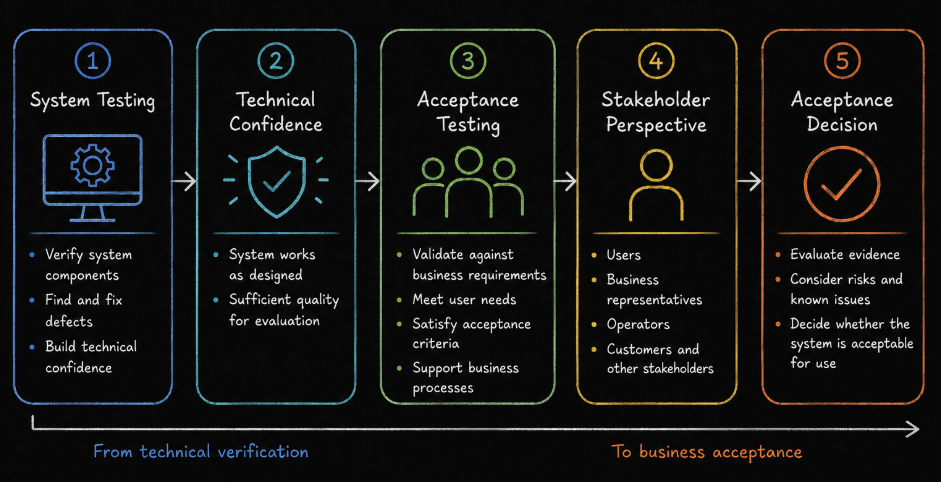
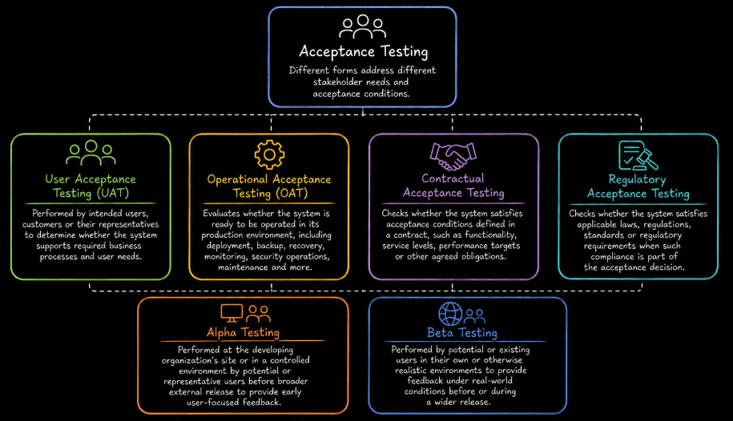
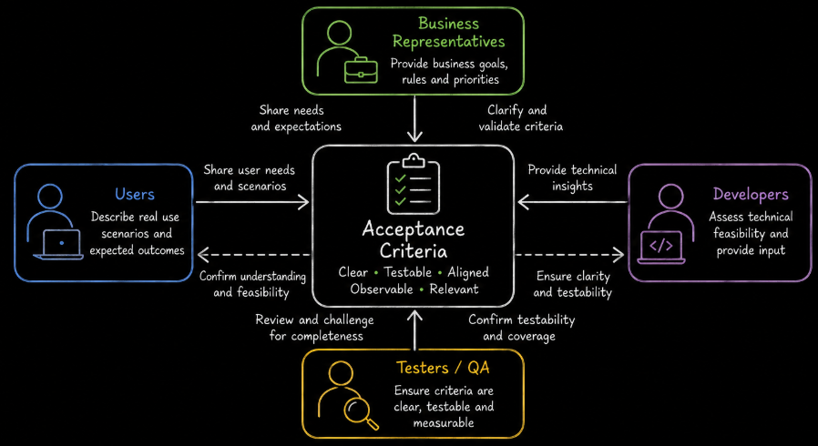

# Table of Contents: Acceptance Testing

- [Acceptance Testing](#acceptance-testing)
- [Types of Acceptance Testing](#types-of-acceptance-testing)
- [Roles and Responsibilities](#roles-and-responsibilities)
- [Collaboration-Based Test Approaches](#collaboration-based-test-approaches)
- [Acceptance Testing in Agile](#acceptance-testing-in-agile)

Acceptance testing shifts the focus from technical verification to whether the system satisfies business needs and is acceptable to its intended stakeholders.

## Acceptance Testing

Acceptance testing evaluates a system against **acceptance criteria, business requirements, user needs, and other relevant requirements** to determine whether it is acceptable to its intended stakeholders.

The focus is less on the internal implementation of the system and more on whether it supports the required business processes and outcomes. Acceptance testing therefore considers the system from the perspective of customers, users, business representatives, operators or other stakeholders who must decide whether it is suitable for its intended use.



Acceptance testing answers a key question. **Does the system satisfy the conditions required for acceptance?**

Acceptance testing is commonly performed after system testing has provided sufficient confidence in the overall system, although the exact timing depends on the development approach. In iterative and Agile development, acceptance-related validation may also take place throughout development as individual features are completed.

Acceptance tests are based on realistic business processes and usage scenarios. Test conditions may be derived from requirements, user stories, business rules, operational procedures, contracts, regulations and defined acceptance criteria.

Acceptance is not determined simply because all planned tests have been executed. The relevant stakeholders make the acceptance decision using agreed criteria, test results, known defects, business risk and any other release conditions defined for the product.

## Types of Acceptance Testing

Different forms of acceptance testing address different stakeholder needs and acceptance conditions.



**User Acceptance Testing (UAT)** is performed by intended users, customers or their representatives to determine whether the system supports required business processes and user needs. UAT uses realistic scenarios and agreed acceptance criteria to support a business acceptance decision.

UAT is typically performed in a production-like environment using controlled, realistic test data so that users can evaluate the system under conditions that closely represent actual use.

**Operational Acceptance Testing (OAT)** evaluates whether the system is ready to be operated in its production environment. Depending on the system, this may include deployment, backup and restore, recovery, monitoring, security-related operational procedures, maintenance and other operational processes.

**Contractual acceptance testing** checks whether the system satisfies acceptance conditions defined in a contract. These conditions may include required functionality, service levels, performance targets or other agreed obligations.

**Regulatory acceptance testing** checks whether the system satisfies applicable laws, regulations, standards or regulatory requirements when such compliance is part of the acceptance decision.

**Alpha testing** is typically performed at the developing organization's site or in a controlled environment by potential or representative users before broader external release. It can provide early feedback about the product from a user perspective.

**Beta testing** is performed by potential or existing users in their own or otherwise realistic environments. It provides feedback about the product under real-world conditions before or during a wider release.

These forms of acceptance testing may overlap. The appropriate approach depends on who must accept the system and which conditions must be satisfied.

## Roles and Responsibilities

Acceptance testing involves several stakeholders. Their exact responsibilities depend on the organization, product, and type of acceptance testing.

**End users and customers** execute or participate in realistic business scenarios and assess whether the system supports their needs. In UAT, their results and feedback provide important evidence for the acceptance decision.

**Business stakeholders** define or approve business requirements, acceptance criteria, and success conditions. They also evaluate test results and business risks when deciding whether the system is acceptable.

**QA and test professionals** may help plan acceptance testing, prepare test data and environments, design or review tests, coordinate execution, record results, and support participating stakeholders. They should enable the acceptance process without replacing the stakeholders who are responsible for the business decision.

**Developers** investigate and fix defects found during acceptance testing and provide technical support when unexpected behavior needs to be understood.

Clear responsibilities help ensure that acceptance testing produces useful evidence and that the final acceptance decision is made by the appropriate stakeholders.

## Collaboration-Based Test Approaches

Acceptance testing depends on a shared understanding of what stakeholders expect from the system. Collaboration is especially important when defining acceptance criteria and when evaluating the system during UAT.

Before acceptance tests are designed, **business representatives, users, testers, and developers can review acceptance criteria together**. This helps make the criteria clear, testable, and aligned with the intended business outcome. Ambiguous terms such as "fast," "easy," or "works correctly" should be replaced with observable conditions whenever possible.



For example, consider a checkout feature. Stakeholders might agree on the following acceptance criteria.

1. A customer with valid payment details can complete an order.
2. An order confirmation is displayed after a successful purchase.
3. Invalid payment details do not create an order.
4. The customer receives a clear message when payment is rejected.

These agreed criteria provide a common basis for designing acceptance tests and evaluating the results.

Collaboration continues during **User Acceptance Testing (UAT)**. Business users execute realistic workflows, testers or QA professionals may support the test process, and developers help investigate defects when needed. When unexpected behavior is found, the participants should determine whether it is a product defect, an unclear requirement, a problem with test data or the test environment or a new business request.

A typical UAT cycle begins with preparing the test environment, test data and acceptance scenarios. Business users are then introduced to the scope and testing process before executing the agreed scenarios. Issues identified during execution are reviewed and classified, and resolved issues may be retested. Finally, the responsible stakeholders review the results and decide whether the agreed acceptance conditions have been satisfied.

Results should be recorded so that they support the acceptance decision. Relevant information may include the scenario tested, expected and actual results, defects or limitations found and the acceptance status of important business processes.

Stakeholder collaboration does not mean that everyone has the same responsibility. The people authorized to accept the system remain responsible for deciding whether the available evidence and remaining risks satisfy the agreed acceptance conditions.

If the acceptance conditions are not satisfied, further work may be required before the system can be accepted. This may include fixing defects, updating the affected functionality and repeating relevant acceptance tests. In some situations, stakeholders may defer lower-priority functionality or make a risk-based release decision when the remaining issues are understood and formally accepted.

## Acceptance Testing in Agile

In Agile development, acceptance-related activities are performed throughout development rather than being treated only as a single activity at the end of the project.

Acceptance testing is closely connected to **user stories** and **acceptance criteria**. A user story describes a need from a user or stakeholder perspective, while its acceptance criteria define observable conditions that the implementation must satisfy.

Acceptance criteria can use a **scenario-oriented approach**, often written in **Given-When-Then** form. This format is commonly used with Gherkin-based tools and helps describe expected behavior through concrete examples.

```text
Given a customer has items in the shopping cart
When the customer completes checkout successfully
Then an order confirmation is displayed
```

Acceptance criteria can also use a **rule-oriented approach**, where the required behavior is expressed as a concise set of conditions.

```text
The registration page is accessible from the main navigation menu.
A valid email address is required to complete registration.
The password must satisfy the defined password rules.
Invalid input produces an appropriate error message.
```

The format is less important than the quality of the criteria. Good acceptance criteria should be understandable, testable, relevant to the business need and specific enough to support a clear evaluation.

Developers, testers and business representatives collaborate to refine acceptance criteria and review the implemented behavior. This gives the team frequent feedback and helps identify misunderstandings before they become expensive to correct.

Some acceptance tests can be automated and executed repeatedly, for example as part of a continuous integration or delivery process. Automation is most useful for stable, repeatable checks. Stakeholder evaluation is still necessary when acceptance depends on business judgment, usability or other factors that cannot be decided by an automated test alone.

By combining clear acceptance criteria, frequent validation and stakeholder feedback, Agile teams can assess acceptance continuously while still making explicit acceptance or release decisions when required.
