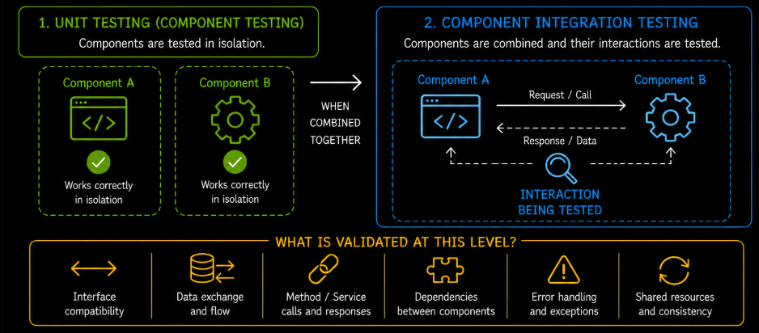
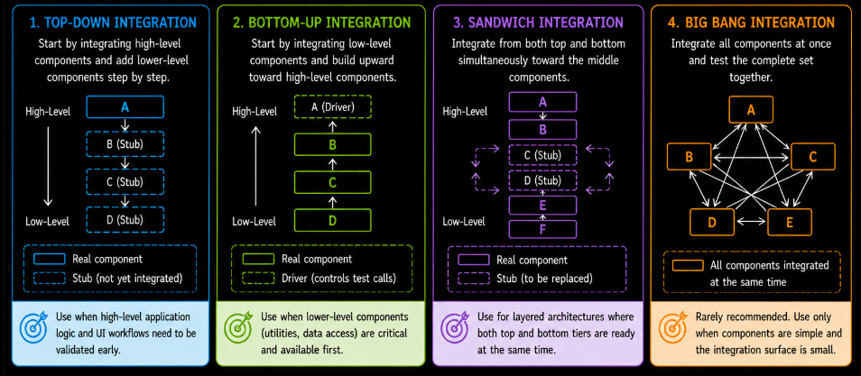
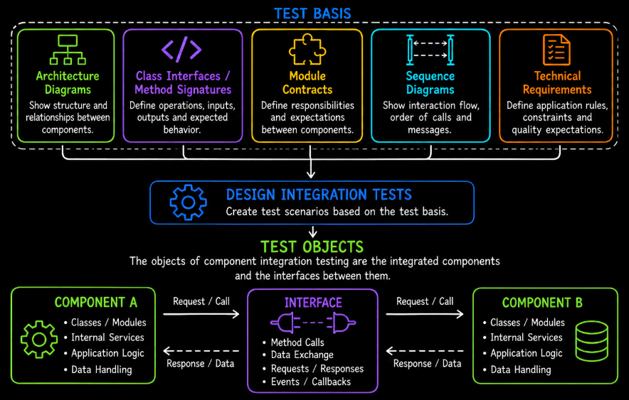
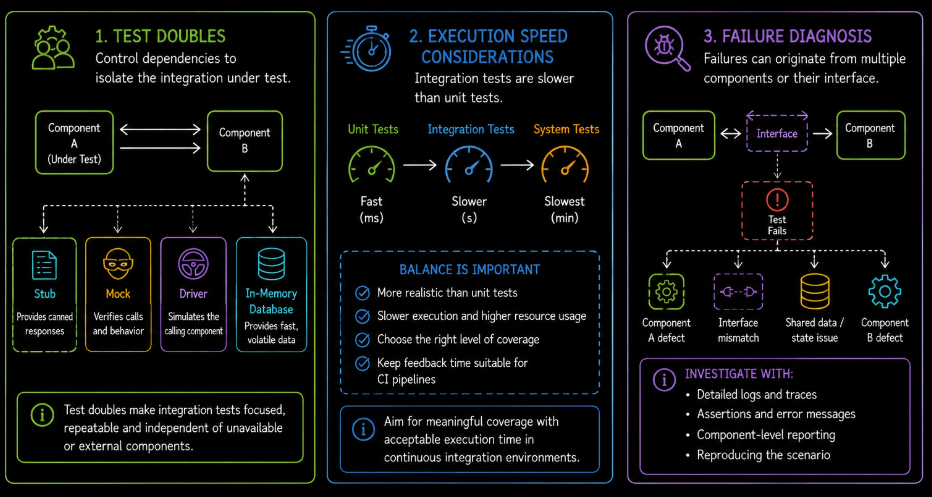

# Table of Contents: Component Integration Testing

- [Component Integration Testing](#component-integration-testing)
- [Objectives of Component Integration Testing](#objectives-of-component-integration-testing)
- [Integration Strategies](#integration-strategies)
- [Test Basis and Test Objects](#test-basis-and-test-objects)
- [Defect Types in Integration Testing](#defect-types-in-integration-testing)
- [Test Execution Approaches](#test-execution-approaches)
- [Roles and Responsibilities](#roles-and-responsibilities)

After individual units are verified in isolation, the next step is to validate how they interact when combined.

## Component Integration Testing

Component integration testing is a testing level that focuses on verifying interactions and communication between integrated components within the system. After individual units have been validated during unit testing, this level checks whether connected components work together correctly.

The primary goal is to identify defects related to interfaces, data exchange, communication and dependencies between components. Even when individual units function correctly on their own, problems may appear when they exchange data, call one another or share resources.

Testing at this level validates how information flows between connected parts of the application. It checks whether components pass data correctly, handle requests and responses as expected and manage dependencies appropriately under different conditions.

Component integration testing typically focuses on small groups of integrated units rather than the complete system. This narrower scope helps teams detect and isolate interaction-related defects before larger parts of the application are combined.

Depending on the architecture, the components under test may include classes, modules, libraries, internal services or other internal application units.

## Objectives of Component Integration Testing

The primary objective of component integration testing is to verify that integrated components communicate and interact correctly when combined. Testing focuses on interfaces, data flow and dependencies between connected units.

Component integration testing helps identify defects that may not appear during isolated unit testing, including interface mismatches, incorrect data exchange, communication failures and dependency-related problems. Detecting these issues early reduces the risk that they will propagate into higher testing levels.

Testing also verifies that connected components handle requests, responses, error conditions and shared resources correctly. Both successful interactions and relevant failure scenarios should be covered so that the integration behaves predictably under expected and unexpected conditions.

## Integration Strategies

Integration strategies define how components are combined and tested. The selected strategy influences how quickly interactions can be validated and how easily defects can be isolated.

**Incremental integration testing** combines and tests components gradually in smaller groups. Because only a limited number of components are added at each step, failures are generally easier to trace to a recently introduced interaction.

A **top-down approach** integrates higher-level components first while lower-level dependencies may initially be replaced with stubs. It is useful when high-level application logic or user-facing workflows need to be validated early.

A **bottom-up approach** integrates lower-level components first while higher-level components may temporarily be replaced with drivers. It is useful when foundational utilities, data-access components or other lower-level modules are critical and sufficiently stable to validate first.

A **sandwich or hybrid approach** combines top-down and bottom-up integration so that testing proceeds from both ends of a layered architecture. It can be effective when upper and lower tiers are available at the same time and teams want to validate them in parallel before integrating the middle layers.

**Big bang integration testing** combines many or all components at once before testing their interactions. This approach makes defect isolation difficult because a failure may originate from several possible components or interfaces. It is rarely preferred and is generally considered only when the components are simple and the integration surface is small.

The appropriate strategy depends on the application architecture, component availability, technical risk, development workflow and the need for early feedback.

## Test Basis and Test Objects

Component integration testing relies on technical information that describes how internal components are expected to interact.

The **test basis** is the information used to determine what interactions should be tested and what behavior is expected. It may include architecture diagrams, interface specifications, class interfaces, method signatures, module contracts, design documentation, sequence diagrams and technical requirements describing communication between internal components.

These artifacts help testers and developers understand component dependencies, expected data flow, invocation sequences and interface behavior within the application.

The **test objects** are the integrated components and the interfaces connecting them. Depending on the architecture, these may include classes, modules, libraries, internal services or internal application interfaces that communicate during execution.

Testing focuses primarily on the interactions, communication paths and exchanged data between the connected components rather than retesting each component's isolated internal behavior.

Supporting elements such as **stubs, drivers, mocks or other test doubles** may be used when a dependency is unavailable or when the integration under test needs to be isolated from surrounding components.

## Defect Types in Integration Testing

Component integration testing primarily identifies defects that occur when internal components interact. A component may behave correctly in isolation while still fail when its assumptions do not match those of another component.

**Interface mismatches** occur when connected components disagree about inputs, outputs, data types, method signatures, message structures or other interface expectations. These mismatches can cause failed calls, rejected data or incorrect processing.

**Incorrect data flow** occurs when information is transferred incorrectly, incompletely or in the wrong sequence between components. This can produce invalid outputs, inconsistent state or failed application workflows.

**Communication failures** can occur when a component does not invoke another component correctly, does not receive the expected response or handles timing and communication conditions incorrectly.

**Dependency-handling defects** occur when components rely on shared resources, libraries, configuration or state that is unavailable, inconsistent or managed incorrectly.

**Exception-handling and recovery defects** occur when connected components do not propagate, translate or recover from errors as expected.

Diagnosing an integration failure can require more investigation than diagnosing a unit-test failure. The defect may be located in either interacting component, their shared state or the interface between them. Component-level logs, traces and test reports can help identify where the interaction diverged from the expected behavior.

## Test Execution Approaches

Component integration testing may use both manual and automated execution, although automation is particularly important because integrations need to be checked repeatedly as components change.

**Manual testing** can support exploratory investigation and troubleshooting when developers or testers need to inspect a complex interaction directly. It is generally most useful when the behavior is difficult to reproduce automatically or when additional investigation is needed after a failure.

**Automated integration testing** uses testing frameworks and scripts to exercise interactions between connected components repeatedly and consistently. Automated tests can verify interface behavior, data flow, dependencies, error handling and shared state as part of the development workflow.

Automated component integration tests often use **test doubles** such as stubs, drivers or mocks to control dependencies that are outside the interaction being tested. In-memory databases or other lightweight substitutes may also be used when they provide the behavior required for the test while keeping execution controlled and repeatable.

Integration tests usually execute more slowly than unit tests because they involve multiple components and may require additional setup, data or infrastructure. Teams therefore balance integration coverage with execution time so that automated pipelines continue to provide useful feedback without unnecessary delay.

Failure diagnosis is also more complex than in isolated unit testing because several components participate in the test. Useful diagnostics should make it possible to determine which interaction failed. Component-specific logs, traces, assertions and reporting can help locate whether the problem originates in a component, shared state or the interface between components.

Automated component integration tests are commonly included in continuous integration pipelines so that important internal interactions are revalidated whenever relevant code changes.

## Roles and Responsibilities

Component integration testing involves collaboration between technical roles responsible for developing, integrating and validating internal application components.

**Developers** usually play a central role because they understand the interfaces and dependencies between the components they implement. They often create and maintain automated component integration tests, investigate failures and correct defects in component interactions.

**QA engineers** may contribute additional integration scenarios, support risk-based coverage, investigate defects and help maintain integration test automation where this responsibility is shared with development teams.

**Test leads or technical leads** may define the integration-testing approach, coordinate coverage across teams and ensure that important component interactions and technical risks are addressed.

In environments that use automated build and continuous integration pipelines, **DevOps engineers** may support the infrastructure required to execute integration tests reliably, including build agents, test environments and pipeline configuration.

Clear ownership of components, interfaces and automated tests helps teams diagnose failures more efficiently and maintain reliable internal integrations as the application evolves.
