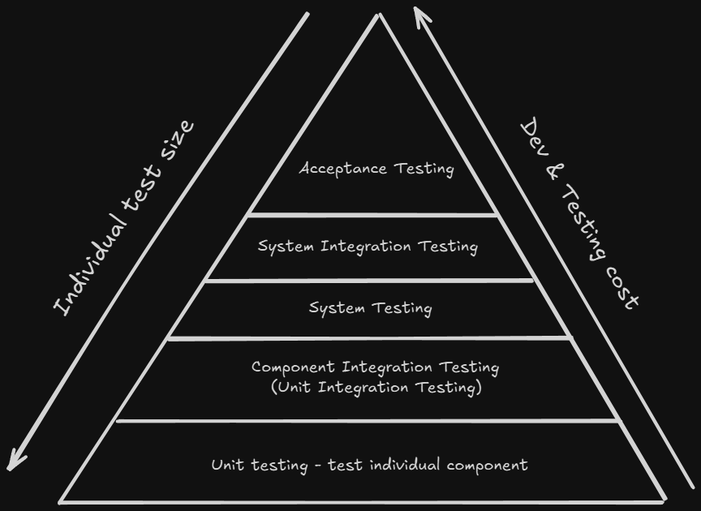

<!-- markdownlint-disable MD033 -->
# Content of Table

- [Levels of Testing](#levels-of-testing)
  - [Component Testing (Unit Testing)](#component-testing-unit-testing)
  - [Component Integration Testing (Unit Integration Testing)](#component-integration-testing-unit-integration-testing)
  - [System Testing](#system-testing)
  - [System Integration Testing](#system-integration-testing)
  - [Acceptance Testing](#acceptance-testing)

## Levels of Testing

### Component Testing (Unit Testing)

**Explanation:**

Component Testing, also known as Unit Testing, is the first level of software testing where individual components (or units) of a software are tested. The purpose is to validate that each unit of the software performs as designed.

    
Overview:

1. **Isolation:** In unit testing, components are tested in isolation from the rest of the system. This means that if a test fails, it's clear that the fault is within the unit under test.

2. **Mocking:** To achieve isolation, other components that the unit interacts with may need to be simulated.

3. **White-Box Testing:** Unit testing is a type of white-box testing as it requires knowledge of the internal workings of the unit to write the tests.

4. **Automated:** Unit tests are typically automated and run as part of the build process. This allows for regular regression testing as the codebase evolves.

5. **Test-Driven Development (TDD):** Unit testing is a key part of TDD, a development methodology where failing unit tests are written before the code is written to make them pass.

6. **Coverage:** A measure of how much of the codebase is tested by unit tests. High coverage is desirable as it reduces the chance of an undetected bug.

### Component Integration Testing (Unit Integration Testing)

**Explanation:**

Component Integration Testing, also known as Unit Integration Testing, is the process of testing the interactions or interfaces between two or more components within the same module or application.

    
Overview:

1. **Interaction Between Units:** The main focus of integration testing is to test the interaction points between different units.

2. **Applicability:** Not mandatory for all applications. Conducted if the application has features requiring component interactions.

3. **Integration Testing Levels:**
    - **Component Integration Testing:** Within the same module.
    - **System Integration Testing:** Between different modules or systems.

4. **Web Services Integration:** Includes testing APIs to ensure correct request processing and response handling.

5. **Integration Strategy:** Existing integration strategies such as **bottom-up**, **top-down**, or **big bang** approaches.

### System Testing

**Explanation:**

System Testing is a level of testing that validates the complete and integrated software product.

    
Overview:

1. **Whole System:** System testing involves testing the entire system as a whole. To evaluate the system's compliance with its specified requirements.

2. **Functional and Non-Functional Testing:**
    - **Functional Testing:** System testing includes comprehensive functional testing to ensure that the system meets the functional requirements.
    - **Non-Functional Testing:** Although system testing itself is primarily functional, it serves as a prerequisite for non-functional testing.

3. **Environment-Related Factors:** Testing environment-related factors, such as software and hardware configurations, which cannot be fully tested at lower levels.

4. **Representative Test Environment:** System testing is conducted in an environment that closely resembles the production environment but is not live.

5. **Independent Test Team:** System testing is often performed by an independent test team, separate from the teams that conducted earlier test levels.

6. **Product Risks:** Mitigate product risks that can only be assessed when the system is fully integrated.

7. **Incomplete Requirements:** System testing helps address incomplete requirements and product risks that were not fully understood or defined during earlier phases.

8. **Simulations and Subsystems:** System testing may use simulations of subsystems or services to create a representative test environment.

### System Integration Testing

**Explanation:**

System Integration Testing (SIT) is a testing phase where individual units or components of a software system are combined and tested as a group.

    
Overview:

1. **Interaction Between Systems:** SIT focuses on testing the interfaces and interactions between two or more systems or components. This includes both internal and external systems that communicate with each other.

2. **Test Environment:** SIT should be conducted in an environment that closely mirrors the production environment.

3. **End-to-End Testing:** SIT is often considered a type of end-to-end (E2E) testing, as it can involve testing processes that span multiple systems from start to finish.

### Acceptance Testing

**Explanation:**

Acceptance Testing is the final level of software testing performed after System and Integration Testing. It aims to evaluate the system's compliance with the business requirements.

    
Key Concepts:

1. **User Perspective:** Acceptance testing is conducted from the user's perspective.

2. **Business Requirements:** The main focus of acceptance testing is to validate the system against business requirements.

3. **Types of Acceptance Testing:**
    - **User Acceptance Testing (UAT):** This is the final phase of acceptance testing where the actual users test the software to validate the functionality and usability.

    - **Operational Acceptance Testing (OAT):** OAT focuses on validating the operational aspects of the system to ensure it can be deployed, installed, and operated in the environment.

    - **Contract and Regulatory Acceptance Testing:** Ensures that the system meets contract obligations and regulatory standards.

4. **Alpha and Beta Testing:**
    - **Alpha Testing:** Conducted by the customer in a pre-production environment to validate the product before it is released.

    - **Beta Testing:** Conducted by a limited number of end users in the real environment to gather feedback before the product is officially released.

