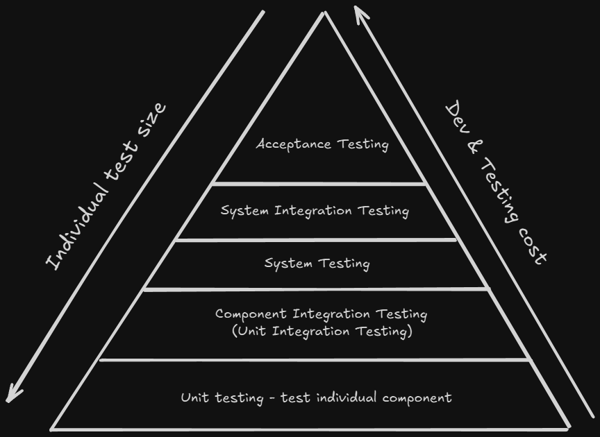

# Content of Table on the Levels of Testing

- [Component Testing (Unit Testing)](#component-testing-unit-testing)
- [Component Integration Testing (Unit Integration Testing)](#component-integration-testing-unit-integration-testing)
- [System Testing](#system-testing)
- [System Integration Testing](#system-integration-testing)
- [Acceptance Testing](#acceptance-testing)

After learning what testing is, how the test process works, and how teams organize quality.

**At what stages do we test software?**

Testing is not done only once at the end. Instead, it is performed at different levels, each focusing on a different scope of the system. These levels help ensure that problems are detected as early as possible and that the system works correctly both internally and externally.

We will start from the smallest pieces of code and move step by step toward full business validation.

## Component Testing (Unit Testing)

Component testing, also known as **unit testing**, verifies that individual units of code **function correctly in isolation**.

A unit is usually the smallest testable part of the software, such as a **function**, **method**, or **class**. The main goal is to make sure that each unit behaves correctly on its own before it is combined with others.

During component testing, each unit is tested separately. This makes it easier to locate defects because failures can be traced directly to a specific component.

Since units often depend on other parts of the system, those dependencies are usually replaced with **mock objects**. Mocking allows the unit to be tested without relying on real **databases**, **APIs**, or **services**.

**Component testing** is a form of **white-box testing**, because the tester (usually the **developer**) uses knowledge of the **internal code** structure.

These tests are usually **automated** and executed frequently, especially as part of **regression testing**.

Component testing is closely connected to **Test-Driven Development (TDD)**, where tests are written before the code and guide the implementation.

Another important aspect is **coverage**, which measures how much of the component’s code is exercised by tests. Coverage does **not guarantee quality**, but it helps identify untested areas.

## Component Integration Testing (Unit Integration Testing)

Once individual units are verified, they are combined and tested together. This is called **component integration testing**.

The purpose of this level is to verify how units interact with each other. The focus is not only on the logic inside units, but also,

- How they connect through their **interfaces**;
- How they exchange information through **communication**;
- How information moves between them as **data flow**.

For example, if a **Login module** sends user details to a **Database module**, integration testing checks whether.

- The function name and parameters match correctly between modules (**interface**);
- The request and response are sent and received correctly (**communication**);
- The user data is passed, processed, and stored correctly (**data flow**).

If any of these fail, the modules may work individually, but the system will not work correctly when they are connected.

There are several common integration approaches.

In **bottom-up integration**, testing starts with **lower-level modules**. These are **tested first**, and then **higher-level modules** are added gradually.

For example, testing may start with **database module**, **payment processing module**.

This approach ensures that basic technical functions work correctly before higher-level features depend on them.

Once these **lower-level** modules work correctly, they are connected to **higher-level** modules such as, **order module**, **user interface module**.

In **top-down integration**, testing starts with **higher-level modules**. **Lower-level modules** are added later, often using **stubs** to **simulate missing components**.

For example, testing may start with the **main application screen**, while lower-level modules such as the **database** and **payment system** are temporarily replaced with **stubs**.

Temporarily replaced with **stubs** that return fake or simplified data until the real modules are ready.

This approach helps test main system behavior early, even when all components are not yet complete.

In **big bang integration**, all modules are integrated at the same time after unit testing is finished, and the whole system is tested together.

For example, the **login module**, **payment module**, **database module**, and **user interface module** are connected all at once and tested as a complete system.

This approach is faster to start, but harder to debug. When an error occurs, it is difficult to determine which module caused the problem.

Component integration testing helps detect **interface** problems, **communication** issues, and **data flow** errors early, before the entire system is fully assembled.

## System Testing

**Explanation:**

System testing validates the complete, integrated software product against its specified requirements.

At this level, the system is tested as a **whole**, not as individual components. The goal is to confirm that the system behaves correctly from the **users point of view**.

System testing primarily focuses on **functional requirements**, checking whether features work as expected.

Although system testing itself is **mainly functional**, it prepares the ground for **non-functional testing** such as **performance**, **security**, **usability**, and **reliability**.

System testing often includes **end-to-end scenarios**, where complete business workflows are executed from start to finish.

This testing is usually performed in an **environment that closely simulates production**, so that system behavior can be observed under realistic conditions.

System testing is often performed by an **independent test team** to provide an objective and **unbiased** evaluation.

## System Integration Testing

**Explanation:**

System integration testing focuses on how the system under test interacts with external systems and services.

While **system testing** checks the **internal behavior of the system**, system integration testing checks **communication beyond system boundaries**.

This includes interactions with **external databases**, **third-party APIs**, **payment systems**, **identity providers**, **messaging services**, and other **integrated systems**.

The goal is to verify that data is **exchanged** correctly, **protocols** are respected, and **failures** are handled properly.

Because of this, system integration testing usually requires a **test environment that is very close to production**, including realistic **configurations** and **external connections**.

This level is especially important in service-based architectures.

## Acceptance Testing

**Explanation:**

Acceptance testing confirms that the system meets business requirements and is ready for deployment.

At this level, the focus shifts from technical correctness to business value.

**Acceptance testing** is based on real-world scenarios and business expectations. It answers the question, **is this system acceptable for use?**

There are several types of acceptance testing.

**User Acceptance Testing (UAT)** is the final validation performed by end users.

**Operational Acceptance Testing (OAT)** validates operational aspects such as **installation**, **deployment**, **backup**, **recovery**, and **monitoring**.

**Contract and regulatory acceptance testing** ensures that contractual obligations and **legal or regulatory requirements** are fulfilled.

Acceptance testing may also include **alpha and beta testing**.

**Alpha testing** is conducted by the **customer in a pre-production environment**.

**Beta testing** is conducted by a **limited group of end users in the real environment** to gather feedback before official release.

Although **acceptance testing** is mainly performed by **end users** or **stakeholders**, **QA** teams prepare the **environment**, **support execution**, and often perform **preliminary acceptance testing** to ensure readiness.
