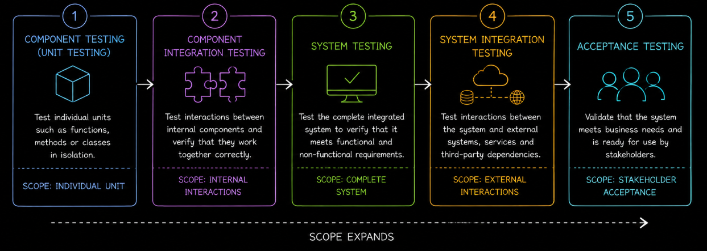

# Table of Contents: Levels of Testing Summary

- [Component Testing (Unit Testing)](#component-testing-unit-testing)
- [Component Integration Testing](#component-integration-testing)
- [System Testing](#system-testing)
- [System Integration Testing](#system-integration-testing)
- [Acceptance Testing](#acceptance-testing)

This summary brings together the key concepts from the **Levels of Testing** module. It is designed as a quick reference for revision and for explaining the purpose, scope and differences between the testing levels.

Testing progresses from **individual units**, through **internal component interactions**, to the **complete application**, then to **external system interactions** and finally to **stakeholder acceptance**. Each testing level has a distinct purpose and can reveal defects that may not be visible at another level.

## Component Testing (Unit Testing)

**Component Testing**, also known as **Unit Testing**, verifies individual units of software in isolation. A unit is usually a small testable part of the application, such as a function, method, class or small module.

The objective is to confirm that the unit behaves correctly for expected inputs, boundary conditions, invalid inputs and relevant error situations before it is integrated with other components.

Dependencies may be replaced with **test doubles** so that the unit can be tested independently. Common test doubles include **dummies, stubs, spies, mocks and fakes**.

Unit tests commonly follow the **Arrange-Act-Assert (AAA)** pattern. **Arrange** prepares the test conditions, **Act** executes the unit under test and **Assert** verifies the expected outcome.

Component testing frequently uses white-box techniques such as **statement testing, decision or branch testing, condition testing, path testing and loop testing**. Tests are usually automated and executed frequently to provide fast feedback.

**Code coverage** can help identify untested program structures, but high coverage does not guarantee effective testing. The quality of the assertions and the relevance of the tested behavior remain more important than achieving a particular coverage percentage.

The key point is that **Component Testing verifies one unit in isolation**.

## Component Integration Testing

**Component Integration Testing** verifies interactions between internal components after those components have been tested individually.

The focus is on **interfaces, data exchange, dependencies, shared resources and communication between connected components**. A component can work correctly in isolation and still fail when it interacts with another component.

Integration can be performed using **top-down, bottom-up, sandwich or big bang strategies**. The appropriate strategy depends on the application architecture, component availability and the interactions that need to be validated.

Typical defects include incorrect interface assumptions, incompatible data, incorrect calls or responses, dependency problems, shared-state issues and incorrect error handling.

Integration tests are generally slower and more complex than isolated unit tests. When a test fails, investigation may be required to determine whether the problem exists in one of the components, their shared state or the interface between them.

The key point is that **Component Integration Testing verifies interactions between internal components**.

## System Testing

**System Testing** validates the complete integrated application as a whole within its defined system boundary.

**Functional system testing** verifies what the application does, including application rules, workflows, calculations, data processing and complete application processes.

**Non-functional system testing** evaluates how well the application operates. Depending on the requirements, this can include **performance, security, usability, accessibility, compatibility and recoverability testing**.

System testing may exercise behavior across the **UI, service or API and database layers**. Testing across these layers helps validate complete application behavior and can also help identify where a failure originates.

System tests often require realistic application states, configurations and test data. External dependencies may be represented by stable stubs or controlled sandboxes when the objective is to evaluate the application itself rather than external integration behavior.

The key point is that **System Testing verifies the complete application within its own boundary**.

## System Integration Testing

**System Integration Testing** verifies how the complete application communicates with **external systems, services and shared platforms**.

Testing may cover external APIs, shared databases, third-party services, messaging systems, authentication providers and other dependencies outside the application's internal boundary.

Important areas include **data exchange, authentication, interface compatibility, contract validation, schema or interface versioning and backward compatibility**.

Testing should also verify behavior when external dependencies fail or behave unexpectedly. This can include **timeout handling, retry logic, circuit breaker activation, graceful degradation and dead-letter queue processing** where relevant.

Distributed integration scenarios may require test data to remain correlated across multiple systems so that identifiers, states and timestamps represent the same entity throughout the workflow.

The key distinction is that **System Testing validates the application itself, while System Integration Testing validates communication between the application and external systems**.

## Acceptance Testing

**Acceptance Testing** evaluates whether the system satisfies the conditions required for acceptance by its intended stakeholders.

Different forms include **User Acceptance Testing (UAT), Operational Acceptance Testing (OAT), contractual acceptance testing, regulatory acceptance testing, alpha testing and beta testing**.

Acceptance testing uses realistic scenarios and agreed **acceptance criteria**. Stakeholders collaborate to ensure that these criteria are clear, observable, testable and aligned with the intended outcome.

During UAT, users or business representatives evaluate realistic workflows while testers may support execution and developers may help investigate defects. The people authorized to accept the system remain responsible for the final acceptance decision.

Acceptance is not determined simply because all planned tests have been executed. The decision considers **acceptance criteria, test results, known defects or limitations and remaining risks**.

The key point is that **Acceptance Testing determines whether the system satisfies the agreed conditions for acceptance**.

Together, the testing levels provide different perspectives on software quality. Testing progresses from verifying individual units and their internal interactions to evaluating the complete application, its external integrations and ultimately whether it satisfies the conditions required for acceptance.

Passing one testing level does not replace the need for another. Each level has a different scope and is designed to reveal problems that may not be visible at other levels.
