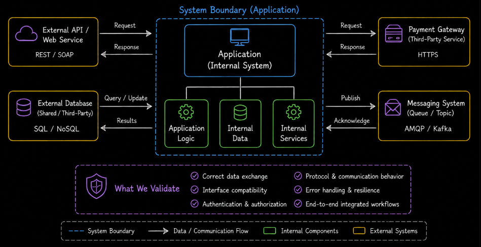
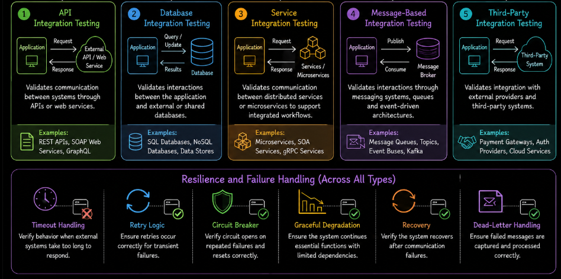
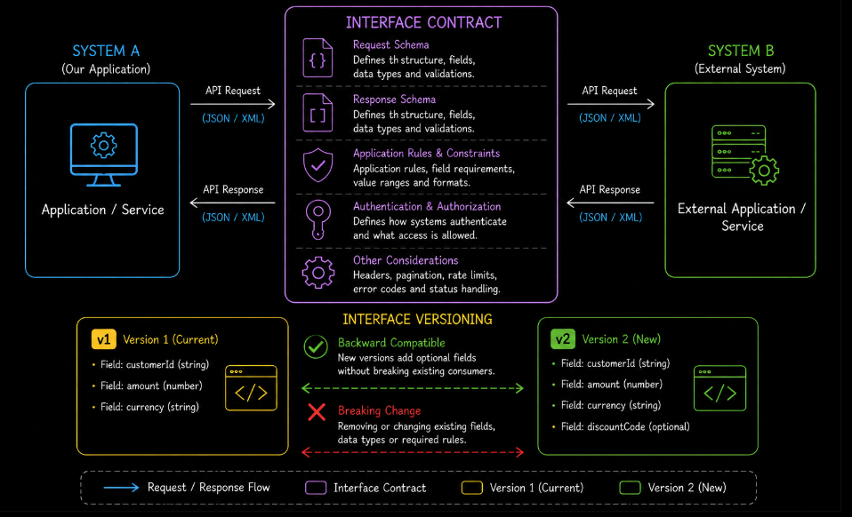
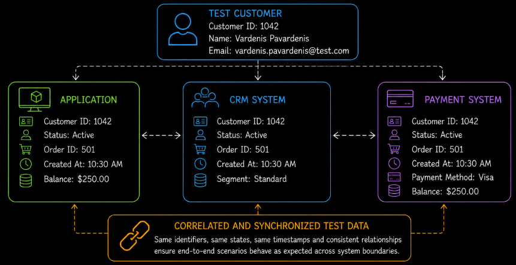

# Table of Contents: System Integration Testing

- [System Integration Testing](#system-integration-testing)
- [Objectives and Scope of System Integration Testing](#objectives-and-scope-of-system-integration-testing)
- [Types of System Integration Testing](#types-of-system-integration-testing)
- [Integration Scenarios and Interfaces](#integration-scenarios-and-interfaces)
- [Test Execution Approaches](#test-execution-approaches)
- [Roles and Responsibilities](#roles-and-responsibilities)
- [Test Environment and Data](#test-environment-and-data)

After the complete integrated system has been validated within its own system boundary during system testing, the next level focuses on how that system interacts with external systems and services.

## System Integration Testing

System integration testing validates the interactions between the complete system and **external systems, services and other external dependencies**.

The key distinction from system testing is the **system boundary**. System testing evaluates the behavior of the complete application within that boundary. System integration testing extends the focus beyond the boundary to verify that the application communicates correctly with external dependencies.

At this level, testing focuses on external communication, interface compatibility, data exchange and workflows that cross system boundaries. The goal is to confirm that information is transferred correctly, external dependencies behave as expected and interactions between connected systems support the required application processes.

For example, an online shopping application may be fully validated during system testing using a controlled payment service. During system integration testing, the interaction with the actual payment provider's test environment can be validated, including requests, responses, authentication, data mapping and failure handling.

System integration testing also identifies problems that may appear only when independently managed systems communicate. These can include incompatible interface versions, incorrect configurations, authentication failures, unexpected responses and communication failures.

Testing also verifies how the application responds when an external dependency does not behave as expected. Relevant scenarios include timeouts, unavailable services, invalid responses and interrupted communication. The application should handle these conditions according to its defined resilience and error-handling requirements.

Successful system integration testing provides confidence that the application can interact reliably with the external systems and services required for its operation.

## Objectives and Scope of System Integration Testing

The primary objective of system integration testing is to ensure that the application communicates reliably and consistently with external systems, services and third-party components under realistic operating conditions. At this level, testing focuses on validating external interfaces, integrated workflows and communication behavior across system boundaries.

System integration testing verifies that connected systems exchange information correctly, process requests and responses as expected and support required application processes without failures or inconsistencies. This includes validation of communication protocols, interface compatibility, authentication mechanisms and data mapping between integrated platforms.

Another important objective is identifying defects related to external dependencies, including incorrect configurations, communication failures, unavailable services, timeout issues and inconsistent external responses. Testing also validates how the application behaves under different integration scenarios, including partial failures and unexpected external behavior, helping ensure overall system stability and reliability.

The scope of system integration testing includes validation of interactions between the application and external systems that exist outside the internal system boundary. Testing focuses on communication, data exchange and workflow execution across connected platforms rather than on internal component behavior, which is addressed during earlier testing levels.

By clearly defining both objectives and scope, teams can improve confidence in external integrations, reduce the risk of production failures and ensure that interconnected systems operate reliably together.

## Types of System Integration Testing

System integration testing can involve different types of validation depending on the architecture, communication model and external dependencies used by the application. These testing types help ensure that integrations between systems operate reliably under various conditions and scenarios.

One common type is **API integration testing**, which focuses on validating communication between systems through APIs or web services. This includes verifying request handling, response structures, authentication, status codes and correct data exchange between connected applications.

Another important type is **database integration testing**, where testing validates interactions between the application and external or shared databases. This helps ensure that data is stored, retrieved and synchronized correctly across system boundaries. Internal database behavior within the application is validated during system testing rather than system integration testing.

**Service integration testing** focuses on communication between distributed services or microservices, ensuring that interconnected services exchange information correctly and support expected workflows.

In environments involving asynchronous communication, **message-based integration testing** validates interactions through messaging systems, queues or event-driven architectures. This includes ensuring that messages are delivered, processed and handled correctly between systems.

System integration testing may also include **third-party integration testing**, where the application is validated against external providers such as payment gateways, authentication services, cloud platforms or external application systems.

In addition to successful communication scenarios, system integration testing validates how the application behaves when external dependencies fail or respond unexpectedly. Resilience testing may include verifying timeout handling, retry logic, circuit breaker activation, graceful degradation and recovery after communication failures. For asynchronous integrations, it may also include verifying how failed messages are handled, such as through dead-letter queues.

By applying different types of system integration testing, teams can validate complex external interactions more effectively and improve confidence in the reliability of integrated systems.

## Integration Scenarios and Interfaces

System integration testing relies on clearly defined integration scenarios and interfaces to validate how connected systems communicate and exchange information under realistic conditions.

An **integration scenario** describes a workflow or interaction involving multiple systems, services or external components working together to complete a specific process. These scenarios help verify that integrated systems behave correctly during real application operations and that information flows consistently across system boundaries.

Integration scenarios may include activities such as processing payments, authenticating users through external providers, exchanging data between platforms or communicating with third-party APIs and services.

The **interfaces** involved in system integration testing define how systems communicate with each other. These interfaces may include APIs, web services, databases, messaging systems, file exchanges or other communication mechanisms used to transfer information between connected applications.

Testing focuses on validating that interfaces correctly process requests, responses and data formats while ensuring compatibility between integrated systems. This includes verifying communication protocols, authentication methods, data mapping and error handling behavior.

Interface testing should also verify that connected systems follow their agreed **interface contracts**. For APIs and web services, these contracts may be described using specifications such as OpenAPI or WSDL. Testing can verify that requests, responses, data types and required fields conform to the defined contract.

External interfaces may change over time, so testing should also cover **schema versioning** and **backward compatibility**. When multiple interface versions are supported, tests should confirm that the application communicates correctly with the current version and continues to handle older supported versions as required.

Integration scenarios also help validate how the application behaves when external systems respond unexpectedly, become unavailable or return invalid data. This is important for ensuring reliability and stability across interconnected environments.

By validating realistic scenarios, interface contracts and communication behavior, teams can improve confidence that integrated systems will operate correctly in production environments where multiple external dependencies interact continuously.

## Test Execution Approaches

System integration testing can be performed using different execution approaches depending on the complexity of integrations, project requirements and development practices. The two primary approaches are **manual testing** and **automated testing**, which are often combined to achieve reliable and efficient integration validation.

**Manual testing** involves validating communication between systems without relying entirely on automation tools. This approach can be useful for exploratory integration scenarios, troubleshooting external communication issues and validating complex workflows involving multiple connected systems.

**Automated testing** uses scripts, frameworks and testing tools to validate integrations automatically and repeatedly. Automation is especially important in system integration testing because external interfaces, APIs and distributed services often require frequent regression validation as systems evolve.

Automated execution helps ensure consistent verification of requests, responses, authentication, data exchange and communication behavior across integrated systems. It also supports continuous integration and continuous delivery pipelines, where integration tests may be executed automatically after deployments or code changes.

In some cases, system integration testing may involve simulated external systems, service virtualization or mock services when real dependencies are unavailable, unstable or expensive to access during testing.

System integration tests also require careful **external state management**. A test may need to create, synchronize and clean up data across several independent systems. Proper cleanup helps ensure that one test does not affect later tests or leave inconsistent data in shared external environments.

External test environments can sometimes be unstable or temporarily unavailable. Tests should distinguish integration defects from failures caused by unavailable sandbox services, network problems or other unstable dependencies. Controlled retries, appropriate error reporting and service virtualization can help manage these situations without hiding genuine integration defects.

Another important consideration is **idempotency**. An idempotent operation can be repeated without causing unintended additional changes. Integration tests should verify idempotent behavior where required, especially for operations involving payments, orders, messages or other changes to shared external systems.

In practice, system integration testing commonly combines manual validation with automated execution to balance flexibility, efficiency and reliability across different integration scenarios.

By selecting appropriate execution approaches and managing external dependencies carefully, teams can improve integration coverage, accelerate defect detection and maintain stable communication between interconnected systems.

## Roles and Responsibilities

System integration testing involves collaboration between multiple technical and business roles to ensure that interconnected systems communicate reliably and support expected workflows across system boundaries.

**QA engineers** design, execute and maintain integration test scenarios that validate communication between external systems, services and interfaces. They help verify that integrated workflows behave correctly and that defects related to external dependencies are identified and reported effectively.

**Developers** support system integration testing by implementing integrations, troubleshooting communication issues and resolving defects related to APIs, services, data mapping or interface compatibility. They may also assist in creating mock services, test utilities and automated integration tests.

**Test leads or test managers** coordinate integration testing activities, define testing strategies and ensure that testing aligns with project requirements, timelines and quality objectives. They also help coordinate communication between teams responsible for different integrated systems.

Because system integration testing often involves external services and distributed environments, **DevOps engineers or infrastructure specialists** may support testing by managing environments, deployments, configurations and integration pipelines required for reliable test execution.

In some projects, **business analysts or domain specialists** may contribute by validating integrated workflows and ensuring that communication between systems supports expected application processes and operational requirements.

Clearly defined roles and effective collaboration are especially important in system integration testing because integration-related issues often involve multiple teams, technologies and external dependencies.

By establishing clear responsibilities, teams can improve coordination, accelerate issue resolution and support reliable integration testing across interconnected systems.

## Test Environment and Data

System integration testing requires stable environments and realistic test data to ensure that communication between interconnected systems can be validated accurately and reliably under conditions that closely reflect production usage.

The **test environment** used for system integration testing should include the required external systems, services, APIs, databases and communication channels involved in integration workflows. This helps ensure that interfaces, dependencies and data exchange mechanisms behave consistently during testing.

Because external integrations often involve distributed environments and third-party services, maintaining correct configurations, network connectivity, authentication settings and service availability is especially important for reliable execution.

In some situations, real external systems may not always be available or practical to use during testing. In these cases, teams may use mock services, simulators or service virtualization to emulate external dependencies and support controlled integration validation.

**Test data** also plays a critical role in system integration testing because integrated systems frequently exchange complex application information across multiple platforms. Data used during testing should represent realistic scenarios, including successful transactions, invalid requests, partial failures and boundary conditions.

Test data must also be coordinated across connected systems. For example, the same customer or order may need to exist in several platforms with matching identifiers and compatible states. Identifiers, states, timestamps and related data should be correlated across systems so that complete integration scenarios can execute consistently.

Testing with meaningful and coordinated data helps validate how systems process, transform and synchronize information while ensuring that communication behaves correctly under different operational situations.

When production-like data is used, organizations must also ensure that sensitive information is protected and managed according to privacy regulations, security policies and compliance requirements.

By maintaining reliable environments and coordinated, realistic test data, teams can improve confidence in external integrations and reduce the likelihood of communication failures occurring in production environments.
