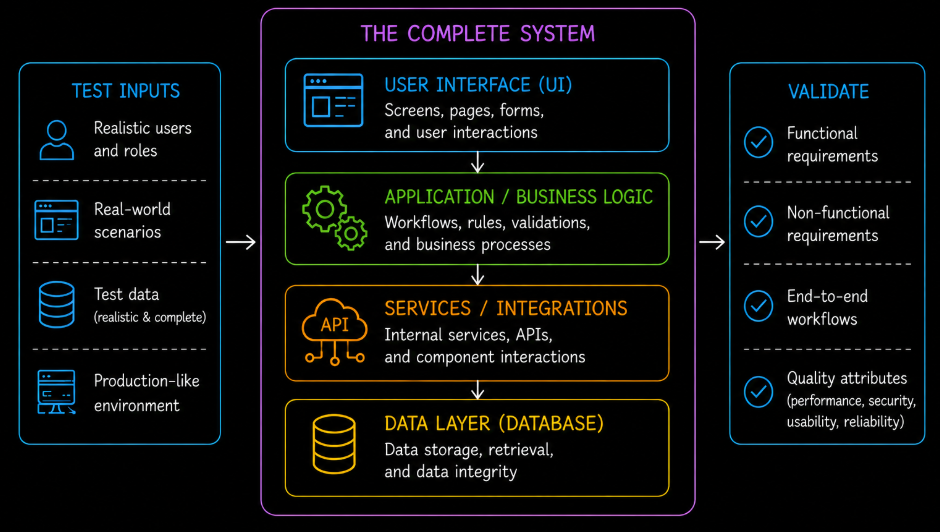
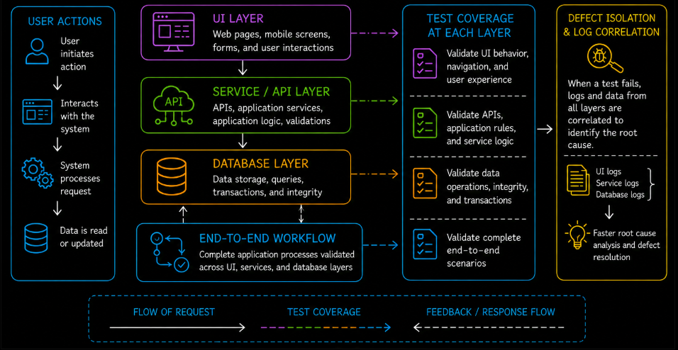
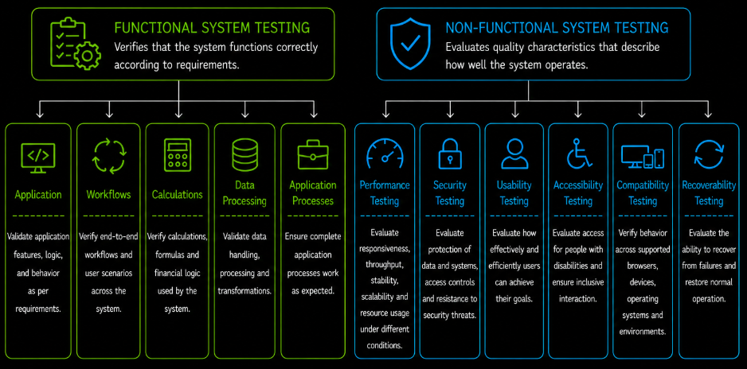
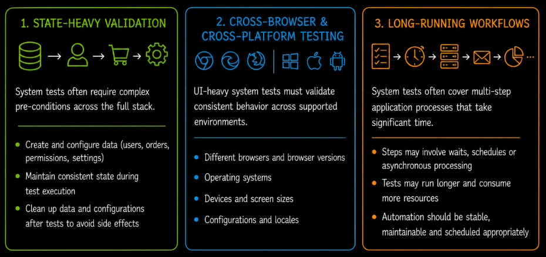

# Table of Contents: System Testing

- [System Testing](#system-testing)
- [Objectives and Scope of System Testing](#objectives-and-scope-of-system-testing)
- [System Testing Across Layers](#system-testing-across-layers)
- [Types of System Testing](#types-of-system-testing)
- [Test Execution Approaches](#test-execution-approaches)
- [Roles and Responsibilities](#roles-and-responsibilities)
- [Test Environment and Data](#test-environment-and-data)

Once components and their interactions are verified, the complete integrated system must be validated as a whole.

## System Testing

System testing is a testing level in which the complete and fully integrated system is evaluated against specified requirements. Unlike earlier testing levels that focus on isolated components or interactions between modules, system testing validates the behavior of the application as a whole and ensures that its parts work together correctly under realistic conditions.

At this stage, the focus shifts from internal implementation details toward overall system behavior and end-to-end workflows. The goal is to confirm that the integrated application behaves as expected from the user perspective and that both functional and non-functional requirements are satisfied.

System testing answers a key question. **Does the entire system behave correctly according to requirements?** Testing is performed from an external perspective using realistic scenarios, environments and data that closely reflect actual system usage.

In addition to validating system functionality, system testing evaluates quality characteristics such as performance, usability, security, reliability and stability. This helps identify issues that may appear only when the complete system operates together rather than when individual parts are tested in isolation.

System testing is typically performed by **QA teams** in an environment that closely resembles production. Because it validates the application as a complete integrated solution, this level of testing provides confidence that the system is stable and ready for further application validation and acceptance testing.

## Objectives and Scope of System Testing

The primary objective of system testing is to verify that the complete integrated system behaves correctly and satisfies specified requirements. Testing focuses on realistic workflows, application processes and end-to-end user scenarios to ensure that the application functions reliably under expected usage conditions.

System testing verifies both **functional** and **non-functional requirements**. It evaluates system functionality as well as quality characteristics such as performance, security, usability, reliability and stability. Because the application is tested as a complete solution, this level is especially useful for identifying defects that appear only when multiple parts of the system operate together.

The scope of system testing covers behavior within the defined system boundary. It focuses on how the integrated parts of the application behave collectively rather than on isolated implementation details or internal code structure. Lower-level verification of individual components is addressed during earlier testing levels, while communication with external systems is primarily covered during system integration testing.

During system testing, external dependencies are typically treated as already validated integrations. Where appropriate, the system may use stable stubs, service virtualization or controlled sandbox environments so that failures can be attributed to the system under test rather than to unpredictable external services.

By clearly defining the objectives and scope, teams can keep testing focused, comprehensive and aligned with system requirements.

## System Testing Across Layers

System testing can be performed across different layers of the system architecture. This allows teams to observe system behavior at specific points while still validating the complete application.

Testing at the **user interface (UI) layer** focuses on user interactions and visible system behavior. It verifies that inputs, outputs, navigation and user workflows function correctly from the end-user perspective.

Testing at the **API or service layer** focuses on application logic and communication between internal services. It verifies that requests are processed correctly and that services cooperate as expected within the system boundary.

Testing at the **database (DB) layer** focuses on internal data operations. It verifies that data is stored, retrieved, updated and maintained correctly and consistently as part of complete system behavior.

**End-to-end testing** validates workflows that span multiple layers, helping confirm that the system behaves correctly when the UI, services and data layer work together.

Testing across layers can also help with defect isolation. When a system test fails, testers may compare behavior and correlate logs across the UI, service and database layers to determine where the problem originated. This full-stack investigation is often broader than the debugging required for unit or narrower integration tests.

## Types of System Testing

System testing can be categorized according to the quality aspect being validated. These categories describe **what** is being tested, while the layer-based approach described earlier explains **where** within the system the validation may be performed.

**Functional system testing** verifies that the complete system performs the required functions correctly. It covers application rules, calculations, data processing, user workflows and end-to-end application processes. Tests confirm that expected inputs produce the correct outputs and that system behavior matches functional requirements.

**Non-functional system testing** evaluates quality characteristics that describe how well the system operates rather than which functions it performs. Depending on the product and its requirements, this may include the following areas.

1. **Performance testing** evaluates system responsiveness, throughput, scalability, stability and resource usage under different operating conditions. Depending on the testing objective, this may include load testing, stress testing, spike testing, endurance (Soak) testing and scalability testing.
2. **Security testing** evaluates whether the system protects data and resources against relevant security risks. This may include validating authentication, authorization, data protection, session management and resistance to applicable security threats.
3. **Usability testing** evaluates how effectively and efficiently intended users can interact with the system and complete their tasks.
4. **Accessibility testing** evaluates whether people with disabilities can perceive, understand, navigate and interact with the system. This may include checking keyboard accessibility, screen reader support, text alternatives, focus behavior and other applicable accessibility requirements.
5. **Compatibility testing** verifies that the system behaves correctly across supported browsers, devices, operating systems, configurations and other target environments.
6. **Recoverability testing** evaluates whether the system can recover from failures, restore required data and services and return to an acceptable operational state within defined recovery requirements.

Functional and non-functional system testing may be executed through the UI, API or database layers, or across complete end-to-end workflows. The testing category defines the quality aspect being evaluated, while the execution layer defines the technical point from which that behavior is observed.

## Test Execution Approaches

System testing can use both **manual testing** and **automated testing**. The appropriate approach depends on the system, the scenario and the type of behavior being validated.

**Manual testing** allows testers to interact with the complete application in a way similar to real users. It is particularly useful for exploratory testing, usability evaluation and complex workflows where human observation and judgment are important.

**Automated testing** uses tools and scripts to execute repeatable system scenarios. It is especially valuable for regression testing and stable end-to-end workflows that need to be checked frequently as the system changes.

System tests often require **state-heavy validation**. Complex preconditions such as user accounts, orders, permissions, configurations or stored data may need to be created before execution and cleaned up afterward. Reliable setup and teardown are important so that one system test does not affect another.

For UI-heavy systems, execution may also include **cross-browser and cross-platform validation**. Tests should cover the supported client environments defined by the product requirements because behavior can differ between browsers, operating systems, devices or screen configurations.

Some system tests cover **long-running workflows** with many steps or delayed processing. These scenarios may take considerably longer than lower-level tests, so automated suites are often scheduled selectively and organized so that faster feedback is still available during development.

When a full system test fails, investigation may require correlation of application logs, service logs, database records and other diagnostic information across the complete stack. This helps distinguish the actual defect from a symptom observed at the user interface or another layer.

In practice, system testing commonly combines manual and automated execution. Manual testing provides flexibility and user-focused observation, while automation improves repeatability, regression coverage and execution consistency.

## Roles and Responsibilities

System testing involves multiple stakeholders working together to ensure that the application is validated thoroughly under realistic conditions.

**QA teams** design, execute and maintain system tests. They validate workflows, verify requirements, report defects and help ensure that testing coverage is sufficient across functional and non-functional areas.

**Developers** support system testing by analyzing and resolving defects discovered during validation. They may also help investigate complex full-stack failures and verify that fixes do not introduce regressions.

**Test leads or test managers** coordinate testing activities, define the testing strategy and ensure that system testing aligns with project objectives, timelines and quality expectations.

**Business analysts** help clarify requirements, workflows and expected system behavior so that tests remain aligned with business needs and user expectations.

In some environments, **DevOps engineers or environment specialists** support system testing by maintaining test environments, managing deployments and ensuring that required infrastructure and dependencies are available for reliable execution.

Clearly defined responsibilities improve communication, reduce misunderstandings and support consistent system validation.

## Test Environment and Data

System testing requires a properly prepared environment and realistic test data so that system behavior can be evaluated accurately. Because testing is performed on the complete integrated application, environment quality and data quality directly affect the reliability of the results.

The **test environment** should closely resemble the production setup, including system configuration, infrastructure, internal services and required dependencies. A stable and correctly configured environment reduces the risk of false failures caused by environmental inconsistencies rather than actual system defects.

External dependencies do not always need to use live production-connected services during system testing. Stable stubs, service virtualization or controlled sandboxes may be used when appropriate so that external volatility does not obscure defects within the system under test.

**Test data** should represent realistic application scenarios and include both common and edge-case situations. This allows teams to validate expected inputs, invalid values, boundary conditions and combinations of data that may affect system behavior.

System tests may require complex data preconditions across the full stack. Test accounts, orders, permissions, configurations and related records should be prepared consistently and cleaned up when necessary so that tests remain repeatable and isolated from one another.

Proper management of test data is also important from a security and compliance perspective. When production-like data is used, organizations must ensure that sensitive information is protected and handled according to applicable privacy requirements and internal policies.

By maintaining reliable environments and meaningful test data, teams can improve testing accuracy, increase confidence in system behavior and reduce the risk of issues appearing after release.
