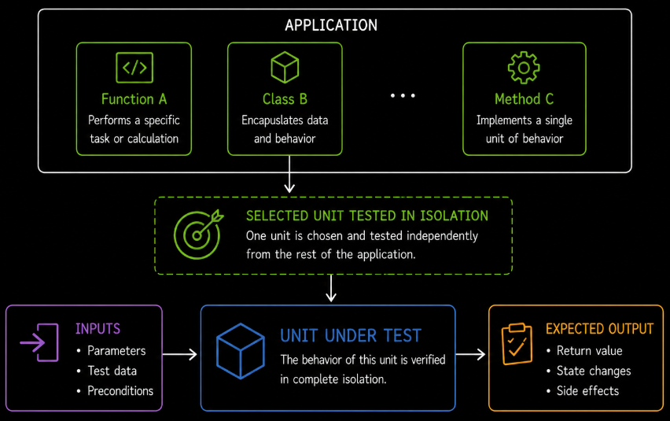
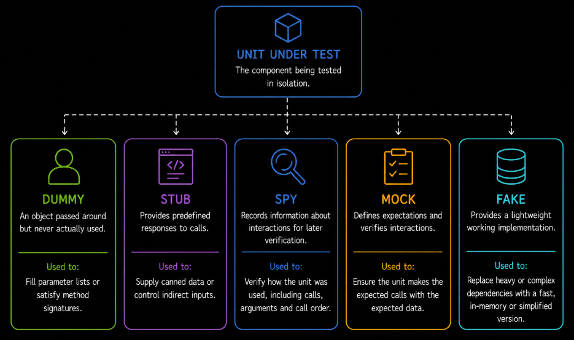
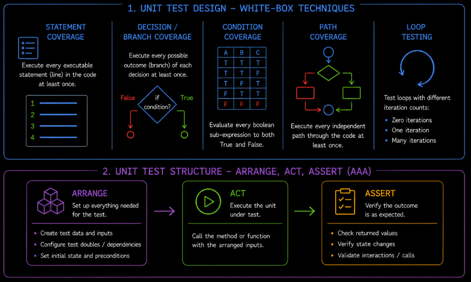
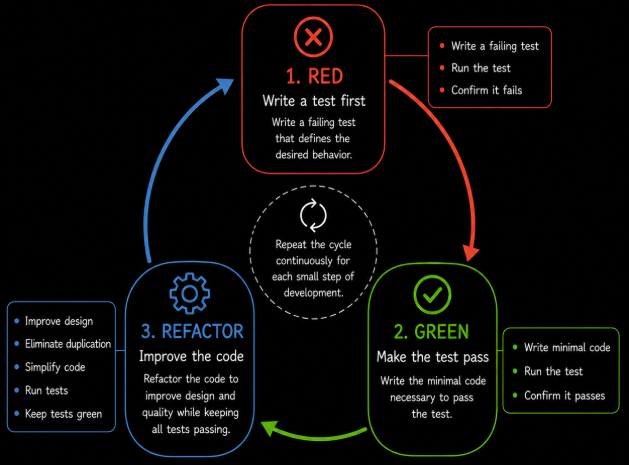

# Table of Contents: Component Testing (Unit Testing)

- [Component Testing](#component-testing)
- [Objectives and Scope of Component Testing](#objectives-and-scope-of-component-testing)
- [Test Isolation and Test Doubles](#test-isolation-and-test-doubles)
- [Test Design and White-Box Techniques](#test-design-and-white-box-techniques)
- [Automation and Regression Testing](#automation-and-regression-testing)
- [Test-Driven Development](#test-driven-development)
- [Code Coverage](#code-coverage)

Component testing verifies individual units of code in isolation before they are combined with other parts of the application.

## Component Testing

Component testing, also known as **unit testing**, verifies that individual units of software behave correctly in isolation.

A unit is usually a small testable part of the application, such as a **function**, **method**, **class** or small module. The exact size of a unit depends on the programming language, architecture and design of the software.

The main goal is to confirm that each unit produces the expected result for defined inputs and conditions before it is integrated with other units.

Because tests focus on a small area of code, failures are usually easier to diagnose than at higher testing levels. A failed unit test can often be traced directly to the function, method or class being exercised.

Component testing is typically performed early and frequently during development. It provides fast feedback when code changes and helps prevent defects from reaching component integration testing and later testing levels.

## Objectives and Scope of Component Testing

The primary objective of component testing is to verify the correctness of an individual unit independently from the rest of the system.

Tests may validate normal behavior, invalid inputs, error handling, boundary conditions and other relevant cases defined by the unit's requirements or implementation.

The scope is intentionally narrow. Component testing focuses on the behavior of a single unit rather than communication between multiple components. Interactions between internal components are validated later during **component integration testing**.

Keeping this scope small helps tests execute quickly and makes defect isolation more precise.

## Test Isolation and Test Doubles

Units often depend on other parts of the application, such as databases, services, file systems, clocks or other components. To keep the unit test focused, these dependencies may be replaced with **test doubles**.

Common types of test doubles include the following.

1. A **dummy** is an object that is passed to the unit but is not used during the test. It is typically supplied only because a parameter is required.
2. A **stub** provides predefined responses to calls made during the test.
3. A **spy** records information about calls it receives so that those interactions can be verified after execution.
4. A **mock** is configured with expected interactions and is used to verify whether those interactions occurred as expected.
5. A **fake** provides a lightweight working implementation of a dependency, such as an in-memory data store used instead of a production database.

For example, a unit that calculates an order total should not require access to a real payment service or production database if those dependencies are not part of the behavior being tested.

Using test doubles helps keep component tests fast, repeatable and independent from unavailable or unstable resources.

## Test Design and White-Box Techniques

Component testing is often performed by developers who understand the internal structure of the code. For this reason, unit tests frequently use **white-box testing techniques**.

White-box testing uses knowledge of the implementation to design tests that exercise relevant program structures. Common techniques and structural coverage targets include the following.

1. **Statement testing and coverage** exercise executable statements and measure whether they have been executed.
2. **Decision or branch testing and coverage** exercise the possible outcomes of decisions, such as true and false branches.
3. **Condition testing and coverage** exercise the individual Boolean conditions within compound decisions so that relevant condition outcomes are evaluated.
4. **Path testing** exercises selected execution paths through the code. Exhaustive coverage of every possible path is usually impractical when loops and complex decisions are present.
5. **Loop testing** examines loop behavior with relevant iteration counts, such as zero iterations, one iteration and multiple iterations.

**Boundary value analysis** is primarily a black-box test technique rather than a white-box technique. It can still be applied effectively at the unit level when a unit processes values around defined input or implementation boundaries.

Unit tests should not depend on internal implementation details unnecessarily. Where possible, tests should verify observable behavior through the unit's public interface so that harmless refactoring does not require excessive test changes.

A common way to organize a unit test is the **Arrange-Act-Assert (AAA)** pattern.

1. **Arrange** prepares the inputs, test data, dependencies and preconditions required by the test.
2. **Act** executes the function, method or other unit under test.
3. **Assert** verifies that the observed result or behavior matches the expected outcome.

Using a consistent structure makes tests easier to read and clearly separates test preparation, execution and verification.

## Automation and Regression Testing

Component tests are usually **automated** because they need to execute quickly and frequently as developers change the code.

Automated unit tests are commonly included in build and continuous integration pipelines. They provide rapid feedback when a code change introduces a regression.

A strong unit test suite should be deterministic. Running the same test against the same code and conditions should produce the same result each time.

Unit tests should also remain independent from one another where possible. One test should not rely on another test having executed first or on shared state that can change unexpectedly.

**Test fixtures** provide consistent preconditions by preparing common objects, test data or state required by tests. Setup can be performed before each test, while teardown or cleanup removes temporary state and releases resources afterward. Proper setup and cleanup help prevent one test from affecting another.

Many unit testing frameworks also support **parameterized or data-driven tests**. These allow the same test logic to run with multiple sets of input values and expected results, increasing coverage without duplicating the test implementation.

## Test-Driven Development

Component testing is closely associated with **Test-Driven Development (TDD)**.

In TDD, a developer first writes a small automated test that describes the required behavior. The test initially fails because the behavior has not yet been implemented. The developer then writes enough code to make the test pass and finally improves the design while keeping the tests passing.

This cycle is commonly described as **Red, Green, Refactor**.

**Red** means writing a test for the required behavior and confirming that it fails for the expected reason. **Green** means implementing enough code to make the test pass. **Refactor** means improving the code and test design without changing the required behavior while keeping the tests passing.

TDD can help developers clarify expected behavior before implementation and encourages code that is easier to test. It is a development approach rather than a requirement for unit testing, so component tests can also be written without using TDD.

## Code Coverage

**Code coverage** measures how much of the program structure is exercised when automated tests run.

Common coverage measures include **statement coverage**, **decision or branch coverage** and **condition coverage**. These measures can help identify areas of code that have not been exercised by the test suite.

High coverage does not guarantee that the tests are effective. A test can execute a line or branch without checking whether the resulting behavior is correct.

For this reason, **100% code coverage is rarely a meaningful goal by itself**. Pursuing a coverage percentage without considering test value can encourage low-value tests that execute code only to increase the metric while failing to verify meaningful behavior.

Coverage should therefore be used as supporting information rather than as the only measure of test quality. The more important question is whether the tests verify meaningful behavior, important decisions, boundary conditions and relevant failure scenarios.
