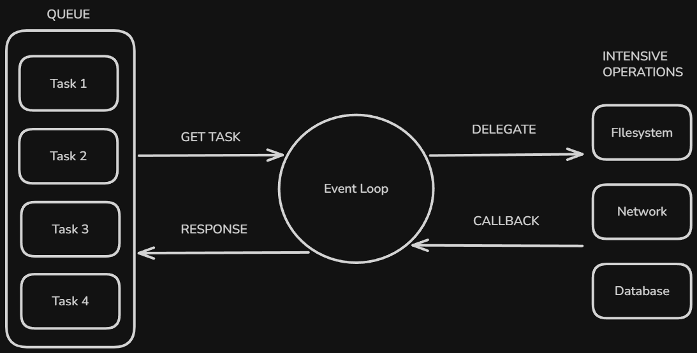

# Content of Python Async Programming Level 2

- [Tasks and Event Loop](#tasks-and-event-loop)
- [Async Iterators](#async-iterators)
- [Asynchronous Context Managers](#asynchronous-context-managers)

Level 2 focuses on deeper async mechanisms that explain how asynchronous programs are scheduled and how `async` protocols work in Python.

These topics build on the coroutine and await concepts introduced in **Async Programming Level 1**.

## Tasks and Event Loop

Async functions describe work that can pause and resume, but they do not run by themselves. When a coroutine function is called, Python creates a coroutine object that represents work that could run in the future. At that moment nothing has started yet. The coroutine only contains the code and the state needed to begin execution.

Something must take that coroutine and actually run it. In Python this responsibility belongs to the event loop.



The event loop is the runtime component that drives asynchronous execution. It keeps track of coroutines that are ready to run and coroutines that are currently waiting for an operation to finish. When a coroutine reaches an `await`, it pauses and returns control to the event loop. The event loop can then allow another coroutine to run until the original operation becomes ready to continue.

From a high level perspective, the event loop repeatedly performs three steps. It runs a coroutine until it reaches an `await`. It pauses that coroutine while the awaited operation is in progress. It resumes the coroutine when the operation completes.

Because of this scheduling behavior, many asynchronous operations can make progress during the same period of time even though only one piece of Python code runs at once.

In most programs the event loop is started using `asyncio.run`.

```python
import asyncio

async def main():
    print("program started")

asyncio.run(main())
```

The `asyncio.run` function creates an event loop, runs the provided coroutine, and closes the loop when the program finishes. It acts as the entry point that begins asynchronous execution.

Coroutines are usually scheduled through objects called tasks.

A task is a wrapper around a coroutine that allows the event loop to manage its execution. When a task is created, the coroutine is registered with the event loop so it can begin running as soon as the scheduler has an opportunity to execute it.

Tasks are created using `asyncio.create_task`.

```py
import asyncio

async def work():
    print("work started")
    await asyncio.sleep(1)
    print("work finished")

async def main():
    task = asyncio.create_task(work())
    await task

asyncio.run(main())
```

When `work()` is called, it produces a coroutine object. Passing that coroutine to `create_task` schedules it to run on the event loop. The task begins executing and pauses when it reaches the `await asyncio.sleep(1)` expression. While the task is waiting, the event loop is free to run other tasks.

Tasks become especially useful when multiple operations should run during the same time period.

```py
import asyncio

async def worker(name):
    print(name, "started")
    await asyncio.sleep(1)
    print(name, "finished")

async def main():
    task_a = asyncio.create_task(worker("A"))
    task_b = asyncio.create_task(worker("B"))

    await task_a
    await task_b

asyncio.run(main())
```

In this example both tasks are scheduled before either one finishes. The event loop switches between them whenever a task pauses at an `await`. While one task is waiting, another task is allowed to run.

It is important to understand the difference between directly awaiting a coroutine and scheduling it as a task.

```py
await worker("A")
await worker("B")
```

In this case the second coroutine does not begin until the first one finishes. Execution remains sequential even though the functions are asynchronous.

When tasks are used instead, both operations start immediately.

```py
task_a = asyncio.create_task(worker("A"))
task_b = asyncio.create_task(worker("B"))

await task_a
await task_b
```

The event loop can now manage both operations at the same time, allowing their waiting periods to overlap.

The event loop therefore acts as the scheduler that drives asynchronous programs, while tasks represent individual pieces of work that the event loop manages. Together they allow many operations that spend time waiting for input or output to progress efficiently without blocking the entire program.

Async programs, however, do not only involve running independent tasks. Many asynchronous operations also produce **a sequence of results over time** rather than a single final value. Examples include receiving messages from a **network stream**, **reading data in chunks** or **processing items** from an asynchronous queue.

In synchronous Python, sequences are commonly processed using iteration.

```python
for item in iterable:
    process(item)
```

Each step of the loop retrieves the next value immediately. The iteration continues until the sequence is exhausted.

In asynchronous programs the next value might not be available immediately. Retrieving it may require waiting for data from a **network**, **disk** or **another task**. Because of this delay, the iteration itself must be able to pause while waiting for the next element.

Python provides `async` iterators to support this pattern.

Async iterators allow iteration to cooperate with the event loop so that retrieving the next value can involve await. Instead of blocking the entire program while waiting for the next item, the current task pauses and the event loop can run other tasks.

This leads to the asynchronous version of iteration.

## Async Iterators

Many asynchronous operations do not produce a single result. Instead they produce a sequence of values over time. A **network stream** may deliver messages one by one. A **large file** might be processed in chunks. A **queue** may provide items whenever another task places them into the queue.

In synchronous Python, sequences are processed using iteration.

```python
numbers = [1, 2, 3, 4]

for number in numbers:
    print(number)
```

Each iteration retrieves the next value immediately from the list. The loop prints the numbers one by one until the sequence is exhausted.

Iteration is also commonly used when reading data from files.

```py
with open("data.txt") as f:
    for line in f:
        print(line.strip())
```

The loop asks the file iterator for the next line. The file object returns each line in sequence until the end of the file is reached.

In both examples, retrieving the next value happens immediately. The iterator simply returns the next element when the loop requests it.

In asynchronous programs the situation can be different. The next value might not be available yet. Retrieving it could require waiting for a **network response**, **disk input**, or **another task to produce data**, if the loop waited synchronously, the entire program would pause until the next item appeared.

To support iteration that may require waiting, Python provides asynchronous iterators. An async iterator allows the loop to pause while waiting for the next value. During that pause the event loop can run other tasks.

Async iteration uses the `async for` statement.

```py
async for item in source:
    process(item)
```

The loop behaves similarly to a normal `for` loop, but retrieving the next element can involve await. When the iterator needs time to produce the next value, the current coroutine pauses and control returns to the event loop.

Async iterators follow a protocol defined by two special methods.

- `__aiter__` returns the iterator object itself.

- `__anext__` produces the next value in the sequence. Because producing the value may require waiting, this method is defined as an async function.

When no more values remain, `__anext__` raises `StopAsyncIteration`, which signals the loop to stop.

A simple async iterator can be written as a class.

```py
import asyncio

class Counter:

    def __init__(self, limit):
        # maximum number the iterator will produce
        self.limit = limit
        
        # current state of the iterator
        self.current = 0

    def __aiter__(self):
        # async for calls this method once
        # it must return the async iterator object
        return self

    async def __anext__(self):
        # async for repeatedly awaits this method
        # to request the next value from the iterator

        # stop condition
        if self.current >= self.limit:
            # tells async for that iteration is finished
            raise StopAsyncIteration

        # simulate waiting for the next value
        # for example data arriving from a network
        await asyncio.sleep(1)

        # update iterator state
        self.current += 1

        # return the next value
        return self.current
```

The iterator produces numbers gradually, pausing for one second before returning each value.

It can be used with `async for`.

```py
async def main():
    async for number in Counter(3):
        print(number)

asyncio.run(main())
```

Execution pauses each time the iterator waits inside `__anext__`. While the iterator is waiting, the event loop can schedule other tasks.

To understand how the loop retrieves values, it helps to look at the steps Python performs while running the iteration.

The statement

```py
async for number in Counter(3):
    print(number)
```

Causes Python to repeatedly call the iterator methods defined in the class.

```py
async def main():

    iterator = Counter(3)

    # async for calls this method once
    iterator = iterator.__aiter__()

    while True:
        try:
            # request the next value
            number = await iterator.__anext__()

            print(number)

        except StopAsyncIteration:
            # stop when no more values remain
            break

asyncio.run(main())
```

First the iterator object is created. Python then calls `__aiter__` to obtain the async iterator.

The loop repeatedly awaits `__anext__` to retrieve the next value. Each call to `__anext__` may pause if the iterator needs time to produce the next element.

When the iterator has no more values to return, `__anext__` raises `StopAsyncIteration`. This signals that the iteration is finished and the loop stops.

Async iterators therefore extend the idea of iteration into asynchronous programs. Instead of immediately producing each value, the iterator is allowed to pause while waiting for data.

Async iteration focuses on producing values over time. Another common pattern in programs involves **managing resources that must be properly opened and closed**.

In synchronous Python this is typically handled using context managers with the `with` statement. A file, for example, is opened when entering the block and automatically closed when leaving it.

```python
with open("data.txt") as file:
    content = file.read()
```

The context manager ensures that setup and cleanup happen correctly even if an error occurs.

In asynchronous programs, however, opening or closing a resource may also require waiting. Establishing a network connection, creating an HTTP session, or acquiring a database connection may involve asynchronous operations. Because these steps can require `await`, a normal context manager is not sufficient.

To support resource management that involves asynchronous operations, Python provides **asynchronous context managers**. These are used with the `async with` statement and allow both entering and leaving the context to pause while waiting for asynchronous work to complete.

## Asynchronous Context Managers

Programs often need to work with resources that must be properly opened and closed. Files must be opened before reading. Network connections must be established before sending requests. Database sessions must be created before queries can run.

A simple way to work with a file is to open and close it manually.

```python
file = open("data.txt")

content = file.read()
print(content)

file.close()
```

The file is opened, its contents are read, and the file is closed afterward.

```py
file = open("data.txt")

content = file.read()

# simulate an unexpected error
raise RuntimeError("something went wrong")

file.close()
```

If the error occurs, the program stops before reaching `file.close()`. The file remains open because the cleanup code was never executed.

To guarantee that cleanup always happens, Python provides the `try` and `finally` blocks.

```py
file = open("data.txt")

try:
    content = file.read()
    print(content)

finally:
    file.close()
```

The `finally` block runs regardless of whether an error occurs. Even if an exception interrupts the program, the file will still be closed.

Although this solves the problem, writing `try` and `finally` every time a resource is used quickly becomes repetitive.

Python therefore provides context managers to automate this pattern using the `with` statement.

```python
with open("data.txt") as file:
    content = file.read()
```

When execution enters the block, the file is opened. When execution leaves the block, the file is automatically closed.

This guarantees that the resource is cleaned up correctly even if an error occurs during execution.

This behavior is implemented using two special methods. When the block begins, Python calls `__enter__`. When the block finishes, Python calls `__exit__`.

To see how these methods work, we can create a simple context manager that opens and closes a file.

```python
class FileReader:

    def __init__(self, filename):
        self.filename = filename

    def __enter__(self):
        print("entering context")

        # open the file
        self.file = open(self.filename)

        # value returned here becomes the variable after "as"
        return self.file

    def __exit__(self, type, value, traceback):
        print("leaving context")

        # cleanup happens here
        self.file.close()
```

The parameters `type`, `value`, and `traceback` describe any exception that occurred inside the `with` block.

If the code inside the block runs without errors, all three values are `None`.

If an error occurs, these parameters contain information about that exception.

The context manager can be used with `with`.

```py
with FileReader("data.txt") as file:
    content = file.read()
    print(content)
    # simulate an error after reading the file
    raise Exception("unexpected error occurred")
```

The file is opened when execution enters the block because Python calls `__enter__` then returned file object is assigned to `file` and code inside the block runs and reads the file content after the file is read, `raise Exception()` triggers an error inside the block.

Before the program stops because of the exception, Python calls `__exit__`. The cleanup code inside `__exit__` runs and closes the file.

This shows that even if an error occurs inside the `with` block, the `__exit__` method still runs and the resource is properly cleaned up.

In asynchronous programs the same resource management problem exists, but opening or closing a resource may involve waiting. Establishing a network connection, starting an HTTP session, or acquiring a database connection may require asynchronous operations that must use `await`.

Because the normal `with` statement cannot pause for asynchronous operations, Python provides asynchronous context managers. These are used with the `async with` statement.

```py
async with resource:
    await use_resource()
```

An asynchronous context manager allows both entering and leaving the context to involve asynchronous work.

This behavior is defined by two special methods.

- `__aenter__` runs when execution enters the context.

- `__aexit__` runs when execution leaves the context.

Both methods are asynchronous functions, which allows them to perform operations that require `await`.

A simple **asynchronous context manager** can be written as a class.

```py
import asyncio

class AsyncResource:

    async def __aenter__(self):
        print("opening resource")
        await asyncio.sleep(1)
        return self

    async def __aexit__(self, type, value, traceback):
        print("closing resource")
        await asyncio.sleep(1)
```

The resource can then be used with `async with`.

```py
import asyncio

async def main():
    async with AsyncResource():
        print("using resource")

asyncio.run(main())
```

When execution enters the block, `__aenter__` runs and performs any setup work and when block finishes, `__aexit__` runs and performs cleanup, because both methods are asynchronous, they can pause while waiting for external operations.

Writing a full class for simple resource management can sometimes be unnecessary. Python therefore provides a helper decorator called `asynccontextmanager` in the `contextlib` module. This decorator allows an asynchronous generator function to behave like an asynchronous context manager.

```py
import asyncio
from contextlib import asynccontextmanager

@asynccontextmanager
async def async_resource():
    print("opening resource")
    await asyncio.sleep(1)

    yield "resource"

    print("closing resource")
    await asyncio.sleep(1)
```

The code before `yield` runs when entering the context. The code after `yield` runs when leaving the context.

This context manager can be used in the same way.

```py
async def main():
    async with async_resource() as resource:
        print("using", resource)

asyncio.run(main())
```

Asynchronous context managers extend the idea of resource management into asynchronous programs. They ensure that setup and cleanup operations can perform asynchronous work while still keeping resource handling safe and structured.
