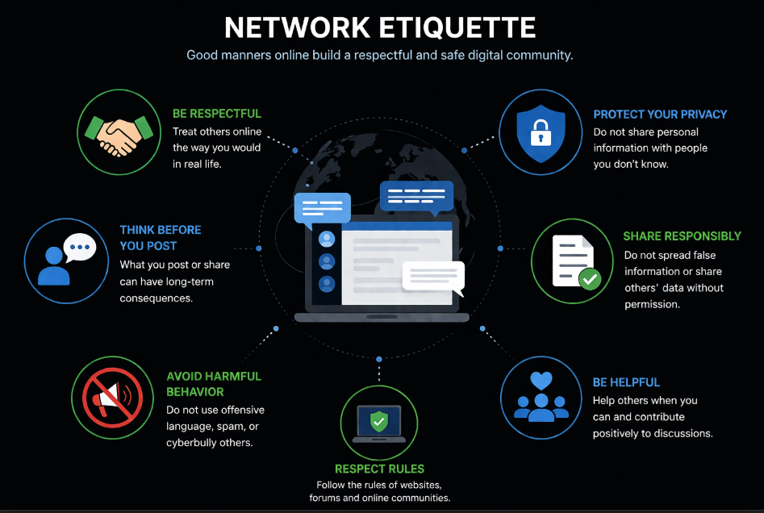

# Tinklo Saugumas 1 lygis - turinys

- [Kas yra tinklo etiketas](#kas-yra-tinklo-etiketas)

## Kas yra tinklo etiketas

Naudojantis internetu svarbu ne tik saugiai perduoti duomenis, bet ir tinkamai bendrauti su kitais žmonėmis. Tam naudojamas tinklo etiketas (*network etiquette*).

Tinklo etiketas apibrėžia taisykles ir elgesio principus, kaip reikėtų elgtis internete bendraujant su kitais vartotojais.

Vienas svarbiausių principų yra **pagarbus bendravimas**. Internete svarbu neįžeidinėti kitų, nerašyti agresyviai ir gerbti kitų nuomonę.

Taip pat svarbu atsakingai dalintis informacija. Nereikėtų platinti melagingos informacijos ar dalintis kitų žmonių duomenimis be jų sutikimo.

Naudojantis internetu būtina saugoti savo privatumą ir neatskleisti per daug asmeninės informacijos, ypač viešose platformose.

Elgesys internete daro įtaką ir žmogaus reputacijai. Tai, ką vartotojas skelbia ar komentuoja, gali turėti ilgalaikių pasekmių.

Tinklo etiketas padeda užtikrinti saugų, atsakingą ir pagarbų bendravimą skaitmeninėje erdvėje.
