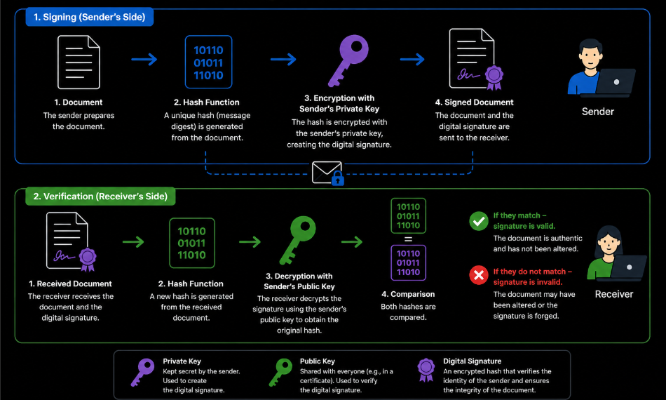
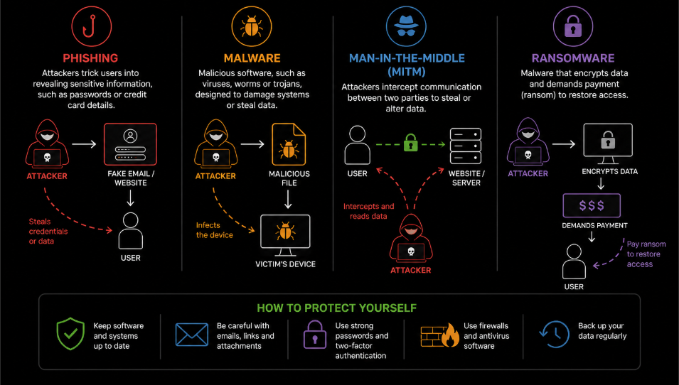
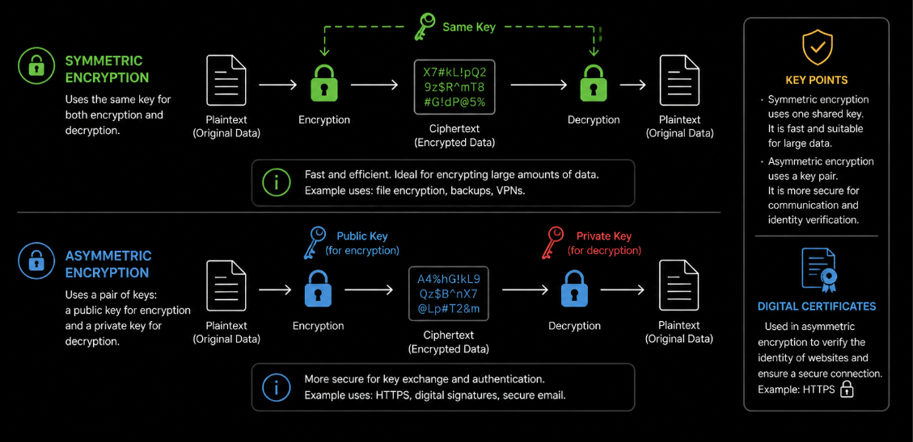

# Tinklo Saugumas 1 lygis - turinys

- [Kas yra tinklo saugumas](#kas-yra-tinklo-saugumas)
- [Kriptografinės sistemos](#kriptografinės-sistemos)

Ankstesniuose skyriuose buvo nagrinėjama, kaip veikia kompiuterių tinklai, kaip perduodami duomenys ir kokie protokolai naudojami internete. Tai leidžia suprasti, kaip informacija keliauja tarp įrenginių ir kaip veikia įvairios tinklo paslaugos.

Tačiau vien tik suprasti duomenų perdavimą neužtenka. Taip pat svarbu užtikrinti, kad perduodama informacija būtų apsaugota nuo pašalinių asmenų ir netinkamo naudojimo.

Tinklo saugumas (*network security*) apima priemones ir metodus, kurie padeda apsaugoti duomenis, sistemas ir tinklo ryšius.

Šiame lygyje nagrinėjami pagrindiniai tinklo saugumo principai, tokie kaip saugus ryšys, šifravimas, asmens duomenų apsauga ir galimos grėsmės internete.

Pirmiausia svarbu suprasti, kas yra tinklo saugumas ir kodėl jis yra reikalingas.

## Kas yra tinklo saugumas

Naudojantis internetu svarbu suprasti, kad ne visi ryšiai yra vienodai saugūs. Kai perduodami duomenys, jie gali būti matomi ar perimti, jei nėra tinkamai apsaugoti.

**Tinklo saugumas** (*network security*) apima priemones ir metodus, kurie padeda apsaugoti **duomenis**, **įrenginius ir ryšį tarp jų**.

Vienas svarbiausių aspektų yra **saugus ir nesaugus ryšys**. Nesaugus ryšys yra toks, kai informacija perduodama be apsaugos. Tokiu atveju duomenys gali būti perskaityti pašalinių asmenų. Pavyzdžiui, naudojant `HTTP` protokolą, informacija siunčiama atviru tekstu.

Saugus ryšys yra toks, kai duomenys yra apsaugoti naudojant **šifravimą**. Tai reiškia, kad perduodama informacija yra užkoduojama ir ją gali perskaityti tik gavėjas. Pavyzdžiui, `HTTPS` protokolas užtikrina saugų ryšį tarp vartotojo ir serverio.

Saugų ryšį galima atpažinti pagal adresą naršyklėje, kuris prasideda `https://`, ir rodomą **spynos simbolį**.

Saugiam duomenų perdavimui naudojamas **šifravimas**. Tai procesas, kurio metu informacija yra užkoduojama taip, kad jos negalėtų perskaityti pašaliniai asmenys. Tik gavėjas, turintis tinkamą prieigą, gali ją atkurti.

Šifravimas taip pat naudojamas patvirtinant vartotojo tapatybę. Vienas iš tokių pavyzdžių yra **elektroninis parašas**, kuris leidžia nustatyti, kas yra dokumento ar pranešimo siuntėjas, ir užtikrina, kad informacija nebuvo pakeista. Elektroninis parašas turi **teisinę galią** ir gali pakeisti ranka rašytą parašą skaitmeninėje erdvėje.

Naudojantis internetu taip pat svarbu saugoti **asmens duomenis**. Tai yra informacija, kuri leidžia atpažinti žmogų, pavyzdžiui, vardas, pavardė ar el. pašto adresas.

Europoje asmens duomenų apsaugą reglamentuoja **BDAR (Bendrasis duomenų apsaugos reglamentas, angl. GDPR)**. Jis nustato, kaip turi būti renkami, saugomi ir naudojami asmens duomenys bei suteikia vartotojams teisę kontroliuoti savo informaciją.

Netinkamas duomenų naudojimas gali sukelti **privatumo pažeidimus** ar **tapatybės vagystę**.

Internete egzistuoja įvairios **grėsmės**. Tai gali būti duomenų perėmimas, kenkėjiškos programos ar sukčiavimas, kai siekiama išgauti jautrią informaciją. Tokios grėsmės dažniausiai atsiranda naudojantis nesaugiais tinklais, nepatikimomis svetainėmis ar atidarant neaiškias nuorodas.

Tinklo saugumas yra svarbus ne tik programinei įrangai, bet ir įrenginiams. Kompiuteriai, telefonai ar kiti prijungti įrenginiai gali būti pažeidžiami, jei nėra atnaujinami ar tinkamai apsaugoti.

Norint sumažinti riziką, svarbu naudoti saugius ryšius, saugoti savo duomenis, atnaujinti įrenginius ir atsargiai vertinti gaunamą informaciją. Tinklo saugumas leidžia užtikrinti **saugų ir patikimą naudojimąsi internetu**.

Saugiam duomenų perdavimui naudojamas **šifravimas**. Tai procesas, kurio metu informacija yra užkoduojama taip, kad jos negalėtų perskaityti pašaliniai asmenys.

Šifravimas yra svarbi tinklo saugumo dalis, todėl toliau nagrinėjama, kaip veikia kriptografinės sistemos.

## Kriptografinės sistemos

Tinklo saugume svarbią vietą užima **kriptografinės sistemos**, kurios naudojamos duomenims apsaugoti.

Kriptografija leidžia užtikrinti, kad perduodama informacija būtų saugi ir negalėtų būti perskaityta pašalinių asmenų. Šifravimas gali būti skirtingų tipų. Paprasčiausiai išskiriami du pagrindiniai būdai.

**Simetrinis šifravimas**, kai naudojamas tas pats raktas tiek duomenims užšifruoti, tiek iššifruoti. Šis būdas naudojamas, pavyzdžiui, apsaugant duomenis įrenginiuose ar perduodant didelius duomenų kiekius.

**Asimetrinis šifravimas**, kai naudojami du raktai - **viešasis** ir **privatusis**. Viešasis raktas naudojamas duomenims užšifruoti, o privatusis juos iššifruoti. Asimetrinis šifravimas naudojamas, pavyzdžiui, saugiame interneto ryšyje (`HTTPS`) ar elektroniniame paraše. Taip pat naudojami **skaitmeniniai sertifikatai**, kurie padeda patvirtinti, kad ryšys yra saugus ir kad serveris yra patikimas.

Kriptografinės sistemos yra svarbi tinklo saugumo dalis, nes jos padeda apsaugoti duomenis nuo perėmimo ir neteisėto naudojimo.
