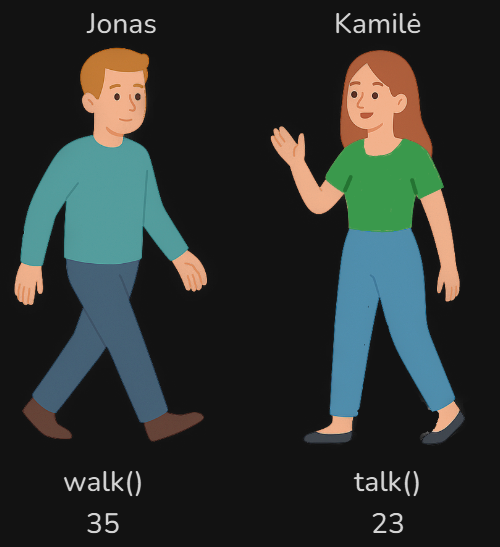
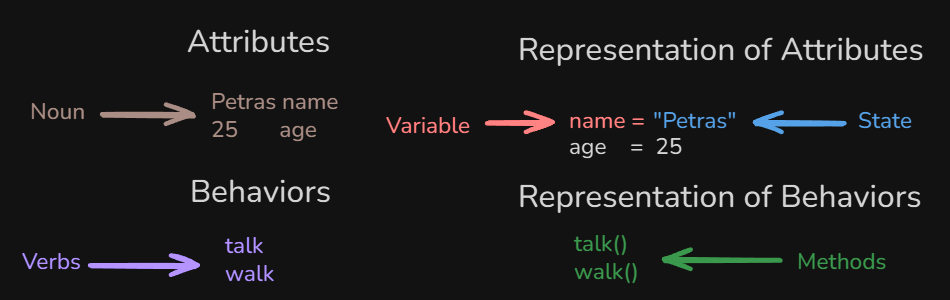
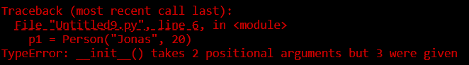
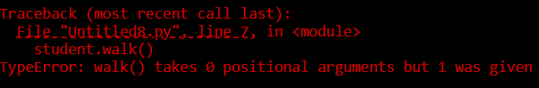
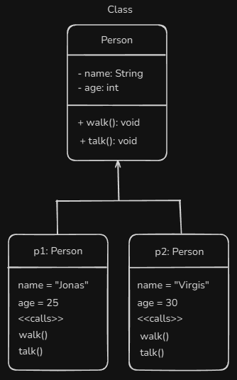

# Content of Python object programming 1 level

- [What is class?](#what-is-class)
- [What is object?](#what-is-object)
- [Attribute](#attribute)
- [Constructor](#constructor)
- [Method](#method)But
- [Working with Attributes in a Class](#working-with-attributes-in-a-class)

As we mentioned earlier, in Python everything is an object. More precisely, Python supports **object-oriented programming (OOP)**, a paradigm where we organize code around objects. Each object has **data (attributes)** and **capabilities (methods)**.

Let’s imagine a group of **people**.

Each person is different, they have their own **name**, **age**, and other **personal details**.

They can also **do things** in life. Some can **walk**, others can **talk**, and some can do both.

But people don’t just have data, they can also **do things**. One person can **walk**, another can **talk**, and some can do both. These actions represent methods in code, which define the **behavior** of an object.

Here is an illustration that visualizes this idea.



Now that we understand the idea from real life, let’s see **how we express it in code**.

To start, we need something that describes what a person is, and in **OOP**, that is done using a **class**.

## What is class?

In **object-oriented programming**, a **class** is like a **blueprint** or **template**. It defines what an object **can have** and what it **can do**.

We define a class using the `class` keyword.

```py
class Person:
    pass
```

*When naming classes, the convention is to use **PascalCase** (capitalize the first letter of each word).*

So next we need understand object where we creaet from the **class**

## What is object?

In Python, an **object** is any **entity in memory** that the interpreter recognizes. When we create an object from a **user-defined class**, it is called an **instance**.

Think of it like this.

- **Object:** Any **entity in memory** that Python knows about.

- **Instance:** Object of a **user-defined class**.

Each instance has its own **state** (attributes) and **behavior** (methods), based on the blueprint defined by the class.

Here is an illustration.



In the image, **attributes** represent the **things** an object *has*, and **behavior** represents the actions it *can do*.

In code, we create an object by calling the class.

```py
p1 = Person()
p2 = Person()
```

Even though `p1` and `p2` are separate instances, they share the same blueprint (`Person`) while maintaining their own data and behavior.

To understand how objects work, it helps to look at their **key characteristics**. Every object has three main aspects.

- **Identity (name):** This refers to the object’s unique location in memory, its **memory address**.

    You can check it using `id(obj)`.

    ```py
    class Person:
        pass

    print(id(Person))
    ```

    This prints a unique identifier showing where the `Person` class object lives in memory.

- **State (attributes):** What the object *has* or *is* (`name`, `age`).
  
- **behaviour (methods):** What the object *can do* (`walk()`, `talk()`).

Now that we know state represents the data stored inside an object, let’s see how **attributes** are actually created and used.

## Attribute

Attributes are simply **variables** that belong either to the **class itself** or to each **individual object**.

The first type is called **class attributes**, which are shared by *all* instances created from that class.

```py
class Person:
    species = "Human"
    count = 0
    planet = "Earth"
```

We can access these class attributes either through the class itself or through an instance created from it.

```py
p1 = Person()
print(p1.species) # Access via instance
print(Person.species) # Access via class
```

Both print the same value because they refer to the same **class-level attribute**.

Most of the time, you’ll still access them through the **instance**, because you're usually working with the object itself.

However, **not all attributes should be shared**.

Each object in the real world has its own unique data, every person has a different **name** and **age**. These kinds of values belong to **individual objects**, not to the **class itself**.

We call these object-level values **instance attributes**.

And to create those **instance attributes**, Python gives us a special method called the **constructor**, which runs automatically when a new object is created.

## Constructor

`__init__` is our first **dunder (special) method**. Its purpose is to **initialize** the object with data at the moment it is created.

This is where we define instance attributes, so each object can store **its own separate state**. It is called **automatically** whenever you create an object from a class.

Here code snippet how we writte.

```py
class Person:
    def __init__(self):
        pass
```

You can see that the **constructor** is just a **method** named `__init__`. Inside its parentheses, we have the keyword `self` as a parameter.

`self` is how the object refers to **itself** from inside the class. It tells Python that *“this data belongs to this specific object”*. Without `self`, the method wouldn’t know which object it should be working with, because a class can create many objects, and `self` ensures the **constructor** assigns data to the current **instance**.

Here’s an example of what happens if we **don’t** use `self` to assign attributes.

```py
class Person:
    def __init__(name, age):
        name = name # This is just a local variable
        age = age

p1 = Person("Jonas", 20)

# Trying to access it outside
print(p1.name)
```

You will see an error.



This results in an error because Python automatically passes the **instance** as the first argument `self`. Since we didn’t include `self`, the constructor thinks `"Jonas"` is the second argument and raises a **positional arguments mismatch** error.

To fix this, we must include `self` as the first parameter of the constructor.

```py
class Person:
    def __init__(self, name, age):
        self.name = name
        self.age = age

p1 = Person("Jonas", 20)
print(p1.name) # Jonas
print(p1.age) # 20
```

Now `name` and `age` are properly stored inside the *object itself* as **instance attributes**, so each object can hold its own separate data.

## Method

- **Behavior (actions):** These represent what the object **can do**, for example **walk** or **talk**.

    ```py
    class Person:
        # This is what a method looks like inside an object
        def walk(): 
            pass # Here, "walk" represents the behavior of the object (an action it can perform).

    student = Person()

    student.walk()
    ```

    If you try to call this method like above, you'll get an error.

    That’s because methods always need to know **which object** is performing the action, and here we didn’t specify it.

    

This is exactly why Python requires the `self` parameter.

Here is a diagram showing the analogy, where each person object has **unique attributes** and **can perform different actions**.



Let’s take this analogy further and think of a **Person** as an object.

## What is self?

A class can also have **attributes** that belong to the class itself, called **class attributes**. These are **shared by all objects** created from the class.

```py
class Person:
    species = "Human"
    count = 0
    planet = "Earth"
```

Here, `species`, `count`, and `planet` are the same for every `Person` object.

`self` is how the object **refers to itself**, it tells the method `“I am the one calling this, use my data”`. Without `self`, the method has no idea which object it belongs to.

Here it is with `self`.

```py
class Person:
    def walk(self):
        print("Walking...")

student = Person()
student.walk()
```

Now the method works, because `self` points to **this specific object instance**, making the behavior correctly tied to its own data. In other words, by adding `self` we are explicitly saying that `walk()` is a **behavior that belongs to this object**, not just a random function floating inside the class.

This type of method is commonly called an **instance method**, because it operates on a *specific instance* of the class, each object gets its own copy of the behavior.

Here’s a simple example.

```py
class Person:
    def walk(self):
        print("Walking...")

student = Person()
student2 = Person()

student.walk()
student2.walk()
```

Each object `student` and `student2` calls the same method, but it is still tied to **their own instance**, because `self` always refers to the **particular object** that is using the method.

So far, we looked at **behavior (methods)**. Now let’s return to **state (attributes)**.

There are two types of attributes we need to understand.

Is **class attributes** These belong to the class itself, and therefore are shared by all objects created from that class.

```py
class Person:
    count = 0
    species = "Human"
    planet = "Earth"

student = Person()

print(student.species) # Human
print(student.planet) # Earth
```

Here, `species` and `planet` are not tied to a specific object, every `Person` will have the same values for them.

But not all attributes should be shared.

Sometimes each individual object needs its own data, such as a specific `name`, or `age`. And this is where `__init__` comes in.

## What is `__init__`?

`__init__` is our first **dunder (special) method**. Its purpose is to **initialize** the object with data when it is created.

This is called the **constructor method**, it runs automatically when you create a new object.

```py
class Person:
    def __init__(self):
        pass
```

Inside `__init__()` we define parameters for **instance attributes**, and the first parameter is always `self`, which refers to the **object being created**.

Let’s see how `self` actually works inside the constructor.

If we don’t use `self` to assign attributes and instead just write a variable inside `__init__`, we are only creating a local variable, not something that belongs to the object.

```py
class Person:
    def __init__(self):
        name = "Anonymous" # This is just a local variable
        print(name)

student1 = Person()

# Trying to access it outside
print(student1.name)
```

This will raise an error because `name` is not stored **inside the object**. It only existed temporarily while `__init__` was running and then disappeared.

The `self` keyword is what stores data **inside the object**, making it part of the object state so it can be accessed later.

When designing a class in Python, the most common way to define an **object state** is through the constructor `__init__`. This is where we set up what makes each instance unique.

```py
class Person:
    def __init__(self, name, age):
        # These attributes define the object's properties
        self.name = name # Attribute for 'name' property
        self.age = age # Attribute for 'age' property
```

The parameters `name` and `age` are passed to the constructor. Inside `__init__`, they are assigned to `self`, which becomes `self.name` and `self.age`, these are the **instance attributes** of that object.

Once the object is created, we can access these **attributes** directly.

```py
print(person1.name) # "Example"
print(person1.age) # 28
```

Here’s the complete flow step by step.

```py
# STEP 1: Pass arguments when creating the object
person = Person("Example", 28, "blue")

# STEP 2: Constructor receives parameters
def __init__(self, name, age):
    # name = "Example"
    # age = 28

# STEP 3: Parameters become attributes of the object
    self.name = name # Now object has .name = "Example"
    self.age = age # Now object has .age = 28
```

By assigning the parameters to `self`, each object keeps its **own separate state**, ensuring that every instance can store and manage its own data independently.

## Working with Attributes in a Class

We also we can define default attributes in the `__init__` there is synatx

```py
def __init__(self, parameter=default_value):
    self.attribute = parameter
```

Just like regular functions, methods in a class can also have **default parameters**.

```py
class Person:
    def __init__(self, name="Unknown", age=0):
        self.name = name
        self.age = age

# Different ways to create objects
person1 = Person() # Uses all defaults
person2 = Person("Virgis") # Uses defaults for age
person4 = Person("Jonas", 30) # No defaults used
```

When using **default parameters** in methods, **required parameters** must come first, followed by any parameters with default values.

```py
# Correct
def __init__(self, name, age=0, country="Unknown"):

# Wrong - SyntaxError
def __init__(self, name="Unknown", age, country)
```

You can also define **attributes without parameters** by assigning default values directly inside the constructor.

```py
class Person:
    def __init__(self):
        # All attributes have fixed default values
        # Every Person object will start with these exact same values
        self.name = "Petras"
        self.age = 20

person1 = Person() # Creates: name="Petras", age=20
person2 = Person() # Creates: name="Petras", age=20
person3 = Person() # Creates: name="Petras", age=20
```

Or mix required and optional parameters.

```py
class Person:
    def __init__(self, name="Petras"):
        # - 'name' is optional (has default "Petras")
        # - 'age' fixed
        self.name = name
        self.age = 20

person1 = Person() # name="Petras" (default), age=20"
person2 = Person("Virgis") # name="Virgis" (custom), age=20 
person3 = Person("Antanas") # name="Antanas" (custom), age=20
```

When working with mutable data types like `list`, `dict`, or `set` as **default parameter** values in Python, you should never use them directly. Instead, use `None` and create a new object inside the method.

Default mutable objects are **created once** when the function is defined, not each time it’s called. This means **all instances share the same object in memory**.

```py
class Person:
    def __init__(self, name, hobbies=[]): # Avoid this
        self.name = name
        self.hobbies = hobbies

person1 = Person("Petras")
person2 = Person("Jonas")

person1.hobbies.append("Reading")
person2.hobbies.append("Gaming")

print(person1.hobbies) # ['Reading', 'Gaming']
print(person2.hobbies) # ['Reading', 'Gaming']
```

Both `person1` and `person2` share the **same list** because the default `[]` was created only once.

```py
print(f"person1.hobbies is person2.hobbies: {person1.hobbies is person2.hobbies}")
print(f"Memory address of person1.hobbies: {id(person1.hobbies)}")
print(f"Memory address of person2.hobbies: {id(person2.hobbies)}")
# person1.hobbies is person2.hobbies: True
# Memory address of person1.hobbies: 140235600000000
# Memory address of person2.hobbies: 140235600000000
```

Correct way use `None`

```py
class Person:
    def __init__(self, name, hobbies=None):
        self.name = name
        self.hobbies = hobbies if hobbies is not None else [] # New list each time

person1 = Person("Petras")
person2 = Person("Jonas")

person1.hobbies.append("Reading")
person2.hobbies.append("Gaming")

print(f"Person1 ({person1.name}): {person1.hobbies}")
print(f"Person2 ({person2.name}): {person2.hobbies}")
# Created person Petras with hobbies: []
# Created person Jonas with hobbies: []

# Person1 (Petras): ['Reading']
# Person2 (Jonas): ['Gaming']
```

Never use mutable objects as default parameter values. Always use `None` and create a new object inside the method.

Now let’s see how we create methods inside a `class`. Methods are defined using the keyword `def`. They describe the behavior of objects.

```py
class Person:
    def __init__(self, name, age, hair_color):
        # These are the attributes (the state)
        self.name = name
        self.age = age

    # Method (behavior)
    def introduce(self):
        print(f"Hi, I'm {self.name}, {self.age} years old")

# Creating objects (filled-out forms)
student1 = Person("Petras", 20)
student2 = Person("Marta", 26)

# Calling method for each object
student1.introduce() # Hi, I'm Petras, 20 years old.
student2.introduce() # Hi, I'm Marta, 26 years old.
```

We call methods on the object, which allows the method to access the object’s attributes. The parameter `self` stores the object’s data permanently and lets the method access the object’s attributes.

Methods can also take extra parameters to modify or use object data

```py
 # Method with an extra parameter
def introduce(self, city):
    self.city = city # Add new attribute dynamically
    print(f"Hi, I'm {self.name}, {self.age} years old from {self.city}.")
```
