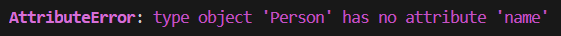
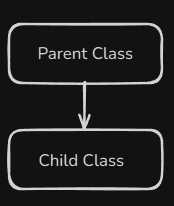
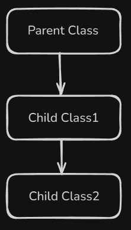
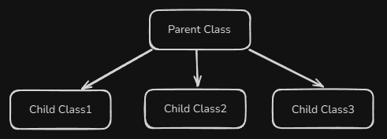

# Content of Python object programming 2 level

- [Encapsulation](#encapsulation)
- [Class Types of Methods](#class-types-of-methods)
- [Inheritance](#inheritance)

In the previous level, we explored the **basics of object-oriented programming (OOP)** we learned what **classes** and **objects** are and how they work together.

Now, in this level, we’ll go one step deeper and we’ll learn how to.

- **Control access to data** inside a class, so that some attributes can only be used internally or hidden for security or design reasons.

- **Reuse and extend** existing classes, allowing one class to build upon another’s attributes and behavior - a concept known as **inheritance**.

## Encapsulation

**Encapsulation** is the process of bundling data (**attributes**) and behavior (**methods**) together into a single unit - the **class**.

According to the principle of encapsulation, the **data members** that describe an object should be **hidden from the outside world**. They can only be accessed and modified through the **methods defined inside the same class**.

Here’s how we define different types of attributes in Python.

- **Public attributes:** Accessible from **anywhere** - both inside and outside the class.

    ```py
    class Person:
    def __init__(self, name):
        self.name = name # public attribute

    person = Person("Petras")
    print(person.name) # Accessible - Petras
    person.name = "Jonas" # Can be modified directly
    print(person.name) # Jonas
    ```

- **Protected attributes:** Indicated by a single underscore `_` before the name. This means *“for internal use only”* - it’s a convention that signals the attribute shouldn’t be accessed directly.

    ```py
    class Person:
        def __init__(self, name, age):
            self.name = name
            self._age = age # protected attribute

    person = Person("Marta", 25)
    print(person._age) # Technically accessible, but should be treated as protected
    ```

- **Private attributes:** Indicated by two underscores `__` before the name. Python automatically *name-mangles* them to make direct access from outside the class difficult.

    ```py
    class Person:
        def __init__(self, name, salary):
            self.name = name
            self.__salary = salary # private attribute

    person = Person("Antanas", 3000)

    print(person.name) # Accessible
    print(person.__salary) # AttributeError - can't access directly
    ```

    Of course, it’s still technically possible to access a private attribute using *name mangling*, but this is considered **bad practice** and should be avoided.

    ```py
    person = Person("Petras", 500)
    print(person._Person__salary) # Works, but not recommended
    ```

Sometimes, we need to access those private attributes, and this is done through **methods** that are accessible from outside the class. These methods provide **controlled interaction** with the data.

Such methods are often called **getters** and **setters**. Traditionally, in **object-oriented programming (OOP)**, these methods follow a naming convention that starts with `get_` or `set_`.

- A **getter** is used to *access (read)* the value of a private attribute.

- A **setter** is used to *modify (update)* the value of a private attribute.

    ```py
    class Person:
        def __init__(self, name, age):
            self.__name = name
            self.__age = age
    
        # Getter for name
        def get_name(self):
            return self.__name
        
        # Setter for name
        def set_name(self, new_name):
            self.__name = new_name

    person = Person("Petras", 25)

    print(person.get_name()) # Petras

    person.set_name("Jonas")

    print(person.get_name()) # Jonas
    ```

In the old way, we used explicit getter and setter methods like `get_name()` and `set_name()` to control access to private attributes.

However, in modern Python, we achieve the same result in a cleaner way by using **decorators**.

As we already discussed in **Level 3 Functions programming**, decorators allow us to modify or extend the behavior of functions and methods.

One of the most common decorators used in **object-oriented programming (OOP)** is `@property`, which helps control access to attributes directly.

Instead of writing separate `get_` and `set_` methods, we can use `@property` along with its related decorators

- `@property` defines a **getter** (to read a value)

- `@<name>.setter` defines a **setter** (to update a value)

- `@<name>.deleter` defines a **deleter** (to delete an attribute)

Here’s how we can rewrite our previous example in a modern way.

```py
class Person:
    def __init__(self, name):
        self.__name = name  # Private attribute

    # Getter
    @property
    def name(self):
        return self.__name

    # Setter
    @name.setter
    def name(self, new_name):
        self.__name = new_name

    # Deleter (optional)
    @name.deleter
    def name(self):
        print("Deleting name...")
        del self.__name

# Example usage
person = Person("Petras")
print(person.name) # Access via getter Petras
person.name = "Jonas" # Modify via setter Jonas
print(person.name) # Output: Jonas
del person.name # Deletes the attribute
```

We also have **special (dunder) methods** that allow you to intercept and control how attributes are accessed, assigned, or deleted.

Overall, encapsulation means **protecting the internal state of an object** and **exposing only what is necessary**. This ensures that object data cannot be directly modified from outside, making the code safer.

## Class Types of Methods

In Python, a class can have three types of methods.

The first and most commonly used are **instance methods**. These methods are called on an object and must include `self` as the first parameter to refer to the current instance of the class.

```py
class Person:
    def __init__(self, name):
        self.name = name

    # Instance method
    def greet(self):
        print(f"Hello, my name is {self.name}.")

# Creating an object
student = Person("Petras")
student.greet()  # Output: Hello, my name is Petras.
```

**Instance methods** are used when the action of the method depends on the **specific object**. In other words, each object can have its own data, and instance methods let the object *“do things”* using its own information.

Other than instance methods, we also have **class methods**, which operate on the class itself rather than individual objects. This means they can access or modify **class-level variables** that are shared across all instances.

To define a class method, we use the decorator `@classmethod` and include `cls` as the first parameter, which refers to the class itself.

`cls` is like `self`, but for the class, not the object.

Here is example how it's look.

```py
class Person:
    population = 0 # class attribute

    def __init__(self, name):
        self.name = name
        Person.population += 1

    @classmethod
    def get_population(cls):
        print(f"Current population: {cls.population}")

p1 = Person("Jonas")
p2 = Person("Algis")

Person.get_population() # Current population: 2
```

Inside a **class method**, defined with the `@classmethod` decorator, we use the parameter `cls` to refer to the class itself. Using `cls`, we can access or modify **class attributes** that are shared across all objects of that class. This allows the method to work with data that belongs to the class rather than to any single instance.

You can also define additional parameters in a **class method** just like in a normal function, and they will work fine.

```py
class Person:
    species = "Homo sapiens"

    @classmethod
    def describe(cls, extra_info):
        print(f"All persons are {cls.species}. {extra_info}")

# Calling the class method
Person.describe("We are social beings.")  
# Output: All persons are Homo sapiens. We are social beings.
```

`cls` refers to the class, and `extra_info` is a regular parameter you can pass when calling the method.

But what you can’t do inside a class method is access or modify instance variables, because class methods don’t have access to `self`. They work only with **class variables**, which are shared by all objects.

Here’s an example of how you shouldn’t do it.

In this case, it looks like we’re using `self`, but its **just a regular parameter name**, not an instance of the class.

```py
    @classmethod
    def change_species(cls, self): # The parameter is named 'self'
        cls.species = "New Species"
        print(self.name)  # Works
```

Instead of using `self`, it’s much clearer to name the parameter something like `instance` or `obj` to make your intent obvious.

```py
    @classmethod
    def change_species(cls, instance):
        cls.species = "New Species"
        print(instance.name)  # Clear that we're using passed instance
```

Use meaningful parameter names (`instance`, `obj`) in `@classmethod` methods if you pass an object explicitly.

Another common mistake is trying to access **instance variables directly** inside a **class method**.

**Remember** that a `@classmethod`, the first parameter `cls` refers to the **class itself**, not to any individual object (instance). That means we can’t access instance attributes like `self.name` or `self.age` because no specific object is involved.

```py
    @classmethod
    def try_access_instance(cls):
        # Trying to access instance variables without an instance
        print(cls.name) # This will fail
        print(cls.age) # This will fail
```

If you run this, Python will raise an **AttributeError**, because `cls` doesn’t have `name` or `age`



**Class methods** are used when the action of the method depends on the **class itself**, not on individual objects. They work with class-level data that is shared by all objects of that class.

In simple terms, **class methods** are used when you want to do something that affects the **entire class and all its objects**, rather than just one specific instance.

The last type is the **static method**.

A `@staticmethod` doesn’t access the instance (`self`) or the class (`cls`). That means it **can’t modify** the object’s data or the class’s shared data. It behaves just like a **regular function**, but it’s placed inside a **class** because it has a **logical connection** to that class.

```py
class Person:
    def __init__(self, name, age):
        self.name = name
        self.age = age

    # Static method
    @staticmethod
    def is_adult(age):
        return age >= 18

# You can call it using the class or an object
print(Person.is_adult(20)) # True
student = Person("Petras", 17)
print(student.is_adult(student.age)) # False
```

Technically, **you can define parameters named** `self` or `cls` and explicitly pass an instance or class to a static method, which would allow you to modify their data.

**However**, this is highly unconventional and generally discouraged. Static methods are intended for operations that **don’t depend on instance or class state**.

```py
class Person:
    species = "Homo sapiens"

    def __init__(self, name, age, city):
        self.name = name
        self.age = age
        self.city = city

    @staticmethod
    def example_method(self, cls):
        # Access instance variable
        self.name = "Petras"
        print("self.name changed to:", self.name)

        # Access class variable
        cls.species = "Homo Neanderthalensis"
        print("cls.species changed to:", cls.species)
```

As we discussed, **static methods** don’t depend on any specific object or class state. That makes them perfect for **utility** or **helper functions** that belong logically to the class but don’t need to access or modify instance or class data. Using static methods keeps related functionality organized inside the class instead of leaving it as a free-floating function.

```py
class Person:
    species = "Homo sapiens"

    def __init__(self, name, age, city):
        self.name = name
        self.age = age
        self.city = city

    # Static method as a utility function
    @staticmethod
    def is_adult(age):
        return age >= 18

    # Instance method uses static method
    def can_vote(self):
        if Person.is_adult(self.age):
            return f"{self.name} can vote."
        else:
            return f"{self.name} cannot vote yet."

# Using static method directly (no instance needed)
print(Person.is_adult(20)) # True
print(Person.is_adult(15)) # False

# Using instance method that internally uses static method
p1 = Person("Petras", 25, "Kaunas")
p2 = Person("Jonas", 16, "Vilnius")

print(p1.can_vote()) # Petras can vote.
print(p2.can_vote()) # Jonas cannot vote yet.
```

In simple terms, **static methods** are used when you need a function that **logically belongs to a class**, but doesn’t need to access or change the class or object data.

## Inheritance

Inheritance is one of the main principles of **object-oriented Programming (OOP)**.
It simply means that one class can inherit (or take over) the **attributes** and **methods** of another class.

We can imagine that inheritance models an **is a** relationship - for example, a *student is a person*, or a *teacher is a person*.

The existing class that provides its properties and behaviors is called the **base class** (or **parent class**), and the class that inherits them is called the **derived class** (or **child class**).

So, instead of creating everything from scratch, a child class can reuse and extend what’s already defined in the parent class.

This encourages **code reusability**, **organization**, and **clarity**.

To understand why inheritance is useful, let’s first look at a case where we repeat the same code unnecessarily.

```py
class Person:
    def __init__(self, name, age):
        self.name = name
        self.age = age

    def show_info(self):
        print(f"Name: {self.name}, Age: {self.age}")


class Student:
    def __init__(self, name, age, grade):
        self.name = name
        self.age = age
        self.grade = grade

    def show_info(self):
        print(f"Name: {self.name}, Age: {self.age}, Grade: {self.grade}")


class Teacher:
    def __init__(self, name, age, subject):
        self.name = name
        self.age = age
        self.subject = subject

    def show_info(self):
        print(f"Name: {self.name}, Age: {self.age}, Subject: {self.subject}")

s1 = Student("Jonas", 15, 9)
t1 = Teacher("Rasa", 34, "Math")

s1.show_info()
t1.show_info()
```

Here, both classes have the same attributes (`name`, `age`) and the same `show_info()` logic - we’re clearly repeating ourselves.

This is exactly the kind of situation where **inheritance** helps us write cleaner, reusable code.

So, instead of repeating the same logic, we can move the shared attributes (`name`, `age`) and method (`show_info`) into a **parent class** - and then let both `Student` and `Teacher` inherit from it.

This way, we write the common code only once, and both child classes can reuse it.

The most common and recommended way is when **one child class inherits from a single parent class**. This is called **single inheritance**.



The structure in code looks like this.

```py
class Person:
    pass

class Student(Person): # inherits from only one parent
    pass
```

The idea is that the `Student` child class can use the **common methods** and **attributes** defined in the `Person` parent class.

Let’s see example, showing what happens under the hood when we call parent methods manually.

```py
# Base class
class Person:
    def __init__(self, name, age):
        self.name = name
        self.age = age

    def show_info(self):
        print(f"Name: {self.name}, Age: {self.age}")

# Subclass
class Student(Person):
    def __init__(self, name, age, grade):
        # Call parent constructor manually
        Person.__init__(self, name, age)
        self.grade = grade

    def show_info(self):
        Person.show_info(self) # Call parent method manually
        print(f"Grade: {self.grade}")

s1 = Student("Jonas", 15, 9)
s1.show_info()
```

With this approach, the shared code is written **only once** in the parent class, and the child class automatically gets access to it. This makes your code **cleaner** and **reusable**.

In our previous example of **single inheritance**, we called the parent methods **manually**. While that works, it’s **not considered best practice**. It’s mainly useful to understand **how inheritance works under the hood**.

In modern Python, we use the built-in function `super()` instead. The `super()` function allows the child class to call the **parent class constructor** or **methods** without referring to the parent’s name directly.

So instead of writing this manually.

```py
Person.__init__(self, name, age)
Person.show_info(self)
```

We use.

```py
super().__init__(name, age)
super().show_info()
```

Here’s the same example rewritten the proper way.

```py
# Base class
class Person:
    def __init__(self, name, age):
        self.name = name
        self.age = age

    def show_info(self):
        print(f"Name: {self.name}, Age: {self.age}")

# Subclass
class Student(Person):
    def __init__(self, name, age, grade):
        # Call parent constructor using super()
        super().__init__(name, age)
        self.grade = grade

    def show_info(self):
        # Call parent method using super()
        super().show_info()
        print(f"Grade: {self.grade}")

s1 = Student("Jonas", 15, 9)
s1.show_info()
```

Now that we understand the basics of inheritance, let’s look at another common type - **multi-level inheritance**.

**Multi-level inheritance** occurs when a class inherits from another class, which in turn inherits from yet another class. Essentially, it creates a chain of inheritance, allowing attributes and methods to be passed down through multiple levels.

Here’s the conceptual diagram.



The structure in code looks like this.

```py
class Person:
    pass

class Student(Person):
    pass

class CollegeStudent(Student): # Inherits from multiple parents
    pass
```

Here, the `Student` class inherits from `Person`, so it automatically gains access to all of `Person` attributes and methods. The `CollegeStudent` class then inherits from `Student`, which means it also indirectly inherits everything from `Person`, forming a continuous chain of inheritance.

Let’s see a example.

```py
# Base class
class Person:
    def __init__(self, name, age):
        self.name = name
        self.age = age

    def show_info(self):
        print(f"Name: {self.name}, Age: {self.age}")

# Intermediate class
class Student(Person):
    def __init__(self, name, age, grade):
        super().__init__(name, age) # Call Person constructor
        self.grade = grade

    def show_info(self):
        super().show_info()
        print(f"Grade: {self.grade}")

# Derived class
class CollegeStudent(Student):
    def __init__(self, name, age, grade, college):
        super().__init__(name, age, grade) # Call Student constructor
        self.college = college

    def show_info(self):
        super().show_info()
        print(f"College: {self.college}")

c1 = CollegeStudent("Jonas", 20, 3, "Vilnius University")
c1.show_info()
```

With **multi-level inheritance**, each level builds on the previous one, letting you **extend behavior step by step** without rewriting existing logic.

The next type of **inheritance** is **hierarchical inheritance**, where **multiple child classes** are derived from a **single parent class**. In simple terms, it means **one parent class and many child classes**, all sharing the common properties and behaviors defined in the parent.

Here’s the conceptual diagram.



The structure in code looks like this.

```py
class Person:
    pass

class Student(Person): # Inherits from Person
    pass

class Teacher(Person): # Inherits from Person
    pass

class Staff(Person): # Inherits from Person
    pass
```

In this case, each child class (`Student`, `Teacher`, and `Staff`) inherits from the same parent class `Person`, meaning they all gain access to its attributes and methods, but can also define their own specific behaviors.

Let’s look at a example.

```py
# Parent class
class Person:
    def __init__(self, name, age):
        self.name = name
        self.age = age

    def show_info(self):
        print(f"Name: {self.name}, Age: {self.age}")

# Child class 1
class Student(Person):
    def __init__(self, name, age, grade):
        super().__init__(name, age)
        self.grade = grade

    def show_student(self):
        print(f"Student Grade: {self.grade}")

# Child class 2
class Teacher(Person):
    def __init__(self, name, age, subject):
        super().__init__(name, age)
        self.subject = subject

    def show_teacher(self):
        print(f"Teaches: {self.subject}")

# Child class 3
class Staff(Person):
    def __init__(self, name, age, department):
        super().__init__(name, age)
        self.department = department

    def show_staff(self):
        print(f"Department: {self.department}")

s1 = Student("Jonas", 17, 10)
t1 = Teacher("Rasa", 35, "Math")
st1 = Staff("Petras", 40, "Administration")

s1.show_info()
s1.show_student()

t1.show_info()
t1.show_teacher()

st1.show_info()
st1.show_staff()
```

So far, we’ve covered the **basic types of inheritance** in Python: **single, multi-level, and hierarchical inheritance** and seen how they allow classes to reuse and extend code efficiently. These foundational concepts help organize code, reduce repetition, and model relationships between objects.

In the future, at **Object Programming Level 4**, we’ll dive deeper into more advanced inheritance techniques and explore **complex class hierarchies**.

Previously, we talked about **encapsulation**, which is all about **protecting the internal state of an object** and exposing only what is necessary through **methods, getters, and setters**.

Now, when we combine **encapsulation** with **inheritance**, we can see how **child classes** can interact with **protected and private attributes** of their parent classes, while still maintaining controlled access.

Here is the example

```py
# Parent class with encapsulated attributes
class Person:
    def __init__(self, name, age, salary):
        self.name = name
        self._age = age
        self.__salary = salary

    # Getter for private attribute
    def get_salary(self):
        return self.__salary

    # Setter for private attribute
    def set_salary(self, value):
        if value > 0:
            self.__salary = value

# Child class inheriting from Person
class Employee(Person):
    def __init__(self, name, age, salary, job):
        super().__init__(name, age, salary)
        self.job = job

    def show_info(self):
        # Can access public and protected attributes
        print(f"Name: {self.name}, Age: {self._age}, Job: {self.job}")
        # Private attribute must be accessed via getter
        print(f"Salary: {self.get_salary()}")

e1 = Employee("Rasa", 30, 3000, "Teacher")
e1.show_info()
```

Here we can see that the **child class** `Employee` inherits attributes and methods from **Person**. It has direct access to **public** and **protected** attributes, while **private attributes** like `__salary` remain hidden and can only be accessed through **getter/setter methods**. This shows how **encapsulation** continues to protect the internal state of an object, even when it is extended through **inheritance**, allowing child classes to reuse functionality safely without breaking data integrity.
