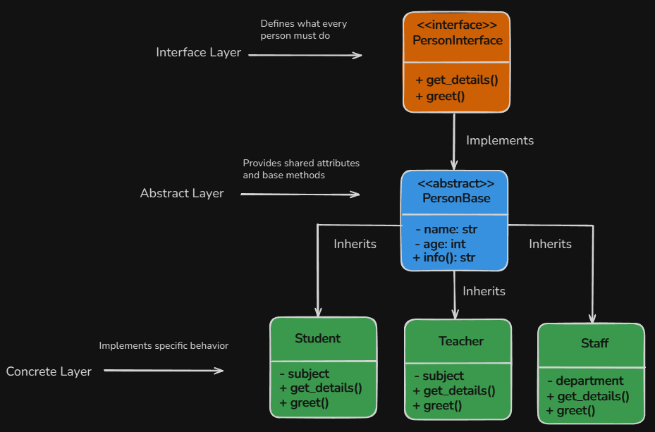
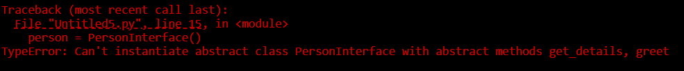

# Content of Python object programming 3 level

- [Abstraction](#abstraction)
- [Polymorphism](#polymorphism)

In the **previous level**, we explored **encapsulation**, where we learned how to access and protect hidden attributes, discussed different **types of methods**, and saw how **inheritance** allows classes to reuse and extend functionality.

Now, in this level, we’ll take another step and learn how to.

- Hide unnecessary details and show only what’s important it's known as **abstraction**.

- Use classes with the **same method name**, but each can do something different it this is called **polymorphism**.

- Integrate special **built-in methods** that let change or extend how classes normally behave also known as **dunder (magic) methods**.

## Abstraction

Let’s understand what the principle of **Abstraction** means.

**Abstraction** is a principle of **object-oriented programming (OOP)**. It’s all about showing only what’s necessary and hiding the unnecessary details. This helps make programs easier to understand, **less complex**, and **more efficient** to develop and maintain.

In simple terms, it means we focus on *what an object does*, *not how it does it*.

Let's use analogy from real life. Imagine **Person**, when interact with someone, don’t need to know how their **body works internally** like how the brain processes thoughts or how the heart pumps blood.

You just **talk** to them, **ask** them to do something, or **get** information from them.

Here is a diagram showing how abstraction is implemented in **OOP**.



In this image, we can see **three main layers** that represent how **abstraction** works step by step.

- **Interface layer:** defines **what actions can be performed**, but **not how they are implemented**. It acts as a **contract** that **promise** every class implementing it will have the same set of methods, even if each class performs them differently.

- **Abstarct layer:** provides both **shared structure** and **partial implementation** for subclasses. It defines **common attributes** and **reusable methods**, while still enforcing certain methods that must be implemented by subclasses.

- **Concrete layer:** This is where the **actual implementation** happens. The concrete class provides the real code for the abstract methods and performs the specific tasks.

Now that we understand the overall idea of **abstraction**, let’s break down each **layer**, look at its **purpose**, what it **contains**, and how **implement it in code**.

The **interface layer** defines **what must be done**, not **how it’s done**. It acts like a **contract** that all subclasses must follow, specifying which methods they are required to implement.

This layer doesn’t contain any **implementation** or **shared logic**, only **abstract method definitions**. In Python, we represent this using an **Abstract Base Class** (`ABC`) with methods decorated by `@abstractmethod`.

Here’s how we write it in code.

```py
from abc import ABC, abstractmethod

# Interface
class PersonInterface(ABC):
    @abstractmethod
    def get_details(self):
        """Return details of the person"""
        pass

    @abstractmethod
    def greet(self):
        """Say hello"""
        pass
```

We first import `ABC` and `abstractmethod` from the **built-in Python module** called `abc`. When we make a class inherit from `ABC`, it tells Python that this class is **abstract**, meaning it’s just a blueprint and **cannot be used to create objects directly**.

The `@abstractmethod` decorator is then used to mark **methods that must be written** (implemented) inside any **child class** that inherits from this **abstract class**.

So if we try to create an **object** directly from an abstract class like this.

```py
person = PersonInterface()
```

Python will raise an error.



This means that **abstract classes cannot be instantiated** on their own. They serve only as **blueprints**.

In a **small application**, you often don’t need two separate layers **interface** and **abstract** class. You can merge them and let the abstract class itself define both.

This layer is different from the interface layer because it can provide **shared logic** in addition to abstract method definitions.

- **Abstract methods:** define *what must be done* like the **interface**.

- **Concrete methods / shared attributes:** provide *reusable logic* for **subclasses**

This layer is useful when multiple child classes will need common features like `name` or `age`, so we define them once here and all subclasses can inherit them. That way, we avoid writing the same **attributes** or **methods** over and over again.

We usually name this kind of class with the word `Base` to show that it is meant to be the foundation for other classes. It contains **shared logic**, but also **abstract methods** that every **child class** must complete.

```py
from abc import ABC, abstractmethod

# Abstract class (acting as both interface / shared base)
class PersonBase(ABC):
    def __init__(self, name, age):
        self.name = name
        self.age = age

    # Shared method
    def info(self):
        return f"Name: {self.name}, Age: {self.age}"
    
    @abstractmethod
    def get_details(self):
        """Return details of the person"""
        pass

    @abstractmethod
    def greet(self):
        """Child class must implement this"""
        pass
```

Because this class already includes shared behavior, subclasses don’t need to rewrite the same code, they simply inherit it. At the same time, the **abstract methods** ensure that every **subclass** still provides its own version of `get_details()` and `greet()`.

The last layer is the **concrete layer**, this is where we finally create **real classes** that can be used in the program. These classes fully implement all the **abstract methods** from the **previous layer**. They also use the **shared attributes** and **methods** from `PersonBase`, but now they add their own specific behavior.

This is the layer where the actual functionality lives. Once the **class** is **concrete**, we can finally **create objects** and call their **methods** to get information.

```py
# Concrete class: Student
class Student(PersonBase):
    def __init__(self, name, age, grade):
        super().__init__(name, age)
        self.grade = grade

    def get_details(self):
        return f"{self.info()}, Grade: {self.grade}"

    def greet(self):
        print(f"Hello, I am {self.name} and I am in grade {self.grade}.")

# Concrete class: Teacher
class Teacher(PersonBase):
    def __init__(self, name, age, subject):
        super().__init__(name, age)
        self.subject = subject

    def get_details(self):
        return f"{self.info()}, Teaches: {self.subject}"

    def greet(self):
        print(f"Hello, I am {self.name} and I teach {self.subject}.")

# Concrete class: Staff
class Staff(PersonBase):
    def __init__(self, name, age, department):
        super().__init__(name, age)
        self.department = department

    def get_details(self):
        return f"{self.info()}, Works in: {self.department}"

    def greet(self):
        print(f"Hello, I am {self.name} and I work in {self.department} department.")


s1 = Student("Jonas", 15, 9)
t1 = Teacher("Rasa", 34, "Math")
st1 = Staff("Petras", 40, "Administration")

print(s1.get_details())
s1.greet()

print(t1.get_details())
t1.greet()

print(st1.get_details())
st1.greet()
```

So far, with **abstraction**, we learned how to define the **shape of behavior**, specifying **what a class should do**, but **not how it does it**. Basiclly, this leaves the details to the **concrete classes** and enforces a structure that different objects can follow.

But now, we need to understand how **different objects** can **share that same structure** while **acting differently** in practice. This is exactly where **polymorphism** comes in.

## Polymorphism

Polymorphism means **“many forms”**. It allows different objects to respond to the same method or interface in **their own unique way**. One of the most common forms we already use is **subtype polymorphism**, which we achieve through **inheritance** from an abstract class and **overriding methods** in **concrete classes**.

Here’s an example using the `PersonBase` abstraction we already built.

```py
from abc import ABC, abstractmethod

# Abstract class (acting as both interface / shared base)
class PersonBase(ABC):
    def __init__(self, name, age):
        self.name = name
        self.age = age

    # Shared method
    def info(self):
        return f"Name: {self.name}, Age: {self.age}"
    
    @abstractmethod
    def get_details(self):
        """Return details of the person"""
        pass

    @abstractmethod
    def greet(self):
        """Child class must implement this"""
        pass

# Concrete class: Student
class Student(PersonBase):
    def __init__(self, name, age, grade):
        super().__init__(name, age)
        self.grade = grade

    def get_details(self):
        return f"{self.info()}, Grade: {self.grade}"

    def greet(self):
        print(f"Hello, I am {self.name} and I am in grade {self.grade}.")

s1 = Student("Jonas", 15, 9)

print(s1.get_details())
s1.greet()
```

Here, the abstract class defines the **interface** (`get_details` and `greet`), while the `Student` class **implements its own version**. Even though multiple subclasses may share the same interface, **each one can behave differently**, which is the essence of **polymorphism**.

Another form of polymorphism is called **duck typing**. Unlike **subtype polymorphism**, this approach doesn’t rely on inheritance at all. The idea comes from the **duck test**, which says, *“If it walks like a duck and quacks like a duck - then it is a duck.”*

In Python, this means that as long as an object has the method you expect like `.greet()` you can use it, even if the class is not related through **inheritance**. The actual **type of the object doesn’t matter**, what matters is whether it **can perform the expected behavior**.

Here is example.

```py
class Student:
    def __init__(self, name):
        self.name = name

    def greet(self):
        return f"Hello, I'm student {self.name}"

class Teacher:
    def __init__(self, name):
        self.name = name

    def greet(self):
        return f"Hello, I'm teacher {self.name}"

# Function that uses "duck typing"
def welcome_person(person):
    # No idea what type it is
    # It only assumes `.greet()` exists
    print(person.greet())

student = Student("Jonas")
teacher = Teacher("Rasa")

welcome_person(student)
welcome_person(teacher)
```

The `welcome_person()` function doesn’t care whether it receives a `Student`, a `Teacher`. It never checks their class or inheritance at all, it simply calls `greet()`. As long as the object provides that method, the function works.

This is exactly what **duck typing** means in Python, **the type doesn’t matter, the behavior does**.

Just like the saying *“If it walks like a duck and quacks like a duck - then it is a duck”*, in Python we say *“If an object has the method we expect, we can treat it as the right type.”*

The last form of polymorphism in **OOP** is **called Ad-hoc polymorphism**, which is more commonly known as **operator overloading**.

This allows us to give custom meaning to **built-in operators** or **functions** when they are used with our own classes.

Before we **overload** anything, notice what happens by default when we try to print an object.

```py
class Person:
    def __init__(self, name, age):
        self.name = name
        self.age = age

p = Person("Jonas", 20)
print(p)
# <__main__.Person object at 0x7fb8a64a0bd0>
```

When we print an object, Python shows only its **default technical representation** here we can see module `__main__` and **class name**, but not the actual **data stored inside** it. As covered in **Level 1 Object Programming**, this is just **Python fallback display**. To make the output meaningful and human-readable, we use **operator overloading** to customize how **built-in operations** like `print()` represent our objects.

If we want the `print()` function to show something meaningful instead of the default technical output, we can use a **dunder (special) method** like `__str__`. This method allows us to define how an object should be represented as a *human-readable string*.

```py
class Person:
    def __init__(self, name, age):
        self.name = name
        self.age = age

    def __str__(self):
        return f"{self.name}, {self.age} years old"

p = Person("Jonas", 20)
print(p)
# Jonas, 20 years old
```

Now, instead of showing Python’s default boring technical output which normally displays the class name and a memory reference, we get a friendly, readable message.

We also have another **dunder method** that is very commonly used, `__repr__`.

While `__str__` is meant for **human-friendly output**, `__repr__` is meant for **developers**. It is mostly used for debugging and logging.

```py
class Person:
    def __init__(self, name, age):
        self.name = name
        self.age = age

    def __repr__(self):
        return f"Person(name='{self.name}', age={self.age})"

p = Person("Jonas", 20)
# Person(name='Jonas', age=20)
```

That type of polymorphism **operator overloading (dunder methods)** used in **very specific situations**. You don’t use them all the time, only when you want to **customize how your object behaves** with built-in Python operations like **printing**, **comparing**.

So while **subtype polymorphism** and **duck typing** are used frequently in everyday **OOP design**, **operator overloading (dunder methods)** is more situational. Use when you need your objects to behave in a more meaningful way.

Overall, polymorphism lets different objects respond to **the same method or interface in their own unique way**.
