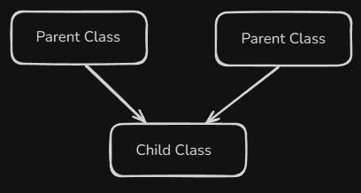

# Content of Python object programming 4 level

**Multiple inheritance** means that a single **child class** can inherit from **more than one parent class**. This allows the child class to combine **attributes** and **methods** from multiple sources.

So, instead of inheriting from just one class like in **single inheritance**, the child class can **mix in** functionality from several.

Here’s the conceptual diagram.



The structure in code looks like this.

```py
class Person:
    pass

class Worker:
    pass

class Teacher(Person, Worker):  # Inherits from multiple parents
    pass
```

In this example, class `Teacher` inherits from both `Person` and `Worker`. That means it has access to **all attributes and methods** from both parent classes.


Another useful dunder method is `__eq__`, which allows us to define how equality should work for our custom objects.

By default, when you compare two objects using `==`, Python checks whether they are the **same object in memory**, not whether their **data is the same**.

```py
class Person:
    def __init__(self, name, age):
        self.name = name
        self.age = age

p1 = Person("Jonas", 20)
p2 = Person("Jonas", 20)

print(p1 == p2) # False (compares memory, not values)
```

Even though both objects hold the same data, the result is `False` because Python is comparing *identity*, not *content*.

```py
print(p1)
print(p2)
# <__main__.Person object at 0x7fb337c32f10>
# <__main__.Person object at 0x7fb337c32f10>
```

To change this behaviour, we implement the `__eq__` method and tell Python **how two Person objects should be compared**. Instead of checking if they are the **same object in memory**, we tell Python to compare their **data (attributes)** instead.

```py
class Person:
    def __init__(self, name, age):
        self.name = name
        self.age = age

    def __eq__(self, other):
        # Comparing Person to Person
        if not isinstance(other, Person):
            return False
        # Compare values, not memory locations
        return self.name == other.name and self.age == other.age

p1 = Person("Jonas", 20)
p2 = Person("Jonas", 20)
p3 = Person("Tomas", 25)

print(p1 == p2) # True same data
print(p1 == p3) # False different data
```

Now the expression `p1 == p2` calls `p1.__eq__(p2)` behind the scenes, and because both objects have the **same name and age**, Python returns `True`.
