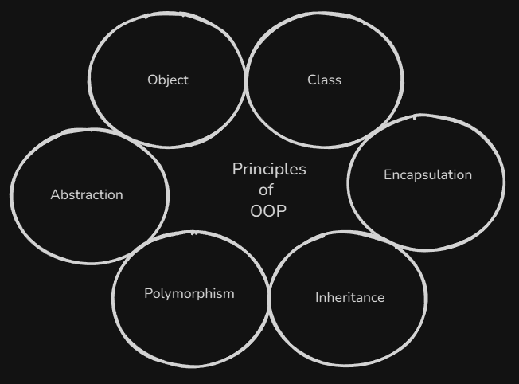

# Overview

When writing code, the first thing we need to understand is what we are building and how to organize it. This is where **programming paradigms** come in. A paradigm is essentially the **style** or **model** we choose to structure our code in order to solve a problem.

We already touched two paradigms: **procedural** and **functional**.

But Python is more than that. It also **supports Object-Oriented Programming (OOP)** - a paradigm(*model*) where we design programs around **objects** and their interactions.

The main principles that characterize the **Object-Oriented Programming (OOP)** concept are.

We will go through each principle step by step in different levels and see how they work.

- **Level 1:** We wll start by learning about `class` and `object`, and how to create them.

- **Level 2:** Then we cover **Encapsulation** and **Inheritance** - how to hide data and reuse code by creating subclass relationships.  

- **Level 3:** We finish with **Polymorphism** and **Abstraction** - how different classes can share common interfaces (polymorphism) and how abstraction allows us to design components that expose only essential features.
