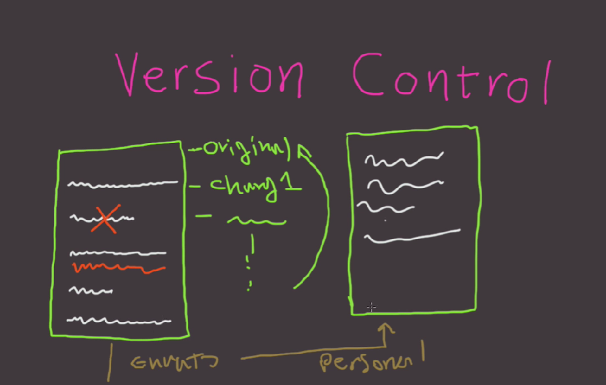

# Table of Contents

- [Setup and Config](#setup-and-config)
- [Basic Snapshotting](#basic-snapshotting)
- [Sharing and Updating Projects](#sharing-and-updating-projects)
- [Branching and Merging](#branching-and-merging)
- [Plumbing Commands](#plumbing-commands)

# Setup and Config

- [Version Controller](#version-controller)
    - [Git](#git)
- [Getting and Creating Projects](#getting-and-creating-projects)
- [Config](#config)
    - [Scopes](#scopes)
        - [Local](#local)
        - [Global](#global)
    - [core.editor](#coreeditor)

## Version Controller

**Explanation:**

This technology addresses a fundamental issue – the loss of previous versions when changes are made and saved. Think about it: without version control, every tweak or modification could potentially erase the history of your file.

**Key Concepts:**

1. **Challenges Without Version Control:**

- Without version control, saving changes results in the loss of previous versions, making it difficult to track and revert to specific states. The traditional approach of creating manual copies is impractical and leads to file clutter.

2. **Version Control Solutions - Commit and Branch:**

- Version control software, like Git, monitors changes and introduces the concept of "commit" – saving a snapshot of the file at a specific point. Additionally, "branching" allows the creation of separate versions for different purposes, ensuring organized and purpose-driven development.

3. **Benefits of Version Control:**

- The primary benefit of version control is maintaining a single local copy while the system systematically tracks changes. This streamlined approach avoids clutter, simplifies branching, and facilitates easy switching between different versions.

4. **Technologies - Git and GitHub:**

Git serves as the local version control system, monitoring changes on the user's system. GitHub, built on Git, acts as a social networking service where users can share their work through public or private repositories.

5. **Branching for Different Objectives:**

- Branching allows users to manage different versions of a file concurrently. For instance, creating branches for public releases or personal modifications keeps the development process organized and purpose-oriented.

**Example:**



### Git

**Explanation:**

Git is a distributed version control system designed to track changes in computer files, primarily used in collaborative software development. Unlike centralized systems, Git allows each programmer to have a local repository, providing a complete version history on their machine. This decentralized approach enhances flexibility and supports collaborative workflows.

The core purpose of Git is to facilitate the coordination of work among programmers who are collectively developing source code. It achieves this by systematically tracking changes made to files, creating a comprehensive history that helps developers understand the evolution of the codebase.

**Key Concepts:**

1. **Centralized Version Control (SVN):**

```plaintext
   A---B---C        (Master)
        |  
    Developers
```

- Commits A, B, and C represent different versions.

- Developers interact with a central repository (SVN) for version control.

2. **Decentralized Version Control (Git):**

```plaintext
   A---B---C          Developer 1
    \
    D---E---F        Developer 2
```

- Commits A, B, C, D, E, and F represent different versions.

- Each developer has their local repository and can work independently.

- Developers can share changes directly with each other without a central server.

**Resources:**

## Getting and Creating Projects

- [git init](#git-init)
- [git clone](#git-clone)

## Config

**Explanation:**

The most basic use case for git config is to invoke it with a configuration name, which will display the set value at that name. Configuration names are dot delimited strings composed of a 'section' and a 'key' based on their hierarchy.

**Key Concepts:**

1. **`--local`:**

- By default, `git config` will write to a local level if no configuration option is passed. Local level configuration is applied to the context repository `git config` gets invoked in. Local configuration values are stored in a file that can be found in the repo's `.git` directory: `.git/config`

2. **`--global`:**

- Global level configuration is user-specific, meaning it is applied to an operating system user. Global configuration values are stored in a file that is located in a user's home directory. `~ /.gitconfig` on unix systems and `C:\Users\\.gitconfig` on windows

3. **`--system`:**

- System-level configuration is applied across an entire machine. This covers all users on an operating system and all repos. The system level configuration file lives in a gitconfig file off the system root path. `$(prefix)/etc/gitconfig` on unix systems. On windows this file can be found `C:\ProgramData\Git\config` 

### Local

**Explanation:**

Will write to a local level if no configuration option is passed. Local level configuration is applied to the context repository `git config` gets invoked in.

**Key Concepts:**

1. File that can be found in the repo's `.git` directory: `.git/config`

**Syntax:**

*Input*

```bash
git config user.name Your Name
git config user.email your.email@example.com
```

*Output*

```bash
git config user.name "Your Name"
git config user.email "your.email@example.com"
```

**Example:**

```bash
mkdir MyProject
cd MyProject
git init
# Initialized empty Git repository in C:/Users/rokas/OneDrive/Desktop/MyProject/.git/
git config user.name Test
git config user.email your.email@example.com
# git config --get user.name
# Test
# =git config --get user.email
# your.email@example.com
git config --list --local
# core.repositoryformatversion=0
# core.filemode=false
# core.bare=false
# core.logallrefupdates=true
# core.symlinks=false
# core.ignorecase=true
# user.name Test
# user.email your.email@example.com
```

### core.editor

**Explanation:**

**Key Concepts:**

**Syntax:**

**Example:**

**Resources:**

# Basic Snapshotting

- [git add](#git-add)
- [git status](#git-status)
- [git commit](#git-commit)


## git add

**Explanation:**

- The staging area is an intermediate area where changes are prepared before committing them to the Git repository.
- Files in the staging area are in a state between the working directory and the committed repository.
- You use the `git add` command to move changes from the working directory to the staging area.

**Syntax:**

```bash
git add <path>
```

**Example:**

```bash
git add file1.js # Stages a single file
git add file1.js file2.js # Stage multple files
git add *.js # Stages with a pattern
git add . # Stages the current directory and all it's content
```

## git status

**Explanation:**

`git status` gives information on the current status of a git repository and it's contents

**Syntax:**

```bash
git status
```

**Example:**

```bash
git status # Full status
git status -s # Short status
# ? = Not tracked
# A = Added
# M = Modified
```

## git commit 

**Explanation:**

The `git commit` command captures a snapshot of the project's currently staged changes. Committed snapshots can be thought of as “safe” versions of a project—Git will never change them unless you explicitly ask it to.

**Key Concepts:**

1. Limit the subject line to 50 characters.
2. Capitalize only the first letter in the subject line.
3. Don't put a period at the end of the subject line.
4. Put a blank line between the subject line and the body.
5. Use the imperative mood
    - "Fix bug" and not "Fixed bug" or "Fixes bug".
6. Describe what was done and why, but not how.

**Syntax:**

```bash
git commit <flag>
```

**Example:**

```bash
git commit -m "Message" # Commits with a one-line message
git commit -am "Message" # Skipping the staging area (not recommended)
# To change the last commit, you can simply commit again, using the --amend flag:
 # Amend only works with the very last commit.
 # Amend rewrites the commit is replaced by a completely new one
  # the old commit is replaced by a completely new one
 # Don't amend (= rewrite) commits that you've already published to a remote repository!
git commit --amend -m "New and correct message"
# You could also add another couple of changes you forget:
git add another/changed/file.txt
git commit --amend -m "message"
```

```bash
# Bad
git commit -m "Fix bug"

# Good
git commit -m "Add auto login for verified users - Closes BLG-20"
```

```bash
# Bad
git commit -m "Implemented automatic login for new verified signups because currently new users have to maually log in after signing up."

# Good
git commit -m "Implement automatic login for new verified signups"
```


# Sharing and Updating Projects

- [Manager repositories](#manager-repositories)
    - [Github](#github)
- [remote](#remote)
- [push](#push)
- [pull](#pull)
- [fetch](#fetch)

## Manager repositories

### Github

**Example:**

- [Example: Local Connection](./assets/examples/connectToGithub/localConnection/README.md)