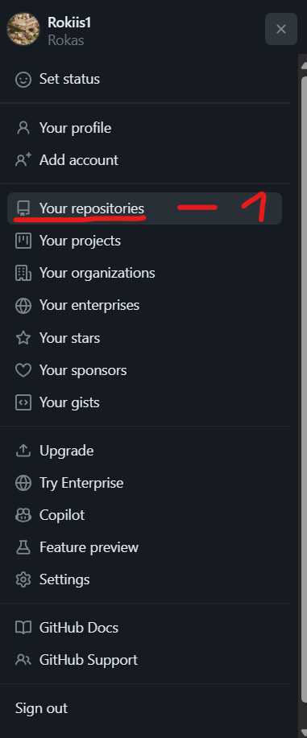
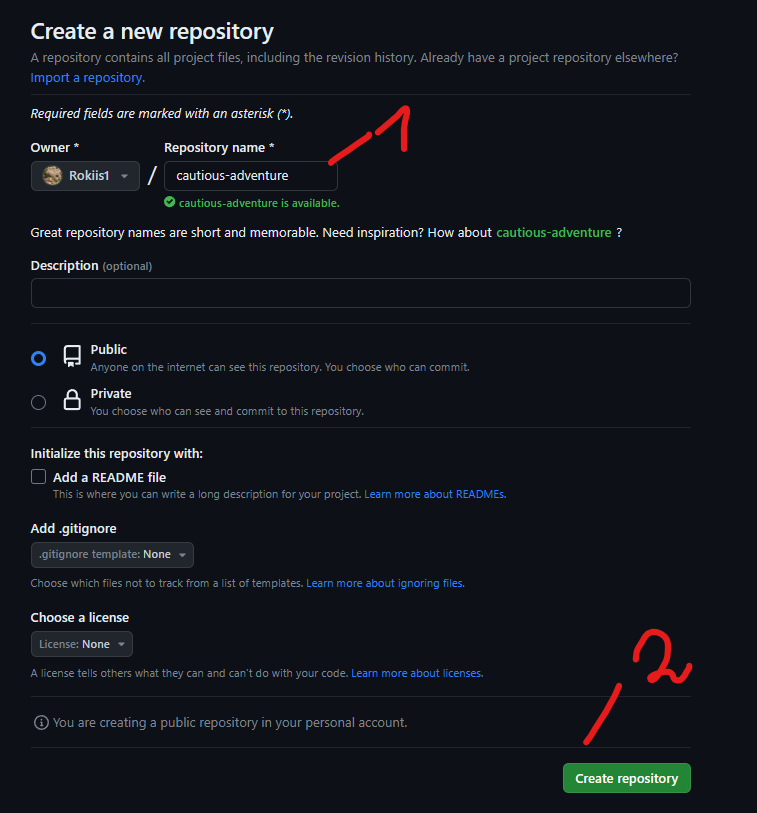
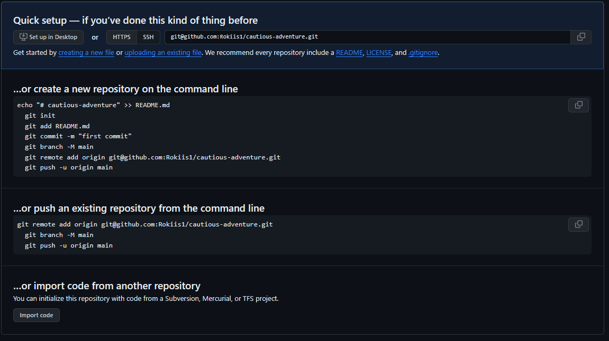

1. Step: Create Folder and local user into .git project

```bash
mkdir MyProject
cd MyProject
git init
# Initialized empty Git repository in C:/Users/rokas/OneDrive/Desktop/MyProject/.git/
git config user.name Test
git config user.email your.email@example.com
# git config --get user.name
# Test
# =git config --get user.email
# your.email@example.com
git config --list --local
# core.repositoryformatversion=0
# core.filemode=false
# core.bare=false
# core.logallrefupdates=true
# core.symlinks=false
# core.ignorecase=true
# user.name Test
# user.email your.email@example.com
```

2. Step: Create in Workspace a file and then index them

```bash
git touch text.txt
git status
git add .
git commit -m "Try to push from local to upstream"
```

3. Step: Create a New Repository on GitHub

Go to the [GitHub website](https://github.com/) and log in if you have account otherwise sign up. Click on the "+" sign in the top right corner of the page, and select "New repository." Follow the instructions to create a new repository, and note the repository URL.


4. Click on Your repositories



5. Click Green Button New


6. Create a Repository name and click green button Create repository



7. Connect to Github via HTTPS with out local repository



8. Add GitHub Repository as Remote:

Add the GitHub repository as a remote. Replace `<repository_url>` with the URL of your GitHub repository. And make branch name main

```bash
git remote add origin git@github.com:Rokiis1/cautious-adventure.git
git branch -M main
```

9. Update Remote URL:

Change the remote URL to use HTTPS instead of SSH. Use the following command:

```bash
git remote set-url origin https://github.com/Rokiis1/cautious-adventure.git
```

Replace the URL with your repository's HTTPS URL.

10. Push to upstream repository

Now, try pushing your changes using the updated URL:

```bash
git push -u origin main
```

11. Click Sign in with your browser


12. Authorize git to connect to github


13. You should see what kind of files or folder upload into upstream repository


14. If you wanna delete locally from the computer you can go in windows search and write `Credential Manager` >
Then Click on this url and click on buitton `Remove`

