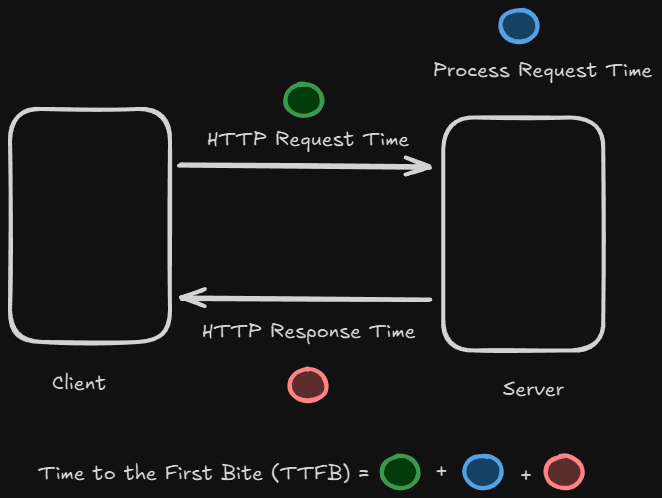

# Content of Manual Web Performance Testing

- [Performance testing tools](#performance-testing-tools)
- [Core Web Vitals overview](#core-web-vitals-overview)
- [Largest Contentful Paint (LCP)](#largest-contentful-paint-lcp)
- [First Input Delay (FID)](#first-input-delay-fid)
- [Interaction to Next Paint (INP)](#interaction-to-next-paint-inp)
- [Cumulative Layout Shift (CLS)](#cumulative-layout-shift-cls)
- [Time to First Byte (TTFB)](#time-to-first-byte-ttfb)

Web performance is an important aspect of modern web development. It affects how quickly content is loaded, how responsive an application feels and how stable the user experience is during interaction.

In real applications, performance issues can lead to slow loading times, delayed interactions or unexpected layout shifts, all of which negatively impact usability and user satisfaction.

To understand and improve performance, developers need ways to measure how an application behaves in real conditions. This involves analyzing loading times, responsiveness and visual stability using specific metrics and tools.

In this section, we explore how performance is tested manually, starting with the tools used to measure and analyze application behavior.

## Performance testing tools

To understand how an application performs, developers use specialized tools that measure **loading speed**, **responsiveness** and **visual stability**.

These tools simulate real user conditions and provide detailed insights into how a page behaves during loading and interaction.

Most performance tools focus on collecting metrics such as **loading times**, **rendering behavior** and **interaction delays**. This data helps identify bottlenecks and areas that need improvement.

One of the most commonly used tools is **browser developer tools**.

Modern browsers include built-in performance features that allow developers to analyze **network activity**, measure **resource loading** and inspect how the page is rendered. The **Network** and **Performance** tabs provide detailed information about request timing and execution.

Another widely used tool is **Lighthouse**.

Lighthouse is an automated tool that analyzes web pages and provides performance reports. It evaluates aspects such as **loading performance**, **accessibility** and **best practices**, and highlights issues that may affect user experience.

There are also external tools that simulate real-world conditions.

Tools such as **PageSpeed Insights** and **WebPageTest** allow testing under different network speeds and device conditions, providing insight into how an application performs in various environments.

Performance testing tools typically provide both **lab data** and **real-world data**.

Lab data is collected in a controlled environment, which helps with debugging and optimization. Real-world data reflects how actual users experience the application, providing a more accurate picture of performance.

Using these tools together helps developers understand how an application behaves, identify performance issues and make informed improvements.

Now that we understand the tools used to measure performance, we can look at the key metrics that define user experience, starting with Core Web Vitals.

## Core Web Vitals overview

**Core Web Vitals** are a set of metrics defined by Google to measure the real-world user experience of a web page.

They focus on three key aspects of performance, **loading speed**, **interactivity** and **visual stability**. These metrics help developers understand how users experience a page during load and interaction.

Core Web Vitals are based on real user data and are used to evaluate whether a page provides a good experience across different devices and network conditions.

The main metrics included in Core Web Vitals are **Largest Contentful Paint**, **Interaction to Next Paint** and **Cumulative Layout Shift**.

**Largest Contentful Paint** measures how quickly the main content of a page becomes visible. **Interaction to Next Paint** measures how responsive the page is to user interactions. **Cumulative Layout Shift** measures how stable the layout is during loading.

In addition to these, other related metrics such as **Time to First Byte** and **First Input Delay** can provide additional insight into performance. **First Input Delay** is gradually being replaced by **Interaction to Next Paint** as a more complete measure of responsiveness.

Together, these metrics provide a structured way to evaluate performance from the users perspective.

To begin exploring these metrics in more detail, we start with Largest Contentful Paint, which focuses on how quickly the main content becomes visible to the user.

## Largest Contentful Paint (LCP)

**Largest Contentful Paint** measures how long it takes for the main content of a page to become visible to the user. This usually corresponds to the largest image or block of text within the viewport.


During page loading, several stages occur before the main content is fully rendered.

The process begins when the page starts loading and the browser fetches and processes HTML, CSS and JavaScript. As rendering progresses, the browser first displays basic pixels on the screen, followed by visible content such as text or images.

Largest Contentful Paint represents the moment when the most significant element in the viewport is fully rendered and visible to the user.

A fast LCP indicates that users can quickly see the primary content of the page, which improves perceived performance and user experience.

A good LCP value is typically below **2.5 seconds**, while values above this range may indicate performance issues.

Several factors can affect LCP.

Large or unoptimized images can delay rendering because they take longer to download. Slow server response times can also delay when content starts loading. In addition, render blocking resources such as CSS and JavaScript may prevent the browser from displaying content quickly. Heavy client side processing can further delay rendering.

Improving LCP often involves optimizing how critical resources are loaded and rendered.

Images should be compressed and delivered in modern formats such as WebP. It is also important to serve images in appropriate sizes based on the device.

```html

```

Critical images should be prioritized so they load as early as possible.

```html
<head>
    <link rel="preload" href="images/critical-image.webp" as="image" fetchpriority="high">
</head>
```

Lazy loading should not be applied to the main LCP element, since it delays rendering.

```html

```

Another important improvement is reducing render blocking resources. This can be achieved by minimizing CSS and JavaScript and ensuring that only critical resources are loaded first.

Optimizing server response time and reducing unnecessary processing can also significantly improve LCP.

Now that we understand how loading performance is measured, we can look at how user interaction responsiveness is evaluated.

## First Input Delay (FID)

**First Input Delay** measures how long it takes for the browser to respond to a user's first interaction. This interaction can be a click, tap or key press.


When a user interacts with a page, the browser must process that input before responding. If the main thread is busy, the interaction is delayed. First Input Delay captures this waiting time between the user's action and the moment the browser begins processing it.

This metric focuses only on the first interaction. It does not measure how the page responds to later interactions.

A good FID value is below **100 milliseconds**. Values between **100 and 300 milliseconds** indicate moderate delay, while values above **300 milliseconds** suggest poor responsiveness.

Several factors can increase First Input Delay.

Heavy JavaScript execution can block the main thread and prevent the browser from responding quickly. Large or unoptimized media files can also delay interactivity. In some cases, slow server response times may contribute to delays in loading scripts needed for interaction.

Improving FID involves reducing the amount of work blocking the main thread.

One common approach is splitting code into smaller chunks so that only essential code is loaded initially. Non critical parts of the application can be loaded later when needed.

Another approach is controlling how scripts are loaded. Non critical scripts should be loaded in a way that does not block rendering or interaction.

```html
<script src="non-critical.js" defer></script>
<script src="analytics.js" async></script>
```

Reducing unnecessary JavaScript execution and optimizing third party scripts can also significantly improve responsiveness.

It is important to understand that FID measures only the delay before processing begins. It does not include the time required to complete the interaction or update the interface.

Because First Input Delay only measures the initial delay, it does not fully represent overall responsiveness during user interaction.

To better capture the full interaction experience, we use a more complete metric.

## Interaction to Next Paint (INP)

**Interaction to Next Paint** measures how responsive a page is during user interactions across its entire lifecycle.

Unlike First Input Delay, which only measures the initial delay, INP captures the full time from when a user interacts with the page to when the next visual update is displayed.


This includes several parts of the interaction process.

Input delay is the time the browser waits before it can start handling the interaction. This usually happens when the main thread is busy.

Processing time is the time required to execute the event handler, such as running JavaScript logic triggered by the interaction.

Presentation delay is the time needed to update the layout and render the changes on the screen.

By combining these phases, INP provides a complete view of how quickly the page responds to user actions.

A good INP value is below **200 milliseconds**. Values between **200 and 500 milliseconds** indicate moderate responsiveness, while values above **500 milliseconds** suggest poor performance.

One of the most common causes of high INP is inefficient event handling.

Expensive computations, unnecessary re-renders or heavy JavaScript execution can delay interaction processing and visual updates.

Improving INP focuses on reducing the work done during interactions.

Event handlers should be optimized to perform only essential tasks. For high frequency events such as scrolling, resizing or typing, techniques like debouncing or throttling can help reduce the number of operations.

Keeping JavaScript lightweight and avoiding long blocking tasks helps ensure that interactions remain smooth and responsive.

INP provides a more complete measure of user experience compared to earlier metrics.

In the next section, we look at how layout stability is measured using Cumulative Layout Shift.

## Cumulative Layout Shift (CLS)

**Cumulative Layout Shift** measures how visually stable a page is while it loads and renders.


A layout shift happens when visible elements move unexpectedly between frames. This can cause content to jump on the screen, making the experience confusing or frustrating for users.

CLS represents the total amount of these unexpected shifts that occur during the lifetime of the page.

The score is calculated based on how much of the screen is affected and how far elements move. Larger movements and wider impact areas result in a higher score.

Shifts that occur shortly after a user interaction are not counted, since they are considered intentional.

A good CLS score is below **0.1**. Values between **0.1 and 0.25** indicate moderate instability, while values above **0.25** suggest a poor user experience.

Layout shifts are often caused by elements that load or change size without reserved space.

Images, advertisements or dynamic content can push existing content down if their dimensions are not defined in advance. Font loading can also change text size and cause shifts. In some cases, delayed JavaScript execution may insert or modify elements after the initial render.

Improving CLS focuses on maintaining consistent layout structure during loading.

Space should be reserved for elements that load later so that content does not move unexpectedly. Media elements such as images and videos should define dimensions or use aspect ratio to maintain layout stability.

```html
<div class="reserved-space">
    
</div>
```

The container reserves space for the content before it loads, preventing layout shifts when the image appears.

```css
.reserved-space {
    width: 100%;
    height: 300px;
}

.reserved-space img {
    width: 100%;
    height: 100%;
    object-fit: cover;
    display: block;
}
```

By ensuring that layout dimensions are predictable, the page remains stable and easier to interact with.

In the next section, we look at Time to First Byte, which measures how quickly the server begins responding to a request.

## Time to First Byte (TTFB)

**Time to First Byte** measures how long it takes for the browser to receive the first byte of data after making a request to the server.



This metric reflects how quickly the server begins responding. It includes the time needed for network transfer, server processing and the initial response.

A lower TTFB means the server responds quickly, while a higher value indicates delays before any content starts loading.

A good TTFB value is below **200 milliseconds**. Values between **200 and 500 milliseconds** indicate moderate delay, while values above **500 milliseconds** suggest poor performance.

Several factors can increase TTFB.

Network latency can delay how quickly requests reach the server and responses return to the browser. Slow server-side processing, such as inefficient code or complex database queries, can also increase response time. High server load or too many simultaneous requests may further delay the response.

Improving TTFB focuses on reducing the time required for the server to process and respond to requests.

Optimizing backend logic and database queries helps reduce processing time. For example, retrieving only necessary data instead of requesting everything can improve performance.

```sql
SELECT id, name FROM users WHERE id = 1;
```

Caching is another important technique.

Server-side caching allows frequently requested data to be stored and reused, reducing the need for repeated processing. Browser caching helps store static resources so they do not need to be downloaded again on future visits.

Proper cache configuration ensures that responses are delivered faster and reduces load on the server.

By improving server response time and reducing unnecessary processing, TTFB can be significantly reduced.

In practice, TTFB provides insight into backend performance and is an important part of overall page loading speed.
