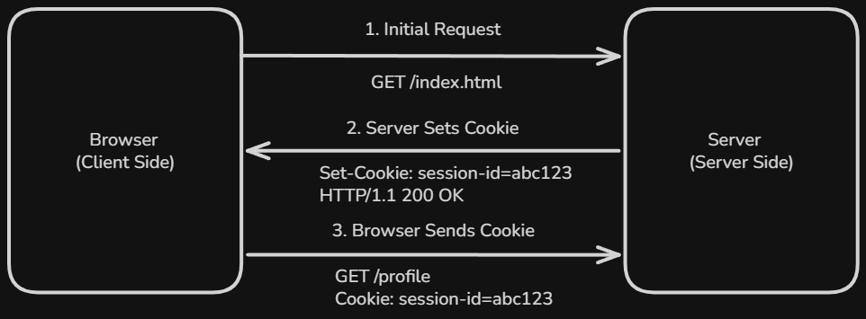
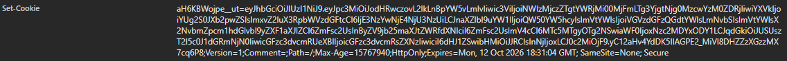
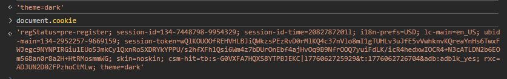
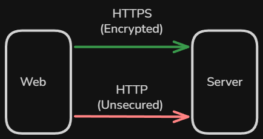
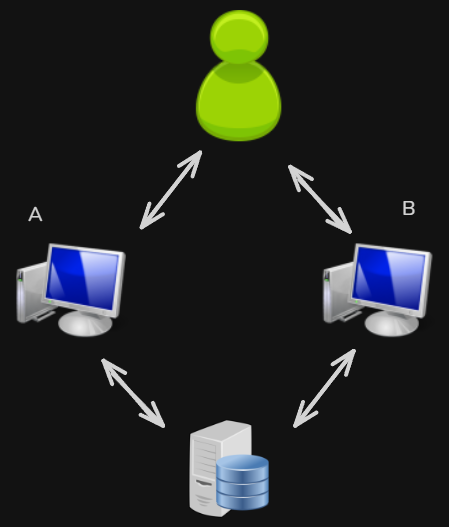

# Content of Cookies

- [What are cookies and why they exist](#what-are-cookies-and-why-they-exist)
- [How cookies work in the browser](#how-cookies-work-in-the-browser)
- [How cookies are created and stored](#how-cookies-are-created-and-stored)
- [How cookies are sent with requests](#how-cookies-are-sent-with-requests)
- [Cookie structure and attributes](#cookie-structure-and-attributes)
- [Types of cookies](#types-of-cookies)
- [Modern browser restrictions on cookies](#modern-browser-restrictions-on-cookies)

Web applications need a way to remember information between requests.

HTTP itself is a **stateless protocol**, which means that each request is independent. The server does not automatically remember anything about previous interactions.

This creates a challenge.

For example, when a user logs in to an application, the server needs a way to remember that the user is authenticated. Without this, the user would have to log in again on every request.

Similarly, applications often need to store small pieces of data such as user preferences, session identifiers or tracking information.

To solve this problem, web applications rely on a mechanism that allows data to be stored on the client and sent with future requests.

You can think of this like a ticket system.

When a user interacts with a website, the server gives them a small piece of data, like a ticket. The browser stores this ticket and automatically sends it back to the server on future requests.

The server uses this ticket to recognize the user or retrieve related information.

This mechanism is called **cookies**.

Cookies act as a **state management layer between the browser and the server**, allowing web applications to maintain continuity across multiple requests.

To understand how cookies are used in web applications, we start with the basics.

## What are cookies and why they exist

A **cookie** is a small piece of data that a server sends to the browser. The browser stores this data and automatically includes it in future requests to the same server.

Cookies are used to maintain **state** in web applications.

Because HTTP is stateless, the server does not remember previous requests. Each request is treated as a completely new interaction.

Cookies solve this limitation by allowing the server to store information on the client and retrieve it later.

You can think of cookies like an identification badge.

When a user first visits a website, the server issues a badge. The browser keeps this badge and presents it every time it makes a request to that server.

The server reads the badge and uses it to recognize the user or retrieve related data.

This does not mean that cookies always contain sensitive information. In most cases, cookies store only a **reference**, such as a session identifier. The actual data is usually stored on the server.

For example, when a user logs in, the server creates a session and assigns it a unique ID. This ID is stored in a cookie in the browser.

On subsequent requests, the browser sends this cookie back to the server. The server uses the session ID to look up the users authenticated state.

Cookies are also used for other purposes.

They can store user preferences, such as language, theme settings also can be used to track user behavior for analytics. and the last wich can also support features like shopping carts or remembering previously entered information.

In all these cases, the main goal remains the same.

Cookies allow the server to associate multiple requests with the same user or context.

However, cookies do not work on their own.

They are created by the server, stored by the browser, and sent back with requests under specific rules.

To understand this process, we need to look at how cookies actually move between the browser and the server.

## How cookies work in the browser

Cookies are part of the communication between the **browser and the server**. They are not created or managed automatically by HTTP itself, but are handled through specific HTTP headers and browser behavior.

You can think of this process as an exchange.

The server provides data, the browser stores it, and then sends it back when required.

The process begins when the browser makes a request to a server.

In the response, the server can include a `Set-Cookie` header. This header tells the browser to store a cookie.

For example, a response might include `Set-Cookie: session_id=abc123`

When the browser receives this header, it stores the cookie along with additional metadata such as the domain, path and expiration.

After the cookie is stored, it becomes part of future requests.

Whenever the browser sends a request to the same server, it automatically includes the cookie in the `Cookie` header.

This happens without any manual action from the user or developer at request time. The browser manages this behavior automatically based on the cookie rules.

The server then reads the cookie value from the request and uses it to identify the user or retrieve related data.

This creates a continuous loop.

The server sets a cookie, the browser stores it, and then sends it back with future requests.

You can think of this like a check-in system.

The first time a user visits, they are registered and given an identifier. On every return visit, they present that identifier so the system can recognize them.

It is important to understand that the browser does not send all cookies to every request.

Cookies are only included when certain conditions are met, such as matching domain and path rules. These rules determine when a cookie should be sent and help prevent unnecessary or unsafe data sharing.

This controlled behavior ensures that cookies are only shared with the appropriate servers.

Now that we understand how cookies move between the browser and the server, the next step is to look at how they are actually created and stored.

## How cookies are created and stored

Cookies are created when a server sends a `Set-Cookie` header in an HTTP response. This header instructs the browser to store a piece of data along with a set of rules that define how and when it should be used.

When the browser receives this response, it processes the header and stores the cookie.

You can observe this behavior using browser developer tools.

In the **Network tab**, when you select a request and inspect the **Response Headers**, you may see a `Set-Cookie` header. This indicates that the server is instructing the browser to create or update a cookie.

It is important to understand that this header only appears when a cookie is being set or modified. It will not appear on every request.

Once stored, cookies can be viewed in the **Application tab -- Storage -- Cookies**, where the browser displays all cookies associated with a domain.

A cookie is not just a simple `key-value` pair. Along with the value, the browser also stores metadata such as the `domain`, `path`, expiration time and security attributes. These properties define the scope and lifetime of the cookie.

The storage itself is managed entirely by the browser.

You can think of the browser as maintaining a cookie store.

This store is organized in a way that associates cookies with specific domains and paths. Each website has access only to the cookies that belong to it, based on these rules.

Cookies can be created in two main ways.

The most common way is through the server using the `Set-Cookie` header. This is typically used for authentication and session management.

Cookies can also be created directly in the browser using JavaScript.

For example `document.cookie = "theme=dark";`

Cookies created this way are immediately visible in JavaScript. If you run `document.cookie` in the browser console, it returns all cookies that are accessible to client-side scripts.

However, cookies created this way have limitations. They cannot include certain security attributes such as `HttpOnly`.

Cookies marked as `HttpOnly` are intentionally hidden from JavaScript.

This means they will not appear in `document.cookie`, even though they exist in the browser and are still sent with HTTP requests.

This restriction is an important security feature. It helps protect sensitive cookies, such as session identifiers, from being accessed by malicious scripts.

Because of this, there is a difference between what is stored in the browser and what is accessible in JavaScript.

- The **browser storage** (Application tab) shows all cookies
- `document.cookie` shows only cookies that are not marked as `HttpOnly`

Once created, cookies are stored in the browser until they expire or are removed.

Some cookies are temporary and exist only for the duration of the browsing session. Others are persistent and remain stored even after the browser is closed.

The browser enforces limits on how many cookies can be stored and how large they can be. If these limits are exceeded, older cookies may be removed.

It is also important to understand that cookies are tied to specific domains.

A cookie set by one website cannot be accessed by another website, unless explicitly allowed through cookie attributes. This restriction is part of the browser’s security model.

In addition, users and browsers can control cookie storage.

Users may clear cookies manually, block them entirely or configure privacy settings that limit how cookies are stored and used.

Now that cookies are created and stored in the browser, the next step is to understand how they are included in outgoing requests.

## How cookies are sent with requests

Once cookies are stored in the browser, they are automatically included in outgoing HTTP requests.

This behavior is handled entirely by the browser. The application does not need to manually attach cookies to requests.

When a request is made, the browser checks its cookie store and includes matching cookies in the `Cookie` header.

For example `Cookie: session_id=abc123; theme=dark`

This header contains one or more cookies as key-value pairs.

You can think of this process like presenting an identification badge.

The browser automatically attaches the badge to each request, allowing the server to recognize the user or context.

In practice, this mechanism is commonly used for authentication.

After a user logs in, the server stores a session identifier in a cookie.

When the browser later makes a request to an endpoint such as `/user`, it automatically includes that cookie.

The server reads the cookie and uses it to identify the user and verify authentication.

This process happens automatically for every request where cookies are applicable.

To understand when cookies are included and what rules control their behavior, we now examine the structure of cookies and their attributes.

## Cookie structure and attributes

A cookie is not just a simple value. It consists of a **name**, a **value**, and a set of **attributes** that define how it behaves.

When a server creates a cookie, it sends it using the `Set-Cookie` header.

For example `Set-Cookie: session_id=abc123; Path=/; HttpOnly; Secure`

Here, `session_id=abc123` is the **name-value pair**, while the rest are **attributes** that control how the cookie is handled.

The **name-value pair** is the actual data stored in the cookie. In most cases, this is a small piece of information such as a session identifier.

You can think of attributes as **rules attached to the cookie**. They determine when it is stored, when it is sent, and how it is protected.

One important attribute is **Domain**.

`Domain` defines which domain can receive the cookie. If it is not set, the cookie is only sent to the exact domain that created it.

In that case, it becomes a **host-only cookie**, meaning it is not shared with subdomains.

Another key attribute is **Path**.

`Path` limits where the cookie is sent. For example, a cookie with `Path=/api` is only included in requests that start with `/api`.

**Expires** and **Max-Age** control how long the cookie exists.

- `Expires` sets a specific date and time
- `Max-Age` defines the lifetime in seconds

If neither is provided, the cookie becomes a **session cookie**, which is removed when the browser is closed.

If one of them is set, the cookie becomes **persistent**, meaning it stays stored even after the browser is closed.

With **Secure**, the cookie is only sent over HTTPS.

This prevents it from being exposed in unencrypted HTTP requests.

With **HttpOnly**, the cookie is hidden from JavaScript.

This means it cannot be accessed using `document.cookie`, but it is still sent with HTTP requests. This helps protect sensitive data from client-side attacks.

For example, in **cross-site scripting (XSS)**, malicious scripts attempt to run in the browser and read sensitive data such as cookies.

By marking a cookie as `HttpOnly`, the browser prevents JavaScript from accessing it, reducing the risk of such attacks.

This topic will be explored in more detail in the **web security**.

Another important attribute is **SameSite**.

It controls whether cookies are sent with cross-site requests.

There are three possible values:

- `Strict` cookies are only sent in **same-site requests**. If a user comes from another website (for example, by clicking a link), the cookie is not included.
- `Lax` cookies are sent in **same-site requests** and when a user navigates from another site (such as clicking a link). However, they are not sent with background requests like API calls, images or iframes.
- `None` cookies are sent in **all requests**, including cross-site requests. This requires the cookie to also have the `Secure` attribute.

`Lax` acts as a **middle ground**. It allows normal navigation but blocks cookies in situations more likely to be used for tracking or attacks.

This attribute is important for protecting against **cross-site request forgery (CSRF)**.

In this type of attack, a malicious website attempts to trigger requests on behalf of a user by relying on the browser to automatically include cookies.

By controlling when cookies are sent in cross-site requests, `SameSite` helps reduce this risk.

This topic will be explored in more detail in the **web security**.

Cookies are designed to store small amounts of data. Browsers usually limit their size to a few kilobytes.

Understanding these attributes is essential, because they directly affect both functionality and security.

Now that we understand how cookies are structured and controlled, we can look at how different types of cookies are used in practice.

## Types of cookies

Cookies can be classified in different ways depending on how they are used.

Some are defined by how long they are stored, while others are defined by where they are used or who creates them.

One common way to classify cookies is based on their **lifetime**.

Cookies that do not define `Expires` or `Max-Age` are called **session cookies**.

These cookies exist only while the browser session is active. Once the browser is closed, they are automatically removed.

Session cookies are often used for temporary data, such as maintaining a logged-in session during a single visit.

Cookies that define `Expires` or `Max-Age` are called **persistent cookies**.

These cookies remain stored in the browser even after it is closed, until they expire or are manually removed.

Persistent cookies are commonly used for features like remembering user preferences, login states, or tracking returning users.

Another way to classify cookies is based on **where they originate**.

Cookies created by the same domain that the user is currently visiting are called **first-party cookies**.

These are typically used for core functionality, such as authentication, session management and user preferences.

Cookies created by a different domain are called **third-party cookies**.

These are usually set by external services, such as analytics tools, advertising networks, or embedded content.

For example, if a website includes a script or resource from another domain, that domain may set its own cookie in the browser.

Third-party cookies have been widely used for tracking users across different websites.

However, they are considered more privacy-sensitive and are increasingly restricted by modern browsers.

Cookies can also differ based on their **purpose**.

Some cookies are essential for the application to function, such as session cookies used for authentication.

Others are used for analytics, personalization, or advertising.

In practice, a single cookie can belong to multiple categories.

For example, a cookie can be both **persistent** and **first-party**, or **session-based** and **third-party**.

Understanding these types helps explain how cookies are used in real applications and why certain cookies are treated differently by browsers.

## Modern browser restrictions on cookies
