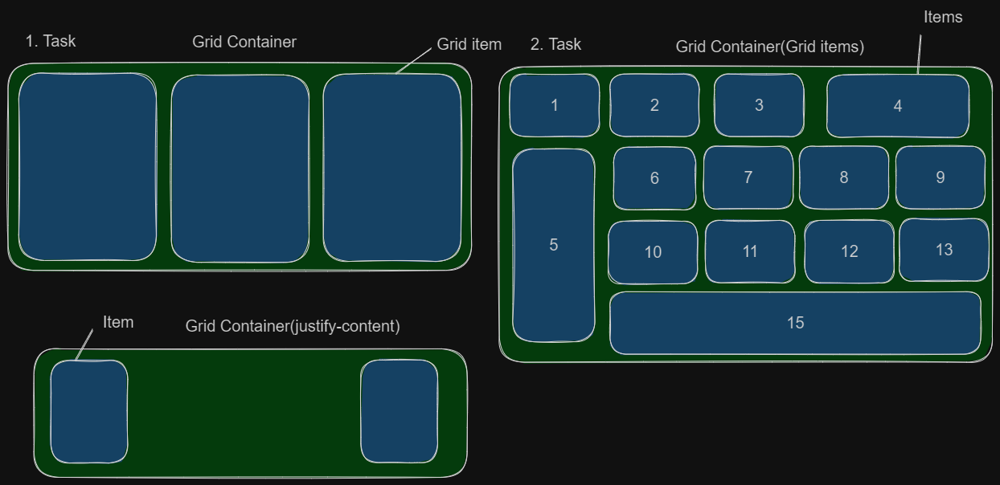

# Resource:

- [(Article)CSS-Tricks: A Complete Guide to Grid](https://css-tricks.com/snippets/css/complete-guide-grid/)
- [(Video)Grid crash course](https://www.youtube.com/watch?v=rg7Fvvl3taU&t=1s)

# Task examples:

- [Code examples(Grid Container)](https://codesandbox.io/s/grid-container-tkhq72?file=/index.html)
- [Code examples(Grid Items)](https://codesandbox.io/s/grid-items-phxrk2?file=/index.html)

