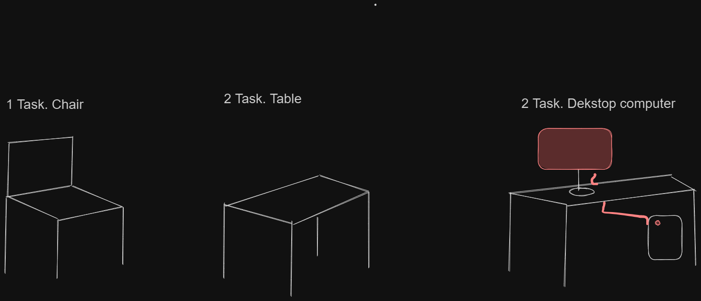

# Table of Contents

- [1 Task Intro](#1-task-intro)
- [2 Task Test Case](#2-task-test-case)
- [3 Task Load Testing](#3-task-load-testing)
- [4 Task Performance Testing](#4-task-performance-testing)
- [5 Stress Testing](#5-stress-testing)
- [6 Security Testing](#6-security-testing)
- [7 Accessibility Testing](#7-accessibility-testing)
- [8 User Acceptance Testing (UAT)](#8-user-acceptance-testing)
- [9 Exploratory Testing](#9-exploratory-testing)
- [10 Smoke and Sanity Testing](#10-smoke-and-sanity-testing)
- [11 Regression Testing](#11-regression-testing)

# 1 Task Intro

- [1.1 Task](https://www.branchfurniture.com/products/verve-chair?cjevent=11ca203a44b211ee806900d80a18b8fa&cm_mmc=CJ-_-6361382-_-3486349-_-US+-+Branch+Homepage&utm_source=Affiliate&utm_content=Future+Publishing+Limited&utm_term=US+-+Branch+Homepage&cjdata=MXxZfDB8WXww)
- [1.2 Task](https://www.ikea.com/us/en/p/lagkapten-adils-desk-gray-turquoise-black-s59523455/)
- [1.3 Task](https://www.dell.com/en-us/shop/cty/xps-desktop/spd/xps-8960-desktop/usexpsthcto8960rpl01?cjevent=de72037b44b411ee816300ef0a18ba72&dgc=af&publisherid=1583972&publisher&aff=Ziff+Davis%2C+LLC&affid=1583972&aff_webid=5226272&aff_user_id=05Bsc6vZARYtmJoNKGJgFK5&cjdata=MXxZfDB8WXww&gacd=9684992-28463632-5750457-345576786-177846717&VEN1=14349898-5226272-05Bsc6vZARYtmJoNKGJgFK5-Ziff%20Davis,%20LLC)

# 2 Task Test Case

**2.1 Create a Test Case table**

**Requirements**

- You will need Excel or Google Sheets

**Example**

- 

**2.2 Create a Test Case in your created table**

**Task 1: Testing a Login Page**

*Feature: Login Page*

**Scenario:** Test the login functionality of a web application.

**Test Case 1: Valid Login**
1. Open the application's login page.
2. Enter a valid username and a valid password.
3. Click the "Login" button.
4. Expected Outcome: The user should be logged in successfully and redirected to the dashboard.

**Test Case 2: Invalid Username**
1. Open the application's login page.
2. Enter an invalid username and a valid password.
3. Click the "Login" button.
4. Expected Outcome: The system should display an error message indicating that the username is invalid.

**Test Case 3: Invalid Password**
1. Open the application's login page.
2. Enter a valid username and an invalid password.
3. Click the "Login" button.
4. Expected Outcome: The system should display an error message indicating that the password is invalid.

**Task 2: Testing an E-commerce Cart**

*Feature: Shopping Cart*

**Scenario:** Test the functionality of adding and removing items from a shopping cart in an e-commerce website.

**Test Case 1: Add Item to Cart**
1. Browse to a product page.
2. Click the "Add to Cart" button for a specific product.
3. Go to the shopping cart.
4. Expected Outcome: The selected product should be added to the cart.

**Test Case 2: Remove Item from Cart**
1. Go to the shopping cart with at least one item.
2. Click the "Remove" button next to a product.
3. Expected Outcome: The selected product should be removed from the cart.

**Test Case 3: Cart Total Calculation**
1. Add multiple items to the cart with different prices.
2. Check the cart total.
3. Expected Outcome: The cart total should accurately reflect the sum of the prices of all the items in the cart.

**Task 3: Testing a Social Media Posting Feature**

*Feature: Social Media Post*

**Scenario:** Test the functionality of creating and sharing a post on a social media platform.

**Test Case 1: Create a Text Post**
1. Log in to the social media platform.
2. Go to the "Create Post" section.
3. Write a text post.
4. Click the "Post" button.
5. Expected Outcome: The text post should be successfully published on the user's profile.

**Test Case 2: Add Image to Post**
1. Log in to the social media platform.
2. Go to the "Create Post" section.
3. Upload an image and write a caption.
4. Click the "Post" button.
5. Expected Outcome: The image post with the caption should be successfully published on the user's profile.

**Test Case 3: Share a Post**
1. Log in to the social media platform.
2. Find an existing post on the feed.
3. Click the "Share" button.
4. Choose to share it on your profile.
5. Expected Outcome: The shared post should appear on your profile and be visible to your followers.

# 3 Task Load Testing

**Task 3.1: Load Testing an E-commerce Checkout Process**

*Feature: Checkout Process*

**Scenario:** Perform load testing on an e-commerce website's checkout process to ensure it can handle a high volume of concurrent users during a holiday shopping season.

**Test Case 1: Simulate Concurrent Users**
1. Use a load testing tool to simulate 100 concurrent users.
2. Instruct each virtual user to go through the entire checkout process.
3. Expected Outcome: Monitor the response time and system performance to ensure it remains stable under heavy load.

**Test Case 2: Test Payment Gateway Load**
1. Simulate 200 concurrent users attempting to make payments simultaneously.
2. Monitor the payment gateway's response time and success rate.
3. Expected Outcome: Ensure the payment gateway can handle the load without significant delays or failures.

**Test Case 3: Test Cart Updates Under Load**
1. Simulate 50 concurrent users adding and removing items from their shopping carts.
2. Monitor the cart update response time and accuracy.
3. Expected Outcome: Verify that cart updates are fast and accurate even under heavy load.

**Task 3.2: Load Testing a Social Media Feed**

*Feature: Social Media Feed*

**Scenario:** Perform load testing on a social media platform's feed to ensure it can handle a high volume of users posting and interacting simultaneously.

**Test Case 1: Simulate Post#ing Activity**
1. Simulate 500 users posting status updates simultaneously.
2. Monitor the system's ability to handle the influx of posts.
3. Expected Outcome: Ensure the platform can accept and display the posts without significant delays.

**Test Case 2: Test Commenting and Liking Load**
1. Simulate 1000 concurrent users liking and commenting on posts in the feed.
2. Monitor the response time for liking and commenting actions.
3. Expected Outcome: Ensure that interactions like liking and commenting are responsive and accurate under heavy load.

**Test Case 3: Test Feed Refresh Load**
1. Simulate 2000 users continuously refreshing their feed.
2. Monitor the feed refresh response time and server resource utilization.
3. Expected Outcome: Ensure that the feed can be refreshed quickly even with a large number of users.

**Task 3.3: Load Testing an Email Server**

*Feature: Email Server*

**Scenario:** Perform load testing on an email server to ensure it can handle a high volume of incoming and outgoing emails during a marketing campaign.

**Test Case 1: Simulate Incoming Email Load**
1. Send 10,000 test emails to the email server within a short timeframe.
2. Monitor the server's ability to process and deliver incoming emails.
3. Expected Outcome: Ensure that the server can handle the influx of emails without delays or errors.

**Test Case 2: Simulate Outgoing Email Load**
1. Schedule the email server to send 5,000 marketing campaign emails to subscribers.
2. Monitor the server's email sending rate and success rate.
3. Expected Outcome: Ensure that the server can send emails efficiently and reliably.

**Test Case 3: Test Email Search Functionality**
1. Simulate 100 concurrent users searching their email inboxes for specific keywords.
2. Monitor the search response time and accuracy.
3. Expected Outcome: Verify that the email search functionality remains responsive even under load.

# 4 Task Performance Testing
 
**Task 4.1: Performance Testing a File Upload Feature**

*Feature: File Upload*

**Scenario:** Perform performance testing on a file upload feature of a cloud storage service to ensure it can handle large file uploads efficiently.

**Test Case 1: Upload a Small File**
1. Open the file upload page.
2. Select a small file (e.g., 1MB) for upload.
3. Upload the file.
4. Expected Outcome: The file should upload quickly (within a few seconds).

**Test Case 2: Upload a Large File**
1. Open the file upload page.
2. Select a large file (e.g., 100MB) for upload.
3. Upload the file.
4. Expected Outcome: The file should upload within a reasonable time frame (e.g., under 5 minutes) without causing system errors.

**Test Case 3: Simulate Concurrent Uploads**
1. Use a performance testing tool to simulate 100 users attempting to upload files concurrently.
2. Monitor server response time and resource utilization.
3. Expected Outcome: Ensure that the system can handle concurrent file uploads without significant degradation in performance.

**Task 4.2: Performance Testing an E-commerce Search Functionality**

*Feature: Product Search*

**Scenario:** Perform performance testing on a product search functionality of an e-commerce website to ensure it can handle high search volumes efficiently.

**Test Case 1: Single User Search**
1. Open the website's search bar.
2. Enter a search query (e.g., "laptop").
3. View the search results.
4. Expected Outcome: The search results should appear within a reasonable time frame (e.g., under 2 seconds).

**Test Case 2: Concurrent User Searches**
1. Use a performance testing tool to simulate 100 concurrent users searching for products.
2. Monitor server response time and resource utilization.
3. Expected Outcome: Ensure that the search functionality remains responsive and accurate under heavy concurrent search loads.

**Test Case 3: Complex Search Queries**
1. Create complex search queries (e.g., filtering by multiple criteria).
2. Simulate multiple users executing these complex searches concurrently.
3. Monitor server response time and accuracy of search results.
4. Expected Outcome: Ensure that even complex search queries are processed efficiently.

**Task 4.3: Performance Testing a Video Streaming Service**

*Feature: Video Streaming*

**Scenario:** Perform performance testing on a video streaming service to ensure it can deliver video content smoothly to a large number of concurrent users.

**Test Case 1: Single User Video Playback**
1. Select a video to play.
2. Monitor the time it takes to start playback.
3. Ensure smooth playback without buffering interruptions.
4. Expected Outcome: The video should start quickly, and playback should be uninterrupted.

**Test Case 2: Concurrent User Streaming**
1. Use a performance testing tool to simulate 500 concurrent users streaming different videos.
2. Monitor server response time, playback quality, and resource utilization.
3. Expected Outcome: Ensure that the service can handle concurrent video streams without degradation in quality.

**Test Case 3: Mobile Device Streaming**
1. Simulate 100 users streaming videos on mobile devices with varying network conditions (e.g., 3G, 4G, Wi-Fi).
2. Monitor the quality of video playback and loading times.
3. Expected Outcome: Verify that the service can adapt to different network conditions and provide an acceptable viewing experience.

# 5 Stress Testing

**Task 5.1: Stress Testing an Online Booking System**

*Feature: Booking System*

**Scenario:** Perform stress testing on an online booking system for a popular event to ensure it can handle a surge in traffic when tickets are released.

**Test Case 1: Simulate Peak Traffic Load**
1. Use a stress testing tool to simulate a sudden surge in traffic by sending a large number of concurrent booking requests (e.g., 10,000 users) as soon as ticket sales open.
2. Monitor server response time, system stability, and resource utilization.
3. Expected Outcome: Ensure that the system can handle the peak traffic without crashing or experiencing excessive delays.

**Test Case 2: Stress Test Payment Processing**
1. Simulate a high number of users (e.g., 5,000) attempting to make payments for their bookings simultaneously.
2. Monitor the payment gateway's response time and success rate.
3. Expected Outcome: Ensure that the payment processing system can handle the load without timeouts or payment failures.

**Test Case 3: Stress Test Database Load**
1. Simulate a large number of users performing various actions (e.g., searching, browsing, and booking) concurrently.
2. Monitor the database response time and query execution.
3. Expected Outcome: Ensure that the database can handle the increased load without significant performance degradation.

**Task 3.2: Stress Testing a Cloud Storage Service**

*Feature: File Upload and Download*

**Scenario:** Perform stress testing on a cloud storage service to ensure it can handle heavy concurrent file uploads and downloads.

**Test Case 1: Simulate Heavy File Uploads**
1. Use a stress testing tool to simulate a high volume of users (e.g., 1,000) uploading large files (e.g., 100MB) concurrently.
2. Monitor server response time, file upload success rate, and storage capacity.
3. Expected Outcome: Ensure that the service can handle the load without service interruptions or excessive file upload failures.

**Test Case 2: Stress Test File Downloads**
1. Simulate a large number of users (e.g., 2,000) downloading files concurrently.
2. Monitor server response time, download speed, and system resource utilization.
3. Expected Outcome: Ensure that the service can serve files to multiple users without significant delays or slowdowns.

**Test Case 3: Stress Test File Deletion**
1. Simulate a high number of users (e.g., 3,000) deleting files from their accounts concurrently.
2. Monitor server response time and storage capacity.
3. Expected Outcome: Ensure that file deletions do not overload the server or cause data integrity issues.

**Task 4.3: Stress Testing a Video Conferencing Platform**

*Feature: Video Conferencing*

**Scenario:** Perform stress testing on a video conferencing platform to ensure it can handle a large number of participants in a virtual conference.

**Test Case 1: Simulate Large Meetings**
1. Create a virtual meeting room and simulate a meeting with a high number of participants (e.g., 100).
2. Monitor video and audio quality, as well as server resource utilization.
3. Expected Outcome: Ensure that the platform can maintain acceptable video and audio quality with a large number of participants.

**Test Case 2: Stress Test Screen Sharing**
1. Simulate multiple users (e.g., 50) sharing their screens simultaneously during a meeting.
2. Monitor the screen sharing quality and system performance.
3. Expected Outcome: Ensure that screen sharing does not significantly affect the overall meeting quality.

**Test Case 3: Stress Test Chat and File Sharing**
1. Simulate a high volume of chat messages and file uploads (e.g., 1,000 messages and files) during a meeting.
2. Monitor chat message delivery times and file sharing success rates.
3. Expected Outcome: Ensure that chat messages and file sharing remain responsive during meetings with heavy interaction.

These exercises will help students practice stress testing, ensuring that applications and systems can handle extreme conditions and loads, which is crucial for robustness and reliability.

# 6 Security Testing

**Task 6.1: Security Testing of User Authentication**

*Feature: User Authentication*

**Scenario:** Perform security testing on the user authentication system of a web application to identify vulnerabilities related to login and access control.

**Test Case 1: Password Strength**
1. Attempt to create an account with a weak password (e.g., "password" or "123456").
2. Expected Outcome: The system should reject weak passwords and prompt for a stronger one.

**Test Case 2: Brute Force Attack**
1. Attempt to log in with an incorrect password multiple times in quick succession.
2. Expected Outcome: After a certain number of failed login attempts, the system should lock the account or introduce a time delay to prevent brute force attacks.

**Test Case 3: Session Management**
1. Log in with a valid user account.
2. Log out and then try to access restricted pages by manually entering URLs.
3. Expected Outcome: The system should properly manage user sessions and prevent unauthorized access to restricted areas after logout.

**Task 6.2: Security Testing of Payment Processing**

*Feature: Payment Processing*

**Scenario:** Perform security testing on the payment processing module of an e-commerce website to ensure customer payment data is handled securely.

**Test Case 1: Payment Data Encryption**
1. Make a payment on the website and intercept the network traffic using a proxy tool.
2. Check if sensitive payment data (e.g., credit card details) are transmitted securely using encryption (HTTPS).
3. Expected Outcome: Payment data should be transmitted securely with encryption, preventing interception and data theft.

**Test Case 2: SQL Injection**
1. Attempt to make a payment with a malicious input in the payment form (e.g., entering SQL injection code).
2. Expected Outcome: The system should sanitize input data and prevent SQL injection attacks, displaying an error message instead of executing the malicious code.

**Test Case 3: Payment Gateway Security**
1. Monitor the payment gateway's security certificates and compliance with industry standards (e.g., PCI DSS).
2. Expected Outcome: The payment gateway should adhere to security standards to ensure the safe processing of payments.

**Task 6.3: Security Testing of User Data Privacy**

*Feature: Data Privacy*

**Scenario:** Perform security testing to ensure the protection of user data privacy in a social media platform.

**Test Case 1: Profile Privacy Settings**
1. Create a user profile with specific privacy settings (e.g., private, friends-only, public).
2. Attempt to view the profile from different user accounts with varying levels of access.
3. Expected Outcome: User profile privacy settings should restrict access to authorized users as configured.

**Test Case 2: Data Leakage Prevention**
1. Post a private message or content on the platform.
2. Check if it's possible to access this private content through unauthorized means (e.g., direct URL access).
3. Expected Outcome: Private content should not be accessible through unauthorized means.

**Test Case 3: Cross-Site Scripting (XSS)**
1. Attempt to post content containing malicious scripts in messages or comments.
2. Check if the platform properly filters and sanitizes user-generated content.
3. Expected Outcome: Malicious scripts should be blocked or sanitized to prevent XSS attacks.

# 7 Accessibility Testing

**Task 7.1: Accessibility Testing of a Website**

*Feature: Website Navigation*

**Scenario:** Perform accessibility testing on a website's navigation menu to ensure it is usable for people with disabilities.

**Test Case 1: Keyboard Navigation**
1. Open the website and navigate to the main menu using only the keyboard (Tab and Enter keys).
2. Verify that each menu item receives focus and is selectable.
3. Expected Outcome: All menu items should be navigable and selectable using keyboard controls.

**Test Case 2: Screen Reader Compatibility**
1. Open the website with a screen reader (e.g., JAWS, NVDA, VoiceOver).
2. Navigate to the main menu and submenus.
3. Verify that the screen reader announces menu items and submenus correctly.
4. Expected Outcome: Screen reader users should receive accurate and meaningful information about the menu structure.

**Test Case 3: High Contrast Mode**
1. Enable high contrast mode in the operating system settings.
2. Visit the website and check if the menu and menu items remain visible and readable.
3. Expected Outcome: The website should maintain readability and usability in high contrast mode.

**Task 7.2: Accessibility Testing of a Mobile App**

*Feature: In-App Chat*

**Scenario:** Perform accessibility testing on the in-app chat feature of a mobile application to ensure it is accessible to users with disabilities.

**Test Case 1: Voice Input**
1. Open the app and access the chat feature.
2. Use voice input to compose and send a message.
3. Verify that the app accurately converts voice input into text messages.
4. Expected Outcome: Voice input should be accurately transcribed into text messages.

**Test Case 2: Text-to-Speech (TTS)**
1. Access the chat feature and receive a new message.
2. Enable the device's built-in screen reader (e.g., TalkBack for Android or VoiceOver for iOS).
3. Verify that the screen reader reads incoming messages aloud.
4. Expected Outcome: Incoming messages should be read aloud by the screen reader.

**Test Case 3: Font and Text Size**
1. Open the app and access the chat feature.
2. Increase the device's font size or text magnification settings.
3. Verify that the chat messages adapt to the larger text size without cutoffs or overlaps.
4. Expected Outcome: Chat messages should remain legible and properly formatted at increased text sizes.

**Task 7.3: Accessibility Testing of a Document Management System**

*Feature: Document Upload*

**Scenario:** Perform accessibility testing on a document upload feature of a document management system to ensure it is accessible to users with disabilities.

**Test Case 1: Screen Reader Compatibility**
1. Access the document upload feature with a screen reader.
2. Verify that screen reader users can navigate and interact with the upload form, including selecting files.
3. Expected Outcome: Screen reader users should be able to use the upload feature without encountering barriers.

**Test Case 2: Keyboard Accessibility**
1. Open the document upload feature and navigate through the upload form using the keyboard (Tab and Enter keys).
2. Verify that all form elements, including file selection, are accessible and usable.
3. Expected Outcome: Users should be able to interact with the upload form using keyboard controls.

**Test Case 3: Error Handling**
1. Attempt to upload a document with an incorrect format or size.
2. Verify that error messages are displayed clearly and are accessible to screen readers.
3. Expected Outcome: Error messages should be properly announced and visible to all users, including those using screen readers.

# 8 User Acceptance Testing (UAT)

**Task 8.1: User Acceptance Testing for a Mobile Banking App**

*Feature: Funds Transfer*

**Scenario:** Perform user acceptance testing on the funds transfer feature of a mobile banking app to ensure it meets user expectations and business requirements.

**Test Case 1: Initiate a Transfer**
1. Open the mobile banking app.
2. Navigate to the "Transfer Funds" section.
3. Enter the recipient's account details and the transfer amount.
4. Initiate the transfer.
5. Expected Outcome: The transfer should be successfully initiated without errors, and the user should receive a confirmation message.

**Test Case 2: Verify Transfer History**
1. After completing a transfer, access the "Transaction History" section.
2. Verify that the recent transfer is correctly displayed, including details like date, recipient, and amount.
3. Expected Outcome: The recent transfer should be accurately recorded in the transaction history.

**Test Case 3: Insufficient Funds Handling**
1. Attempt to initiate a transfer with insufficient funds in the account.
2. Verify that the app displays a clear error message explaining the insufficient funds situation.
3. Expected Outcome: The app should prevent the transfer and inform the user about the insufficient balance.

**Task 8.2: User Acceptance Testing for an E-commerce Website**

*Feature: Checkout Process*

**Scenario:** Perform user acceptance testing on the checkout process of an e-commerce website to ensure it is user-friendly and functions correctly.

**Test Case 1: Add to Cart and Proceed to Checkout**
1. Browse the website, select a product, and add it to the shopping cart.
2. Proceed to checkout.
3. Complete the checkout process, including entering shipping and payment information.
4. Expected Outcome: The product should be successfully purchased, and the user should receive an order confirmation.

**Test Case 2: Coupon Code Application**
1. During the checkout process, apply a valid coupon code.
2. Verify that the applied discount is reflected in the order total.
3. Expected Outcome: The coupon code should be successfully applied, and the order total should reflect the discount.

**Test Case 3: Guest Checkout**
1. Attempt to complete a purchase as a guest without creating an account.
2. Verify that the guest checkout option is smooth and functional.
3. Expected Outcome: Users should be able to complete a purchase without the need for account creation.

**Task 8.3: User Acceptance Testing for a Healthcare Information System**

*Feature: Patient Record Access*

**Scenario:** Perform user acceptance testing on the patient record access feature of a healthcare information system to ensure it adheres to medical privacy and compliance standards.

**Test Case 1: Search for a Patient Record**
1. Log in to the healthcare system.
2. Search for a specific patient's medical record using their unique identifier (e.g., medical record number).
3. Verify that the patient's record is displayed accurately.
4. Expected Outcome: The patient's medical record should be accessible and displayed correctly.

**Test Case 2: Access Control**
1. Attempt to access a patient's record without the necessary permissions.
2. Verify that the system denies access and displays a permission error.
3. Expected Outcome: Unauthorized users should be prevented from accessing patient records.

**Test Case 3: Patient Record Update**
1. Access a patient's medical record and attempt to update their medical history or treatment plan.
2. Verify that the system allows authorized users to update patient records.
3. Expected Outcome: Authorized users should be able to update patient records accurately and securely.

# 9 Exploratory Testing

**Task 9.1: Exploratory Testing of a Blogging Platform**

*Feature: Blog Post Creation*

**Scenario:** Perform exploratory testing on the blog post creation feature of a blogging platform to uncover any issues or usability concerns.

**Test Case 1: Draft Creation and Editing**
1. Log in to the blogging platform.
2. Create a new blog post draft.
3. Experiment with the draft editor, trying various formatting options, images, and text lengths.
4. Save the draft and reopen it for editing.
5. Expected Outcome: The draft should be editable without any loss of formatting or content.

**Test Case 2: Image Upload and Caption**
1. Create a new blog post.
2. Insert an image into the post and add a caption.
3. Verify that the image is displayed correctly, and the caption is visible.
4. Expected Outcome: The image should be properly displayed with the caption below it.

**Test Case 3: Post Scheduling**
1. Create a new blog post and schedule it for publication at a future date and time.
2. Verify that the post is published automatically at the scheduled time.
3. Expected Outcome: The post should be published at the specified time without manual intervention.

**Task 9.2: Exploratory Testing of a Hotel Booking Website**

*Feature: Room Reservation*

**Scenario:** Perform exploratory testing on the room reservation feature of a hotel booking website to identify potential issues and improve user experience.

**Test Case 1: Search and Filters**
1. Visit the hotel booking website.
2. Search for available rooms in a specific location.
3. Experiment with various filters (e.g., price, amenities) to refine the search results.
4. Expected Outcome: The search and filter options should help users find suitable rooms effectively.

**Test Case 2: Booking Process Flow**
1. Select a room for booking.
2. Go through the entire booking process, including entering guest information and payment details.
3. Experiment with various inputs and steps.
4. Expected Outcome: The booking process should be intuitive, and users should be able to complete it without confusion.

**Test Case 3: Cancellation and Refund Policy**
1. Make a reservation and then attempt to cancel it.
2. Review the cancellation and refund policy.
3. Experiment with different cancellation scenarios (e.g., within the refundable window and outside the refundable window).
4. Expected Outcome: The cancellation and refund policy should be clear and applied consistently.

**Task 9.3: Exploratory Testing of a Mobile Fitness App**

*Feature: Workout Tracker*

**Scenario:** Perform exploratory testing on the workout tracker feature of a mobile fitness app to ensure it works as intended and provides a seamless user experience.

**Test Case 1: Exercise Logging**
1. Open the fitness app and log a workout session, including details like exercise type, duration, and intensity.
2. Experiment with various exercise types and intensity levels.
3. Expected Outcome: The app should accurately record and track workout sessions.

**Test Case 2: Integration with Wearable Devices**
1. Connect the fitness app to a wearable fitness tracker (e.g., smartwatch).
2. Log a workout session using the wearable device and sync it with the app.
3. Verify that the data is correctly imported and displayed in the app.
4. Expected Outcome: Data from the wearable device should seamlessly integrate with the app.

**Test Case 3: Goal Setting and Achievement**
1. Set fitness goals within the app (e.g., steps per day, calories burned).
2. Work towards achieving these goals by logging workout sessions and activities.
3. Expected Outcome: The app should provide motivation and accurately track progress towards set goals.

# 10 Smoke and Sanity Testing

**Task 10.1: Smoke Testing an E-commerce Website**

*Feature: Shopping Cart and Checkout*

**Scenario:** Perform smoke testing on the shopping cart and checkout functionality of an e-commerce website to quickly identify major issues before further testing.

**Smoke Test Case 1: Add to Cart**
1. Open the website.
2. Browse a product and add it to the shopping cart.
3. Verify that the product is added to the cart.
4. Expected Outcome: The product should be successfully added to the cart without errors.

**Smoke Test Case 2: Checkout as Guest**
1. Proceed to checkout as a guest user.
2. Enter minimal required information for billing and shipping.
3. Confirm the order.
4. Expected Outcome: The guest checkout process should proceed without errors, and the order should be successfully placed.

**Smoke Test Case 3: Payment Processing**
1. Go through the checkout process, including entering payment information.
2. Verify that the payment is processed successfully.
3. Expected Outcome: Payment should be processed without errors, and the user should receive an order confirmation.

**Task 10.2: Sanity Testing of a Social Media Platform**

*Feature: User Profile and Posting*

**Scenario:** Perform sanity testing on the user profile and posting features of a social media platform to ensure that recent changes or updates have not introduced critical issues.

**Sanity Test Case 1: Edit Profile**
1. Access your user profile.
2. Attempt to edit profile information, such as the profile picture or bio.
3. Verify that the changes are saved successfully.
4. Expected Outcome: Profile edits should be saved without errors.

**Sanity Test Case 2: Create a Post**
1. Compose a new post and include text and an image.
2. Publish the post.
3. Verify that the post is visible on your profile and in the feed.
4. Expected Outcome: The post should be successfully created and displayed.

**Sanity Test Case 3: Like and Comment**
1. Like a post created by another user.
2. Leave a comment on the same post.
3. Verify that the like and comment actions are reflected correctly.
4. Expected Outcome: Likes and comments should be recorded accurately on the post.

# 11 Regression Testing

**Task 11.1: Regression Testing for a Weather App**

*Feature: Weather Forecast*

**Scenario:** Perform regression testing on the weather forecast feature of a mobile weather app after a recent update to ensure that it continues to provide accurate and reliable weather information.

**Regression Test Case 1: Current Temperature**
1. Open the weather app.
2. Check the displayed current temperature for your location.
3. Expected Outcome: The current temperature should be accurate and match the latest weather data.

**Regression Test Case 2: 5-Day Forecast**
1. Access the 5-day weather forecast for your location.
2. Verify that the forecasted temperatures, conditions, and precipitation data align with the updated weather data.
3. Expected Outcome: The 5-day forecast should reflect the latest weather predictions.

**Regression Test Case 3: Hourly Forecast**
1. View the hourly weather forecast for today.
2. Confirm that the hourly temperature and weather conditions are up-to-date.
3. Expected Outcome: The hourly forecast should provide accurate weather information for the current day.

**Task 11.2: Regression Testing for an E-commerce Website**

*Feature: Shopping Cart*

**Scenario:** Perform regression testing on the shopping cart functionality of an e-commerce website after a recent update to ensure that it handles product additions, updates, and removals correctly.

**Regression Test Case 1: Add to Cart**
1. Open the e-commerce website.
2. Browse a product and add it to the shopping cart.
3. Verify that the product is added to the cart and the cart total is updated.
4. Expected Outcome: The product should be added to the cart, and the cart total should reflect the added item.

**Regression Test Case 2: Update Quantity**
1. Access the shopping cart and update the quantity of a product.
2. Confirm that the cart total adjusts accordingly.
3. Expected Outcome: Changing the product quantity should update the cart total correctly.

**Regression Test Case 3: Remove from Cart**
1. Go to the shopping cart and remove a product.
2. Verify that the cart updates to reflect the removal, and the cart total is adjusted accordingly.
3. Expected Outcome: Removing a product should update the cart contents and total accurately.

**Task 11.3: Regression Testing for a Financial Software**

*Feature: Budget Tracker*

**Scenario:** Perform regression testing on the budget tracker feature of financial software after a recent update to ensure that it correctly calculates and displays budget data.

**Regression Test Case 1: Add Income**
1. Open the financial software.
2. Add an income transaction with a specific amount.
3. Confirm that the transaction is recorded, and the budget balance is updated.
4. Expected Outcome: Adding income should increase the budget balance correctly.

**Regression Test Case 2: Expense Tracking**
1. Log an expense transaction with a specific amount.
2. Verify that the expense is recorded, and the budget balance decreases accordingly.
3. Expected Outcome: Expenses should reduce the budget balance accurately.

**Regression Test Case 3: Category Budget**
1. Set a budget limit for a specific spending category.
2. Track expenses in that category and ensure that the software warns when the category budget is exceeded.
3. Expected Outcome: The software should provide alerts when category budgets are exceeded as configured.

